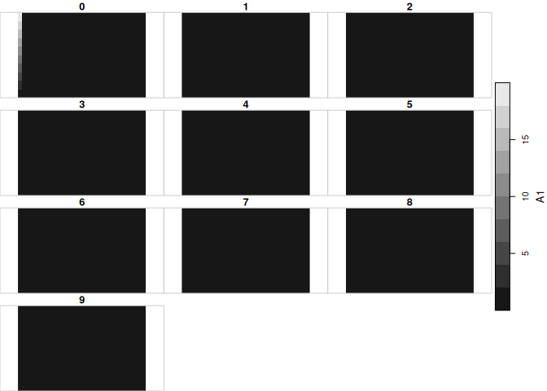
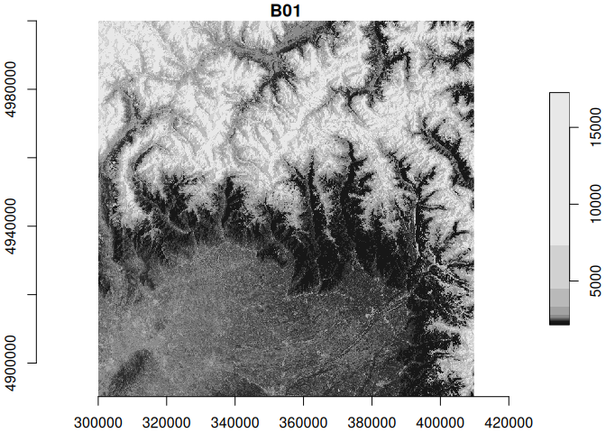
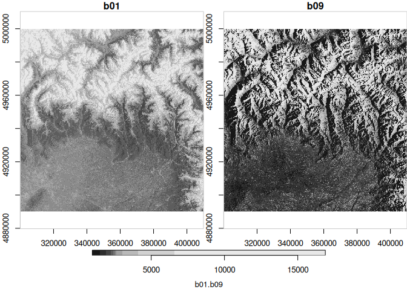

# Accessing Zarr data from STAC (?) using Rarr (??)
Johannes Heisig
2025-10-08

## Local Zarr with Rarr

Read the sample Zarr array provided with the Rarr package

``` r
#remotes::install_github("sharlagelfand/Rarr")
library(Rarr)
library(dplyr)

# Using a local file provided with the package
## This array has 3 dimensions
z1 <- system.file("extdata", "zarr_examples", "row-first",
  "int32.zarr",
  package = "Rarr"
)
zarr_overview(z1)
```

    Type: Array
    Path: /home/jheisig/R/x86_64-pc-linux-gnu-library/4.3/Rarr/extdata/zarr_examples/row-first/int32.zarr
    Shape: 30 x 20 x 10
    Chunk Shape: 10 x 10 x 5
    No. of Chunks: 12 (3 x 2 x 2)
    Data Type: int32
    Endianness: little
    Compressor: blosc

``` r
## read the entire array
z1_full = read_zarr_array(zarr_array_path = z1)
dim(z1_full)
```

    [1] 30 20 10

Check the metadata of the Zarr array

``` r
library(jsonlite)
array_meta = jsonlite::read_json(file.path(z1, ".zarray"))
array_meta$shape
```

    [[1]]
    [1] 30

    [[2]]
    [1] 20

    [[3]]
    [1] 10

Convert to a stars object

``` r
library(stars)
```

    Loading required package: sf

    Linking to GEOS 3.12.2, GDAL 3.9.3, PROJ 9.4.1; sf_use_s2() is TRUE

``` r
(st_z1 = st_as_stars(z1_full))
```

    stars object with 3 dimensions and 1 attribute
    attribute(s):
        Min. 1st Qu. Median       Mean 3rd Qu. Max.
    A1     0       0      0 0.03983333       0   20
    dimension(s):
       from to offset delta point x/y
    X1    1 30      0     1 FALSE [x]
    X2    1 20      0     1 FALSE [y]
    X3    1 10      0     1 FALSE    

``` r
plot(st_z1, breaks = "equal")
```



Next: Recognise the dimensions as stars coordinates…

``` r
#(st_z1 = st_as_stars(z1_full))
```

## Remote Zarr with stars (directly)

> not successful yet.

..using a Zarr archive stored on S3, registered in a STAC catalog and
hosted by EODC.

``` r
zarr_s3 = "https://objects.eodc.eu/e05ab01a9d56408d82ac32d69a5aae2a:sample-data/tutorial_data/cpm_v253/S2B_MSIL1C_20250113T103309_N0511_R108_T32TLQ_20250113T122458.zarr"
```

``` r
vsi_url = paste0("/vsicurl/", zarr_s3)

sf::gdal_utils(source = vsi_url)
read_stars(vsi_url)
```

    trying to read file: /vsicurl/https://objects.eodc.eu/e05ab01a9d56408d82ac32d69a5aae2a:sample-data/tutorial_data/cpm_v253/S2B_MSIL1C_20250113T103309_N0511_R108_T32TLQ_20250113T122458.zarr

    Error in eval(expr, envir, enclos): file not found

``` r
read_mdim(vsi_url)
```

    Warning in CPL_read_mdim(file, array_name, options, offset, count, step, : GDAL
    Error 11: HTTP response code: 404

    Error in eval(expr, envir, enclos): file not found

``` r
terra::rast(vsi_url)
```

    Warning: HTTP response code: 404 (GDAL error 11)

    Error: [rast] file does not exist: /vsicurl/https://objects.eodc.eu/e05ab01a9d56408d82ac32d69a5aae2a:sample-data/tutorial_data/cpm_v253/S2B_MSIL1C_20250113T103309_N0511_R108_T32TLQ_20250113T122458.zarr

``` r
vsi_url = paste0("ZARR:/vsicurl/", "https://objects.eodc.eu/e05ab01a9d56408d82ac32d69a5aae2a:sample-data/tutorial_data/cpm_v253/S2B_MSIL1C_20250113T103309_N0511_R108_T32TLQ_20250113T122458.zarr")

sf::gdal_utils(source = vsi_url)
```

    Warning: There is likely a quoting error of the whole connection string. (GDAL
    error 1)

``` r
read_stars(vsi_url)
```

    Warning: There is likely a quoting error of the whole connection string. (GDAL
    error 1)

    Warning: There is likely a quoting error of the whole connection string. (GDAL
    error 1)

    trying to read file: ZARR:/vsicurl/https://objects.eodc.eu/e05ab01a9d56408d82ac32d69a5aae2a:sample-data/tutorial_data/cpm_v253/S2B_MSIL1C_20250113T103309_N0511_R108_T32TLQ_20250113T122458.zarr

    Error in eval(expr, envir, enclos): file not found

``` r
read_mdim(vsi_url, variable = "/quality/mask/r60m/b09")
```

    Warning: There is likely a quoting error of the whole connection string. (GDAL
    error 1)

    Error in eval(expr, envir, enclos): file not found

``` r
terra::rast(vsi_url)
```

    Warning: There is likely a quoting error of the whole connection string. (GDAL
    error 1)

    Error: [rast] file does not exist: ZARR:/vsicurl/https://objects.eodc.eu/e05ab01a9d56408d82ac32d69a5aae2a:sample-data/tutorial_data/cpm_v253/S2B_MSIL1C_20250113T103309_N0511_R108_T32TLQ_20250113T122458.zarr

## Remote Zarr with Rarr

> construct a stars object from meta data

``` r
# get meta data for all assets in the zarr archive!
zarr_overview(zarr_s3, as_data_frame = T) |> 
  mutate(var = sub(zarr_s3, "", path)) |> 
  select(var, everything(), -path) 
```

                                                       var nchunks  data_type
    1                           /conditions/geometry/angle       1 unicode224
    2                            /conditions/geometry/band       1  unicode96
    3                        /conditions/geometry/detector       1      int64
    4                 /conditions/geometry/mean_sun_angles       1    float64
    5   /conditions/geometry/mean_viewing_incidence_angles       1    float64
    6                      /conditions/geometry/sun_angles       1    float64
    7        /conditions/geometry/viewing_incidence_angles       4    float64
    8                               /conditions/geometry/x       1      int64
    9                               /conditions/geometry/y       1      int64
    10        /conditions/mask/detector_footprint/r10m/b02      36      uint8
    11        /conditions/mask/detector_footprint/r10m/b03      36      uint8
    12        /conditions/mask/detector_footprint/r10m/b04      36      uint8
    13        /conditions/mask/detector_footprint/r10m/b08      36      uint8
    14          /conditions/mask/detector_footprint/r10m/x       1      int64
    15          /conditions/mask/detector_footprint/r10m/y       1      int64
    16        /conditions/mask/detector_footprint/r20m/b05      36      uint8
    17        /conditions/mask/detector_footprint/r20m/b06      36      uint8
    18        /conditions/mask/detector_footprint/r20m/b07      36      uint8
    19        /conditions/mask/detector_footprint/r20m/b11      36      uint8
    20        /conditions/mask/detector_footprint/r20m/b12      36      uint8
    21        /conditions/mask/detector_footprint/r20m/b8a      36      uint8
    22          /conditions/mask/detector_footprint/r20m/x       1      int64
    23          /conditions/mask/detector_footprint/r20m/y       1      int64
    24        /conditions/mask/detector_footprint/r60m/b01      36      uint8
    25        /conditions/mask/detector_footprint/r60m/b09      36      uint8
    26        /conditions/mask/detector_footprint/r60m/b10      36      uint8
    27          /conditions/mask/detector_footprint/r60m/x       1      int64
    28          /conditions/mask/detector_footprint/r60m/y       1      int64
    29        /conditions/mask/l1c_classification/r60m/b00      36      uint8
    30          /conditions/mask/l1c_classification/r60m/x       1      int64
    31          /conditions/mask/l1c_classification/r60m/y       1      int64
    32                /conditions/meteorology/cams/aod1240       1    float32
    33                 /conditions/meteorology/cams/aod469       1    float32
    34                 /conditions/meteorology/cams/aod550       1    float32
    35                 /conditions/meteorology/cams/aod670       1    float32
    36                 /conditions/meteorology/cams/aod865       1    float32
    37               /conditions/meteorology/cams/bcaod550       1    float32
    38               /conditions/meteorology/cams/duaod550       1    float32
    39          /conditions/meteorology/cams/isobaricInhPa       1    float64
    40               /conditions/meteorology/cams/latitude       1    float64
    41              /conditions/meteorology/cams/longitude       1    float64
    42                 /conditions/meteorology/cams/number       1      int64
    43               /conditions/meteorology/cams/omaod550       1    float32
    44               /conditions/meteorology/cams/ssaod550       1    float32
    45                   /conditions/meteorology/cams/step       1      int64
    46               /conditions/meteorology/cams/suaod550       1    float32
    47                /conditions/meteorology/cams/surface       1    float64
    48                   /conditions/meteorology/cams/time       1      int64
    49             /conditions/meteorology/cams/valid_time       1      int64
    50                      /conditions/meteorology/cams/z       1    float32
    51         /conditions/meteorology/ecmwf/isobaricInhPa       1    float64
    52              /conditions/meteorology/ecmwf/latitude       1    float64
    53             /conditions/meteorology/ecmwf/longitude       1    float64
    54                   /conditions/meteorology/ecmwf/msl       1    float32
    55                /conditions/meteorology/ecmwf/number       1      int64
    56                     /conditions/meteorology/ecmwf/r       1    float32
    57                  /conditions/meteorology/ecmwf/step       1      int64
    58               /conditions/meteorology/ecmwf/surface       1    float64
    59                  /conditions/meteorology/ecmwf/tco3       1    float32
    60                  /conditions/meteorology/ecmwf/tcwv       1    float32
    61                  /conditions/meteorology/ecmwf/time       1      int64
    62                   /conditions/meteorology/ecmwf/u10       1    float32
    63                   /conditions/meteorology/ecmwf/v10       1    float32
    64            /conditions/meteorology/ecmwf/valid_time       1      int64
    65                  /measurements/reflectance/r10m/b02      36     uint16
    66                  /measurements/reflectance/r10m/b03      36     uint16
    67                  /measurements/reflectance/r10m/b04      36     uint16
    68                  /measurements/reflectance/r10m/b08      36     uint16
    69                    /measurements/reflectance/r10m/x       1      int64
    70                    /measurements/reflectance/r10m/y       1      int64
    71                  /measurements/reflectance/r20m/b05      36     uint16
    72                  /measurements/reflectance/r20m/b06      36     uint16
    73                  /measurements/reflectance/r20m/b07      36     uint16
    74                  /measurements/reflectance/r20m/b11      36     uint16
    75                  /measurements/reflectance/r20m/b12      36     uint16
    76                  /measurements/reflectance/r20m/b8a      36     uint16
    77                    /measurements/reflectance/r20m/x       1      int64
    78                    /measurements/reflectance/r20m/y       1      int64
    79                  /measurements/reflectance/r60m/b01      36     uint16
    80                  /measurements/reflectance/r60m/b09      36     uint16
    81                  /measurements/reflectance/r60m/b10      36     uint16
    82                    /measurements/reflectance/r60m/x       1      int64
    83                    /measurements/reflectance/r60m/y       1      int64
    84                    /quality/l1c_quicklook/r10m/band       1      int64
    85                     /quality/l1c_quicklook/r10m/tci     108      uint8
    86                       /quality/l1c_quicklook/r10m/x       1      int64
    87                       /quality/l1c_quicklook/r10m/y       1      int64
    88                              /quality/mask/r10m/b02      36      uint8
    89                              /quality/mask/r10m/b03      36      uint8
    90                              /quality/mask/r10m/b04      36      uint8
    91                              /quality/mask/r10m/b08      36      uint8
    92                                /quality/mask/r10m/x       1      int64
    93                                /quality/mask/r10m/y       1      int64
    94                              /quality/mask/r20m/b05      36      uint8
    95                              /quality/mask/r20m/b06      36      uint8
    96                              /quality/mask/r20m/b07      36      uint8
    97                              /quality/mask/r20m/b11      36      uint8
    98                              /quality/mask/r20m/b12      36      uint8
    99                              /quality/mask/r20m/b8a      36      uint8
    100                               /quality/mask/r20m/x       1      int64
    101                               /quality/mask/r20m/y       1      int64
    102                             /quality/mask/r60m/b01      36      uint8
    103                             /quality/mask/r60m/b09      36      uint8
    104                             /quality/mask/r60m/b10      36      uint8
    105                               /quality/mask/r60m/x       1      int64
    106                               /quality/mask/r60m/y       1      int64
        compressor          dim    chunk_dim
    1        blosc            2            2
    2        blosc           13           13
    3        blosc            7            7
    4        blosc            2            2
    5        blosc        13, 2        13, 2
    6        blosc    2, 23, 23    2, 23, 23
    7        blosc 13, 7, 2.... 7, 4, 2,....
    8        blosc           23           23
    9        blosc           23           23
    10       blosc 10980, 10980   1830, 1830
    11       blosc 10980, 10980   1830, 1830
    12       blosc 10980, 10980   1830, 1830
    13       blosc 10980, 10980   1830, 1830
    14       blosc        10980        10980
    15       blosc        10980        10980
    16       blosc   5490, 5490     915, 915
    17       blosc   5490, 5490     915, 915
    18       blosc   5490, 5490     915, 915
    19       blosc   5490, 5490     915, 915
    20       blosc   5490, 5490     915, 915
    21       blosc   5490, 5490     915, 915
    22       blosc         5490         5490
    23       blosc         5490         5490
    24       blosc   1830, 1830     305, 305
    25       blosc   1830, 1830     305, 305
    26       blosc   1830, 1830     305, 305
    27       blosc         1830         1830
    28       blosc         1830         1830
    29       blosc   1830, 1830     305, 305
    30       blosc         1830         1830
    31       blosc         1830         1830
    32       blosc         9, 9         9, 9
    33       blosc         9, 9         9, 9
    34       blosc         9, 9         9, 9
    35       blosc         9, 9         9, 9
    36       blosc         9, 9         9, 9
    37       blosc         9, 9         9, 9
    38       blosc         9, 9         9, 9
    39        <NA>                          
    40       blosc            9            9
    41       blosc            9            9
    42        <NA>                          
    43       blosc         9, 9         9, 9
    44       blosc         9, 9         9, 9
    45        <NA>                          
    46       blosc         9, 9         9, 9
    47        <NA>                          
    48        <NA>                          
    49        <NA>                          
    50       blosc         9, 9         9, 9
    51        <NA>                          
    52       blosc            9            9
    53       blosc            9            9
    54       blosc         9, 9         9, 9
    55        <NA>                          
    56       blosc         9, 9         9, 9
    57        <NA>                          
    58        <NA>                          
    59       blosc         9, 9         9, 9
    60       blosc         9, 9         9, 9
    61        <NA>                          
    62       blosc         9, 9         9, 9
    63       blosc         9, 9         9, 9
    64        <NA>                          
    65       blosc 10980, 10980   1830, 1830
    66       blosc 10980, 10980   1830, 1830
    67       blosc 10980, 10980   1830, 1830
    68       blosc 10980, 10980   1830, 1830
    69       blosc        10980        10980
    70       blosc        10980        10980
    71       blosc   5490, 5490     915, 915
    72       blosc   5490, 5490     915, 915
    73       blosc   5490, 5490     915, 915
    74       blosc   5490, 5490     915, 915
    75       blosc   5490, 5490     915, 915
    76       blosc   5490, 5490     915, 915
    77       blosc         5490         5490
    78       blosc         5490         5490
    79       blosc   1830, 1830     305, 305
    80       blosc   1830, 1830     305, 305
    81       blosc   1830, 1830     305, 305
    82       blosc         1830         1830
    83       blosc         1830         1830
    84       blosc            3            3
    85       blosc 3, 10980.... 1, 1830,....
    86       blosc        10980        10980
    87       blosc        10980        10980
    88       blosc 10980, 10980   1830, 1830
    89       blosc 10980, 10980   1830, 1830
    90       blosc 10980, 10980   1830, 1830
    91       blosc 10980, 10980   1830, 1830
    92       blosc        10980        10980
    93       blosc        10980        10980
    94       blosc   5490, 5490     915, 915
    95       blosc   5490, 5490     915, 915
    96       blosc   5490, 5490     915, 915
    97       blosc   5490, 5490     915, 915
    98       blosc   5490, 5490     915, 915
    99       blosc   5490, 5490     915, 915
    100      blosc         5490         5490
    101      blosc         5490         5490
    102      blosc   1830, 1830     305, 305
    103      blosc   1830, 1830     305, 305
    104      blosc   1830, 1830     305, 305
    105      blosc         1830         1830
    106      blosc         1830         1830

Read the attributes of the Zarr archive

These both do not work…

``` r
Rarr::read_zattrs(zarr_s3)
```

    Error in Rarr::read_zattrs(zarr_s3): The group or array does not contain attributes (.zattrs)

``` r
Rarr::read_zattrs(file.path(zarr_s3, ".zattrs"))
```

    Error in Rarr::read_zattrs(file.path(zarr_s3, ".zattrs")): The group or array does not contain attributes (.zattrs)

… so read json directly:

``` r
attr_s3 = jsonlite::read_json(file.path(zarr_s3, ".zattrs"))
```

Read data from a single band array and its coordinates

``` r
# This time point to a single band asset directly!
zarr_s3_b01 = paste0(zarr_s3, "/measurements/reflectance/r60m/b01")
zarr_overview(zarr_s3_b01)
```

    Type: Array
    Path: https://objects.eodc.eu/e05ab01a9d56408d82ac32d69a5aae2a:sample-data/tutorial_data/cpm_v253/S2B_MSIL1C_20250113T103309_N0511_R108_T32TLQ_20250113T122458.zarr/measurements/reflectance/r60m/b01/
    Shape: 1830 x 1830
    Chunk Shape: 305 x 305
    No. of Chunks: 36 (6 x 6)
    Data Type: uint16
    Endianness: little
    Compressor: blosc

``` r
z_s3 = read_zarr_array(zarr_s3_b01)

zarr_s3_x = paste0(zarr_s3, "/conditions/mask/detector_footprint/r60m/x") |> 
  read_zarr_array()
zarr_s3_y = paste0(zarr_s3, "/conditions/mask/detector_footprint/r60m/y") |> 
  read_zarr_array()
```

Construct a stars object

``` r
# read CRS from attributes
zarr_crs = attr_s3$stac_discovery$properties$`proj:epsg`

# band name
var = "B01"

# read 
zz = st_as_stars(z_s3) |> 
  st_set_crs(zarr_crs) |> 
  st_set_dimensions(1, names = "X", values = zarr_s3_x) |> 
  st_set_dimensions(2, names = "Y", values = zarr_s3_y) |> 
  setNames(var)
zz
```

    stars object with 2 dimensions and 1 attribute
    attribute(s), summary of first 1e+05 cells:
         Min. 1st Qu. Median   Mean 3rd Qu.  Max.
    B01  2240    2836   4362 5655.6    7631 16921
    dimension(s):
      from   to  offset delta point x/y
    X    1 1830  300030    60 FALSE [x]
    Y    1 1830 5000010   -60 FALSE [y]

``` r
plot(zz, axes = TRUE)
```

    downsample set to 2



all in one function:

``` r
st_read_zarr_band = function(path, var, res, ...){
  # stopifnot valid zarr url...
  attr_s3 = jsonlite::read_json(file.path(path, ".zattrs"))
  zarr_crs = attr_s3$stac_discovery$properties$`proj:epsg`
  
  # attr_s3$stac_discovery$properties$`eopf:resolutions`
  res_char = switch(as.character(res),
    "10" = "r10m",
    "20" = "r20m", 
    "60" = "r60m",
    stop("Resolution must be one of 10, 20, or 60.")
  )

  # ...: make use of index arguments of read_zarr_array??
  z_s3 = file.path(path, "measurements/reflectance", res_char, var) |> 
    read_zarr_array(...)
  zarr_s3_x = file.path(path, "conditions/mask/detector_footprint", res_char, "x") |> 
    read_zarr_array(...)
  zarr_s3_y = file.path(path, "conditions/mask/detector_footprint", res_char, "y") |> 
    read_zarr_array(...)
  
  st_as_stars(z_s3) |> 
    st_set_crs(st_crs(zarr_crs)) |> 
    st_set_dimensions(1, names = "X", values = zarr_s3_x) |> 
    st_set_dimensions(2, names = "Y", values = zarr_s3_y) |> 
    setNames(var)
}
```

test…

## Read and combine multiple bands??

``` r
(b01 = st_read_zarr_band(zarr_s3, "b01", 60))
```

    stars object with 2 dimensions and 1 attribute
    attribute(s), summary of first 1e+05 cells:
         Min. 1st Qu. Median   Mean 3rd Qu.  Max.
    b01  2240    2836   4362 5655.6    7631 16921
    dimension(s):
      from   to  offset delta point x/y
    X    1 1830  300030    60 FALSE [x]
    Y    1 1830 5000010   -60 FALSE [y]

``` r
(b09 = st_read_zarr_band(zarr_s3, "b09", 60))
```

    stars object with 2 dimensions and 1 attribute
    attribute(s), summary of first 1e+05 cells:
         Min. 1st Qu. Median     Mean 3rd Qu.  Max.
    b09   999    1704   2804 4187.666    5802 16773
    dimension(s):
      from   to  offset delta point x/y
    X    1 1830  300030    60 FALSE [x]
    Y    1 1830 5000010   -60 FALSE [y]

``` r
c(b01, b09) |> merge() |> plot(axes = TRUE)
```

    downsample set to 3


