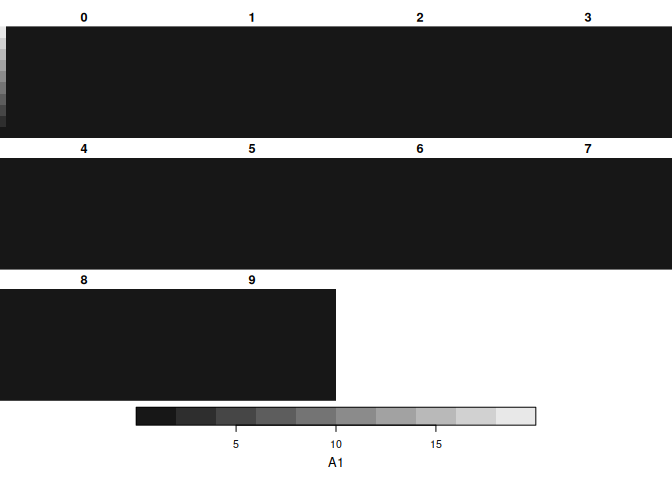
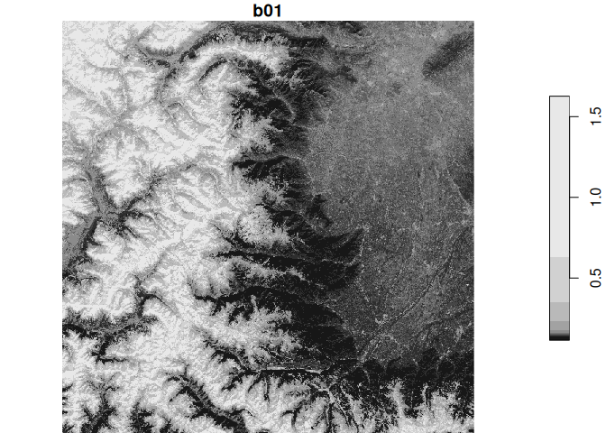
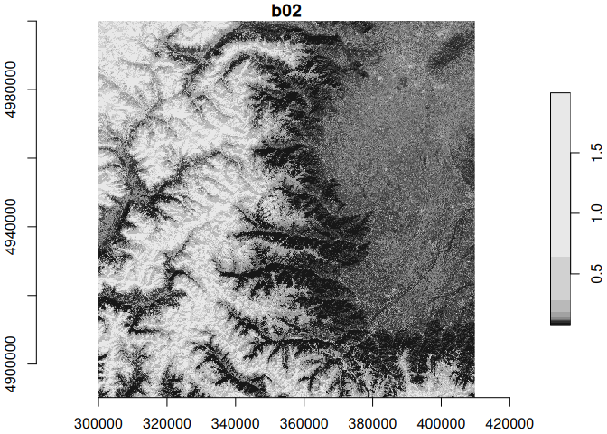
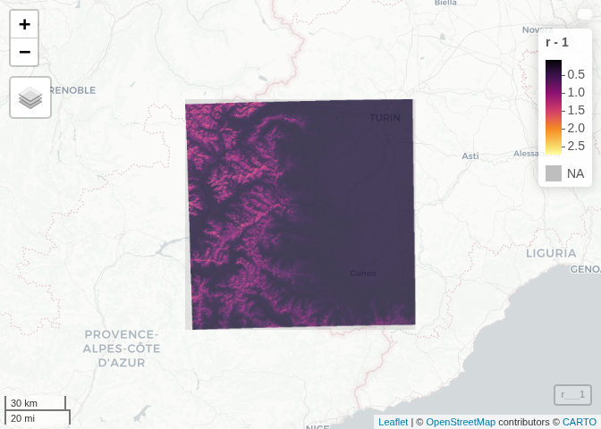
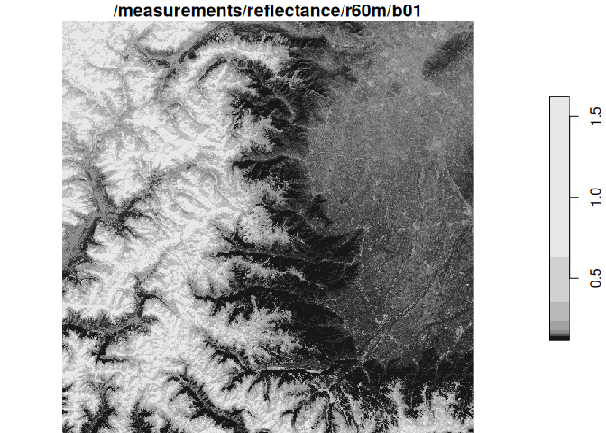
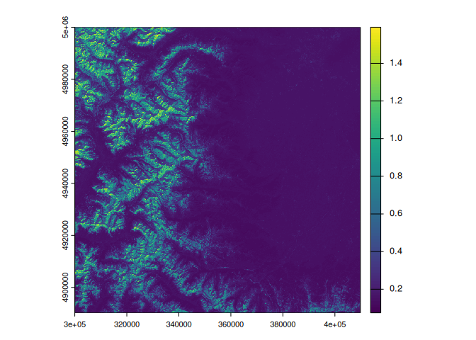
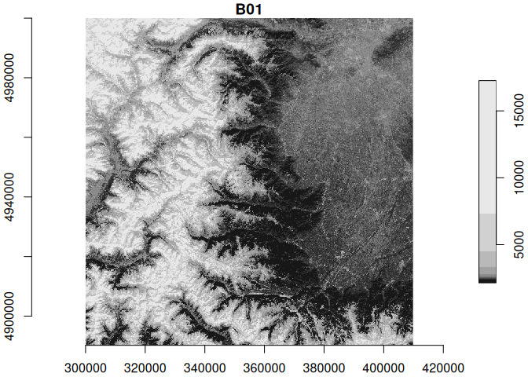
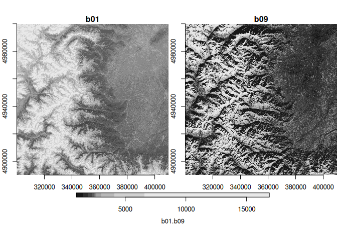

# Accessing Zarr data from STAC using Rarr and stars
Johannes Heisig
2025-10-13

- [Local Zarr with Rarr](#local-zarr-with-rarr)
- [Remote Zarr with stars (directly)](#remote-zarr-with-stars-directly)
- [Remote Zarr with Rarr](#remote-zarr-with-rarr)
- [Read and combine multiple bands??](#read-and-combine-multiple-bands)
- [Benchmark](#benchmark)

``` r
#remotes::install_github("sharlagelfand/Rarr")
library(Rarr)
library(stars)
library(terra)
library(dplyr)
library(jsonlite)
library(mapview)
```

## Local Zarr with Rarr

Read the sample Zarr array provided with the Rarr package

``` r
# Using a local file provided with the package
## This array has 3 dimensions
z1 <- system.file("extdata", "zarr_examples", "row-first",
  "int32.zarr",
  package = "Rarr"
)
zarr_overview(z1)
```

    Type: Array
    Path: /home/jheisig/R/x86_64-pc-linux-gnu-library/4.5/Rarr/extdata/zarr_examples/row-first/int32.zarr
    Shape: 30 x 20 x 10
    Chunk Shape: 10 x 10 x 5
    No. of Chunks: 12 (3 x 2 x 2)
    Data Type: int32
    Endianness: little
    Compressor: blosc

``` r
## read the entire array
z1_full = read_zarr_array(zarr_array_path = z1)
dim(z1_full)
```

    [1] 30 20 10

Check the metadata of the Zarr array

``` r
array_meta = read_json(file.path(z1, ".zarray"))
array_meta$shape
```

    [[1]]
    [1] 30

    [[2]]
    [1] 20

    [[3]]
    [1] 10

Convert to a stars object

``` r
(st_z1 = st_as_stars(z1_full))
```

    stars object with 3 dimensions and 1 attribute
    attribute(s):
        Min. 1st Qu. Median       Mean 3rd Qu. Max.
    A1     0       0      0 0.03983333       0   20
    dimension(s):
       from to offset delta point x/y
    X1    1 30      0     1 FALSE [x]
    X2    1 20      0     1 FALSE [y]
    X3    1 10      0     1 FALSE    

``` r
plot(st_z1, breaks = "equal")
```



Next step: Recognise the dimensions as stars coordinates…

## Remote Zarr with stars (directly)

..using a Zarr archive stored on S3, registered in a STAC catalog and
hosted by EODC.

> Successful now with correct `"ZARR:/vsicurl/"` URL prefix for GDAL.

``` r
zarr_s3 = "https://objects.eodc.eu/e05ab01a9d56408d82ac32d69a5aae2a:sample-data/tutorial_data/cpm_v253/S2B_MSIL1C_20250113T103309_N0511_R108_T32TLQ_20250113T122458.zarr"

vsi_url = paste0("ZARR:/vsicurl/", as_label(zarr_s3)) # needs special quoting
band_variable = "/measurements/reflectance/r60m/b01"

sf::gdal_utils("mdiminfo", source = vsi_url, quiet = T) |> 
  fromJSON() |> 
  names()
```

    [1] "type"       "driver"     "name"       "attributes" "groups"    

``` r
# stars proxy
r = read_stars(vsi_url, driver = "ZARR") # errors
```

    NA, 

    Error in if (is.function(.x) || !np || any(sapply(prefixes, has_prefix, : missing value where TRUE/FALSE needed

``` r
(r = read_stars(paste(vsi_url, band_variable, sep = ":")))
```

    Warning: ignoring unrecognized unit: digital_counts

    stars object with 2 dimensions and 1 attribute
    attribute(s), summary of first 1e+05 cells:
           Min. 1st Qu. Median      Mean 3rd Qu.   Max.
    b01  0.1299  0.1542 0.1628 0.3541124  0.4304 1.6556
    dimension(s):
      from   to offset delta x/y
    x    1 1830  3e+05    60 [x]
    y    1 1830  5e+06   -60 [y]

``` r
system.time(plot(r, axes = TRUE)) 
```

    downsample set to 2



       user  system elapsed 
      0.674   0.051   0.720 

``` r
sf::gdal_utils("mdiminfo", source = vsi_url)
```

    {
      "type": "group",
      "driver": "Zarr",
      "name": "/",
      "attributes": {
        "other_metadata": {
          "L0_ancillary_data_quality": "null",
          "L0_ephemeris_data_quality": "null",
          "NUC_table_ID": 2,
          "SWIR_rearrangement_flag": "null",
          "UTM_zone_identification": "S2B_OPER_MSI_L1C_TL_2BPS_20250113T122458_A041032_T32TLQ_N05.11",
          "absolute_location_assessment_from_AOCS": "null",
          "band_description": {
            "01": {
              "bandwidth": "20.0",
              "onboard_compression_rate": "2.655",
              "onboard_integration_time": "7.22833",
              "units": "nm"
            },
            "02": {
              "bandwidth": "65.0",
              "onboard_compression_rate": "2.97",
              "onboard_integration_time": "1.2646269",
              "units": "nm"
            },
            "03": {
              "bandwidth": "35.0",
              "onboard_compression_rate": "2.97",
              "onboard_integration_time": "1.2996743",
              "units": "nm"
            },
            "04": {
              "bandwidth": "30.0",
              "onboard_compression_rate": "2.97",
              "onboard_integration_time": "1.3405629",
              "units": "nm"
            },
            "05": {
              "bandwidth": "15.0",
              "onboard_compression_rate": "2.655",
              "onboard_integration_time": "2.7846026",
              "units": "nm"
            },
            "06": {
              "bandwidth": "13.0",
              "onboard_compression_rate": "2.655",
              "onboard_integration_time": "2.7727115",
              "units": "nm"
            },
            "07": {
              "bandwidth": "19.0",
              "onboard_compression_rate": "2.655",
              "onboard_integration_time": "2.7727115",
              "units": "nm"
            },
            "08": {
              "bandwidth": "105.0",
              "onboard_compression_rate": "2.97",
              "onboard_integration_time": "1.3872929",
              "units": "nm"
            },
            "09": {
              "bandwidth": "20.0",
              "onboard_compression_rate": "2.655",
              "onboard_integration_time": "8.031501",
              "units": "nm"
            },
            "10": {
              "bandwidth": "30.0",
              "onboard_compression_rate": "2.655",
              "onboard_integration_time": "5.5537686",
              "units": "nm"
            },
            "11": {
              "bandwidth": "90.0",
              "onboard_compression_rate": "2.4",
              "onboard_integration_time": "1.3793689",
              "units": "nm"
            },
            "12": {
              "bandwidth": "180.0",
              "onboard_compression_rate": "2.4",
              "onboard_integration_time": "1.4761667",
              "units": "nm"
            },
            "8A": {
              "bandwidth": "20.0",
              "onboard_compression_rate": "2.655",
              "onboard_integration_time": "2.7608204",
              "units": "nm"
            },
            "b01": {
              "bandwidth": 20,
              "central_wavelength": 442.30000000000001,
              "onboard_compression_rate": "2.655",
              "onboard_integration_time": "7.22833",
              "physical_gain": "3.96033477",
              "spectral_response_step": "1",
              "spectral_response_values": "0.0062411 0.01024045 0.00402983 0.00642179 0.00552753 0.0065525 0.00409887 0.006297 0.00436742 0.00233356 0.00058162 0.00202276 0.00294328 0.00485362 0.00317041 0.00237657 0.00234612 0.00440152 0.01292397 0.05001678 0.18650104 0.45441623 0.72307877 0.83999211 0.86456334 0.87472096 0.89215296 0.91090814 0.92588017 0.93924094 0.94491826 0.95078529 0.96803023 0.99939195 1 0.97548364 0.96148351 0.94986211 0.91841452 0.87989802 0.80383677 0.59752075 0.30474132 0.10798014 0.0304465 0.00885119",
              "units": "nm",
              "wavelength_max": 456,
              "wavelength_min": 411
            },
            "b02": {
              "bandwidth": 65,
              "central_wavelength": 492.30000000000001,
              "onboard_compression_rate": "2.97",
              "onboard_integration_time": "1.2646269",
              "physical_gain": "3.81657264",
              "spectral_response_step": "1",
              "spectral_response_values": "0.05529541 0.12005068 0.25199051 0.4623617 0.65162379 0.77642171 0.82319091 0.83083116 0.83382106 0.837526 0.86304286 0.88226141 0.90486326 0.92043837 0.93602675 0.930533 0.92714067 0.9161479 0.90551724 0.89745515 0.90266694 0.90854264 0.92047913 0.92417935 0.91845025 0.90743244 0.89733983 0.88646415 0.87189983 0.85643973 0.84473414 0.84190734 0.85644111 0.87782724 0.90261174 0.91840544 0.94585847 0.96887192 0.99336135 0.99927899 1 0.99520325 0.98412711 0.97947473 0.97808297 0.97213439 0.96277794 0.95342234 0.93802376 0.92460144 0.90932642 0.90192251 0.89184298 0.88963556 0.89146958 0.89877911 0.91056869 0.92427362 0.93823555 0.95311791 0.97150808 0.98737003 0.99658514 0.99367959 0.98144714 0.95874415 0.89291635 0.73566218 0.52060373 0.3322804 0.19492197 0.11732617 0.07507304 0.05094154 0.03213016 0.01510217 0.00447984",
              "units": "nm",
              "wavelength_max": 532,
              "wavelength_min": 456
            },
            "b03": {
              "bandwidth": 35,
              "central_wavelength": 559,
              "onboard_compression_rate": "2.97",
              "onboard_integration_time": "1.2996743",
              "physical_gain": "4.23050273",
              "spectral_response_step": "1",
              "spectral_response_values": "0.00188039 0.01545903 0.03660414 0.08100583 0.16917887 0.33278274 0.58622794 0.80916412 0.913051 0.94472284 0.94898813 0.94369132 0.92845674 0.91256938 0.90078036 0.89958598 0.90547138 0.92045355 0.94065665 0.96199681 0.98186744 0.9985841 1 0.99279888 0.97801325 0.95301174 0.9266333 0.89359131 0.86941793 0.84827 0.83908301 0.83206209 0.8291787 0.83305844 0.84630939 0.86396307 0.87268076 0.86818339 0.8554947 0.80839054 0.67650876 0.45584205 0.24737576 0.12765465 0.0589016 0.02564742 0.00515905",
              "units": "nm",
              "wavelength_max": 582,
              "wavelength_min": 536
            },
            "b04": {
              "bandwidth": 30,
              "central_wavelength": 665,
              "onboard_compression_rate": "2.97",
              "onboard_integration_time": "1.3405629",
              "physical_gain": "4.76810164",
              "spectral_response_step": "1",
              "spectral_response_values": "0.00499358 0.02642563 0.11905127 0.333204 0.59813448 0.80612041 0.91152955 0.92179127 0.91677167 0.90751672 0.89867522 0.89413622 0.89685141 0.89933396 0.90191681 0.90710817 0.9164622 0.92908702 0.9426682 0.95591935 0.96854537 0.98264967 0.99231022 1 0.99904114 0.99257339 0.97943242 0.96553214 0.95377013 0.94146127 0.92151286 0.89308475 0.83539461 0.69759082 0.49483622 0.27886075 0.10892715 0.03028701 0.00747382 0.00087148",
              "units": "nm",
              "wavelength_max": 685,
              "wavelength_min": 646
            },
            "b05": {
              "bandwidth": 15,
              "central_wavelength": 703.79999999999995,
              "onboard_compression_rate": "2.655",
              "onboard_integration_time": "2.7846026",
              "physical_gain": "5.17726695",
              "spectral_response_step": "1",
              "spectral_response_values": "0.01042619 0.05713826 0.21461286 0.54715702 0.87088164 0.96808183 0.99104427 1 0.99512875 0.98751456 0.97910038 0.97035979 0.95875454 0.94130694 0.92531149 0.89283152 0.76531084 0.50228771 0.17957688 0.0337948 0.00240526",
              "units": "nm",
              "wavelength_max": 714,
              "wavelength_min": 694
            },
            "b06": {
              "bandwidth": 13,
              "central_wavelength": 739.10000000000002,
              "onboard_compression_rate": "2.655",
              "onboard_integration_time": "2.7727115",
              "physical_gain": "5.08823722",
              "spectral_response_step": "1",
              "spectral_response_values": "0.01739744 0.10565746 0.38571484 0.78168196 0.90518378 0.91562509 0.92258804 0.93134141 0.9469604 0.96535098 0.97817455 0.99107716 0.99990615 1 0.97144118 0.81937503 0.46748011 0.09409351 0.00983236",
              "units": "nm",
              "wavelength_max": 748,
              "wavelength_min": 730
            },
            "b07": {
              "bandwidth": 19,
              "central_wavelength": 779.70000000000005,
              "onboard_compression_rate": "2.655",
              "onboard_integration_time": "2.7727115",
              "physical_gain": "4.76468134",
              "spectral_response_step": "1",
              "spectral_response_values": "0.0103729 0.03754921 0.11240409 0.25890105 0.48035521 0.73155954 0.91293607 0.97124929 0.96391197 0.95529249 0.964831 0.98628988 1 0.99782157 0.98343012 0.96489467 0.94619093 0.92560158 0.90788186 0.88471259 0.85693094 0.82513165 0.7734046 0.66767522 0.47756609 0.23225321 0.06764032 0.01301456 0.00117425",
              "units": "nm",
              "wavelength_max": 794,
              "wavelength_min": 766
            },
            "b08": {
              "bandwidth": 105,
              "central_wavelength": 833,
              "onboard_compression_rate": "2.97",
              "onboard_integration_time": "1.3872929",
              "physical_gain": "6.82374334",
              "spectral_response_step": "1",
              "spectral_response_values": "0.00037316 0.00296451 0.01663315 0.02818619 0.05000442 0.08575595 0.14871265 0.25701156 0.42307501 0.62943997 0.80112571 0.90352196 0.93855197 0.94406104 0.9474892 0.96325767 0.97948137 0.99144397 0.99630748 1 0.99827121 0.99843182 0.98914342 0.98264167 0.96769944 0.95752283 0.95074919 0.9458125 0.94267916 0.9465958 0.94450012 0.93992861 0.92759688 0.91226544 0.89079677 0.8706102 0.85021777 0.83416655 0.82214927 0.8124078 0.80920229 0.80220847 0.79081499 0.78239761 0.76731527 0.75394962 0.74226922 0.72750987 0.71976209 0.71456726 0.71982866 0.72746214 0.73945306 0.75138424 0.76310661 0.77122498 0.78298312 0.78494127 0.78409222 0.7834498 0.78216032 0.78062401 0.78132572 0.7813272 0.7810081 0.77897938 0.7761445 0.76910534 0.7625494 0.75157186 0.74086146 0.73121299 0.71988688 0.71025573 0.69679744 0.68602501 0.67163906 0.65532408 0.64173681 0.62683353 0.61241074 0.60185411 0.59380689 0.58714687 0.58444579 0.58231388 0.58111599 0.57996902 0.57480451 0.57684802 0.57273034 0.57144461 0.56985127 0.57167225 0.57154913 0.57292235 0.57617796 0.5784908 0.58023702 0.57982619 0.57868642 0.57587451 0.56976789 0.56173136 0.55644176 0.54881732 0.54508423 0.54153848 0.54069902 0.53850959 0.53655263 0.530404 0.52068821 0.50399678 0.486513 0.46813829 0.45468861 0.44447936 0.44177056 0.44425396 0.44633078 0.43914074 0.41748156 0.3690277 0.30165803 0.23504284 0.17434599 0.12247894 0.08354059 0.05624109 0.03804368 0.02427229 0.01490577 0.00615862",
              "units": "nm",
              "wavelength_max": 907,
              "wavelength_min": 774
            },
            "b09": {
              "bandwidth": 20,
              "central_wavelength": 943.20000000000005,
              "onboard_compression_rate": "2.655",
              "onboard_integration_time": "8.031501",
              "physical_gain": "9.3709782",
              "spectral_response_step": "1",
              "spectral_response_values": "0.0121336 0.04608767 0.15156613 0.35888361 0.60704101 0.83836043 0.93474094 0.94270146 0.95838078 0.99064712 0.99789825 1 0.98593726 0.97333604 0.95776631 0.972226 0.94856942 0.94367414 0.90771555 0.88460732 0.85258329 0.83375172 0.71599386 0.52202762 0.26922852 0.09477806 0.02640828 0.00346547",
              "units": "nm",
              "wavelength_max": 957,
              "wavelength_min": 930
            },
            "b10": {
              "bandwidth": 30,
              "central_wavelength": 1376.9000000000001,
              "onboard_compression_rate": "2.655",
              "onboard_integration_time": "5.5537686",
              "physical_gain": "56.82468464",
              "spectral_response_step": "1",
              "spectral_response_values": "2.472e-05 0.00013691 0.00012558 8.901e-05 0.00012425 9.941e-05 0.00013952 0.00015816 0.00019272 0.00025959 0.00032221 0.00034719 0.0003699 0.00054874 0.00105434 0.00218813 0.00480743 0.01135252 0.02671185 0.05776022 0.11176337 0.19587518 0.31418191 0.46188068 0.62292578 0.7709851 0.88086652 0.9448941 0.97405066 0.98616696 0.99306955 0.99775441 1 0.99942348 0.99616891 0.99082045 0.9842131 0.97708513 0.97013647 0.96374366 0.95755001 0.95127438 0.94546638 0.94069659 0.93759595 0.93624612 0.93510206 0.93054472 0.91630845 0.88530334 0.83129653 0.74856466 0.63524397 0.49733159 0.34907723 0.21259735 0.10971453 0.04789269 0.01853013 0.00716776 0.0031533 0.00157017 0.00084901 0.00053006 0.00033171 0.00019447 0.00022104 0.00022646 0.00018156 0.00016063 0.00015475 0.00014734 0.00014776 0.00017405 0.00023619 0.00012007 4.337e-05",
              "units": "nm",
              "wavelength_max": 1415,
              "wavelength_min": 1339
            },
            "b11": {
              "bandwidth": 90,
              "central_wavelength": 1610.4000000000001,
              "onboard_compression_rate": "2.4",
              "onboard_integration_time": "1.3793689",
              "physical_gain": "37.27329789",
              "spectral_response_step": "1",
              "spectral_response_values": "1.154e-05 2.707e-05 8.129e-05 0.0001701 0.00027422 0.00034456 0.00046028 0.00065214 0.00082283 0.00107791 0.0014306 0.00196134 0.00266427 0.00368682 0.00522456 0.00758401 0.01126335 0.01715812 0.02674581 0.04145595 0.06300627 0.09464207 0.13995799 0.20105412 0.28189591 0.38134665 0.4907345 0.60674263 0.71505301 0.80391496 0.87015099 0.91645643 0.94668952 0.96391534 0.97305962 0.97704089 0.97777566 0.97686717 0.97531356 0.97336816 0.9714563 0.9697157 0.96907419 0.96968255 0.97051178 0.97272986 0.97613656 0.97894419 0.9810083 0.98350836 0.9848292 0.98438948 0.98389859 0.98334634 0.9814301 0.97936035 0.97802641 0.97623515 0.97537114 0.97569131 0.97679261 0.97898052 0.98199689 0.98520852 0.98866135 0.99233425 0.99480248 0.99589079 0.9958911 0.99475534 0.99207775 0.98856394 0.9848769 0.98106836 0.97677436 0.97351815 0.97192459 0.97052192 0.97043004 0.9723835 0.97525347 0.97856769 0.98298866 0.98810437 0.99268138 0.99645012 0.9990686 1 0.99902738 0.99662493 0.99326995 0.989647 0.98577051 0.98212932 0.97979728 0.97946062 0.980262 0.98247241 0.98601349 0.98957829 0.99173488 0.99219848 0.98937107 0.98205611 0.97007817 0.95307506 0.93223131 0.90784439 0.88392149 0.86411672 0.85075738 0.84410342 0.84337963 0.84698191 0.84866039 0.84046041 0.81336359 0.75654857 0.66994259 0.56517119 0.45690882 0.35310835 0.25633426 0.17582806 0.11552613 0.0733101 0.04640345 0.02898639 0.01853597 0.01243537 0.00877131 0.00630418 0.00457459 0.00335323 0.00245906 0.001988 0.00149989 0.00112208 0.00078208 0.00054086 0.00028019 0.0001326",
              "units": "nm",
              "wavelength_max": 1679,
              "wavelength_min": 1538
            },
            "b12": {
              "bandwidth": 180,
              "central_wavelength": 2185.6999999999998,
              "onboard_compression_rate": "2.4",
              "onboard_integration_time": "1.4761667",
              "physical_gain": "108.59620299",
              "spectral_response_step": "1",
              "spectral_response_values": "0.00022389 0.00073676 0.00164703 0.00301151 0.00458328 0.00592584 0.00752876 0.00874103 0.01025764 0.01222618 0.01458055 0.01744267 0.02104287 0.02540339 0.03057901 0.03719619 0.04572365 0.05630242 0.06994211 0.08791078 0.11057655 0.13873936 0.17311239 0.21416774 0.26175285 0.31696031 0.38057337 0.44916129 0.52246923 0.59858476 0.67183039 0.73762307 0.79267856 0.83543144 0.86612544 0.88613168 0.89739036 0.90131058 0.90056883 0.89688046 0.89211284 0.88771935 0.88417799 0.88183136 0.88142338 0.88242075 0.88687585 0.89245189 0.89861914 0.90533051 0.91254666 0.91988456 0.92662076 0.93280462 0.9381479 0.94308713 0.94528987 0.94711578 0.94827846 0.94854335 0.94782599 0.94683272 0.94584552 0.94458923 0.94320642 0.94161778 0.94216937 0.94300085 0.94396863 0.94500784 0.94593652 0.94680905 0.94766521 0.94866638 0.94960932 0.95040536 0.95078607 0.95126357 0.95205865 0.9524548 0.95228734 0.95215614 0.95239704 0.95270563 0.95306455 0.9535262 0.95404061 0.9545903 0.95529443 0.95650666 0.95774374 0.95899449 0.96021128 0.96117558 0.96241242 0.96389292 0.9633817 0.96287807 0.96252982 0.96163134 0.96051578 0.95934879 0.95816596 0.95676127 0.95491383 0.95287555 0.95386662 0.95498503 0.9555239 0.95548083 0.9551674 0.95442758 0.95327341 0.95194429 0.95041866 0.9484181 0.94839027 0.94838056 0.94813039 0.94753901 0.94645196 0.94504703 0.9433144 0.94197531 0.94049427 0.93875727 0.94132922 0.9436129 0.94558364 0.94711284 0.94831802 0.94945878 0.95060227 0.95182631 0.95345901 0.95510105 0.95225316 0.95033203 0.94956701 0.94895037 0.94955832 0.95152282 0.95486528 0.95963437 0.96607045 0.97375116 0.97078626 0.96900558 0.96819786 0.96750837 0.9674355 0.96792378 0.96839035 0.96883692 0.9693902 0.96985301 0.96898817 0.96814874 0.96743874 0.96638941 0.96534457 0.96425351 0.96281969 0.96155971 0.96053251 0.95926107 0.95959913 0.96025143 0.96154033 0.96262988 0.96359875 0.96467154 0.9654114 0.96625109 0.96744643 0.96878244 0.97046916 0.97234778 0.97422228 0.9759326 0.97713045 0.97892333 0.98039008 0.98147316 0.98248415 0.9832885 0.98458694 0.9866985 0.98911057 0.99119702 0.99315819 0.99524701 0.99668121 0.99826512 0.99959594 1 0.99866374 0.99576531 0.99062502 0.98155399 0.96876193 0.95174168 0.92942389 0.90240499 0.8705554 0.83207693 0.78626172 0.73649625 0.68202115 0.62329799 0.56418429 0.50680538 0.4515209 0.4006232 0.35430248 0.30995212 0.26941268 0.23418861 0.20232924 0.17373524 0.14941215 0.1290062 0.11157271 0.09693492 0.08490613 0.07409041 0.06449244 0.056343 0.0493999 0.04321207 0.03800099 0.03348242 0.02900748 0.0251013 0.02003645 0.01384563 0.00850471 0.00443484 0.00085324",
              "units": "nm",
              "wavelength_max": 2303,
              "wavelength_min": 2065
            },
            "b8a": {
              "bandwidth": 20,
              "central_wavelength": 864,
              "onboard_compression_rate": "2.655",
              "onboard_integration_time": "2.7608204",
              "physical_gain": "5.76125907",
              "spectral_response_step": "1",
              "spectral_response_values": "0.00167523 0.01602231 0.03225867 0.07345268 0.1689243 0.34543042 0.56923369 0.79611745 0.93749188 0.98102805 0.98742384 0.99457226 0.99912415 0.99993652 1 0.99437257 0.98756135 0.98263615 0.9790323 0.97397518 0.97130259 0.9645338 0.95610202 0.93941552 0.89155652 0.77601041 0.5951886 0.37588812 0.18394037 0.07870072 0.0332686 0.01575167 0.00159818",
              "units": "nm",
              "wavelength_max": 880,
              "wavelength_min": 848
            }
          },
          "electronic_crosstalk_correction_flag": "null",
          "eopf_category": "eoproduct",
          "geometric_refinement": {
            "mean_value_of_residual_displacements_at_all_tie_points_after_refinement_m": {
              "x_mean": "null",
              "y_mean": "null"
            },
            "spacecraft_rotation": {
              "X": {
                "coefficients": "null",
                "degree": "null"
              },
              "Y": {
                "coefficients": "null",
                "degree": "null"
              },
              "Z": {
                "coefficients": "null",
                "degree": "null"
              }
            },
            "standard_deviation_of_residual_displacements_at_all_tie_points_after_refinement_m": {
              "x_stdv": "null",
              "y_stdv": "null"
            }
          },
          "history": [
            {
              "output": "Downlinked Stream",
              "type": "Raw Data"
            },
            {
              "inputs": "Downlinked Stream",
              "organisation": "ESA",
              "output": "S2MSIL0__etc",
              "processor": "L0",
              "type": "Level-0 Product",
              "version": "???"
            },
            {
              "inputs": {
                "Level-0 Product": "S2MSIL0__etc",
                "list of used processing parameters file names": [
                  "n",
                  "1",
                  ":",
                  "A",
                  "u",
                  "x",
                  "i",
                  "l",
                  "i",
                  "a",
                  "r",
                  "y",
                  "_",
                  "D",
                  "a",
                  "t",
                  "a",
                  "_",
                  "I",
                  "n",
                  "f",
                  "o",
                  "/",
                  "G",
                  "I",
                  "P",
                  "P",
                  "_",
                  "L",
                  "i",
                  "s",
                  "t",
                  "/",
                  "G",
                  "I",
                  "P",
                  "P",
                  "_",
                  "F",
                  "I",
                  "L",
                  "E",
                  "N",
                  "A",
                  "M",
                  "E",
                  "S2B_OPER_GIP_R2DEFI_MPC__20170206T103040_V20170101T000000_21000101T000000_B10",
                  "S2B_OPER_GIP_R2DEFI_MPC__20170206T103039_V20170101T000000_21000101T000000_B03",
                  "S2B_OPER_GIP_R2DEFI_MPC__20170206T103038_V20170101T000000_21000101T000000_B02",
                  "S2B_OPER_GIP_R2DEFI_MPC__20170206T103040_V20170101T000000_21000101T000000_B09",
                  "S2B_OPER_GIP_R2DEFI_MPC__20170206T103039_V20170101T000000_21000101T000000_B06",
                  "S2B_OPER_GIP_R2DENT_MPC__20170206T103039_V20170101T000000_21000101T000000_B04",
                  "S2B_OPER_GIP_R2DENT_MPC__20170206T103040_V20170101T000000_21000101T000000_B8A",
                  "S2B_OPER_GIP_R2DENT_MPC__20170206T103039_V20170101T000000_21000101T000000_B12",
                  "S2B_OPER_GIP_R2DENT_MPC__20170206T103040_V20170101T000000_21000101T000000_B10",
                  "S2B_OPER_GIP_R2DENT_MPC__20170206T103039_V20170101T000000_21000101T000000_B09",
                  "S2B_OPER_GIP_R2DENT_MPC__20170206T103039_V20170101T000000_21000101T000000_B02",
                  "S2B_OPER_GIP_R2DENT_MPC__20170206T103039_V20170101T000000_21000101T000000_B08",
                  "S2B_OPER_GIP_R2DENT_MPC__20170206T103040_V20170101T000000_21000101T000000_B07",
                  "S2B_OPER_GIP_R2DENT_MPC__20170206T103039_V20170101T000000_21000101T000000_B06",
                  "S2B_OPER_GIP_R2DENT_MPC__20170206T103039_V20170101T000000_21000101T000000_B01",
                  "S2B_OPER_GIP_R2DENT_MPC__20170206T103039_V20170101T000000_21000101T000000_B05",
                  "S2B_OPER_GIP_R2DENT_MPC__20170206T103039_V20170101T000000_21000101T000000_B11",
                  "S2B_OPER_GIP_R2DENT_MPC__20170206T103040_V20170101T000000_21000101T000000_B03",
                  "S2B_OPER_GIP_R2DEPI_MPC__20230405T000007_V20230411T000000_21000101T000000_B00",
                  "S2B_OPER_GIP_R2EOB2_MPC__20170517T113826_V20170101T000005_21000101T000000_B12",
                  "S2B_OPER_GIP_R2EOB2_MPC__20170517T113826_V20170101T000005_21000101T000000_B03",
                  "S2B_OPER_GIP_R2EOB2_MPC__20170517T113826_V20170101T000005_21000101T000000_B05",
                  "S2B_OPER_GIP_R2EOB2_MPC__20170517T113826_V20170101T000005_21000101T000000_B08",
                  "S2B_OPER_GIP_R2EOB2_MPC__20170517T113826_V20170101T000005_21000101T000000_B04",
                  "S2B_OPER_GIP_R2EOB2_MPC__20170517T113826_V20170101T000005_21000101T000000_B10",
                  "S2B_OPER_GIP_R2EOB2_MPC__20170517T113826_V20170101T000005_21000101T000000_B01",
                  "S2B_OPER_GIP_R2EOB2_MPC__20170517T113826_V20170101T000005_21000101T000000_B06",
                  "S2B_OPER_GIP_R2EOB2_MPC__20170517T113826_V20170101T000005_21000101T000000_B09",
                  "S2B_OPER_GIP_R2EOB2_MPC__20170517T113826_V20170101T000005_21000101T000000_B02",
                  "S2B_OPER_GIP_R2EOB2_MPC__20170517T113826_V20170101T000005_21000101T000000_B8A",
                  "S2B_OPER_GIP_R2EOB2_MPC__20170517T113826_V20170101T000005_21000101T000000_B07",
                  "S2B_OPER_GIP_R2EOB2_MPC__20170517T113826_V20170101T000005_21000101T000000_B11",
                  "S2B_OPER_GIP_R2EQOG_MPC__20241204T120000_V20241205T010000_21000101T000000_B12",
                  "S2B_OPER_GIP_R2EQOG_MPC__20241204T120000_V20241205T010000_21000101T000000_B08",
                  "S2B_OPER_GIP_R2EQOG_MPC__20241204T120000_V20241205T010000_21000101T000000_B10",
                  "S2B_OPER_GIP_R2EQOG_MPC__20241204T120000_V20241205T010000_21000101T000000_B01",
                  "S2B_OPER_GIP_R2EQOG_MPC__20241204T120000_V20241205T010000_21000101T000000_B05",
                  "S2B_OPER_GIP_R2EQOG_MPC__20241204T120000_V20241205T010000_21000101T000000_B02",
                  "S2B_OPER_GIP_R2EQOG_MPC__20241204T120000_V20241205T010000_21000101T000000_B04",
                  "S2B_OPER_GIP_R2EQOG_MPC__20241204T120000_V20241205T010000_21000101T000000_B07",
                  "S2B_OPER_GIP_R2EQOG_MPC__20241204T120000_V20241205T010000_21000101T000000_B09",
                  "S2B_OPER_GIP_R2EQOG_MPC__20241204T120000_V20241205T010000_21000101T000000_B11",
                  "S2B_OPER_GIP_R2EQOG_MPC__20241204T120000_V20241205T010000_21000101T000000_B8A",
                  "S2B_OPER_GIP_R2EQOG_MPC__20241204T120000_V20241205T010000_21000101T000000_B06",
                  "S2B_OPER_GIP_R2EQOG_MPC__20241204T120000_V20241205T010000_21000101T000000_B03",
                  "S2B_OPER_GIP_R2L2NC_MPC__20170206T103040_V20170101T000000_21000101T000000_B04",
                  "S2B_OPER_GIP_R2L2NC_MPC__20170206T103040_V20170101T000000_21000101T000000_B09",
                  "S2B_OPER_GIP_R2L2NC_MPC__20170206T103040_V20170101T000000_21000101T000000_B10",
                  "S2B_OPER_GIP_R2L2NC_MPC__20170206T103039_V20170101T000000_21000101T000000_B01",
                  "S2B_OPER_GIP_R2L2NC_MPC__20170206T103040_V20170101T000000_21000101T000000_B12",
                  "S2B_OPER_GIP_R2L2NC_MPC__20170206T103040_V20170101T000000_21000101T000000_B02",
                  "S2B_OPER_GIP_R2L2NC_MPC__20170206T103040_V20170101T000000_21000101T000000_B08",
                  "S2B_OPER_GIP_R2L2NC_MPC__20170206T103040_V20170101T000000_21000101T000000_B8A",
                  "S2B_OPER_GIP_R2L2NC_MPC__20170206T103040_V20170101T000000_21000101T000000_B03",
                  "S2B_OPER_GIP_R2L2NC_MPC__20170206T103040_V20170101T000000_21000101T000000_B05",
                  "S2B_OPER_GIP_R2L2NC_MPC__20170206T103040_V20170101T000000_21000101T000000_B06",
                  "S2B_OPER_GIP_R2L2NC_MPC__20170206T103040_V20170101T000000_21000101T000000_B07",
                  "S2B_OPER_GIP_R2L2NC_MPC__20170206T103040_V20170101T000000_21000101T000000_B11",
                  "S2B_OPER_GIP_R2NOMO_MPC__20170206T103047_V20170101T000000_21000101T000000_B00",
                  "S2B_OPER_GIP_R2PARA_MPC__20221206T000009_V20221206T064000_21000101T000000_B00",
                  "S2B_OPER_GIP_R2SWIR_MPC__20170523T080300_V20170517T090600_21000101T000000_B00",
                  "S2B_OPER_GIP_R2WAFI_MPC__20170206T103047_V20170101T000000_21000101T000000_B02",
                  "S2B_OPER_GIP_R2WAFI_MPC__20170206T103039_V20170101T000000_21000101T000000_B04",
                  "S2B_OPER_GIP_R2WAFI_MPC__20170206T103047_V20170101T000000_21000101T000000_B10",
                  "S2B_OPER_GIP_R2WAFI_MPC__20170206T103047_V20170101T000000_21000101T000000_B8A",
                  "S2B_OPER_GIP_R2WAFI_MPC__20170206T103047_V20170101T000000_21000101T000000_B01",
                  "S2B_OPER_GIP_R2WAFI_MPC__20170206T103039_V20170101T000000_21000101T000000_B07",
                  "S2B_OPER_GIP_R2WAFI_MPC__20170206T103040_V20170101T000000_21000101T000000_B06",
                  "S2B_OPER_GIP_R2WAFI_MPC__20170206T103047_V20170101T000000_21000101T000000_B09",
                  "S2B_OPER_GIP_R2WAFI_MPC__20170206T103047_V20170101T000000_21000101T000000_B08",
                  "S2B_OPER_GIP_R2WAFI_MPC__20170206T103040_V20170101T000000_21000101T000000_B11",
                  "S2B_OPER_GIP_R2WAFI_MPC__20170206T103040_V20170101T000000_21000101T000000_B05",
                  "S2B_OPER_GIP_R2WAFI_MPC__20170206T103040_V20170101T000000_21000101T000000_B12",
                  "S2B_OPER_GIP_R2WAFI_MPC__20170206T103039_V20170101T000000_21000101T000000_B03",
                  "S2B_OPER_GIP_RESPAR_MPC__20170206T103032_V20170101T000000_21000101T000000_B00",
                  "S2B_OPER_GIP_SPAMOD_MPC__20231122T110035_V20231123T000000_21000101T000000_B00",
                  "S2B_OPER_GIP_TILPAR_MPC__20170206T103032_V20170101T000000_21000101T000000_B00",
                  "S2B_OPER_GIP_VIEDIR_MPC__20170512T114736_V20170322T000000_21000101T000000_B8A",
                  "S2B_OPER_GIP_VIEDIR_MPC__20170512T114736_V20170322T000000_21000101T000000_B01",
                  "S2B_OPER_GIP_VIEDIR_MPC__20170512T114736_V20170322T000000_21000101T000000_B11",
                  "S2B_OPER_GIP_VIEDIR_MPC__20170512T114736_V20170322T000000_21000101T000000_B08",
                  "S2B_OPER_GIP_VIEDIR_MPC__20170512T114736_V20170322T000000_21000101T000000_B03",
                  "S2B_OPER_GIP_VIEDIR_MPC__20170512T114736_V20170322T000000_21000101T000000_B07",
                  "S2B_OPER_GIP_VIEDIR_MPC__20170512T114736_V20170322T000000_21000101T000000_B02",
                  "S2B_OPER_GIP_VIEDIR_MPC__20170512T114736_V20170322T000000_21000101T000000_B12",
                  "S2B_OPER_GIP_VIEDIR_MPC__20170512T114736_V20170322T000000_21000101T000000_B04",
                  "S2B_OPER_GIP_VIEDIR_MPC__20170512T114736_V20170322T000000_21000101T000000_B06",
                  "S2B_OPER_GIP_VIEDIR_MPC__20170512T114736_V20170322T000000_21000101T000000_B09",
                  "S2B_OPER_GIP_VIEDIR_MPC__20170512T114736_V20170322T000000_21000101T000000_B05",
                  "S2B_OPER_GIP_VIEDIR_MPC__20170512T114736_V20170322T000000_21000101T000000_B10"
                ],
                "used CAMS file names": "S2__OPER_AUX_CAMSFO_ADG__20250113T000000_V20250113T000000_20250115T010000",
                "used DEM file name": "S2__OPER_DEM_GLOBEF_PDMC_19800101T000000_S19800101T000000",
                "used ECMWF file names": "S2__OPER_AUX_ECMWFD_ADG__20250113T000000_V20250113T090000_20250115T030000",
                "used GRI file list": [
                  "n",
                  "1",
                  ":",
                  "A",
                  "u",
                  "x",
                  "i",
                  "l",
                  "i",
                  "a",
                  "r",
                  "y",
                  "_",
                  "D",
                  "a",
                  "t",
                  "a",
                  "_",
                  "I",
                  "n",
                  "f",
                  "o",
                  "/",
                  "G",
                  "R",
                  "I",
                  "_",
                  "L",
                  "i",
                  "s",
                  "t"
                ],
                "used IERS file name": "S2__OPER_AUX_UT1UTC_PDMC_20250109T000000_V20250110T000000_20260109T000000"
              },
              "organisation": "ESA",
              "output": "S2MSIL1A_etc",
              "processor": "Sentinel-2 IPF",
              "type": "Level-1A Product",
              "version": "???"
            },
            {
              "inputs": {
                "Level-1A Product": "S2MSIL1A_etc",
                "list of used processing parameters file names": [
                  "n",
                  "1",
                  ":",
                  "A",
                  "u",
                  "x",
                  "i",
                  "l",
                  "i",
                  "a",
                  "r",
                  "y",
                  "_",
                  "D",
                  "a",
                  "t",
                  "a",
                  "_",
                  "I",
                  "n",
                  "f",
                  "o",
                  "/",
                  "G",
                  "I",
                  "P",
                  "P",
                  "_",
                  "L",
                  "i",
                  "s",
                  "t",
                  "/",
                  "G",
                  "I",
                  "P",
                  "P",
                  "_",
                  "F",
                  "I",
                  "L",
                  "E",
                  "N",
                  "A",
                  "M",
                  "E",
                  "S2B_OPER_GIP_R2DEFI_MPC__20170206T103040_V20170101T000000_21000101T000000_B10",
                  "S2B_OPER_GIP_R2DEFI_MPC__20170206T103039_V20170101T000000_21000101T000000_B03",
                  "S2B_OPER_GIP_R2DEFI_MPC__20170206T103038_V20170101T000000_21000101T000000_B02",
                  "S2B_OPER_GIP_R2DEFI_MPC__20170206T103040_V20170101T000000_21000101T000000_B09",
                  "S2B_OPER_GIP_R2DEFI_MPC__20170206T103039_V20170101T000000_21000101T000000_B06",
                  "S2B_OPER_GIP_R2DENT_MPC__20170206T103039_V20170101T000000_21000101T000000_B04",
                  "S2B_OPER_GIP_R2DENT_MPC__20170206T103040_V20170101T000000_21000101T000000_B8A",
                  "S2B_OPER_GIP_R2DENT_MPC__20170206T103039_V20170101T000000_21000101T000000_B12",
                  "S2B_OPER_GIP_R2DENT_MPC__20170206T103040_V20170101T000000_21000101T000000_B10",
                  "S2B_OPER_GIP_R2DENT_MPC__20170206T103039_V20170101T000000_21000101T000000_B09",
                  "S2B_OPER_GIP_R2DENT_MPC__20170206T103039_V20170101T000000_21000101T000000_B02",
                  "S2B_OPER_GIP_R2DENT_MPC__20170206T103039_V20170101T000000_21000101T000000_B08",
                  "S2B_OPER_GIP_R2DENT_MPC__20170206T103040_V20170101T000000_21000101T000000_B07",
                  "S2B_OPER_GIP_R2DENT_MPC__20170206T103039_V20170101T000000_21000101T000000_B06",
                  "S2B_OPER_GIP_R2DENT_MPC__20170206T103039_V20170101T000000_21000101T000000_B01",
                  "S2B_OPER_GIP_R2DENT_MPC__20170206T103039_V20170101T000000_21000101T000000_B05",
                  "S2B_OPER_GIP_R2DENT_MPC__20170206T103039_V20170101T000000_21000101T000000_B11",
                  "S2B_OPER_GIP_R2DENT_MPC__20170206T103040_V20170101T000000_21000101T000000_B03",
                  "S2B_OPER_GIP_R2DEPI_MPC__20230405T000007_V20230411T000000_21000101T000000_B00",
                  "S2B_OPER_GIP_R2EOB2_MPC__20170517T113826_V20170101T000005_21000101T000000_B12",
                  "S2B_OPER_GIP_R2EOB2_MPC__20170517T113826_V20170101T000005_21000101T000000_B03",
                  "S2B_OPER_GIP_R2EOB2_MPC__20170517T113826_V20170101T000005_21000101T000000_B05",
                  "S2B_OPER_GIP_R2EOB2_MPC__20170517T113826_V20170101T000005_21000101T000000_B08",
                  "S2B_OPER_GIP_R2EOB2_MPC__20170517T113826_V20170101T000005_21000101T000000_B04",
                  "S2B_OPER_GIP_R2EOB2_MPC__20170517T113826_V20170101T000005_21000101T000000_B10",
                  "S2B_OPER_GIP_R2EOB2_MPC__20170517T113826_V20170101T000005_21000101T000000_B01",
                  "S2B_OPER_GIP_R2EOB2_MPC__20170517T113826_V20170101T000005_21000101T000000_B06",
                  "S2B_OPER_GIP_R2EOB2_MPC__20170517T113826_V20170101T000005_21000101T000000_B09",
                  "S2B_OPER_GIP_R2EOB2_MPC__20170517T113826_V20170101T000005_21000101T000000_B02",
                  "S2B_OPER_GIP_R2EOB2_MPC__20170517T113826_V20170101T000005_21000101T000000_B8A",
                  "S2B_OPER_GIP_R2EOB2_MPC__20170517T113826_V20170101T000005_21000101T000000_B07",
                  "S2B_OPER_GIP_R2EOB2_MPC__20170517T113826_V20170101T000005_21000101T000000_B11",
                  "S2B_OPER_GIP_R2EQOG_MPC__20241204T120000_V20241205T010000_21000101T000000_B12",
                  "S2B_OPER_GIP_R2EQOG_MPC__20241204T120000_V20241205T010000_21000101T000000_B08",
                  "S2B_OPER_GIP_R2EQOG_MPC__20241204T120000_V20241205T010000_21000101T000000_B10",
                  "S2B_OPER_GIP_R2EQOG_MPC__20241204T120000_V20241205T010000_21000101T000000_B01",
                  "S2B_OPER_GIP_R2EQOG_MPC__20241204T120000_V20241205T010000_21000101T000000_B05",
                  "S2B_OPER_GIP_R2EQOG_MPC__20241204T120000_V20241205T010000_21000101T000000_B02",
                  "S2B_OPER_GIP_R2EQOG_MPC__20241204T120000_V20241205T010000_21000101T000000_B04",
                  "S2B_OPER_GIP_R2EQOG_MPC__20241204T120000_V20241205T010000_21000101T000000_B07",
                  "S2B_OPER_GIP_R2EQOG_MPC__20241204T120000_V20241205T010000_21000101T000000_B09",
                  "S2B_OPER_GIP_R2EQOG_MPC__20241204T120000_V20241205T010000_21000101T000000_B11",
                  "S2B_OPER_GIP_R2EQOG_MPC__20241204T120000_V20241205T010000_21000101T000000_B8A",
                  "S2B_OPER_GIP_R2EQOG_MPC__20241204T120000_V20241205T010000_21000101T000000_B06",
                  "S2B_OPER_GIP_R2EQOG_MPC__20241204T120000_V20241205T010000_21000101T000000_B03",
                  "S2B_OPER_GIP_R2L2NC_MPC__20170206T103040_V20170101T000000_21000101T000000_B04",
                  "S2B_OPER_GIP_R2L2NC_MPC__20170206T103040_V20170101T000000_21000101T000000_B09",
                  "S2B_OPER_GIP_R2L2NC_MPC__20170206T103040_V20170101T000000_21000101T000000_B10",
                  "S2B_OPER_GIP_R2L2NC_MPC__20170206T103039_V20170101T000000_21000101T000000_B01",
                  "S2B_OPER_GIP_R2L2NC_MPC__20170206T103040_V20170101T000000_21000101T000000_B12",
                  "S2B_OPER_GIP_R2L2NC_MPC__20170206T103040_V20170101T000000_21000101T000000_B02",
                  "S2B_OPER_GIP_R2L2NC_MPC__20170206T103040_V20170101T000000_21000101T000000_B08",
                  "S2B_OPER_GIP_R2L2NC_MPC__20170206T103040_V20170101T000000_21000101T000000_B8A",
                  "S2B_OPER_GIP_R2L2NC_MPC__20170206T103040_V20170101T000000_21000101T000000_B03",
                  "S2B_OPER_GIP_R2L2NC_MPC__20170206T103040_V20170101T000000_21000101T000000_B05",
                  "S2B_OPER_GIP_R2L2NC_MPC__20170206T103040_V20170101T000000_21000101T000000_B06",
                  "S2B_OPER_GIP_R2L2NC_MPC__20170206T103040_V20170101T000000_21000101T000000_B07",
                  "S2B_OPER_GIP_R2L2NC_MPC__20170206T103040_V20170101T000000_21000101T000000_B11",
                  "S2B_OPER_GIP_R2NOMO_MPC__20170206T103047_V20170101T000000_21000101T000000_B00",
                  "S2B_OPER_GIP_R2PARA_MPC__20221206T000009_V20221206T064000_21000101T000000_B00",
                  "S2B_OPER_GIP_R2SWIR_MPC__20170523T080300_V20170517T090600_21000101T000000_B00",
                  "S2B_OPER_GIP_R2WAFI_MPC__20170206T103047_V20170101T000000_21000101T000000_B02",
                  "S2B_OPER_GIP_R2WAFI_MPC__20170206T103039_V20170101T000000_21000101T000000_B04",
                  "S2B_OPER_GIP_R2WAFI_MPC__20170206T103047_V20170101T000000_21000101T000000_B10",
                  "S2B_OPER_GIP_R2WAFI_MPC__20170206T103047_V20170101T000000_21000101T000000_B8A",
                  "S2B_OPER_GIP_R2WAFI_MPC__20170206T103047_V20170101T000000_21000101T000000_B01",
                  "S2B_OPER_GIP_R2WAFI_MPC__20170206T103039_V20170101T000000_21000101T000000_B07",
                  "S2B_OPER_GIP_R2WAFI_MPC__20170206T103040_V20170101T000000_21000101T000000_B06",
                  "S2B_OPER_GIP_R2WAFI_MPC__20170206T103047_V20170101T000000_21000101T000000_B09",
                  "S2B_OPER_GIP_R2WAFI_MPC__20170206T103047_V20170101T000000_21000101T000000_B08",
                  "S2B_OPER_GIP_R2WAFI_MPC__20170206T103040_V20170101T000000_21000101T000000_B11",
                  "S2B_OPER_GIP_R2WAFI_MPC__20170206T103040_V20170101T000000_21000101T000000_B05",
                  "S2B_OPER_GIP_R2WAFI_MPC__20170206T103040_V20170101T000000_21000101T000000_B12",
                  "S2B_OPER_GIP_R2WAFI_MPC__20170206T103039_V20170101T000000_21000101T000000_B03",
                  "S2B_OPER_GIP_RESPAR_MPC__20170206T103032_V20170101T000000_21000101T000000_B00",
                  "S2B_OPER_GIP_SPAMOD_MPC__20231122T110035_V20231123T000000_21000101T000000_B00",
                  "S2B_OPER_GIP_TILPAR_MPC__20170206T103032_V20170101T000000_21000101T000000_B00",
                  "S2B_OPER_GIP_VIEDIR_MPC__20170512T114736_V20170322T000000_21000101T000000_B8A",
                  "S2B_OPER_GIP_VIEDIR_MPC__20170512T114736_V20170322T000000_21000101T000000_B01",
                  "S2B_OPER_GIP_VIEDIR_MPC__20170512T114736_V20170322T000000_21000101T000000_B11",
                  "S2B_OPER_GIP_VIEDIR_MPC__20170512T114736_V20170322T000000_21000101T000000_B08",
                  "S2B_OPER_GIP_VIEDIR_MPC__20170512T114736_V20170322T000000_21000101T000000_B03",
                  "S2B_OPER_GIP_VIEDIR_MPC__20170512T114736_V20170322T000000_21000101T000000_B07",
                  "S2B_OPER_GIP_VIEDIR_MPC__20170512T114736_V20170322T000000_21000101T000000_B02",
                  "S2B_OPER_GIP_VIEDIR_MPC__20170512T114736_V20170322T000000_21000101T000000_B12",
                  "S2B_OPER_GIP_VIEDIR_MPC__20170512T114736_V20170322T000000_21000101T000000_B04",
                  "S2B_OPER_GIP_VIEDIR_MPC__20170512T114736_V20170322T000000_21000101T000000_B06",
                  "S2B_OPER_GIP_VIEDIR_MPC__20170512T114736_V20170322T000000_21000101T000000_B09",
                  "S2B_OPER_GIP_VIEDIR_MPC__20170512T114736_V20170322T000000_21000101T000000_B05",
                  "S2B_OPER_GIP_VIEDIR_MPC__20170512T114736_V20170322T000000_21000101T000000_B10"
                ],
                "used CAMS file names": "S2__OPER_AUX_CAMSFO_ADG__20250113T000000_V20250113T000000_20250115T010000",
                "used DEM file name": "S2__OPER_DEM_GLOBEF_PDMC_19800101T000000_S19800101T000000",
                "used ECMWF file names": "S2__OPER_AUX_ECMWFD_ADG__20250113T000000_V20250113T090000_20250115T030000",
                "used GRI file list": [
                  "n",
                  "1",
                  ":",
                  "A",
                  "u",
                  "x",
                  "i",
                  "l",
                  "i",
                  "a",
                  "r",
                  "y",
                  "_",
                  "D",
                  "a",
                  "t",
                  "a",
                  "_",
                  "I",
                  "n",
                  "f",
                  "o",
                  "/",
                  "G",
                  "R",
                  "I",
                  "_",
                  "L",
                  "i",
                  "s",
                  "t"
                ],
                "used IERS file name": "S2__OPER_AUX_UT1UTC_PDMC_20250109T000000_V20250110T000000_20260109T000000"
              },
              "organisation": "ESA",
              "output": "S2MSIL1B_etc",
              "processor": "Sentinel-2 IPF",
              "type": "Level-1B Product",
              "version": "???"
            },
            {
              "inputs": {
                "Level-1B Product": "S2MSIL1B_etc",
                "list of used processing parameters file names": [
                  "n",
                  "1",
                  ":",
                  "A",
                  "u",
                  "x",
                  "i",
                  "l",
                  "i",
                  "a",
                  "r",
                  "y",
                  "_",
                  "D",
                  "a",
                  "t",
                  "a",
                  "_",
                  "I",
                  "n",
                  "f",
                  "o",
                  "/",
                  "G",
                  "I",
                  "P",
                  "P",
                  "_",
                  "L",
                  "i",
                  "s",
                  "t",
                  "/",
                  "G",
                  "I",
                  "P",
                  "P",
                  "_",
                  "F",
                  "I",
                  "L",
                  "E",
                  "N",
                  "A",
                  "M",
                  "E",
                  "S2B_OPER_GIP_R2DEFI_MPC__20170206T103040_V20170101T000000_21000101T000000_B10",
                  "S2B_OPER_GIP_R2DEFI_MPC__20170206T103039_V20170101T000000_21000101T000000_B03",
                  "S2B_OPER_GIP_R2DEFI_MPC__20170206T103038_V20170101T000000_21000101T000000_B02",
                  "S2B_OPER_GIP_R2DEFI_MPC__20170206T103040_V20170101T000000_21000101T000000_B09",
                  "S2B_OPER_GIP_R2DEFI_MPC__20170206T103039_V20170101T000000_21000101T000000_B06",
                  "S2B_OPER_GIP_R2DENT_MPC__20170206T103039_V20170101T000000_21000101T000000_B04",
                  "S2B_OPER_GIP_R2DENT_MPC__20170206T103040_V20170101T000000_21000101T000000_B8A",
                  "S2B_OPER_GIP_R2DENT_MPC__20170206T103039_V20170101T000000_21000101T000000_B12",
                  "S2B_OPER_GIP_R2DENT_MPC__20170206T103040_V20170101T000000_21000101T000000_B10",
                  "S2B_OPER_GIP_R2DENT_MPC__20170206T103039_V20170101T000000_21000101T000000_B09",
                  "S2B_OPER_GIP_R2DENT_MPC__20170206T103039_V20170101T000000_21000101T000000_B02",
                  "S2B_OPER_GIP_R2DENT_MPC__20170206T103039_V20170101T000000_21000101T000000_B08",
                  "S2B_OPER_GIP_R2DENT_MPC__20170206T103040_V20170101T000000_21000101T000000_B07",
                  "S2B_OPER_GIP_R2DENT_MPC__20170206T103039_V20170101T000000_21000101T000000_B06",
                  "S2B_OPER_GIP_R2DENT_MPC__20170206T103039_V20170101T000000_21000101T000000_B01",
                  "S2B_OPER_GIP_R2DENT_MPC__20170206T103039_V20170101T000000_21000101T000000_B05",
                  "S2B_OPER_GIP_R2DENT_MPC__20170206T103039_V20170101T000000_21000101T000000_B11",
                  "S2B_OPER_GIP_R2DENT_MPC__20170206T103040_V20170101T000000_21000101T000000_B03",
                  "S2B_OPER_GIP_R2DEPI_MPC__20230405T000007_V20230411T000000_21000101T000000_B00",
                  "S2B_OPER_GIP_R2EOB2_MPC__20170517T113826_V20170101T000005_21000101T000000_B12",
                  "S2B_OPER_GIP_R2EOB2_MPC__20170517T113826_V20170101T000005_21000101T000000_B03",
                  "S2B_OPER_GIP_R2EOB2_MPC__20170517T113826_V20170101T000005_21000101T000000_B05",
                  "S2B_OPER_GIP_R2EOB2_MPC__20170517T113826_V20170101T000005_21000101T000000_B08",
                  "S2B_OPER_GIP_R2EOB2_MPC__20170517T113826_V20170101T000005_21000101T000000_B04",
                  "S2B_OPER_GIP_R2EOB2_MPC__20170517T113826_V20170101T000005_21000101T000000_B10",
                  "S2B_OPER_GIP_R2EOB2_MPC__20170517T113826_V20170101T000005_21000101T000000_B01",
                  "S2B_OPER_GIP_R2EOB2_MPC__20170517T113826_V20170101T000005_21000101T000000_B06",
                  "S2B_OPER_GIP_R2EOB2_MPC__20170517T113826_V20170101T000005_21000101T000000_B09",
                  "S2B_OPER_GIP_R2EOB2_MPC__20170517T113826_V20170101T000005_21000101T000000_B02",
                  "S2B_OPER_GIP_R2EOB2_MPC__20170517T113826_V20170101T000005_21000101T000000_B8A",
                  "S2B_OPER_GIP_R2EOB2_MPC__20170517T113826_V20170101T000005_21000101T000000_B07",
                  "S2B_OPER_GIP_R2EOB2_MPC__20170517T113826_V20170101T000005_21000101T000000_B11",
                  "S2B_OPER_GIP_R2EQOG_MPC__20241204T120000_V20241205T010000_21000101T000000_B12",
                  "S2B_OPER_GIP_R2EQOG_MPC__20241204T120000_V20241205T010000_21000101T000000_B08",
                  "S2B_OPER_GIP_R2EQOG_MPC__20241204T120000_V20241205T010000_21000101T000000_B10",
                  "S2B_OPER_GIP_R2EQOG_MPC__20241204T120000_V20241205T010000_21000101T000000_B01",
                  "S2B_OPER_GIP_R2EQOG_MPC__20241204T120000_V20241205T010000_21000101T000000_B05",
                  "S2B_OPER_GIP_R2EQOG_MPC__20241204T120000_V20241205T010000_21000101T000000_B02",
                  "S2B_OPER_GIP_R2EQOG_MPC__20241204T120000_V20241205T010000_21000101T000000_B04",
                  "S2B_OPER_GIP_R2EQOG_MPC__20241204T120000_V20241205T010000_21000101T000000_B07",
                  "S2B_OPER_GIP_R2EQOG_MPC__20241204T120000_V20241205T010000_21000101T000000_B09",
                  "S2B_OPER_GIP_R2EQOG_MPC__20241204T120000_V20241205T010000_21000101T000000_B11",
                  "S2B_OPER_GIP_R2EQOG_MPC__20241204T120000_V20241205T010000_21000101T000000_B8A",
                  "S2B_OPER_GIP_R2EQOG_MPC__20241204T120000_V20241205T010000_21000101T000000_B06",
                  "S2B_OPER_GIP_R2EQOG_MPC__20241204T120000_V20241205T010000_21000101T000000_B03",
                  "S2B_OPER_GIP_R2L2NC_MPC__20170206T103040_V20170101T000000_21000101T000000_B04",
                  "S2B_OPER_GIP_R2L2NC_MPC__20170206T103040_V20170101T000000_21000101T000000_B09",
                  "S2B_OPER_GIP_R2L2NC_MPC__20170206T103040_V20170101T000000_21000101T000000_B10",
                  "S2B_OPER_GIP_R2L2NC_MPC__20170206T103039_V20170101T000000_21000101T000000_B01",
                  "S2B_OPER_GIP_R2L2NC_MPC__20170206T103040_V20170101T000000_21000101T000000_B12",
                  "S2B_OPER_GIP_R2L2NC_MPC__20170206T103040_V20170101T000000_21000101T000000_B02",
                  "S2B_OPER_GIP_R2L2NC_MPC__20170206T103040_V20170101T000000_21000101T000000_B08",
                  "S2B_OPER_GIP_R2L2NC_MPC__20170206T103040_V20170101T000000_21000101T000000_B8A",
                  "S2B_OPER_GIP_R2L2NC_MPC__20170206T103040_V20170101T000000_21000101T000000_B03",
                  "S2B_OPER_GIP_R2L2NC_MPC__20170206T103040_V20170101T000000_21000101T000000_B05",
                  "S2B_OPER_GIP_R2L2NC_MPC__20170206T103040_V20170101T000000_21000101T000000_B06",
                  "S2B_OPER_GIP_R2L2NC_MPC__20170206T103040_V20170101T000000_21000101T000000_B07",
                  "S2B_OPER_GIP_R2L2NC_MPC__20170206T103040_V20170101T000000_21000101T000000_B11",
                  "S2B_OPER_GIP_R2NOMO_MPC__20170206T103047_V20170101T000000_21000101T000000_B00",
                  "S2B_OPER_GIP_R2PARA_MPC__20221206T000009_V20221206T064000_21000101T000000_B00",
                  "S2B_OPER_GIP_R2SWIR_MPC__20170523T080300_V20170517T090600_21000101T000000_B00",
                  "S2B_OPER_GIP_R2WAFI_MPC__20170206T103047_V20170101T000000_21000101T000000_B02",
                  "S2B_OPER_GIP_R2WAFI_MPC__20170206T103039_V20170101T000000_21000101T000000_B04",
                  "S2B_OPER_GIP_R2WAFI_MPC__20170206T103047_V20170101T000000_21000101T000000_B10",
                  "S2B_OPER_GIP_R2WAFI_MPC__20170206T103047_V20170101T000000_21000101T000000_B8A",
                  "S2B_OPER_GIP_R2WAFI_MPC__20170206T103047_V20170101T000000_21000101T000000_B01",
                  "S2B_OPER_GIP_R2WAFI_MPC__20170206T103039_V20170101T000000_21000101T000000_B07",
                  "S2B_OPER_GIP_R2WAFI_MPC__20170206T103040_V20170101T000000_21000101T000000_B06",
                  "S2B_OPER_GIP_R2WAFI_MPC__20170206T103047_V20170101T000000_21000101T000000_B09",
                  "S2B_OPER_GIP_R2WAFI_MPC__20170206T103047_V20170101T000000_21000101T000000_B08",
                  "S2B_OPER_GIP_R2WAFI_MPC__20170206T103040_V20170101T000000_21000101T000000_B11",
                  "S2B_OPER_GIP_R2WAFI_MPC__20170206T103040_V20170101T000000_21000101T000000_B05",
                  "S2B_OPER_GIP_R2WAFI_MPC__20170206T103040_V20170101T000000_21000101T000000_B12",
                  "S2B_OPER_GIP_R2WAFI_MPC__20170206T103039_V20170101T000000_21000101T000000_B03",
                  "S2B_OPER_GIP_RESPAR_MPC__20170206T103032_V20170101T000000_21000101T000000_B00",
                  "S2B_OPER_GIP_SPAMOD_MPC__20231122T110035_V20231123T000000_21000101T000000_B00",
                  "S2B_OPER_GIP_TILPAR_MPC__20170206T103032_V20170101T000000_21000101T000000_B00",
                  "S2B_OPER_GIP_VIEDIR_MPC__20170512T114736_V20170322T000000_21000101T000000_B8A",
                  "S2B_OPER_GIP_VIEDIR_MPC__20170512T114736_V20170322T000000_21000101T000000_B01",
                  "S2B_OPER_GIP_VIEDIR_MPC__20170512T114736_V20170322T000000_21000101T000000_B11",
                  "S2B_OPER_GIP_VIEDIR_MPC__20170512T114736_V20170322T000000_21000101T000000_B08",
                  "S2B_OPER_GIP_VIEDIR_MPC__20170512T114736_V20170322T000000_21000101T000000_B03",
                  "S2B_OPER_GIP_VIEDIR_MPC__20170512T114736_V20170322T000000_21000101T000000_B07",
                  "S2B_OPER_GIP_VIEDIR_MPC__20170512T114736_V20170322T000000_21000101T000000_B02",
                  "S2B_OPER_GIP_VIEDIR_MPC__20170512T114736_V20170322T000000_21000101T000000_B12",
                  "S2B_OPER_GIP_VIEDIR_MPC__20170512T114736_V20170322T000000_21000101T000000_B04",
                  "S2B_OPER_GIP_VIEDIR_MPC__20170512T114736_V20170322T000000_21000101T000000_B06",
                  "S2B_OPER_GIP_VIEDIR_MPC__20170512T114736_V20170322T000000_21000101T000000_B09",
                  "S2B_OPER_GIP_VIEDIR_MPC__20170512T114736_V20170322T000000_21000101T000000_B05",
                  "S2B_OPER_GIP_VIEDIR_MPC__20170512T114736_V20170322T000000_21000101T000000_B10"
                ],
                "used CAMS file names": "S2__OPER_AUX_CAMSFO_ADG__20250113T000000_V20250113T000000_20250115T010000",
                "used DEM file name": "S2__OPER_DEM_GLOBEF_PDMC_19800101T000000_S19800101T000000",
                "used ECMWF file names": "S2__OPER_AUX_ECMWFD_ADG__20250113T000000_V20250113T090000_20250115T030000",
                "used GRI file list": [
                  "n",
                  "1",
                  ":",
                  "A",
                  "u",
                  "x",
                  "i",
                  "l",
                  "i",
                  "a",
                  "r",
                  "y",
                  "_",
                  "D",
                  "a",
                  "t",
                  "a",
                  "_",
                  "I",
                  "n",
                  "f",
                  "o",
                  "/",
                  "G",
                  "R",
                  "I",
                  "_",
                  "L",
                  "i",
                  "s",
                  "t"
                ],
                "used IERS file name": "S2__OPER_AUX_UT1UTC_PDMC_20250109T000000_V20250110T000000_20260109T000000"
              },
              "organisation": "ESA",
              "output": "S2MSIL1C_etc",
              "processor": "Sentinel-2 IPF",
              "type": "Level-1C Product",
              "version": "???"
            }
          ],
          "horizontal_CRS_code": "EPSG:32632",
          "horizontal_CRS_name": "WGS84 / UTM zone 32N",
          "mean_sensing_time": "2025-01-13T10:38:32.156995Z",
          "mean_sun_azimuth_angle_in_deg_for_all_bands_all_detectors": 164.501207347752,
          "mean_sun_zenith_angle_in_deg_for_all_bands_all_detectors": 67.518700992401506,
          "meteo": {
            "source": "ECMWF",
            "type": "FORECAST"
          },
          "multispectral_registration_assessment": "null",
          "onboard_compression_flag": "true",
          "onboard_equalization_flag": "null",
          "optical_crosstalk_correction_flag": "null",
          "percentage_of_degraded_MSI_data": 0,
          "planimetric_stability_assessment_from_AOCS": "null",
          "product_quality_status": "PASSED",
          "reflectance_correction_factor_from_the_Sun-Earth_distance_variation_computed_using_the_acquisition_date": 1.03411047670495,
          "spectral_band_of_reference": "null"
        },
        "other_metadata4": {
          "L0_ancillary_data_quality": "null",
          "L0_ephemeris_data_quality": "null",
          "SWIR_rearrangement_flag": "null",
          "absolute_location_assessment_from_AOCS": "null",
          "band_description": {
            "01": {
              "bandwidth": "20.0",
              "central_wavelength": 442.30000000000001,
              "physical_gain": "3.96033477",
              "spectral_response_step": "1",
              "spectral_response_values": "0.0062411 0.01024045 0.00402983 0.00642179 0.00552753 0.0065525 0.00409887 0.006297 0.00436742 0.00233356 0.00058162 0.00202276 0.00294328 0.00485362 0.00317041 0.00237657 0.00234612 0.00440152 0.01292397 0.05001678 0.18650104 0.45441623 0.72307877 0.83999211 0.86456334 0.87472096 0.89215296 0.91090814 0.92588017 0.93924094 0.94491826 0.95078529 0.96803023 0.99939195 1 0.97548364 0.96148351 0.94986211 0.91841452 0.87989802 0.80383677 0.59752075 0.30474132 0.10798014 0.0304465 0.00885119",
              "units": "nm",
              "wavelength_max": 456,
              "wavelength_min": 411
            },
            "02": {
              "bandwidth": "65.0",
              "central_wavelength": 492.30000000000001,
              "physical_gain": "3.81657264",
              "spectral_response_step": "1",
              "spectral_response_values": "0.05529541 0.12005068 0.25199051 0.4623617 0.65162379 0.77642171 0.82319091 0.83083116 0.83382106 0.837526 0.86304286 0.88226141 0.90486326 0.92043837 0.93602675 0.930533 0.92714067 0.9161479 0.90551724 0.89745515 0.90266694 0.90854264 0.92047913 0.92417935 0.91845025 0.90743244 0.89733983 0.88646415 0.87189983 0.85643973 0.84473414 0.84190734 0.85644111 0.87782724 0.90261174 0.91840544 0.94585847 0.96887192 0.99336135 0.99927899 1 0.99520325 0.98412711 0.97947473 0.97808297 0.97213439 0.96277794 0.95342234 0.93802376 0.92460144 0.90932642 0.90192251 0.89184298 0.88963556 0.89146958 0.89877911 0.91056869 0.92427362 0.93823555 0.95311791 0.97150808 0.98737003 0.99658514 0.99367959 0.98144714 0.95874415 0.89291635 0.73566218 0.52060373 0.3322804 0.19492197 0.11732617 0.07507304 0.05094154 0.03213016 0.01510217 0.00447984",
              "units": "nm",
              "wavelength_max": 532,
              "wavelength_min": 456
            },
            "03": {
              "bandwidth": "35.0",
              "central_wavelength": 559,
              "physical_gain": "4.23050273",
              "spectral_response_step": "1",
              "spectral_response_values": "0.00188039 0.01545903 0.03660414 0.08100583 0.16917887 0.33278274 0.58622794 0.80916412 0.913051 0.94472284 0.94898813 0.94369132 0.92845674 0.91256938 0.90078036 0.89958598 0.90547138 0.92045355 0.94065665 0.96199681 0.98186744 0.9985841 1 0.99279888 0.97801325 0.95301174 0.9266333 0.89359131 0.86941793 0.84827 0.83908301 0.83206209 0.8291787 0.83305844 0.84630939 0.86396307 0.87268076 0.86818339 0.8554947 0.80839054 0.67650876 0.45584205 0.24737576 0.12765465 0.0589016 0.02564742 0.00515905",
              "units": "nm",
              "wavelength_max": 582,
              "wavelength_min": 536
            },
            "04": {
              "bandwidth": "30.0",
              "central_wavelength": 665,
              "physical_gain": "4.76810164",
              "spectral_response_step": "1",
              "spectral_response_values": "0.00499358 0.02642563 0.11905127 0.333204 0.59813448 0.80612041 0.91152955 0.92179127 0.91677167 0.90751672 0.89867522 0.89413622 0.89685141 0.89933396 0.90191681 0.90710817 0.9164622 0.92908702 0.9426682 0.95591935 0.96854537 0.98264967 0.99231022 1 0.99904114 0.99257339 0.97943242 0.96553214 0.95377013 0.94146127 0.92151286 0.89308475 0.83539461 0.69759082 0.49483622 0.27886075 0.10892715 0.03028701 0.00747382 0.00087148",
              "units": "nm",
              "wavelength_max": 685,
              "wavelength_min": 646
            },
            "05": {
              "bandwidth": "15.0",
              "central_wavelength": 703.79999999999995,
              "physical_gain": "5.17726695",
              "spectral_response_step": "1",
              "spectral_response_values": "0.01042619 0.05713826 0.21461286 0.54715702 0.87088164 0.96808183 0.99104427 1 0.99512875 0.98751456 0.97910038 0.97035979 0.95875454 0.94130694 0.92531149 0.89283152 0.76531084 0.50228771 0.17957688 0.0337948 0.00240526",
              "units": "nm",
              "wavelength_max": 714,
              "wavelength_min": 694
            },
            "06": {
              "bandwidth": "13.0",
              "central_wavelength": 739.10000000000002,
              "physical_gain": "5.08823722",
              "spectral_response_step": "1",
              "spectral_response_values": "0.01739744 0.10565746 0.38571484 0.78168196 0.90518378 0.91562509 0.92258804 0.93134141 0.9469604 0.96535098 0.97817455 0.99107716 0.99990615 1 0.97144118 0.81937503 0.46748011 0.09409351 0.00983236",
              "units": "nm",
              "wavelength_max": 748,
              "wavelength_min": 730
            },
            "07": {
              "bandwidth": "19.0",
              "central_wavelength": 779.70000000000005,
              "physical_gain": "4.76468134",
              "spectral_response_step": "1",
              "spectral_response_values": "0.0103729 0.03754921 0.11240409 0.25890105 0.48035521 0.73155954 0.91293607 0.97124929 0.96391197 0.95529249 0.964831 0.98628988 1 0.99782157 0.98343012 0.96489467 0.94619093 0.92560158 0.90788186 0.88471259 0.85693094 0.82513165 0.7734046 0.66767522 0.47756609 0.23225321 0.06764032 0.01301456 0.00117425",
              "units": "nm",
              "wavelength_max": 794,
              "wavelength_min": 766
            },
            "08": {
              "bandwidth": "105.0",
              "central_wavelength": 833,
              "physical_gain": "6.82374334",
              "spectral_response_step": "1",
              "spectral_response_values": "0.00037316 0.00296451 0.01663315 0.02818619 0.05000442 0.08575595 0.14871265 0.25701156 0.42307501 0.62943997 0.80112571 0.90352196 0.93855197 0.94406104 0.9474892 0.96325767 0.97948137 0.99144397 0.99630748 1 0.99827121 0.99843182 0.98914342 0.98264167 0.96769944 0.95752283 0.95074919 0.9458125 0.94267916 0.9465958 0.94450012 0.93992861 0.92759688 0.91226544 0.89079677 0.8706102 0.85021777 0.83416655 0.82214927 0.8124078 0.80920229 0.80220847 0.79081499 0.78239761 0.76731527 0.75394962 0.74226922 0.72750987 0.71976209 0.71456726 0.71982866 0.72746214 0.73945306 0.75138424 0.76310661 0.77122498 0.78298312 0.78494127 0.78409222 0.7834498 0.78216032 0.78062401 0.78132572 0.7813272 0.7810081 0.77897938 0.7761445 0.76910534 0.7625494 0.75157186 0.74086146 0.73121299 0.71988688 0.71025573 0.69679744 0.68602501 0.67163906 0.65532408 0.64173681 0.62683353 0.61241074 0.60185411 0.59380689 0.58714687 0.58444579 0.58231388 0.58111599 0.57996902 0.57480451 0.57684802 0.57273034 0.57144461 0.56985127 0.57167225 0.57154913 0.57292235 0.57617796 0.5784908 0.58023702 0.57982619 0.57868642 0.57587451 0.56976789 0.56173136 0.55644176 0.54881732 0.54508423 0.54153848 0.54069902 0.53850959 0.53655263 0.530404 0.52068821 0.50399678 0.486513 0.46813829 0.45468861 0.44447936 0.44177056 0.44425396 0.44633078 0.43914074 0.41748156 0.3690277 0.30165803 0.23504284 0.17434599 0.12247894 0.08354059 0.05624109 0.03804368 0.02427229 0.01490577 0.00615862",
              "units": "nm",
              "wavelength_max": 907,
              "wavelength_min": 774
            },
            "09": {
              "bandwidth": "20.0",
              "central_wavelength": 943.20000000000005,
              "physical_gain": "9.3709782",
              "spectral_response_step": "1",
              "spectral_response_values": "0.0121336 0.04608767 0.15156613 0.35888361 0.60704101 0.83836043 0.93474094 0.94270146 0.95838078 0.99064712 0.99789825 1 0.98593726 0.97333604 0.95776631 0.972226 0.94856942 0.94367414 0.90771555 0.88460732 0.85258329 0.83375172 0.71599386 0.52202762 0.26922852 0.09477806 0.02640828 0.00346547",
              "units": "nm",
              "wavelength_max": 957,
              "wavelength_min": 930
            },
            "10": {
              "bandwidth": "30.0",
              "central_wavelength": 1376.9000000000001,
              "physical_gain": "56.82468464",
              "spectral_response_step": "1",
              "spectral_response_values": "2.472e-05 0.00013691 0.00012558 8.901e-05 0.00012425 9.941e-05 0.00013952 0.00015816 0.00019272 0.00025959 0.00032221 0.00034719 0.0003699 0.00054874 0.00105434 0.00218813 0.00480743 0.01135252 0.02671185 0.05776022 0.11176337 0.19587518 0.31418191 0.46188068 0.62292578 0.7709851 0.88086652 0.9448941 0.97405066 0.98616696 0.99306955 0.99775441 1 0.99942348 0.99616891 0.99082045 0.9842131 0.97708513 0.97013647 0.96374366 0.95755001 0.95127438 0.94546638 0.94069659 0.93759595 0.93624612 0.93510206 0.93054472 0.91630845 0.88530334 0.83129653 0.74856466 0.63524397 0.49733159 0.34907723 0.21259735 0.10971453 0.04789269 0.01853013 0.00716776 0.0031533 0.00157017 0.00084901 0.00053006 0.00033171 0.00019447 0.00022104 0.00022646 0.00018156 0.00016063 0.00015475 0.00014734 0.00014776 0.00017405 0.00023619 0.00012007 4.337e-05",
              "units": "nm",
              "wavelength_max": 1415,
              "wavelength_min": 1339
            },
            "11": {
              "bandwidth": "90.0",
              "central_wavelength": 1610.4000000000001,
              "physical_gain": "37.27329789",
              "spectral_response_step": "1",
              "spectral_response_values": "1.154e-05 2.707e-05 8.129e-05 0.0001701 0.00027422 0.00034456 0.00046028 0.00065214 0.00082283 0.00107791 0.0014306 0.00196134 0.00266427 0.00368682 0.00522456 0.00758401 0.01126335 0.01715812 0.02674581 0.04145595 0.06300627 0.09464207 0.13995799 0.20105412 0.28189591 0.38134665 0.4907345 0.60674263 0.71505301 0.80391496 0.87015099 0.91645643 0.94668952 0.96391534 0.97305962 0.97704089 0.97777566 0.97686717 0.97531356 0.97336816 0.9714563 0.9697157 0.96907419 0.96968255 0.97051178 0.97272986 0.97613656 0.97894419 0.9810083 0.98350836 0.9848292 0.98438948 0.98389859 0.98334634 0.9814301 0.97936035 0.97802641 0.97623515 0.97537114 0.97569131 0.97679261 0.97898052 0.98199689 0.98520852 0.98866135 0.99233425 0.99480248 0.99589079 0.9958911 0.99475534 0.99207775 0.98856394 0.9848769 0.98106836 0.97677436 0.97351815 0.97192459 0.97052192 0.97043004 0.9723835 0.97525347 0.97856769 0.98298866 0.98810437 0.99268138 0.99645012 0.9990686 1 0.99902738 0.99662493 0.99326995 0.989647 0.98577051 0.98212932 0.97979728 0.97946062 0.980262 0.98247241 0.98601349 0.98957829 0.99173488 0.99219848 0.98937107 0.98205611 0.97007817 0.95307506 0.93223131 0.90784439 0.88392149 0.86411672 0.85075738 0.84410342 0.84337963 0.84698191 0.84866039 0.84046041 0.81336359 0.75654857 0.66994259 0.56517119 0.45690882 0.35310835 0.25633426 0.17582806 0.11552613 0.0733101 0.04640345 0.02898639 0.01853597 0.01243537 0.00877131 0.00630418 0.00457459 0.00335323 0.00245906 0.001988 0.00149989 0.00112208 0.00078208 0.00054086 0.00028019 0.0001326",
              "units": "nm",
              "wavelength_max": 1679,
              "wavelength_min": 1538
            },
            "12": {
              "bandwidth": "180.0",
              "central_wavelength": 2185.6999999999998,
              "physical_gain": "108.59620299",
              "spectral_response_step": "1",
              "spectral_response_values": "0.00022389 0.00073676 0.00164703 0.00301151 0.00458328 0.00592584 0.00752876 0.00874103 0.01025764 0.01222618 0.01458055 0.01744267 0.02104287 0.02540339 0.03057901 0.03719619 0.04572365 0.05630242 0.06994211 0.08791078 0.11057655 0.13873936 0.17311239 0.21416774 0.26175285 0.31696031 0.38057337 0.44916129 0.52246923 0.59858476 0.67183039 0.73762307 0.79267856 0.83543144 0.86612544 0.88613168 0.89739036 0.90131058 0.90056883 0.89688046 0.89211284 0.88771935 0.88417799 0.88183136 0.88142338 0.88242075 0.88687585 0.89245189 0.89861914 0.90533051 0.91254666 0.91988456 0.92662076 0.93280462 0.9381479 0.94308713 0.94528987 0.94711578 0.94827846 0.94854335 0.94782599 0.94683272 0.94584552 0.94458923 0.94320642 0.94161778 0.94216937 0.94300085 0.94396863 0.94500784 0.94593652 0.94680905 0.94766521 0.94866638 0.94960932 0.95040536 0.95078607 0.95126357 0.95205865 0.9524548 0.95228734 0.95215614 0.95239704 0.95270563 0.95306455 0.9535262 0.95404061 0.9545903 0.95529443 0.95650666 0.95774374 0.95899449 0.96021128 0.96117558 0.96241242 0.96389292 0.9633817 0.96287807 0.96252982 0.96163134 0.96051578 0.95934879 0.95816596 0.95676127 0.95491383 0.95287555 0.95386662 0.95498503 0.9555239 0.95548083 0.9551674 0.95442758 0.95327341 0.95194429 0.95041866 0.9484181 0.94839027 0.94838056 0.94813039 0.94753901 0.94645196 0.94504703 0.9433144 0.94197531 0.94049427 0.93875727 0.94132922 0.9436129 0.94558364 0.94711284 0.94831802 0.94945878 0.95060227 0.95182631 0.95345901 0.95510105 0.95225316 0.95033203 0.94956701 0.94895037 0.94955832 0.95152282 0.95486528 0.95963437 0.96607045 0.97375116 0.97078626 0.96900558 0.96819786 0.96750837 0.9674355 0.96792378 0.96839035 0.96883692 0.9693902 0.96985301 0.96898817 0.96814874 0.96743874 0.96638941 0.96534457 0.96425351 0.96281969 0.96155971 0.96053251 0.95926107 0.95959913 0.96025143 0.96154033 0.96262988 0.96359875 0.96467154 0.9654114 0.96625109 0.96744643 0.96878244 0.97046916 0.97234778 0.97422228 0.9759326 0.97713045 0.97892333 0.98039008 0.98147316 0.98248415 0.9832885 0.98458694 0.9866985 0.98911057 0.99119702 0.99315819 0.99524701 0.99668121 0.99826512 0.99959594 1 0.99866374 0.99576531 0.99062502 0.98155399 0.96876193 0.95174168 0.92942389 0.90240499 0.8705554 0.83207693 0.78626172 0.73649625 0.68202115 0.62329799 0.56418429 0.50680538 0.4515209 0.4006232 0.35430248 0.30995212 0.26941268 0.23418861 0.20232924 0.17373524 0.14941215 0.1290062 0.11157271 0.09693492 0.08490613 0.07409041 0.06449244 0.056343 0.0493999 0.04321207 0.03800099 0.03348242 0.02900748 0.0251013 0.02003645 0.01384563 0.00850471 0.00443484 0.00085324",
              "units": "nm",
              "wavelength_max": 2303,
              "wavelength_min": 2065
            },
            "8A": {
              "bandwidth": "20.0",
              "central_wavelength": 864,
              "physical_gain": "5.76125907",
              "spectral_response_step": "1",
              "spectral_response_values": "0.00167523 0.01602231 0.03225867 0.07345268 0.1689243 0.34543042 0.56923369 0.79611745 0.93749188 0.98102805 0.98742384 0.99457226 0.99912415 0.99993652 1 0.99437257 0.98756135 0.98263615 0.9790323 0.97397518 0.97130259 0.9645338 0.95610202 0.93941552 0.89155652 0.77601041 0.5951886 0.37588812 0.18394037 0.07870072 0.0332686 0.01575167 0.00159818",
              "units": "nm",
              "wavelength_max": 880,
              "wavelength_min": 848
            }
          },
          "electronic_crosstalk_correction_flag": "null",
          "eopf_category": "eoproduct",
          "geometric_refinement": {
            "mean_value_of_residual_displacements_at_all_tie_points_after_refinement_m": {
              "x_mean": "null",
              "y_mean": "null"
            },
            "spacecraft_rotation": {
              "X": {
                "coefficients": "null",
                "degree": "null"
              },
              "Y": {
                "coefficients": "null",
                "degree": "null"
              },
              "Z": {
                "coefficients": "null",
                "degree": "null"
              }
            },
            "standard_deviation_of_residual_displacements_at_all_tie_points_after_refinement_m": {
              "x_stdv": "null",
              "y_stdv": "null"
            }
          },
          "history": [
            {
              "output": "Downlinked Stream",
              "type": "Raw Data"
            },
            {
              "inputs": "Downlinked Stream",
              "organisation": "ESA",
              "output": "S2MSIL0__etc",
              "processor": "L0",
              "type": "Level-0 Product",
              "version": "???"
            },
            {
              "inputs": {
                "Level-0 Product": "S2MSIL0__etc",
                "list of used processing parameters file names": [
                  "S2B_OPER_GIP_PROBAS_MPC__20240717T000511_V20240723T070000_21000101T000000_B00",
                  "S2B_OPER_GIP_ATMIMA_MPC__20170206T103051_V20170101T000000_21000101T000000_B00",
                  "S2B_OPER_GIP_INVLOC_MPC__20170523T080300_V20170322T000000_21000101T000000_B00",
                  "S2B_OPER_GIP_LREXTR_MPC__20210608T000001_V20150622T000000_21000101T000000_B00",
                  "S2B_OPER_GIP_OLQCPA_MPC__20240717T000043_V20240723T070000_21000101T000000_B00",
                  "S2B_OPER_GIP_ATMSAD_MPC__20170324T155501_V20170306T000000_21000101T000000_B00",
                  "S2B_OPER_GIP_BLINDP_MPC__20170221T000000_V20170101T000000_21000101T000000_B00",
                  "S2B_OPER_GIP_CLOINV_MPC__20210609T000002_V20210823T030000_21000101T000000_B00",
                  "S2B_OPER_GIP_CLOPAR_MPC__20220120T000001_V20220125T022000_21000101T000000_B00",
                  "S2B_OPER_GIP_CONVER_MPC__20150710T131444_V20150627T000000_21000101T000000_B00",
                  "S2B_OPER_GIP_DATATI_MPC__20170428T123038_V20170322T000000_21000101T000000_B00",
                  "S2B_OPER_GIP_DECOMP_MPC__20121031T075922_V19830101T000000_21000101T000000_B00",
                  "S2__OPER_GIP_EARMOD_MPC__20210608T000001_V20150622T000000_21000101T000000_B00",
                  "S2B_OPER_GIP_ECMWFP_MPC__20121031T075922_V19830101T000000_21000101T000000_B00",
                  "S2B_OPER_GIP_G2PARA_MPC__20241016T000030_V20241017T010000_21000101T000000_B00",
                  "S2B_OPER_GIP_G2PARE_MPC__20170206T103032_V20170101T000000_21000101T000000_B00",
                  "S2B_OPER_GIP_GEOPAR_MPC__20170206T103032_V20170101T000000_21000101T000000_B00",
                  "S2B_OPER_GIP_HRTPAR_MPC__20221206T000000_V20221206T064000_21000101T000000_B00",
                  "S2B_OPER_GIP_INTDET_MPC__20220120T000010_V20220125T022000_21000101T000000_B00",
                  "S2B_OPER_GIP_JP2KPA_MPC__20220120T000006_V20220125T022000_21000101T000000_B00",
                  "S2B_OPER_GIP_MASPAR_MPC__20220120T000002_V20220125T022000_21000101T000000_B00",
                  "S2B_OPER_GIP_PRDLOC_MPC__20180301T130000_V20180305T014000_21000101T000000_B00",
                  "S2B_OPER_GIP_R2ABCA_MPC__20241204T120000_V20241205T010000_21000101T000000_B00",
                  "S2B_OPER_GIP_R2BINN_MPC__20170206T103032_V20170101T000000_21000101T000000_B00",
                  "S2B_OPER_GIP_R2CRCO_MPC__20220120T000002_V20220125T022000_21000101T000000_B00",
                  "S2B_OPER_GIP_R2DECT_MPC__20170206T103038_V20170101T000000_21000101T000000_B08",
                  "S2B_OPER_GIP_R2DECT_MPC__20170206T103038_V20170101T000000_21000101T000000_B02",
                  "S2B_OPER_GIP_R2DECT_MPC__20170206T103038_V20170101T000000_21000101T000000_B06",
                  "S2B_OPER_GIP_R2DECT_MPC__20170206T103038_V20170101T000000_21000101T000000_B03",
                  "S2B_OPER_GIP_R2DECT_MPC__20170206T103038_V20170101T000000_21000101T000000_B01",
                  "S2B_OPER_GIP_R2DECT_MPC__20170206T103038_V20170101T000000_21000101T000000_B05",
                  "S2B_OPER_GIP_R2DECT_MPC__20170206T103038_V20170101T000000_21000101T000000_B07",
                  "S2B_OPER_GIP_R2DECT_MPC__20170206T103038_V20170101T000000_21000101T000000_B04",
                  "S2B_OPER_GIP_R2DECT_MPC__20170206T103038_V20170101T000000_21000101T000000_B10",
                  "S2B_OPER_GIP_R2DECT_MPC__20170206T103038_V20170101T000000_21000101T000000_B8A",
                  "S2B_OPER_GIP_R2DECT_MPC__20170206T103038_V20170101T000000_21000101T000000_B11",
                  "S2B_OPER_GIP_R2DECT_MPC__20170206T103038_V20170101T000000_21000101T000000_B12",
                  "S2B_OPER_GIP_R2DECT_MPC__20170206T103038_V20170101T000000_21000101T000000_B09",
                  "S2B_OPER_GIP_R2DEFI_MPC__20170206T103038_V20170101T000000_21000101T000000_B01",
                  "S2B_OPER_GIP_R2DEFI_MPC__20170206T103039_V20170101T000000_21000101T000000_B11",
                  "S2B_OPER_GIP_R2DEFI_MPC__20170206T103039_V20170101T000000_21000101T000000_B8A",
                  "S2B_OPER_GIP_R2DEFI_MPC__20170206T103039_V20170101T000000_21000101T000000_B08",
                  "S2B_OPER_GIP_R2DEFI_MPC__20170206T103039_V20170101T000000_21000101T000000_B07",
                  "S2B_OPER_GIP_R2DEFI_MPC__20170206T103039_V20170101T000000_21000101T000000_B05",
                  "S2B_OPER_GIP_R2DEFI_MPC__20170206T103039_V20170101T000000_21000101T000000_B04",
                  "S2B_OPER_GIP_R2DEFI_MPC__20170206T103039_V20170101T000000_21000101T000000_B12",
                  "S2B_OPER_GIP_R2DEFI_MPC__20170206T103040_V20170101T000000_21000101T000000_B10",
                  "S2B_OPER_GIP_R2DEFI_MPC__20170206T103039_V20170101T000000_21000101T000000_B03",
                  "S2B_OPER_GIP_R2DEFI_MPC__20170206T103038_V20170101T000000_21000101T000000_B02",
                  "S2B_OPER_GIP_R2DEFI_MPC__20170206T103040_V20170101T000000_21000101T000000_B09",
                  "S2B_OPER_GIP_R2DEFI_MPC__20170206T103039_V20170101T000000_21000101T000000_B06",
                  "S2B_OPER_GIP_R2DENT_MPC__20170206T103039_V20170101T000000_21000101T000000_B04",
                  "S2B_OPER_GIP_R2DENT_MPC__20170206T103040_V20170101T000000_21000101T000000_B8A",
                  "S2B_OPER_GIP_R2DENT_MPC__20170206T103039_V20170101T000000_21000101T000000_B12",
                  "S2B_OPER_GIP_R2DENT_MPC__20170206T103040_V20170101T000000_21000101T000000_B10",
                  "S2B_OPER_GIP_R2DENT_MPC__20170206T103039_V20170101T000000_21000101T000000_B09",
                  "S2B_OPER_GIP_R2DENT_MPC__20170206T103039_V20170101T000000_21000101T000000_B02",
                  "S2B_OPER_GIP_R2DENT_MPC__20170206T103039_V20170101T000000_21000101T000000_B08",
                  "S2B_OPER_GIP_R2DENT_MPC__20170206T103040_V20170101T000000_21000101T000000_B07",
                  "S2B_OPER_GIP_R2DENT_MPC__20170206T103039_V20170101T000000_21000101T000000_B06",
                  "S2B_OPER_GIP_R2DENT_MPC__20170206T103039_V20170101T000000_21000101T000000_B01",
                  "S2B_OPER_GIP_R2DENT_MPC__20170206T103039_V20170101T000000_21000101T000000_B05",
                  "S2B_OPER_GIP_R2DENT_MPC__20170206T103039_V20170101T000000_21000101T000000_B11",
                  "S2B_OPER_GIP_R2DENT_MPC__20170206T103040_V20170101T000000_21000101T000000_B03",
                  "S2B_OPER_GIP_R2DEPI_MPC__20230405T000007_V20230411T000000_21000101T000000_B00",
                  "S2B_OPER_GIP_R2EOB2_MPC__20170517T113826_V20170101T000005_21000101T000000_B12",
                  "S2B_OPER_GIP_R2EOB2_MPC__20170517T113826_V20170101T000005_21000101T000000_B03",
                  "S2B_OPER_GIP_R2EOB2_MPC__20170517T113826_V20170101T000005_21000101T000000_B05",
                  "S2B_OPER_GIP_R2EOB2_MPC__20170517T113826_V20170101T000005_21000101T000000_B08",
                  "S2B_OPER_GIP_R2EOB2_MPC__20170517T113826_V20170101T000005_21000101T000000_B04",
                  "S2B_OPER_GIP_R2EOB2_MPC__20170517T113826_V20170101T000005_21000101T000000_B10",
                  "S2B_OPER_GIP_R2EOB2_MPC__20170517T113826_V20170101T000005_21000101T000000_B01",
                  "S2B_OPER_GIP_R2EOB2_MPC__20170517T113826_V20170101T000005_21000101T000000_B06",
                  "S2B_OPER_GIP_R2EOB2_MPC__20170517T113826_V20170101T000005_21000101T000000_B09",
                  "S2B_OPER_GIP_R2EOB2_MPC__20170517T113826_V20170101T000005_21000101T000000_B02",
                  "S2B_OPER_GIP_R2EOB2_MPC__20170517T113826_V20170101T000005_21000101T000000_B8A",
                  "S2B_OPER_GIP_R2EOB2_MPC__20170517T113826_V20170101T000005_21000101T000000_B07",
                  "S2B_OPER_GIP_R2EOB2_MPC__20170517T113826_V20170101T000005_21000101T000000_B11",
                  "S2B_OPER_GIP_R2EQOG_MPC__20241204T120000_V20241205T010000_21000101T000000_B12",
                  "S2B_OPER_GIP_R2EQOG_MPC__20241204T120000_V20241205T010000_21000101T000000_B08",
                  "S2B_OPER_GIP_R2EQOG_MPC__20241204T120000_V20241205T010000_21000101T000000_B10",
                  "S2B_OPER_GIP_R2EQOG_MPC__20241204T120000_V20241205T010000_21000101T000000_B01",
                  "S2B_OPER_GIP_R2EQOG_MPC__20241204T120000_V20241205T010000_21000101T000000_B05",
                  "S2B_OPER_GIP_R2EQOG_MPC__20241204T120000_V20241205T010000_21000101T000000_B02",
                  "S2B_OPER_GIP_R2EQOG_MPC__20241204T120000_V20241205T010000_21000101T000000_B04",
                  "S2B_OPER_GIP_R2EQOG_MPC__20241204T120000_V20241205T010000_21000101T000000_B07",
                  "S2B_OPER_GIP_R2EQOG_MPC__20241204T120000_V20241205T010000_21000101T000000_B09",
                  "S2B_OPER_GIP_R2EQOG_MPC__20241204T120000_V20241205T010000_21000101T000000_B11",
                  "S2B_OPER_GIP_R2EQOG_MPC__20241204T120000_V20241205T010000_21000101T000000_B8A",
                  "S2B_OPER_GIP_R2EQOG_MPC__20241204T120000_V20241205T010000_21000101T000000_B06",
                  "S2B_OPER_GIP_R2EQOG_MPC__20241204T120000_V20241205T010000_21000101T000000_B03",
                  "S2B_OPER_GIP_R2L2NC_MPC__20170206T103040_V20170101T000000_21000101T000000_B04",
                  "S2B_OPER_GIP_R2L2NC_MPC__20170206T103040_V20170101T000000_21000101T000000_B09",
                  "S2B_OPER_GIP_R2L2NC_MPC__20170206T103040_V20170101T000000_21000101T000000_B10",
                  "S2B_OPER_GIP_R2L2NC_MPC__20170206T103039_V20170101T000000_21000101T000000_B01",
                  "S2B_OPER_GIP_R2L2NC_MPC__20170206T103040_V20170101T000000_21000101T000000_B12",
                  "S2B_OPER_GIP_R2L2NC_MPC__20170206T103040_V20170101T000000_21000101T000000_B02",
                  "S2B_OPER_GIP_R2L2NC_MPC__20170206T103040_V20170101T000000_21000101T000000_B08",
                  "S2B_OPER_GIP_R2L2NC_MPC__20170206T103040_V20170101T000000_21000101T000000_B8A",
                  "S2B_OPER_GIP_R2L2NC_MPC__20170206T103040_V20170101T000000_21000101T000000_B03",
                  "S2B_OPER_GIP_R2L2NC_MPC__20170206T103040_V20170101T000000_21000101T000000_B05",
                  "S2B_OPER_GIP_R2L2NC_MPC__20170206T103040_V20170101T000000_21000101T000000_B06",
                  "S2B_OPER_GIP_R2L2NC_MPC__20170206T103040_V20170101T000000_21000101T000000_B07",
                  "S2B_OPER_GIP_R2L2NC_MPC__20170206T103040_V20170101T000000_21000101T000000_B11",
                  "S2B_OPER_GIP_R2NOMO_MPC__20170206T103047_V20170101T000000_21000101T000000_B00",
                  "S2B_OPER_GIP_R2PARA_MPC__20221206T000009_V20221206T064000_21000101T000000_B00",
                  "S2B_OPER_GIP_R2SWIR_MPC__20170523T080300_V20170517T090600_21000101T000000_B00",
                  "S2B_OPER_GIP_R2WAFI_MPC__20170206T103047_V20170101T000000_21000101T000000_B02",
                  "S2B_OPER_GIP_R2WAFI_MPC__20170206T103039_V20170101T000000_21000101T000000_B04",
                  "S2B_OPER_GIP_R2WAFI_MPC__20170206T103047_V20170101T000000_21000101T000000_B10",
                  "S2B_OPER_GIP_R2WAFI_MPC__20170206T103047_V20170101T000000_21000101T000000_B8A",
                  "S2B_OPER_GIP_R2WAFI_MPC__20170206T103047_V20170101T000000_21000101T000000_B01",
                  "S2B_OPER_GIP_R2WAFI_MPC__20170206T103039_V20170101T000000_21000101T000000_B07",
                  "S2B_OPER_GIP_R2WAFI_MPC__20170206T103040_V20170101T000000_21000101T000000_B06",
                  "S2B_OPER_GIP_R2WAFI_MPC__20170206T103047_V20170101T000000_21000101T000000_B09",
                  "S2B_OPER_GIP_R2WAFI_MPC__20170206T103047_V20170101T000000_21000101T000000_B08",
                  "S2B_OPER_GIP_R2WAFI_MPC__20170206T103040_V20170101T000000_21000101T000000_B11",
                  "S2B_OPER_GIP_R2WAFI_MPC__20170206T103040_V20170101T000000_21000101T000000_B05",
                  "S2B_OPER_GIP_R2WAFI_MPC__20170206T103040_V20170101T000000_21000101T000000_B12",
                  "S2B_OPER_GIP_R2WAFI_MPC__20170206T103039_V20170101T000000_21000101T000000_B03",
                  "S2B_OPER_GIP_RESPAR_MPC__20170206T103032_V20170101T000000_21000101T000000_B00",
                  "S2B_OPER_GIP_SPAMOD_MPC__20231122T110035_V20231123T000000_21000101T000000_B00",
                  "S2B_OPER_GIP_TILPAR_MPC__20170206T103032_V20170101T000000_21000101T000000_B00",
                  "S2B_OPER_GIP_VIEDIR_MPC__20170512T114736_V20170322T000000_21000101T000000_B8A",
                  "S2B_OPER_GIP_VIEDIR_MPC__20170512T114736_V20170322T000000_21000101T000000_B01",
                  "S2B_OPER_GIP_VIEDIR_MPC__20170512T114736_V20170322T000000_21000101T000000_B11",
                  "S2B_OPER_GIP_VIEDIR_MPC__20170512T114736_V20170322T000000_21000101T000000_B08",
                  "S2B_OPER_GIP_VIEDIR_MPC__20170512T114736_V20170322T000000_21000101T000000_B03",
                  "S2B_OPER_GIP_VIEDIR_MPC__20170512T114736_V20170322T000000_21000101T000000_B07",
                  "S2B_OPER_GIP_VIEDIR_MPC__20170512T114736_V20170322T000000_21000101T000000_B02",
                  "S2B_OPER_GIP_VIEDIR_MPC__20170512T114736_V20170322T000000_21000101T000000_B12",
                  "S2B_OPER_GIP_VIEDIR_MPC__20170512T114736_V20170322T000000_21000101T000000_B04",
                  "S2B_OPER_GIP_VIEDIR_MPC__20170512T114736_V20170322T000000_21000101T000000_B06",
                  "S2B_OPER_GIP_VIEDIR_MPC__20170512T114736_V20170322T000000_21000101T000000_B09",
                  "S2B_OPER_GIP_VIEDIR_MPC__20170512T114736_V20170322T000000_21000101T000000_B05",
                  "S2B_OPER_GIP_VIEDIR_MPC__20170512T114736_V20170322T000000_21000101T000000_B10"
                ],
                "used DEM file name": "S2__OPER_DEM_GLOBEF_PDMC_19800101T000000_S19800101T000000",
                "used ECMWF file names": "S2__OPER_AUX_ECMWFD_ADG__20250113T000000_V20250113T090000_20250115T030000",
                "used IERS file name": "S2__OPER_AUX_UT1UTC_PDMC_20250109T000000_V20250110T000000_20260109T000000"
              },
              "organisation": "ESA",
              "output": "S2MSIL1A_etc",
              "processor": "Sentinel-2 IPF",
              "type": "Level-1A Product",
              "version": "???"
            },
            {
              "inputs": {
                "Level-1A Product": "S2MSIL1A_etc",
                "list of used processing parameters file names": [
                  "S2B_OPER_GIP_PROBAS_MPC__20240717T000511_V20240723T070000_21000101T000000_B00",
                  "S2B_OPER_GIP_ATMIMA_MPC__20170206T103051_V20170101T000000_21000101T000000_B00",
                  "S2B_OPER_GIP_INVLOC_MPC__20170523T080300_V20170322T000000_21000101T000000_B00",
                  "S2B_OPER_GIP_LREXTR_MPC__20210608T000001_V20150622T000000_21000101T000000_B00",
                  "S2B_OPER_GIP_OLQCPA_MPC__20240717T000043_V20240723T070000_21000101T000000_B00",
                  "S2B_OPER_GIP_ATMSAD_MPC__20170324T155501_V20170306T000000_21000101T000000_B00",
                  "S2B_OPER_GIP_BLINDP_MPC__20170221T000000_V20170101T000000_21000101T000000_B00",
                  "S2B_OPER_GIP_CLOINV_MPC__20210609T000002_V20210823T030000_21000101T000000_B00",
                  "S2B_OPER_GIP_CLOPAR_MPC__20220120T000001_V20220125T022000_21000101T000000_B00",
                  "S2B_OPER_GIP_CONVER_MPC__20150710T131444_V20150627T000000_21000101T000000_B00",
                  "S2B_OPER_GIP_DATATI_MPC__20170428T123038_V20170322T000000_21000101T000000_B00",
                  "S2B_OPER_GIP_DECOMP_MPC__20121031T075922_V19830101T000000_21000101T000000_B00",
                  "S2__OPER_GIP_EARMOD_MPC__20210608T000001_V20150622T000000_21000101T000000_B00",
                  "S2B_OPER_GIP_ECMWFP_MPC__20121031T075922_V19830101T000000_21000101T000000_B00",
                  "S2B_OPER_GIP_G2PARA_MPC__20241016T000030_V20241017T010000_21000101T000000_B00",
                  "S2B_OPER_GIP_G2PARE_MPC__20170206T103032_V20170101T000000_21000101T000000_B00",
                  "S2B_OPER_GIP_GEOPAR_MPC__20170206T103032_V20170101T000000_21000101T000000_B00",
                  "S2B_OPER_GIP_HRTPAR_MPC__20221206T000000_V20221206T064000_21000101T000000_B00",
                  "S2B_OPER_GIP_INTDET_MPC__20220120T000010_V20220125T022000_21000101T000000_B00",
                  "S2B_OPER_GIP_JP2KPA_MPC__20220120T000006_V20220125T022000_21000101T000000_B00",
                  "S2B_OPER_GIP_MASPAR_MPC__20220120T000002_V20220125T022000_21000101T000000_B00",
                  "S2B_OPER_GIP_PRDLOC_MPC__20180301T130000_V20180305T014000_21000101T000000_B00",
                  "S2B_OPER_GIP_R2ABCA_MPC__20241204T120000_V20241205T010000_21000101T000000_B00",
                  "S2B_OPER_GIP_R2BINN_MPC__20170206T103032_V20170101T000000_21000101T000000_B00",
                  "S2B_OPER_GIP_R2CRCO_MPC__20220120T000002_V20220125T022000_21000101T000000_B00",
                  "S2B_OPER_GIP_R2DECT_MPC__20170206T103038_V20170101T000000_21000101T000000_B08",
                  "S2B_OPER_GIP_R2DECT_MPC__20170206T103038_V20170101T000000_21000101T000000_B02",
                  "S2B_OPER_GIP_R2DECT_MPC__20170206T103038_V20170101T000000_21000101T000000_B06",
                  "S2B_OPER_GIP_R2DECT_MPC__20170206T103038_V20170101T000000_21000101T000000_B03",
                  "S2B_OPER_GIP_R2DECT_MPC__20170206T103038_V20170101T000000_21000101T000000_B01",
                  "S2B_OPER_GIP_R2DECT_MPC__20170206T103038_V20170101T000000_21000101T000000_B05",
                  "S2B_OPER_GIP_R2DECT_MPC__20170206T103038_V20170101T000000_21000101T000000_B07",
                  "S2B_OPER_GIP_R2DECT_MPC__20170206T103038_V20170101T000000_21000101T000000_B04",
                  "S2B_OPER_GIP_R2DECT_MPC__20170206T103038_V20170101T000000_21000101T000000_B10",
                  "S2B_OPER_GIP_R2DECT_MPC__20170206T103038_V20170101T000000_21000101T000000_B8A",
                  "S2B_OPER_GIP_R2DECT_MPC__20170206T103038_V20170101T000000_21000101T000000_B11",
                  "S2B_OPER_GIP_R2DECT_MPC__20170206T103038_V20170101T000000_21000101T000000_B12",
                  "S2B_OPER_GIP_R2DECT_MPC__20170206T103038_V20170101T000000_21000101T000000_B09",
                  "S2B_OPER_GIP_R2DEFI_MPC__20170206T103038_V20170101T000000_21000101T000000_B01",
                  "S2B_OPER_GIP_R2DEFI_MPC__20170206T103039_V20170101T000000_21000101T000000_B11",
                  "S2B_OPER_GIP_R2DEFI_MPC__20170206T103039_V20170101T000000_21000101T000000_B8A",
                  "S2B_OPER_GIP_R2DEFI_MPC__20170206T103039_V20170101T000000_21000101T000000_B08",
                  "S2B_OPER_GIP_R2DEFI_MPC__20170206T103039_V20170101T000000_21000101T000000_B07",
                  "S2B_OPER_GIP_R2DEFI_MPC__20170206T103039_V20170101T000000_21000101T000000_B05",
                  "S2B_OPER_GIP_R2DEFI_MPC__20170206T103039_V20170101T000000_21000101T000000_B04",
                  "S2B_OPER_GIP_R2DEFI_MPC__20170206T103039_V20170101T000000_21000101T000000_B12",
                  "S2B_OPER_GIP_R2DEFI_MPC__20170206T103040_V20170101T000000_21000101T000000_B10",
                  "S2B_OPER_GIP_R2DEFI_MPC__20170206T103039_V20170101T000000_21000101T000000_B03",
                  "S2B_OPER_GIP_R2DEFI_MPC__20170206T103038_V20170101T000000_21000101T000000_B02",
                  "S2B_OPER_GIP_R2DEFI_MPC__20170206T103040_V20170101T000000_21000101T000000_B09",
                  "S2B_OPER_GIP_R2DEFI_MPC__20170206T103039_V20170101T000000_21000101T000000_B06",
                  "S2B_OPER_GIP_R2DENT_MPC__20170206T103039_V20170101T000000_21000101T000000_B04",
                  "S2B_OPER_GIP_R2DENT_MPC__20170206T103040_V20170101T000000_21000101T000000_B8A",
                  "S2B_OPER_GIP_R2DENT_MPC__20170206T103039_V20170101T000000_21000101T000000_B12",
                  "S2B_OPER_GIP_R2DENT_MPC__20170206T103040_V20170101T000000_21000101T000000_B10",
                  "S2B_OPER_GIP_R2DENT_MPC__20170206T103039_V20170101T000000_21000101T000000_B09",
                  "S2B_OPER_GIP_R2DENT_MPC__20170206T103039_V20170101T000000_21000101T000000_B02",
                  "S2B_OPER_GIP_R2DENT_MPC__20170206T103039_V20170101T000000_21000101T000000_B08",
                  "S2B_OPER_GIP_R2DENT_MPC__20170206T103040_V20170101T000000_21000101T000000_B07",
                  "S2B_OPER_GIP_R2DENT_MPC__20170206T103039_V20170101T000000_21000101T000000_B06",
                  "S2B_OPER_GIP_R2DENT_MPC__20170206T103039_V20170101T000000_21000101T000000_B01",
                  "S2B_OPER_GIP_R2DENT_MPC__20170206T103039_V20170101T000000_21000101T000000_B05",
                  "S2B_OPER_GIP_R2DENT_MPC__20170206T103039_V20170101T000000_21000101T000000_B11",
                  "S2B_OPER_GIP_R2DENT_MPC__20170206T103040_V20170101T000000_21000101T000000_B03",
                  "S2B_OPER_GIP_R2DEPI_MPC__20230405T000007_V20230411T000000_21000101T000000_B00",
                  "S2B_OPER_GIP_R2EOB2_MPC__20170517T113826_V20170101T000005_21000101T000000_B12",
                  "S2B_OPER_GIP_R2EOB2_MPC__20170517T113826_V20170101T000005_21000101T000000_B03",
                  "S2B_OPER_GIP_R2EOB2_MPC__20170517T113826_V20170101T000005_21000101T000000_B05",
                  "S2B_OPER_GIP_R2EOB2_MPC__20170517T113826_V20170101T000005_21000101T000000_B08",
                  "S2B_OPER_GIP_R2EOB2_MPC__20170517T113826_V20170101T000005_21000101T000000_B04",
                  "S2B_OPER_GIP_R2EOB2_MPC__20170517T113826_V20170101T000005_21000101T000000_B10",
                  "S2B_OPER_GIP_R2EOB2_MPC__20170517T113826_V20170101T000005_21000101T000000_B01",
                  "S2B_OPER_GIP_R2EOB2_MPC__20170517T113826_V20170101T000005_21000101T000000_B06",
                  "S2B_OPER_GIP_R2EOB2_MPC__20170517T113826_V20170101T000005_21000101T000000_B09",
                  "S2B_OPER_GIP_R2EOB2_MPC__20170517T113826_V20170101T000005_21000101T000000_B02",
                  "S2B_OPER_GIP_R2EOB2_MPC__20170517T113826_V20170101T000005_21000101T000000_B8A",
                  "S2B_OPER_GIP_R2EOB2_MPC__20170517T113826_V20170101T000005_21000101T000000_B07",
                  "S2B_OPER_GIP_R2EOB2_MPC__20170517T113826_V20170101T000005_21000101T000000_B11",
                  "S2B_OPER_GIP_R2EQOG_MPC__20241204T120000_V20241205T010000_21000101T000000_B12",
                  "S2B_OPER_GIP_R2EQOG_MPC__20241204T120000_V20241205T010000_21000101T000000_B08",
                  "S2B_OPER_GIP_R2EQOG_MPC__20241204T120000_V20241205T010000_21000101T000000_B10",
                  "S2B_OPER_GIP_R2EQOG_MPC__20241204T120000_V20241205T010000_21000101T000000_B01",
                  "S2B_OPER_GIP_R2EQOG_MPC__20241204T120000_V20241205T010000_21000101T000000_B05",
                  "S2B_OPER_GIP_R2EQOG_MPC__20241204T120000_V20241205T010000_21000101T000000_B02",
                  "S2B_OPER_GIP_R2EQOG_MPC__20241204T120000_V20241205T010000_21000101T000000_B04",
                  "S2B_OPER_GIP_R2EQOG_MPC__20241204T120000_V20241205T010000_21000101T000000_B07",
                  "S2B_OPER_GIP_R2EQOG_MPC__20241204T120000_V20241205T010000_21000101T000000_B09",
                  "S2B_OPER_GIP_R2EQOG_MPC__20241204T120000_V20241205T010000_21000101T000000_B11",
                  "S2B_OPER_GIP_R2EQOG_MPC__20241204T120000_V20241205T010000_21000101T000000_B8A",
                  "S2B_OPER_GIP_R2EQOG_MPC__20241204T120000_V20241205T010000_21000101T000000_B06",
                  "S2B_OPER_GIP_R2EQOG_MPC__20241204T120000_V20241205T010000_21000101T000000_B03",
                  "S2B_OPER_GIP_R2L2NC_MPC__20170206T103040_V20170101T000000_21000101T000000_B04",
                  "S2B_OPER_GIP_R2L2NC_MPC__20170206T103040_V20170101T000000_21000101T000000_B09",
                  "S2B_OPER_GIP_R2L2NC_MPC__20170206T103040_V20170101T000000_21000101T000000_B10",
                  "S2B_OPER_GIP_R2L2NC_MPC__20170206T103039_V20170101T000000_21000101T000000_B01",
                  "S2B_OPER_GIP_R2L2NC_MPC__20170206T103040_V20170101T000000_21000101T000000_B12",
                  "S2B_OPER_GIP_R2L2NC_MPC__20170206T103040_V20170101T000000_21000101T000000_B02",
                  "S2B_OPER_GIP_R2L2NC_MPC__20170206T103040_V20170101T000000_21000101T000000_B08",
                  "S2B_OPER_GIP_R2L2NC_MPC__20170206T103040_V20170101T000000_21000101T000000_B8A",
                  "S2B_OPER_GIP_R2L2NC_MPC__20170206T103040_V20170101T000000_21000101T000000_B03",
                  "S2B_OPER_GIP_R2L2NC_MPC__20170206T103040_V20170101T000000_21000101T000000_B05",
                  "S2B_OPER_GIP_R2L2NC_MPC__20170206T103040_V20170101T000000_21000101T000000_B06",
                  "S2B_OPER_GIP_R2L2NC_MPC__20170206T103040_V20170101T000000_21000101T000000_B07",
                  "S2B_OPER_GIP_R2L2NC_MPC__20170206T103040_V20170101T000000_21000101T000000_B11",
                  "S2B_OPER_GIP_R2NOMO_MPC__20170206T103047_V20170101T000000_21000101T000000_B00",
                  "S2B_OPER_GIP_R2PARA_MPC__20221206T000009_V20221206T064000_21000101T000000_B00",
                  "S2B_OPER_GIP_R2SWIR_MPC__20170523T080300_V20170517T090600_21000101T000000_B00",
                  "S2B_OPER_GIP_R2WAFI_MPC__20170206T103047_V20170101T000000_21000101T000000_B02",
                  "S2B_OPER_GIP_R2WAFI_MPC__20170206T103039_V20170101T000000_21000101T000000_B04",
                  "S2B_OPER_GIP_R2WAFI_MPC__20170206T103047_V20170101T000000_21000101T000000_B10",
                  "S2B_OPER_GIP_R2WAFI_MPC__20170206T103047_V20170101T000000_21000101T000000_B8A",
                  "S2B_OPER_GIP_R2WAFI_MPC__20170206T103047_V20170101T000000_21000101T000000_B01",
                  "S2B_OPER_GIP_R2WAFI_MPC__20170206T103039_V20170101T000000_21000101T000000_B07",
                  "S2B_OPER_GIP_R2WAFI_MPC__20170206T103040_V20170101T000000_21000101T000000_B06",
                  "S2B_OPER_GIP_R2WAFI_MPC__20170206T103047_V20170101T000000_21000101T000000_B09",
                  "S2B_OPER_GIP_R2WAFI_MPC__20170206T103047_V20170101T000000_21000101T000000_B08",
                  "S2B_OPER_GIP_R2WAFI_MPC__20170206T103040_V20170101T000000_21000101T000000_B11",
                  "S2B_OPER_GIP_R2WAFI_MPC__20170206T103040_V20170101T000000_21000101T000000_B05",
                  "S2B_OPER_GIP_R2WAFI_MPC__20170206T103040_V20170101T000000_21000101T000000_B12",
                  "S2B_OPER_GIP_R2WAFI_MPC__20170206T103039_V20170101T000000_21000101T000000_B03",
                  "S2B_OPER_GIP_RESPAR_MPC__20170206T103032_V20170101T000000_21000101T000000_B00",
                  "S2B_OPER_GIP_SPAMOD_MPC__20231122T110035_V20231123T000000_21000101T000000_B00",
                  "S2B_OPER_GIP_TILPAR_MPC__20170206T103032_V20170101T000000_21000101T000000_B00",
                  "S2B_OPER_GIP_VIEDIR_MPC__20170512T114736_V20170322T000000_21000101T000000_B8A",
                  "S2B_OPER_GIP_VIEDIR_MPC__20170512T114736_V20170322T000000_21000101T000000_B01",
                  "S2B_OPER_GIP_VIEDIR_MPC__20170512T114736_V20170322T000000_21000101T000000_B11",
                  "S2B_OPER_GIP_VIEDIR_MPC__20170512T114736_V20170322T000000_21000101T000000_B08",
                  "S2B_OPER_GIP_VIEDIR_MPC__20170512T114736_V20170322T000000_21000101T000000_B03",
                  "S2B_OPER_GIP_VIEDIR_MPC__20170512T114736_V20170322T000000_21000101T000000_B07",
                  "S2B_OPER_GIP_VIEDIR_MPC__20170512T114736_V20170322T000000_21000101T000000_B02",
                  "S2B_OPER_GIP_VIEDIR_MPC__20170512T114736_V20170322T000000_21000101T000000_B12",
                  "S2B_OPER_GIP_VIEDIR_MPC__20170512T114736_V20170322T000000_21000101T000000_B04",
                  "S2B_OPER_GIP_VIEDIR_MPC__20170512T114736_V20170322T000000_21000101T000000_B06",
                  "S2B_OPER_GIP_VIEDIR_MPC__20170512T114736_V20170322T000000_21000101T000000_B09",
                  "S2B_OPER_GIP_VIEDIR_MPC__20170512T114736_V20170322T000000_21000101T000000_B05",
                  "S2B_OPER_GIP_VIEDIR_MPC__20170512T114736_V20170322T000000_21000101T000000_B10"
                ],
                "used DEM file name": "S2__OPER_DEM_GLOBEF_PDMC_19800101T000000_S19800101T000000",
                "used ECMWF file names": "S2__OPER_AUX_ECMWFD_ADG__20250113T000000_V20250113T090000_20250115T030000",
                "used IERS file name": "S2__OPER_AUX_UT1UTC_PDMC_20250109T000000_V20250110T000000_20260109T000000"
              },
              "organisation": "ESA",
              "output": "S2MSIL1B_etc",
              "processor": "Sentinel-2 IPF",
              "type": "Level-1B Product",
              "version": "???"
            },
            {
              "inputs": {
                "Level-1B Product": "S2MSIL1B_etc",
                "list of used processing parameters file names": [
                  "S2B_OPER_GIP_PROBAS_MPC__20240717T000511_V20240723T070000_21000101T000000_B00",
                  "S2B_OPER_GIP_ATMIMA_MPC__20170206T103051_V20170101T000000_21000101T000000_B00",
                  "S2B_OPER_GIP_INVLOC_MPC__20170523T080300_V20170322T000000_21000101T000000_B00",
                  "S2B_OPER_GIP_LREXTR_MPC__20210608T000001_V20150622T000000_21000101T000000_B00",
                  "S2B_OPER_GIP_OLQCPA_MPC__20240717T000043_V20240723T070000_21000101T000000_B00",
                  "S2B_OPER_GIP_ATMSAD_MPC__20170324T155501_V20170306T000000_21000101T000000_B00",
                  "S2B_OPER_GIP_BLINDP_MPC__20170221T000000_V20170101T000000_21000101T000000_B00",
                  "S2B_OPER_GIP_CLOINV_MPC__20210609T000002_V20210823T030000_21000101T000000_B00",
                  "S2B_OPER_GIP_CLOPAR_MPC__20220120T000001_V20220125T022000_21000101T000000_B00",
                  "S2B_OPER_GIP_CONVER_MPC__20150710T131444_V20150627T000000_21000101T000000_B00",
                  "S2B_OPER_GIP_DATATI_MPC__20170428T123038_V20170322T000000_21000101T000000_B00",
                  "S2B_OPER_GIP_DECOMP_MPC__20121031T075922_V19830101T000000_21000101T000000_B00",
                  "S2__OPER_GIP_EARMOD_MPC__20210608T000001_V20150622T000000_21000101T000000_B00",
                  "S2B_OPER_GIP_ECMWFP_MPC__20121031T075922_V19830101T000000_21000101T000000_B00",
                  "S2B_OPER_GIP_G2PARA_MPC__20241016T000030_V20241017T010000_21000101T000000_B00",
                  "S2B_OPER_GIP_G2PARE_MPC__20170206T103032_V20170101T000000_21000101T000000_B00",
                  "S2B_OPER_GIP_GEOPAR_MPC__20170206T103032_V20170101T000000_21000101T000000_B00",
                  "S2B_OPER_GIP_HRTPAR_MPC__20221206T000000_V20221206T064000_21000101T000000_B00",
                  "S2B_OPER_GIP_INTDET_MPC__20220120T000010_V20220125T022000_21000101T000000_B00",
                  "S2B_OPER_GIP_JP2KPA_MPC__20220120T000006_V20220125T022000_21000101T000000_B00",
                  "S2B_OPER_GIP_MASPAR_MPC__20220120T000002_V20220125T022000_21000101T000000_B00",
                  "S2B_OPER_GIP_PRDLOC_MPC__20180301T130000_V20180305T014000_21000101T000000_B00",
                  "S2B_OPER_GIP_R2ABCA_MPC__20241204T120000_V20241205T010000_21000101T000000_B00",
                  "S2B_OPER_GIP_R2BINN_MPC__20170206T103032_V20170101T000000_21000101T000000_B00",
                  "S2B_OPER_GIP_R2CRCO_MPC__20220120T000002_V20220125T022000_21000101T000000_B00",
                  "S2B_OPER_GIP_R2DECT_MPC__20170206T103038_V20170101T000000_21000101T000000_B08",
                  "S2B_OPER_GIP_R2DECT_MPC__20170206T103038_V20170101T000000_21000101T000000_B02",
                  "S2B_OPER_GIP_R2DECT_MPC__20170206T103038_V20170101T000000_21000101T000000_B06",
                  "S2B_OPER_GIP_R2DECT_MPC__20170206T103038_V20170101T000000_21000101T000000_B03",
                  "S2B_OPER_GIP_R2DECT_MPC__20170206T103038_V20170101T000000_21000101T000000_B01",
                  "S2B_OPER_GIP_R2DECT_MPC__20170206T103038_V20170101T000000_21000101T000000_B05",
                  "S2B_OPER_GIP_R2DECT_MPC__20170206T103038_V20170101T000000_21000101T000000_B07",
                  "S2B_OPER_GIP_R2DECT_MPC__20170206T103038_V20170101T000000_21000101T000000_B04",
                  "S2B_OPER_GIP_R2DECT_MPC__20170206T103038_V20170101T000000_21000101T000000_B10",
                  "S2B_OPER_GIP_R2DECT_MPC__20170206T103038_V20170101T000000_21000101T000000_B8A",
                  "S2B_OPER_GIP_R2DECT_MPC__20170206T103038_V20170101T000000_21000101T000000_B11",
                  "S2B_OPER_GIP_R2DECT_MPC__20170206T103038_V20170101T000000_21000101T000000_B12",
                  "S2B_OPER_GIP_R2DECT_MPC__20170206T103038_V20170101T000000_21000101T000000_B09",
                  "S2B_OPER_GIP_R2DEFI_MPC__20170206T103038_V20170101T000000_21000101T000000_B01",
                  "S2B_OPER_GIP_R2DEFI_MPC__20170206T103039_V20170101T000000_21000101T000000_B11",
                  "S2B_OPER_GIP_R2DEFI_MPC__20170206T103039_V20170101T000000_21000101T000000_B8A",
                  "S2B_OPER_GIP_R2DEFI_MPC__20170206T103039_V20170101T000000_21000101T000000_B08",
                  "S2B_OPER_GIP_R2DEFI_MPC__20170206T103039_V20170101T000000_21000101T000000_B07",
                  "S2B_OPER_GIP_R2DEFI_MPC__20170206T103039_V20170101T000000_21000101T000000_B05",
                  "S2B_OPER_GIP_R2DEFI_MPC__20170206T103039_V20170101T000000_21000101T000000_B04",
                  "S2B_OPER_GIP_R2DEFI_MPC__20170206T103039_V20170101T000000_21000101T000000_B12",
                  "S2B_OPER_GIP_R2DEFI_MPC__20170206T103040_V20170101T000000_21000101T000000_B10",
                  "S2B_OPER_GIP_R2DEFI_MPC__20170206T103039_V20170101T000000_21000101T000000_B03",
                  "S2B_OPER_GIP_R2DEFI_MPC__20170206T103038_V20170101T000000_21000101T000000_B02",
                  "S2B_OPER_GIP_R2DEFI_MPC__20170206T103040_V20170101T000000_21000101T000000_B09",
                  "S2B_OPER_GIP_R2DEFI_MPC__20170206T103039_V20170101T000000_21000101T000000_B06",
                  "S2B_OPER_GIP_R2DENT_MPC__20170206T103039_V20170101T000000_21000101T000000_B04",
                  "S2B_OPER_GIP_R2DENT_MPC__20170206T103040_V20170101T000000_21000101T000000_B8A",
                  "S2B_OPER_GIP_R2DENT_MPC__20170206T103039_V20170101T000000_21000101T000000_B12",
                  "S2B_OPER_GIP_R2DENT_MPC__20170206T103040_V20170101T000000_21000101T000000_B10",
                  "S2B_OPER_GIP_R2DENT_MPC__20170206T103039_V20170101T000000_21000101T000000_B09",
                  "S2B_OPER_GIP_R2DENT_MPC__20170206T103039_V20170101T000000_21000101T000000_B02",
                  "S2B_OPER_GIP_R2DENT_MPC__20170206T103039_V20170101T000000_21000101T000000_B08",
                  "S2B_OPER_GIP_R2DENT_MPC__20170206T103040_V20170101T000000_21000101T000000_B07",
                  "S2B_OPER_GIP_R2DENT_MPC__20170206T103039_V20170101T000000_21000101T000000_B06",
                  "S2B_OPER_GIP_R2DENT_MPC__20170206T103039_V20170101T000000_21000101T000000_B01",
                  "S2B_OPER_GIP_R2DENT_MPC__20170206T103039_V20170101T000000_21000101T000000_B05",
                  "S2B_OPER_GIP_R2DENT_MPC__20170206T103039_V20170101T000000_21000101T000000_B11",
                  "S2B_OPER_GIP_R2DENT_MPC__20170206T103040_V20170101T000000_21000101T000000_B03",
                  "S2B_OPER_GIP_R2DEPI_MPC__20230405T000007_V20230411T000000_21000101T000000_B00",
                  "S2B_OPER_GIP_R2EOB2_MPC__20170517T113826_V20170101T000005_21000101T000000_B12",
                  "S2B_OPER_GIP_R2EOB2_MPC__20170517T113826_V20170101T000005_21000101T000000_B03",
                  "S2B_OPER_GIP_R2EOB2_MPC__20170517T113826_V20170101T000005_21000101T000000_B05",
                  "S2B_OPER_GIP_R2EOB2_MPC__20170517T113826_V20170101T000005_21000101T000000_B08",
                  "S2B_OPER_GIP_R2EOB2_MPC__20170517T113826_V20170101T000005_21000101T000000_B04",
                  "S2B_OPER_GIP_R2EOB2_MPC__20170517T113826_V20170101T000005_21000101T000000_B10",
                  "S2B_OPER_GIP_R2EOB2_MPC__20170517T113826_V20170101T000005_21000101T000000_B01",
                  "S2B_OPER_GIP_R2EOB2_MPC__20170517T113826_V20170101T000005_21000101T000000_B06",
                  "S2B_OPER_GIP_R2EOB2_MPC__20170517T113826_V20170101T000005_21000101T000000_B09",
                  "S2B_OPER_GIP_R2EOB2_MPC__20170517T113826_V20170101T000005_21000101T000000_B02",
                  "S2B_OPER_GIP_R2EOB2_MPC__20170517T113826_V20170101T000005_21000101T000000_B8A",
                  "S2B_OPER_GIP_R2EOB2_MPC__20170517T113826_V20170101T000005_21000101T000000_B07",
                  "S2B_OPER_GIP_R2EOB2_MPC__20170517T113826_V20170101T000005_21000101T000000_B11",
                  "S2B_OPER_GIP_R2EQOG_MPC__20241204T120000_V20241205T010000_21000101T000000_B12",
                  "S2B_OPER_GIP_R2EQOG_MPC__20241204T120000_V20241205T010000_21000101T000000_B08",
                  "S2B_OPER_GIP_R2EQOG_MPC__20241204T120000_V20241205T010000_21000101T000000_B10",
                  "S2B_OPER_GIP_R2EQOG_MPC__20241204T120000_V20241205T010000_21000101T000000_B01",
                  "S2B_OPER_GIP_R2EQOG_MPC__20241204T120000_V20241205T010000_21000101T000000_B05",
                  "S2B_OPER_GIP_R2EQOG_MPC__20241204T120000_V20241205T010000_21000101T000000_B02",
                  "S2B_OPER_GIP_R2EQOG_MPC__20241204T120000_V20241205T010000_21000101T000000_B04",
                  "S2B_OPER_GIP_R2EQOG_MPC__20241204T120000_V20241205T010000_21000101T000000_B07",
                  "S2B_OPER_GIP_R2EQOG_MPC__20241204T120000_V20241205T010000_21000101T000000_B09",
                  "S2B_OPER_GIP_R2EQOG_MPC__20241204T120000_V20241205T010000_21000101T000000_B11",
                  "S2B_OPER_GIP_R2EQOG_MPC__20241204T120000_V20241205T010000_21000101T000000_B8A",
                  "S2B_OPER_GIP_R2EQOG_MPC__20241204T120000_V20241205T010000_21000101T000000_B06",
                  "S2B_OPER_GIP_R2EQOG_MPC__20241204T120000_V20241205T010000_21000101T000000_B03",
                  "S2B_OPER_GIP_R2L2NC_MPC__20170206T103040_V20170101T000000_21000101T000000_B04",
                  "S2B_OPER_GIP_R2L2NC_MPC__20170206T103040_V20170101T000000_21000101T000000_B09",
                  "S2B_OPER_GIP_R2L2NC_MPC__20170206T103040_V20170101T000000_21000101T000000_B10",
                  "S2B_OPER_GIP_R2L2NC_MPC__20170206T103039_V20170101T000000_21000101T000000_B01",
                  "S2B_OPER_GIP_R2L2NC_MPC__20170206T103040_V20170101T000000_21000101T000000_B12",
                  "S2B_OPER_GIP_R2L2NC_MPC__20170206T103040_V20170101T000000_21000101T000000_B02",
                  "S2B_OPER_GIP_R2L2NC_MPC__20170206T103040_V20170101T000000_21000101T000000_B08",
                  "S2B_OPER_GIP_R2L2NC_MPC__20170206T103040_V20170101T000000_21000101T000000_B8A",
                  "S2B_OPER_GIP_R2L2NC_MPC__20170206T103040_V20170101T000000_21000101T000000_B03",
                  "S2B_OPER_GIP_R2L2NC_MPC__20170206T103040_V20170101T000000_21000101T000000_B05",
                  "S2B_OPER_GIP_R2L2NC_MPC__20170206T103040_V20170101T000000_21000101T000000_B06",
                  "S2B_OPER_GIP_R2L2NC_MPC__20170206T103040_V20170101T000000_21000101T000000_B07",
                  "S2B_OPER_GIP_R2L2NC_MPC__20170206T103040_V20170101T000000_21000101T000000_B11",
                  "S2B_OPER_GIP_R2NOMO_MPC__20170206T103047_V20170101T000000_21000101T000000_B00",
                  "S2B_OPER_GIP_R2PARA_MPC__20221206T000009_V20221206T064000_21000101T000000_B00",
                  "S2B_OPER_GIP_R2SWIR_MPC__20170523T080300_V20170517T090600_21000101T000000_B00",
                  "S2B_OPER_GIP_R2WAFI_MPC__20170206T103047_V20170101T000000_21000101T000000_B02",
                  "S2B_OPER_GIP_R2WAFI_MPC__20170206T103039_V20170101T000000_21000101T000000_B04",
                  "S2B_OPER_GIP_R2WAFI_MPC__20170206T103047_V20170101T000000_21000101T000000_B10",
                  "S2B_OPER_GIP_R2WAFI_MPC__20170206T103047_V20170101T000000_21000101T000000_B8A",
                  "S2B_OPER_GIP_R2WAFI_MPC__20170206T103047_V20170101T000000_21000101T000000_B01",
                  "S2B_OPER_GIP_R2WAFI_MPC__20170206T103039_V20170101T000000_21000101T000000_B07",
                  "S2B_OPER_GIP_R2WAFI_MPC__20170206T103040_V20170101T000000_21000101T000000_B06",
                  "S2B_OPER_GIP_R2WAFI_MPC__20170206T103047_V20170101T000000_21000101T000000_B09",
                  "S2B_OPER_GIP_R2WAFI_MPC__20170206T103047_V20170101T000000_21000101T000000_B08",
                  "S2B_OPER_GIP_R2WAFI_MPC__20170206T103040_V20170101T000000_21000101T000000_B11",
                  "S2B_OPER_GIP_R2WAFI_MPC__20170206T103040_V20170101T000000_21000101T000000_B05",
                  "S2B_OPER_GIP_R2WAFI_MPC__20170206T103040_V20170101T000000_21000101T000000_B12",
                  "S2B_OPER_GIP_R2WAFI_MPC__20170206T103039_V20170101T000000_21000101T000000_B03",
                  "S2B_OPER_GIP_RESPAR_MPC__20170206T103032_V20170101T000000_21000101T000000_B00",
                  "S2B_OPER_GIP_SPAMOD_MPC__20231122T110035_V20231123T000000_21000101T000000_B00",
                  "S2B_OPER_GIP_TILPAR_MPC__20170206T103032_V20170101T000000_21000101T000000_B00",
                  "S2B_OPER_GIP_VIEDIR_MPC__20170512T114736_V20170322T000000_21000101T000000_B8A",
                  "S2B_OPER_GIP_VIEDIR_MPC__20170512T114736_V20170322T000000_21000101T000000_B01",
                  "S2B_OPER_GIP_VIEDIR_MPC__20170512T114736_V20170322T000000_21000101T000000_B11",
                  "S2B_OPER_GIP_VIEDIR_MPC__20170512T114736_V20170322T000000_21000101T000000_B08",
                  "S2B_OPER_GIP_VIEDIR_MPC__20170512T114736_V20170322T000000_21000101T000000_B03",
                  "S2B_OPER_GIP_VIEDIR_MPC__20170512T114736_V20170322T000000_21000101T000000_B07",
                  "S2B_OPER_GIP_VIEDIR_MPC__20170512T114736_V20170322T000000_21000101T000000_B02",
                  "S2B_OPER_GIP_VIEDIR_MPC__20170512T114736_V20170322T000000_21000101T000000_B12",
                  "S2B_OPER_GIP_VIEDIR_MPC__20170512T114736_V20170322T000000_21000101T000000_B04",
                  "S2B_OPER_GIP_VIEDIR_MPC__20170512T114736_V20170322T000000_21000101T000000_B06",
                  "S2B_OPER_GIP_VIEDIR_MPC__20170512T114736_V20170322T000000_21000101T000000_B09",
                  "S2B_OPER_GIP_VIEDIR_MPC__20170512T114736_V20170322T000000_21000101T000000_B05",
                  "S2B_OPER_GIP_VIEDIR_MPC__20170512T114736_V20170322T000000_21000101T000000_B10"
                ],
                "used DEM file name": "S2__OPER_DEM_GLOBEF_PDMC_19800101T000000_S19800101T000000",
                "used ECMWF file names": "S2__OPER_AUX_ECMWFD_ADG__20250113T000000_V20250113T090000_20250115T030000",
                "used IERS file name": "S2__OPER_AUX_UT1UTC_PDMC_20250109T000000_V20250110T000000_20260109T000000"
              },
              "organisation": "ESA",
              "output": "S2MSIL1C_etc",
              "processor": "Sentinel-2 IPF",
              "type": "Level-1C Product",
              "version": "???"
            }
          ],
          "meteo": {
            "source": "ECMWF",
            "type": "FORECAST"
          },
          "multispectral_registration_assessment": "null",
          "onboard_equalization_flag": "null",
          "optical_crosstalk_correction_flag": "null",
          "percentage_of_degraded_MSI_data": 0,
          "planimetric_stability_assessment_from_AOCS": "null",
          "product_quality_status": "PASSED,PASSED,PASSED,PASSED,PASSED",
          "reflectance_correction_factor_from_the_Sun-Earth_distance_variation_computed_using_the_acquisition_date": 1.03411047670495,
          "spectral_band_of_reference": "null"
        },
        "stac_discovery": {
          "assets": {
            "analytic": {
              "eo:bands": [
                {
                  "center_wavelength": 0.44230000000000003,
                  "common_name": "coastal",
                  "full_width_half_max": 0.02,
                  "name": "01",
                  "solar_illumination": "1874.3"
                },
                {
                  "center_wavelength": 0.49230000000000002,
                  "common_name": "blue",
                  "full_width_half_max": 0.065000000000000002,
                  "name": "02",
                  "solar_illumination": "1959.75"
                },
                {
                  "center_wavelength": 0.55900000000000005,
                  "common_name": "green",
                  "full_width_half_max": 0.035000000000000003,
                  "name": "03",
                  "solar_illumination": "1824.93"
                },
                {
                  "center_wavelength": 0.66500000000000004,
                  "common_name": "red",
                  "full_width_half_max": 0.029999999999999999,
                  "name": "04",
                  "solar_illumination": "1512.79"
                },
                {
                  "center_wavelength": 0.70379999999999998,
                  "full_width_half_max": 0.014999999999999999,
                  "name": "05",
                  "solar_illumination": "1425.78"
                },
                {
                  "center_wavelength": 0.73910000000000009,
                  "full_width_half_max": 0.014999999999999999,
                  "name": "06",
                  "solar_illumination": "1291.13"
                },
                {
                  "center_wavelength": 0.77970000000000006,
                  "full_width_half_max": 0.02,
                  "name": "07",
                  "solar_illumination": "1175.57"
                },
                {
                  "center_wavelength": 0.83299999999999996,
                  "common_name": "nir",
                  "full_width_half_max": 0.105,
                  "name": "08",
                  "solar_illumination": "1041.28"
                },
                {
                  "center_wavelength": 0.86399999999999999,
                  "full_width_half_max": 0.02,
                  "name": "8A",
                  "solar_illumination": "953.93"
                },
                {
                  "center_wavelength": 0.94320000000000004,
                  "full_width_half_max": 0.02,
                  "name": "09",
                  "solar_illumination": "817.58"
                },
                {
                  "center_wavelength": 1.3769,
                  "common_name": "cirrus",
                  "full_width_half_max": 0.029999999999999999,
                  "name": "10",
                  "solar_illumination": "365.41"
                },
                {
                  "center_wavelength": 1.6104000000000001,
                  "common_name": "swir16",
                  "full_width_half_max": 0.089999999999999997,
                  "name": "11",
                  "solar_illumination": "247.08"
                },
                {
                  "center_wavelength": 2.1856999999999998,
                  "common_name": "swir22",
                  "full_width_half_max": 0.17999999999999999,
                  "name": "12",
                  "solar_illumination": "87.75"
                }
              ],
              "eo:cloud_cover": 0.88775418794230898,
              "eo:snow_cover": 30.372062468273199,
              "href": "null"
            }
          },
          "bbox": [
            7.8719187041000813,
            44.137996748196564,
            6.4568605169967697,
            45.148073182871244
          ],
          "geometry": {
            "coordinates": [
              [
                [
                  6.4568605169967697,
                  45.125513562023713
                ],
                [
                  7.8525926183826664,
                  45.148073182871244
                ],
                [
                  7.8719187041000813,
                  44.159796633711338
                ],
                [
                  6.4996516131068844,
                  44.137996748196564
                ],
                [
                  6.4568605169967697,
                  45.125513562023713
                ]
              ]
            ],
            "type": "Polygon"
          },
          "id": "S2B_MSIL1C_20250113T103309_N0511_R108_T32TLQ_20250113T122458.SAFE",
          "links": [
            {
              "href": "./.zattrs.json",
              "rel": "self",
              "type": "application/json"
            }
          ],
          "properties": {
            "bands": [
              {
                "center_wavelength": 442.30000000000001,
                "common_name": "coastal",
                "full_width_half_max": 0.02,
                "name": "b01",
                "solar_illumination": 1874.3
              },
              {
                "center_wavelength": 492.30000000000001,
                "common_name": "blue",
                "full_width_half_max": 0.065000000000000002,
                "name": "b02",
                "solar_illumination": 1959.75
              },
              {
                "center_wavelength": 559,
                "common_name": "green",
                "full_width_half_max": 0.035000000000000003,
                "name": "b03",
                "solar_illumination": 1824.9300000000001
              },
              {
                "center_wavelength": 665,
                "common_name": "red",
                "full_width_half_max": 0.029999999999999999,
                "name": "b04",
                "solar_illumination": 1512.79
              },
              {
                "center_wavelength": 703.79999999999995,
                "common_name": "rededge",
                "full_width_half_max": 0.014999999999999999,
                "name": "b05",
                "solar_illumination": 1425.78
              },
              {
                "center_wavelength": 739.10000000000002,
                "common_name": "rededge",
                "full_width_half_max": 0.014999999999999999,
                "name": "b06",
                "solar_illumination": 1291.1300000000001
              },
              {
                "center_wavelength": 779.70000000000005,
                "common_name": "rededge",
                "full_width_half_max": 0.02,
                "name": "b07",
                "solar_illumination": 1175.5699999999999
              },
              {
                "center_wavelength": 833,
                "common_name": "nir",
                "full_width_half_max": 0.105,
                "name": "b08",
                "solar_illumination": 1041.28
              },
              {
                "center_wavelength": 864,
                "common_name": "nir08",
                "full_width_half_max": 0.02,
                "name": "b8a",
                "solar_illumination": 953.92999999999995
              },
              {
                "center_wavelength": 943.20000000000005,
                "common_name": "nir09",
                "full_width_half_max": 0.02,
                "name": "b09",
                "solar_illumination": 817.58000000000004
              },
              {
                "center_wavelength": 1376.9000000000001,
                "common_name": "cirrus",
                "full_width_half_max": 0.029999999999999999,
                "name": "b10",
                "solar_illumination": 365.41000000000003
              },
              {
                "center_wavelength": 1610.4000000000001,
                "common_name": "swir16",
                "full_width_half_max": 0.089999999999999997,
                "name": "b11",
                "solar_illumination": 247.08000000000001
              },
              {
                "center_wavelength": 2185.6999999999998,
                "common_name": "swir22",
                "full_width_half_max": 0.17999999999999999,
                "name": "b12",
                "solar_illumination": 87.75
              }
            ],
            "constellation": "sentinel-2",
            "created": "2025-01-13T12:24:58+00:00",
            "datetime": "null",
            "end_datetime": "2025-01-13T10:33:09.024000+00:00",
            "eo:cloud_cover": 0.88775418794230898,
            "eo:snow_cover": 30.372062468273199,
            "eopf:baseline": "05.11",
            "eopf:data_take_id": "GS2B_20250113T103309_041032_N05.11",
            "eopf:image_size": [
              {
                "columns": 10980,
                "name": "bands 02, 03, 04, 08",
                "rows": 10980,
                "start_offset": 5000040,
                "track_offset": 300000
              },
              {
                "columns": 5490,
                "name": "bands 05, 06, 07, 8A, 11, 12",
                "rows": 5490,
                "start_offset": 5000040,
                "track_offset": 300000
              },
              {
                "columns": 1830,
                "name": "bands 01, 09, 10",
                "rows": 1830,
                "start_offset": 5000040,
                "track_offset": 300000
              }
            ],
            "eopf:instrument_mode": "INS-NOBS",
            "eopf:resolutions": {
              "bands 01, 09, 10": "60",
              "bands 02, 03, 04, 08": "10",
              "bands 05, 06, 07, 8A, 11, 12": "20"
            },
            "instrument": "msi",
            "platform": "sentinel-2b",
            "processing:expression": "systematic",
            "processing:facility": "ESA",
            "processing:level": "L1C",
            "processing:lineage": "IPF L1C processor",
            "processing:software": {
              "Sentinel-2 IPF": " "
            },
            "product:timeline": "NRT",
            "product:timeliness": "PT3H",
            "product:timeliness_category": "NRT",
            "product:type": "S02MSIL1C",
            "proj:bbox": [
              300000,
              4890240,
              409800,
              5000040
            ],
            "proj:epsg": 32632,
            "providers": [
              {
                "name": "L1C Processor",
                "roles": [
                  "processor"
                ]
              },
              {
                "name": "ESA",
                "roles": [
                  "producer"
                ]
              }
            ],
            "sat:absolute_orbit": 41032,
            "sat:orbit_state": "descending",
            "sat:platform_international_designator": "2015-028A",
            "sat:relative_orbit": 108,
            "sci:doi": "10.5270/S2_-742ikth",
            "start_datetime": "2025-01-13T10:33:09.024000+00:00"
          },
          "stac_extensions": [
            "https://stac-extensions.github.io/eopf/v1.0.0/schema.json",
            "https://stac-extensions.github.io/eo/v1.1.0/schema.json",
            "https://stac-extensions.github.io/sat/v1.0.0/schema.json",
            "https://stac-extensions.github.io/view/v1.0.0/schema.json",
            "https://stac-extensions.github.io/scientific/v1.0.0/schema.json",
            "https://stac-extensions.github.io/processing/v1.2.0/schema.json",
            "https://stac-extensions.github.io/product/v0.1.0/schema.json"
          ],
          "stac_version": "1.0.0",
          "type": "Feature"
        }
      },
      "groups": {
        "conditions": {
          "groups": {
            "geometry": {
              "dimensions": [
                {
                  "name": "angle",
                  "full_name": "/conditions/geometry/angle",
                  "size": 2,
                  "indexing_variable": {
                    "angle": {
                      "datatype": "String",
                      "dimensions": [
                        "/conditions/geometry/angle"
                      ],
                      "dimension_size": [
                        2
                      ],
                      "block_size": [
                        2
                      ],
                      "structural_info": {
                        "COMPRESSOR": "{ \"blocksize\": 0, \"clevel\": 3, \"cname\": \"zstd\", \"id\": \"blosc\", \"shuffle\": 2 }"
                      }
                    }
                  }
                },
                {
                  "name": "band",
                  "full_name": "/conditions/geometry/band",
                  "size": 13,
                  "indexing_variable": {
                    "band": {
                      "datatype": "String",
                      "dimensions": [
                        "/conditions/geometry/band"
                      ],
                      "dimension_size": [
                        13
                      ],
                      "block_size": [
                        13
                      ],
                      "structural_info": {
                        "COMPRESSOR": "{ \"blocksize\": 0, \"clevel\": 3, \"cname\": \"zstd\", \"id\": \"blosc\", \"shuffle\": 2 }"
                      }
                    }
                  }
                },
                {
                  "name": "detector",
                  "full_name": "/conditions/geometry/detector",
                  "size": 7,
                  "indexing_variable": {
                    "detector": {
                      "datatype": "Int64",
                      "dimensions": [
                        "/conditions/geometry/detector"
                      ],
                      "dimension_size": [
                        7
                      ],
                      "block_size": [
                        7
                      ],
                      "structural_info": {
                        "COMPRESSOR": "{ \"blocksize\": 0, \"clevel\": 3, \"cname\": \"zstd\", \"id\": \"blosc\", \"shuffle\": 2 }"
                      }
                    }
                  }
                },
                {
                  "name": "x",
                  "full_name": "/conditions/geometry/x",
                  "size": 23,
                  "indexing_variable": {
                    "x": {
                      "datatype": "Int64",
                      "dimensions": [
                        "/conditions/geometry/x"
                      ],
                      "dimension_size": [
                        23
                      ],
                      "block_size": [
                        23
                      ],
                      "structural_info": {
                        "COMPRESSOR": "{ \"blocksize\": 0, \"clevel\": 3, \"cname\": \"zstd\", \"id\": \"blosc\", \"shuffle\": 2 }"
                      }
                    }
                  }
                },
                {
                  "name": "y",
                  "full_name": "/conditions/geometry/y",
                  "size": 23,
                  "indexing_variable": {
                    "y": {
                      "datatype": "Int64",
                      "dimensions": [
                        "/conditions/geometry/y"
                      ],
                      "dimension_size": [
                        23
                      ],
                      "block_size": [
                        23
                      ],
                      "structural_info": {
                        "COMPRESSOR": "{ \"blocksize\": 0, \"clevel\": 3, \"cname\": \"zstd\", \"id\": \"blosc\", \"shuffle\": 2 }"
                      }
                    }
                  }
                }
              ],
              "arrays": {
                "angle": {
                  "datatype": "String",
                  "dimensions": [
                    "/conditions/geometry/angle"
                  ],
                  "dimension_size": [
                    2
                  ],
                  "block_size": [
                    2
                  ],
                  "structural_info": {
                    "COMPRESSOR": "{ \"blocksize\": 0, \"clevel\": 3, \"cname\": \"zstd\", \"id\": \"blosc\", \"shuffle\": 2 }"
                  }
                },
                "band": {
                  "datatype": "String",
                  "dimensions": [
                    "/conditions/geometry/band"
                  ],
                  "dimension_size": [
                    13
                  ],
                  "block_size": [
                    13
                  ],
                  "structural_info": {
                    "COMPRESSOR": "{ \"blocksize\": 0, \"clevel\": 3, \"cname\": \"zstd\", \"id\": \"blosc\", \"shuffle\": 2 }"
                  }
                },
                "detector": {
                  "datatype": "Int64",
                  "dimensions": [
                    "/conditions/geometry/detector"
                  ],
                  "dimension_size": [
                    7
                  ],
                  "block_size": [
                    7
                  ],
                  "structural_info": {
                    "COMPRESSOR": "{ \"blocksize\": 0, \"clevel\": 3, \"cname\": \"zstd\", \"id\": \"blosc\", \"shuffle\": 2 }"
                  }
                },
                "x": {
                  "datatype": "Int64",
                  "dimensions": [
                    "/conditions/geometry/x"
                  ],
                  "dimension_size": [
                    23
                  ],
                  "block_size": [
                    23
                  ],
                  "structural_info": {
                    "COMPRESSOR": "{ \"blocksize\": 0, \"clevel\": 3, \"cname\": \"zstd\", \"id\": \"blosc\", \"shuffle\": 2 }"
                  }
                },
                "y": {
                  "datatype": "Int64",
                  "dimensions": [
                    "/conditions/geometry/y"
                  ],
                  "dimension_size": [
                    23
                  ],
                  "block_size": [
                    23
                  ],
                  "structural_info": {
                    "COMPRESSOR": "{ \"blocksize\": 0, \"clevel\": 3, \"cname\": \"zstd\", \"id\": \"blosc\", \"shuffle\": 2 }"
                  }
                },
                "mean_sun_angles": {
                  "datatype": "Float64",
                  "dimensions": [
                    "/conditions/geometry/angle"
                  ],
                  "dimension_size": [
                    2
                  ],
                  "block_size": [
                    2
                  ],
                  "attributes": {
                    "_eopf_attrs": {
                      "coordinates": [
                        "angle"
                      ],
                      "dimensions": [
                        "angle"
                      ]
                    },
                    "unit": "deg"
                  },
                  "nodata_value": "NaN",
                  "structural_info": {
                    "COMPRESSOR": "{ \"blocksize\": 0, \"clevel\": 3, \"cname\": \"zstd\", \"id\": \"blosc\", \"shuffle\": 2 }"
                  }
                },
                "mean_viewing_incidence_angles": {
                  "datatype": "Float64",
                  "dimensions": [
                    "/conditions/geometry/band",
                    "/conditions/geometry/angle"
                  ],
                  "dimension_size": [
                    13,
                    2
                  ],
                  "block_size": [
                    13,
                    2
                  ],
                  "attributes": {
                    "_eopf_attrs": {
                      "coordinates": [
                        "angle",
                        "band"
                      ],
                      "dimensions": [
                        "band",
                        "angle"
                      ]
                    },
                    "unit": "deg"
                  },
                  "nodata_value": "NaN",
                  "structural_info": {
                    "COMPRESSOR": "{ \"blocksize\": 0, \"clevel\": 3, \"cname\": \"zstd\", \"id\": \"blosc\", \"shuffle\": 2 }"
                  }
                },
                "sun_angles": {
                  "datatype": "Float64",
                  "dimensions": [
                    "/conditions/geometry/angle",
                    "/conditions/geometry/y",
                    "/conditions/geometry/x"
                  ],
                  "dimension_size": [
                    2,
                    23,
                    23
                  ],
                  "block_size": [
                    2,
                    23,
                    23
                  ],
                  "attributes": {
                    "_eopf_attrs": {
                      "coordinates": [
                        "angle",
                        "y",
                        "x"
                      ],
                      "dimensions": [
                        "angle",
                        "y",
                        "x"
                      ]
                    }
                  },
                  "nodata_value": "NaN",
                  "structural_info": {
                    "COMPRESSOR": "{ \"blocksize\": 0, \"clevel\": 3, \"cname\": \"zstd\", \"id\": \"blosc\", \"shuffle\": 2 }"
                  }
                },
                "viewing_incidence_angles": {
                  "datatype": "Float64",
                  "dimensions": [
                    "/conditions/geometry/band",
                    "/conditions/geometry/detector",
                    "/conditions/geometry/angle",
                    "/conditions/geometry/y",
                    "/conditions/geometry/x"
                  ],
                  "dimension_size": [
                    13,
                    7,
                    2,
                    23,
                    23
                  ],
                  "block_size": [
                    7,
                    4,
                    2,
                    23,
                    23
                  ],
                  "attributes": {
                    "_eopf_attrs": {
                      "coordinates": [
                        "angle",
                        "y",
                        "x",
                        "detector",
                        "band"
                      ],
                      "dimensions": [
                        "band",
                        "detector",
                        "angle",
                        "y",
                        "x"
                      ]
                    }
                  },
                  "nodata_value": "NaN",
                  "structural_info": {
                    "COMPRESSOR": "{ \"blocksize\": 0, \"clevel\": 3, \"cname\": \"zstd\", \"id\": \"blosc\", \"shuffle\": 2 }"
                  }
                }
              }
            },
            "mask": {
              "groups": {
                "detector_footprint": {
                  "groups": {
                    "r10m": {
                      "dimensions": [
                        {
                          "name": "x",
                          "full_name": "/conditions/mask/detector_footprint/r10m/x",
                          "size": 10980,
                          "indexing_variable": {
                            "x": {
                              "datatype": "Int64",
                              "dimensions": [
                                "/conditions/mask/detector_footprint/r10m/x"
                              ],
                              "dimension_size": [
                                10980
                              ],
                              "block_size": [
                                10980
                              ],
                              "structural_info": {
                                "COMPRESSOR": "{ \"blocksize\": 0, \"clevel\": 3, \"cname\": \"zstd\", \"id\": \"blosc\", \"shuffle\": 2 }"
                              }
                            }
                          }
                        },
                        {
                          "name": "y",
                          "full_name": "/conditions/mask/detector_footprint/r10m/y",
                          "size": 10980,
                          "indexing_variable": {
                            "y": {
                              "datatype": "Int64",
                              "dimensions": [
                                "/conditions/mask/detector_footprint/r10m/y"
                              ],
                              "dimension_size": [
                                10980
                              ],
                              "block_size": [
                                10980
                              ],
                              "structural_info": {
                                "COMPRESSOR": "{ \"blocksize\": 0, \"clevel\": 3, \"cname\": \"zstd\", \"id\": \"blosc\", \"shuffle\": 2 }"
                              }
                            }
                          }
                        }
                      ],
                      "arrays": {
                        "x": {
                          "datatype": "Int64",
                          "dimensions": [
                            "/conditions/mask/detector_footprint/r10m/x"
                          ],
                          "dimension_size": [
                            10980
                          ],
                          "block_size": [
                            10980
                          ],
                          "structural_info": {
                            "COMPRESSOR": "{ \"blocksize\": 0, \"clevel\": 3, \"cname\": \"zstd\", \"id\": \"blosc\", \"shuffle\": 2 }"
                          }
                        },
                        "y": {
                          "datatype": "Int64",
                          "dimensions": [
                            "/conditions/mask/detector_footprint/r10m/y"
                          ],
                          "dimension_size": [
                            10980
                          ],
                          "block_size": [
                            10980
                          ],
                          "structural_info": {
                            "COMPRESSOR": "{ \"blocksize\": 0, \"clevel\": 3, \"cname\": \"zstd\", \"id\": \"blosc\", \"shuffle\": 2 }"
                          }
                        },
                        "b02": {
                          "datatype": "Byte",
                          "dimensions": [
                            "/conditions/mask/detector_footprint/r10m/y",
                            "/conditions/mask/detector_footprint/r10m/x"
                          ],
                          "dimension_size": [
                            10980,
                            10980
                          ],
                          "block_size": [
                            1830,
                            1830
                          ],
                          "attributes": {
                            "_eopf_attrs": {
                              "coordinates": [
                                "x",
                                "y"
                              ],
                              "dimensions": [
                                "y",
                                "x"
                              ]
                            },
                            "dtype": "<u1",
                            "long_name": "detector footprint mask provided in the final reference frame (ground geometry). 0 = no detector, 1-12 = detector 1-12",
                            "proj:bbox": [300000, 4890240, 409800, 5000040],
                            "proj:epsg": 32632,
                            "proj:shape": [10980, 10980],
                            "proj:transform": [10, 0, 300000, 0, -10, 5000040, 0, 0, 1],
                            "proj:wkt2": "PROJCS[\"WGS 84 / UTM zone 32N\",GEOGCS[\"WGS 84\",DATUM[\"WGS_1984\",SPHEROID[\"WGS 84\",6378137,298.257223563,AUTHORITY[\"EPSG\",\"7030\"]],AUTHORITY[\"EPSG\",\"6326\"]],PRIMEM[\"Greenwich\",0,AUTHORITY[\"EPSG\",\"8901\"]],UNIT[\"degree\",0.0174532925199433,AUTHORITY[\"EPSG\",\"9122\"]],AUTHORITY[\"EPSG\",\"4326\"]],PROJECTION[\"Transverse_Mercator\"],PARAMETER[\"latitude_of_origin\",0],PARAMETER[\"central_meridian\",9],PARAMETER[\"scale_factor\",0.9996],PARAMETER[\"false_easting\",500000],PARAMETER[\"false_northing\",0],UNIT[\"metre\",1,AUTHORITY[\"EPSG\",\"9001\"]],AXIS[\"Easting\",EAST],AXIS[\"Northing\",NORTH],AUTHORITY[\"EPSG\",\"32632\"]]"
                          },
                          "structural_info": {
                            "COMPRESSOR": "{ \"blocksize\": 0, \"clevel\": 3, \"cname\": \"zstd\", \"id\": \"blosc\", \"shuffle\": 2 }"
                          }
                        },
                        "b03": {
                          "datatype": "Byte",
                          "dimensions": [
                            "/conditions/mask/detector_footprint/r10m/y",
                            "/conditions/mask/detector_footprint/r10m/x"
                          ],
                          "dimension_size": [
                            10980,
                            10980
                          ],
                          "block_size": [
                            1830,
                            1830
                          ],
                          "attributes": {
                            "_eopf_attrs": {
                              "coordinates": [
                                "x",
                                "y"
                              ],
                              "dimensions": [
                                "y",
                                "x"
                              ]
                            },
                            "dtype": "<u1",
                            "long_name": "detector footprint mask provided in the final reference frame (ground geometry). 0 = no detector, 1-12 = detector 1-12",
                            "proj:bbox": [300000, 4890240, 409800, 5000040],
                            "proj:epsg": 32632,
                            "proj:shape": [10980, 10980],
                            "proj:transform": [10, 0, 300000, 0, -10, 5000040, 0, 0, 1],
                            "proj:wkt2": "PROJCS[\"WGS 84 / UTM zone 32N\",GEOGCS[\"WGS 84\",DATUM[\"WGS_1984\",SPHEROID[\"WGS 84\",6378137,298.257223563,AUTHORITY[\"EPSG\",\"7030\"]],AUTHORITY[\"EPSG\",\"6326\"]],PRIMEM[\"Greenwich\",0,AUTHORITY[\"EPSG\",\"8901\"]],UNIT[\"degree\",0.0174532925199433,AUTHORITY[\"EPSG\",\"9122\"]],AUTHORITY[\"EPSG\",\"4326\"]],PROJECTION[\"Transverse_Mercator\"],PARAMETER[\"latitude_of_origin\",0],PARAMETER[\"central_meridian\",9],PARAMETER[\"scale_factor\",0.9996],PARAMETER[\"false_easting\",500000],PARAMETER[\"false_northing\",0],UNIT[\"metre\",1,AUTHORITY[\"EPSG\",\"9001\"]],AXIS[\"Easting\",EAST],AXIS[\"Northing\",NORTH],AUTHORITY[\"EPSG\",\"32632\"]]"
                          },
                          "structural_info": {
                            "COMPRESSOR": "{ \"blocksize\": 0, \"clevel\": 3, \"cname\": \"zstd\", \"id\": \"blosc\", \"shuffle\": 2 }"
                          }
                        },
                        "b04": {
                          "datatype": "Byte",
                          "dimensions": [
                            "/conditions/mask/detector_footprint/r10m/y",
                            "/conditions/mask/detector_footprint/r10m/x"
                          ],
                          "dimension_size": [
                            10980,
                            10980
                          ],
                          "block_size": [
                            1830,
                            1830
                          ],
                          "attributes": {
                            "_eopf_attrs": {
                              "coordinates": [
                                "x",
                                "y"
                              ],
                              "dimensions": [
                                "y",
                                "x"
                              ]
                            },
                            "dtype": "<u1",
                            "long_name": "detector footprint mask provided in the final reference frame (ground geometry). 0 = no detector, 1-12 = detector 1-12",
                            "proj:bbox": [300000, 4890240, 409800, 5000040],
                            "proj:epsg": 32632,
                            "proj:shape": [10980, 10980],
                            "proj:transform": [10, 0, 300000, 0, -10, 5000040, 0, 0, 1],
                            "proj:wkt2": "PROJCS[\"WGS 84 / UTM zone 32N\",GEOGCS[\"WGS 84\",DATUM[\"WGS_1984\",SPHEROID[\"WGS 84\",6378137,298.257223563,AUTHORITY[\"EPSG\",\"7030\"]],AUTHORITY[\"EPSG\",\"6326\"]],PRIMEM[\"Greenwich\",0,AUTHORITY[\"EPSG\",\"8901\"]],UNIT[\"degree\",0.0174532925199433,AUTHORITY[\"EPSG\",\"9122\"]],AUTHORITY[\"EPSG\",\"4326\"]],PROJECTION[\"Transverse_Mercator\"],PARAMETER[\"latitude_of_origin\",0],PARAMETER[\"central_meridian\",9],PARAMETER[\"scale_factor\",0.9996],PARAMETER[\"false_easting\",500000],PARAMETER[\"false_northing\",0],UNIT[\"metre\",1,AUTHORITY[\"EPSG\",\"9001\"]],AXIS[\"Easting\",EAST],AXIS[\"Northing\",NORTH],AUTHORITY[\"EPSG\",\"32632\"]]"
                          },
                          "structural_info": {
                            "COMPRESSOR": "{ \"blocksize\": 0, \"clevel\": 3, \"cname\": \"zstd\", \"id\": \"blosc\", \"shuffle\": 2 }"
                          }
                        },
                        "b08": {
                          "datatype": "Byte",
                          "dimensions": [
                            "/conditions/mask/detector_footprint/r10m/y",
                            "/conditions/mask/detector_footprint/r10m/x"
                          ],
                          "dimension_size": [
                            10980,
                            10980
                          ],
                          "block_size": [
                            1830,
                            1830
                          ],
                          "attributes": {
                            "_eopf_attrs": {
                              "coordinates": [
                                "x",
                                "y"
                              ],
                              "dimensions": [
                                "y",
                                "x"
                              ]
                            },
                            "dtype": "<u1",
                            "long_name": "detector footprint mask provided in the final reference frame (ground geometry). 0 = no detector, 1-12 = detector 1-12",
                            "proj:bbox": [300000, 4890240, 409800, 5000040],
                            "proj:epsg": 32632,
                            "proj:shape": [10980, 10980],
                            "proj:transform": [10, 0, 300000, 0, -10, 5000040, 0, 0, 1],
                            "proj:wkt2": "PROJCS[\"WGS 84 / UTM zone 32N\",GEOGCS[\"WGS 84\",DATUM[\"WGS_1984\",SPHEROID[\"WGS 84\",6378137,298.257223563,AUTHORITY[\"EPSG\",\"7030\"]],AUTHORITY[\"EPSG\",\"6326\"]],PRIMEM[\"Greenwich\",0,AUTHORITY[\"EPSG\",\"8901\"]],UNIT[\"degree\",0.0174532925199433,AUTHORITY[\"EPSG\",\"9122\"]],AUTHORITY[\"EPSG\",\"4326\"]],PROJECTION[\"Transverse_Mercator\"],PARAMETER[\"latitude_of_origin\",0],PARAMETER[\"central_meridian\",9],PARAMETER[\"scale_factor\",0.9996],PARAMETER[\"false_easting\",500000],PARAMETER[\"false_northing\",0],UNIT[\"metre\",1,AUTHORITY[\"EPSG\",\"9001\"]],AXIS[\"Easting\",EAST],AXIS[\"Northing\",NORTH],AUTHORITY[\"EPSG\",\"32632\"]]"
                          },
                          "structural_info": {
                            "COMPRESSOR": "{ \"blocksize\": 0, \"clevel\": 3, \"cname\": \"zstd\", \"id\": \"blosc\", \"shuffle\": 2 }"
                          }
                        }
                      }
                    },
                    "r20m": {
                      "dimensions": [
                        {
                          "name": "x",
                          "full_name": "/conditions/mask/detector_footprint/r20m/x",
                          "size": 5490,
                          "indexing_variable": {
                            "x": {
                              "datatype": "Int64",
                              "dimensions": [
                                "/conditions/mask/detector_footprint/r20m/x"
                              ],
                              "dimension_size": [
                                5490
                              ],
                              "block_size": [
                                5490
                              ],
                              "structural_info": {
                                "COMPRESSOR": "{ \"blocksize\": 0, \"clevel\": 3, \"cname\": \"zstd\", \"id\": \"blosc\", \"shuffle\": 2 }"
                              }
                            }
                          }
                        },
                        {
                          "name": "y",
                          "full_name": "/conditions/mask/detector_footprint/r20m/y",
                          "size": 5490,
                          "indexing_variable": {
                            "y": {
                              "datatype": "Int64",
                              "dimensions": [
                                "/conditions/mask/detector_footprint/r20m/y"
                              ],
                              "dimension_size": [
                                5490
                              ],
                              "block_size": [
                                5490
                              ],
                              "structural_info": {
                                "COMPRESSOR": "{ \"blocksize\": 0, \"clevel\": 3, \"cname\": \"zstd\", \"id\": \"blosc\", \"shuffle\": 2 }"
                              }
                            }
                          }
                        }
                      ],
                      "arrays": {
                        "x": {
                          "datatype": "Int64",
                          "dimensions": [
                            "/conditions/mask/detector_footprint/r20m/x"
                          ],
                          "dimension_size": [
                            5490
                          ],
                          "block_size": [
                            5490
                          ],
                          "structural_info": {
                            "COMPRESSOR": "{ \"blocksize\": 0, \"clevel\": 3, \"cname\": \"zstd\", \"id\": \"blosc\", \"shuffle\": 2 }"
                          }
                        },
                        "y": {
                          "datatype": "Int64",
                          "dimensions": [
                            "/conditions/mask/detector_footprint/r20m/y"
                          ],
                          "dimension_size": [
                            5490
                          ],
                          "block_size": [
                            5490
                          ],
                          "structural_info": {
                            "COMPRESSOR": "{ \"blocksize\": 0, \"clevel\": 3, \"cname\": \"zstd\", \"id\": \"blosc\", \"shuffle\": 2 }"
                          }
                        },
                        "b05": {
                          "datatype": "Byte",
                          "dimensions": [
                            "/conditions/mask/detector_footprint/r20m/y",
                            "/conditions/mask/detector_footprint/r20m/x"
                          ],
                          "dimension_size": [
                            5490,
                            5490
                          ],
                          "block_size": [
                            915,
                            915
                          ],
                          "attributes": {
                            "_eopf_attrs": {
                              "coordinates": [
                                "x",
                                "y"
                              ],
                              "dimensions": [
                                "y",
                                "x"
                              ]
                            },
                            "dtype": "<u1",
                            "long_name": "detector footprint mask provided in the final reference frame (ground geometry). 0 = no detector, 1-12 = detector 1-12",
                            "proj:bbox": [300000, 4890240, 409800, 5000040],
                            "proj:epsg": 32632,
                            "proj:shape": [5490, 5490],
                            "proj:transform": [20, 0, 300000, 0, -20, 5000040, 0, 0, 1],
                            "proj:wkt2": "PROJCS[\"WGS 84 / UTM zone 32N\",GEOGCS[\"WGS 84\",DATUM[\"WGS_1984\",SPHEROID[\"WGS 84\",6378137,298.257223563,AUTHORITY[\"EPSG\",\"7030\"]],AUTHORITY[\"EPSG\",\"6326\"]],PRIMEM[\"Greenwich\",0,AUTHORITY[\"EPSG\",\"8901\"]],UNIT[\"degree\",0.0174532925199433,AUTHORITY[\"EPSG\",\"9122\"]],AUTHORITY[\"EPSG\",\"4326\"]],PROJECTION[\"Transverse_Mercator\"],PARAMETER[\"latitude_of_origin\",0],PARAMETER[\"central_meridian\",9],PARAMETER[\"scale_factor\",0.9996],PARAMETER[\"false_easting\",500000],PARAMETER[\"false_northing\",0],UNIT[\"metre\",1,AUTHORITY[\"EPSG\",\"9001\"]],AXIS[\"Easting\",EAST],AXIS[\"Northing\",NORTH],AUTHORITY[\"EPSG\",\"32632\"]]"
                          },
                          "structural_info": {
                            "COMPRESSOR": "{ \"blocksize\": 0, \"clevel\": 3, \"cname\": \"zstd\", \"id\": \"blosc\", \"shuffle\": 2 }"
                          }
                        },
                        "b06": {
                          "datatype": "Byte",
                          "dimensions": [
                            "/conditions/mask/detector_footprint/r20m/y",
                            "/conditions/mask/detector_footprint/r20m/x"
                          ],
                          "dimension_size": [
                            5490,
                            5490
                          ],
                          "block_size": [
                            915,
                            915
                          ],
                          "attributes": {
                            "_eopf_attrs": {
                              "coordinates": [
                                "x",
                                "y"
                              ],
                              "dimensions": [
                                "y",
                                "x"
                              ]
                            },
                            "dtype": "<u1",
                            "long_name": "detector footprint mask provided in the final reference frame (ground geometry). 0 = no detector, 1-12 = detector 1-12",
                            "proj:bbox": [300000, 4890240, 409800, 5000040],
                            "proj:epsg": 32632,
                            "proj:shape": [5490, 5490],
                            "proj:transform": [20, 0, 300000, 0, -20, 5000040, 0, 0, 1],
                            "proj:wkt2": "PROJCS[\"WGS 84 / UTM zone 32N\",GEOGCS[\"WGS 84\",DATUM[\"WGS_1984\",SPHEROID[\"WGS 84\",6378137,298.257223563,AUTHORITY[\"EPSG\",\"7030\"]],AUTHORITY[\"EPSG\",\"6326\"]],PRIMEM[\"Greenwich\",0,AUTHORITY[\"EPSG\",\"8901\"]],UNIT[\"degree\",0.0174532925199433,AUTHORITY[\"EPSG\",\"9122\"]],AUTHORITY[\"EPSG\",\"4326\"]],PROJECTION[\"Transverse_Mercator\"],PARAMETER[\"latitude_of_origin\",0],PARAMETER[\"central_meridian\",9],PARAMETER[\"scale_factor\",0.9996],PARAMETER[\"false_easting\",500000],PARAMETER[\"false_northing\",0],UNIT[\"metre\",1,AUTHORITY[\"EPSG\",\"9001\"]],AXIS[\"Easting\",EAST],AXIS[\"Northing\",NORTH],AUTHORITY[\"EPSG\",\"32632\"]]"
                          },
                          "structural_info": {
                            "COMPRESSOR": "{ \"blocksize\": 0, \"clevel\": 3, \"cname\": \"zstd\", \"id\": \"blosc\", \"shuffle\": 2 }"
                          }
                        },
                        "b07": {
                          "datatype": "Byte",
                          "dimensions": [
                            "/conditions/mask/detector_footprint/r20m/y",
                            "/conditions/mask/detector_footprint/r20m/x"
                          ],
                          "dimension_size": [
                            5490,
                            5490
                          ],
                          "block_size": [
                            915,
                            915
                          ],
                          "attributes": {
                            "_eopf_attrs": {
                              "coordinates": [
                                "x",
                                "y"
                              ],
                              "dimensions": [
                                "y",
                                "x"
                              ]
                            },
                            "dtype": "<u1",
                            "long_name": "detector footprint mask provided in the final reference frame (ground geometry). 0 = no detector, 1-12 = detector 1-12",
                            "proj:bbox": [300000, 4890240, 409800, 5000040],
                            "proj:epsg": 32632,
                            "proj:shape": [5490, 5490],
                            "proj:transform": [20, 0, 300000, 0, -20, 5000040, 0, 0, 1],
                            "proj:wkt2": "PROJCS[\"WGS 84 / UTM zone 32N\",GEOGCS[\"WGS 84\",DATUM[\"WGS_1984\",SPHEROID[\"WGS 84\",6378137,298.257223563,AUTHORITY[\"EPSG\",\"7030\"]],AUTHORITY[\"EPSG\",\"6326\"]],PRIMEM[\"Greenwich\",0,AUTHORITY[\"EPSG\",\"8901\"]],UNIT[\"degree\",0.0174532925199433,AUTHORITY[\"EPSG\",\"9122\"]],AUTHORITY[\"EPSG\",\"4326\"]],PROJECTION[\"Transverse_Mercator\"],PARAMETER[\"latitude_of_origin\",0],PARAMETER[\"central_meridian\",9],PARAMETER[\"scale_factor\",0.9996],PARAMETER[\"false_easting\",500000],PARAMETER[\"false_northing\",0],UNIT[\"metre\",1,AUTHORITY[\"EPSG\",\"9001\"]],AXIS[\"Easting\",EAST],AXIS[\"Northing\",NORTH],AUTHORITY[\"EPSG\",\"32632\"]]"
                          },
                          "structural_info": {
                            "COMPRESSOR": "{ \"blocksize\": 0, \"clevel\": 3, \"cname\": \"zstd\", \"id\": \"blosc\", \"shuffle\": 2 }"
                          }
                        },
                        "b11": {
                          "datatype": "Byte",
                          "dimensions": [
                            "/conditions/mask/detector_footprint/r20m/y",
                            "/conditions/mask/detector_footprint/r20m/x"
                          ],
                          "dimension_size": [
                            5490,
                            5490
                          ],
                          "block_size": [
                            915,
                            915
                          ],
                          "attributes": {
                            "_eopf_attrs": {
                              "coordinates": [
                                "x",
                                "y"
                              ],
                              "dimensions": [
                                "y",
                                "x"
                              ]
                            },
                            "dtype": "<u1",
                            "long_name": "detector footprint mask provided in the final reference frame (ground geometry). 0 = no detector, 1-12 = detector 1-12",
                            "proj:bbox": [300000, 4890240, 409800, 5000040],
                            "proj:epsg": 32632,
                            "proj:shape": [5490, 5490],
                            "proj:transform": [20, 0, 300000, 0, -20, 5000040, 0, 0, 1],
                            "proj:wkt2": "PROJCS[\"WGS 84 / UTM zone 32N\",GEOGCS[\"WGS 84\",DATUM[\"WGS_1984\",SPHEROID[\"WGS 84\",6378137,298.257223563,AUTHORITY[\"EPSG\",\"7030\"]],AUTHORITY[\"EPSG\",\"6326\"]],PRIMEM[\"Greenwich\",0,AUTHORITY[\"EPSG\",\"8901\"]],UNIT[\"degree\",0.0174532925199433,AUTHORITY[\"EPSG\",\"9122\"]],AUTHORITY[\"EPSG\",\"4326\"]],PROJECTION[\"Transverse_Mercator\"],PARAMETER[\"latitude_of_origin\",0],PARAMETER[\"central_meridian\",9],PARAMETER[\"scale_factor\",0.9996],PARAMETER[\"false_easting\",500000],PARAMETER[\"false_northing\",0],UNIT[\"metre\",1,AUTHORITY[\"EPSG\",\"9001\"]],AXIS[\"Easting\",EAST],AXIS[\"Northing\",NORTH],AUTHORITY[\"EPSG\",\"32632\"]]"
                          },
                          "structural_info": {
                            "COMPRESSOR": "{ \"blocksize\": 0, \"clevel\": 3, \"cname\": \"zstd\", \"id\": \"blosc\", \"shuffle\": 2 }"
                          }
                        },
                        "b12": {
                          "datatype": "Byte",
                          "dimensions": [
                            "/conditions/mask/detector_footprint/r20m/y",
                            "/conditions/mask/detector_footprint/r20m/x"
                          ],
                          "dimension_size": [
                            5490,
                            5490
                          ],
                          "block_size": [
                            915,
                            915
                          ],
                          "attributes": {
                            "_eopf_attrs": {
                              "coordinates": [
                                "x",
                                "y"
                              ],
                              "dimensions": [
                                "y",
                                "x"
                              ]
                            },
                            "dtype": "<u1",
                            "long_name": "detector footprint mask provided in the final reference frame (ground geometry). 0 = no detector, 1-12 = detector 1-12",
                            "proj:bbox": [300000, 4890240, 409800, 5000040],
                            "proj:epsg": 32632,
                            "proj:shape": [5490, 5490],
                            "proj:transform": [20, 0, 300000, 0, -20, 5000040, 0, 0, 1],
                            "proj:wkt2": "PROJCS[\"WGS 84 / UTM zone 32N\",GEOGCS[\"WGS 84\",DATUM[\"WGS_1984\",SPHEROID[\"WGS 84\",6378137,298.257223563,AUTHORITY[\"EPSG\",\"7030\"]],AUTHORITY[\"EPSG\",\"6326\"]],PRIMEM[\"Greenwich\",0,AUTHORITY[\"EPSG\",\"8901\"]],UNIT[\"degree\",0.0174532925199433,AUTHORITY[\"EPSG\",\"9122\"]],AUTHORITY[\"EPSG\",\"4326\"]],PROJECTION[\"Transverse_Mercator\"],PARAMETER[\"latitude_of_origin\",0],PARAMETER[\"central_meridian\",9],PARAMETER[\"scale_factor\",0.9996],PARAMETER[\"false_easting\",500000],PARAMETER[\"false_northing\",0],UNIT[\"metre\",1,AUTHORITY[\"EPSG\",\"9001\"]],AXIS[\"Easting\",EAST],AXIS[\"Northing\",NORTH],AUTHORITY[\"EPSG\",\"32632\"]]"
                          },
                          "structural_info": {
                            "COMPRESSOR": "{ \"blocksize\": 0, \"clevel\": 3, \"cname\": \"zstd\", \"id\": \"blosc\", \"shuffle\": 2 }"
                          }
                        },
                        "b8a": {
                          "datatype": "Byte",
                          "dimensions": [
                            "/conditions/mask/detector_footprint/r20m/y",
                            "/conditions/mask/detector_footprint/r20m/x"
                          ],
                          "dimension_size": [
                            5490,
                            5490
                          ],
                          "block_size": [
                            915,
                            915
                          ],
                          "attributes": {
                            "_eopf_attrs": {
                              "coordinates": [
                                "x",
                                "y"
                              ],
                              "dimensions": [
                                "y",
                                "x"
                              ]
                            },
                            "dtype": "<u1",
                            "long_name": "detector footprint mask provided in the final reference frame (ground geometry). 0 = no detector, 1-12 = detector 1-12",
                            "proj:bbox": [300000, 4890240, 409800, 5000040],
                            "proj:epsg": 32632,
                            "proj:shape": [5490, 5490],
                            "proj:transform": [20, 0, 300000, 0, -20, 5000040, 0, 0, 1],
                            "proj:wkt2": "PROJCS[\"WGS 84 / UTM zone 32N\",GEOGCS[\"WGS 84\",DATUM[\"WGS_1984\",SPHEROID[\"WGS 84\",6378137,298.257223563,AUTHORITY[\"EPSG\",\"7030\"]],AUTHORITY[\"EPSG\",\"6326\"]],PRIMEM[\"Greenwich\",0,AUTHORITY[\"EPSG\",\"8901\"]],UNIT[\"degree\",0.0174532925199433,AUTHORITY[\"EPSG\",\"9122\"]],AUTHORITY[\"EPSG\",\"4326\"]],PROJECTION[\"Transverse_Mercator\"],PARAMETER[\"latitude_of_origin\",0],PARAMETER[\"central_meridian\",9],PARAMETER[\"scale_factor\",0.9996],PARAMETER[\"false_easting\",500000],PARAMETER[\"false_northing\",0],UNIT[\"metre\",1,AUTHORITY[\"EPSG\",\"9001\"]],AXIS[\"Easting\",EAST],AXIS[\"Northing\",NORTH],AUTHORITY[\"EPSG\",\"32632\"]]"
                          },
                          "structural_info": {
                            "COMPRESSOR": "{ \"blocksize\": 0, \"clevel\": 3, \"cname\": \"zstd\", \"id\": \"blosc\", \"shuffle\": 2 }"
                          }
                        }
                      }
                    },
                    "r60m": {
                      "dimensions": [
                        {
                          "name": "x",
                          "full_name": "/conditions/mask/detector_footprint/r60m/x",
                          "size": 1830,
                          "indexing_variable": {
                            "x": {
                              "datatype": "Int64",
                              "dimensions": [
                                "/conditions/mask/detector_footprint/r60m/x"
                              ],
                              "dimension_size": [
                                1830
                              ],
                              "block_size": [
                                1830
                              ],
                              "structural_info": {
                                "COMPRESSOR": "{ \"blocksize\": 0, \"clevel\": 3, \"cname\": \"zstd\", \"id\": \"blosc\", \"shuffle\": 2 }"
                              }
                            }
                          }
                        },
                        {
                          "name": "y",
                          "full_name": "/conditions/mask/detector_footprint/r60m/y",
                          "size": 1830,
                          "indexing_variable": {
                            "y": {
                              "datatype": "Int64",
                              "dimensions": [
                                "/conditions/mask/detector_footprint/r60m/y"
                              ],
                              "dimension_size": [
                                1830
                              ],
                              "block_size": [
                                1830
                              ],
                              "structural_info": {
                                "COMPRESSOR": "{ \"blocksize\": 0, \"clevel\": 3, \"cname\": \"zstd\", \"id\": \"blosc\", \"shuffle\": 2 }"
                              }
                            }
                          }
                        }
                      ],
                      "arrays": {
                        "x": {
                          "datatype": "Int64",
                          "dimensions": [
                            "/conditions/mask/detector_footprint/r60m/x"
                          ],
                          "dimension_size": [
                            1830
                          ],
                          "block_size": [
                            1830
                          ],
                          "structural_info": {
                            "COMPRESSOR": "{ \"blocksize\": 0, \"clevel\": 3, \"cname\": \"zstd\", \"id\": \"blosc\", \"shuffle\": 2 }"
                          }
                        },
                        "y": {
                          "datatype": "Int64",
                          "dimensions": [
                            "/conditions/mask/detector_footprint/r60m/y"
                          ],
                          "dimension_size": [
                            1830
                          ],
                          "block_size": [
                            1830
                          ],
                          "structural_info": {
                            "COMPRESSOR": "{ \"blocksize\": 0, \"clevel\": 3, \"cname\": \"zstd\", \"id\": \"blosc\", \"shuffle\": 2 }"
                          }
                        },
                        "b01": {
                          "datatype": "Byte",
                          "dimensions": [
                            "/conditions/mask/detector_footprint/r60m/y",
                            "/conditions/mask/detector_footprint/r60m/x"
                          ],
                          "dimension_size": [
                            1830,
                            1830
                          ],
                          "block_size": [
                            305,
                            305
                          ],
                          "attributes": {
                            "_eopf_attrs": {
                              "coordinates": [
                                "x",
                                "y"
                              ],
                              "dimensions": [
                                "y",
                                "x"
                              ]
                            },
                            "dtype": "<u1",
                            "long_name": "detector footprint mask provided in the final reference frame (ground geometry). 0 = no detector, 1-12 = detector 1-12",
                            "proj:bbox": [300000, 4890240, 409800, 5000040],
                            "proj:epsg": 32632,
                            "proj:shape": [1830, 1830],
                            "proj:transform": [60, 0, 300000, 0, -60, 5000040, 0, 0, 1],
                            "proj:wkt2": "PROJCS[\"WGS 84 / UTM zone 32N\",GEOGCS[\"WGS 84\",DATUM[\"WGS_1984\",SPHEROID[\"WGS 84\",6378137,298.257223563,AUTHORITY[\"EPSG\",\"7030\"]],AUTHORITY[\"EPSG\",\"6326\"]],PRIMEM[\"Greenwich\",0,AUTHORITY[\"EPSG\",\"8901\"]],UNIT[\"degree\",0.0174532925199433,AUTHORITY[\"EPSG\",\"9122\"]],AUTHORITY[\"EPSG\",\"4326\"]],PROJECTION[\"Transverse_Mercator\"],PARAMETER[\"latitude_of_origin\",0],PARAMETER[\"central_meridian\",9],PARAMETER[\"scale_factor\",0.9996],PARAMETER[\"false_easting\",500000],PARAMETER[\"false_northing\",0],UNIT[\"metre\",1,AUTHORITY[\"EPSG\",\"9001\"]],AXIS[\"Easting\",EAST],AXIS[\"Northing\",NORTH],AUTHORITY[\"EPSG\",\"32632\"]]"
                          },
                          "structural_info": {
                            "COMPRESSOR": "{ \"blocksize\": 0, \"clevel\": 3, \"cname\": \"zstd\", \"id\": \"blosc\", \"shuffle\": 2 }"
                          }
                        },
                        "b09": {
                          "datatype": "Byte",
                          "dimensions": [
                            "/conditions/mask/detector_footprint/r60m/y",
                            "/conditions/mask/detector_footprint/r60m/x"
                          ],
                          "dimension_size": [
                            1830,
                            1830
                          ],
                          "block_size": [
                            305,
                            305
                          ],
                          "attributes": {
                            "_eopf_attrs": {
                              "coordinates": [
                                "x",
                                "y"
                              ],
                              "dimensions": [
                                "y",
                                "x"
                              ]
                            },
                            "dtype": "<u1",
                            "long_name": "detector footprint mask provided in the final reference frame (ground geometry). 0 = no detector, 1-12 = detector 1-12",
                            "proj:bbox": [300000, 4890240, 409800, 5000040],
                            "proj:epsg": 32632,
                            "proj:shape": [1830, 1830],
                            "proj:transform": [60, 0, 300000, 0, -60, 5000040, 0, 0, 1],
                            "proj:wkt2": "PROJCS[\"WGS 84 / UTM zone 32N\",GEOGCS[\"WGS 84\",DATUM[\"WGS_1984\",SPHEROID[\"WGS 84\",6378137,298.257223563,AUTHORITY[\"EPSG\",\"7030\"]],AUTHORITY[\"EPSG\",\"6326\"]],PRIMEM[\"Greenwich\",0,AUTHORITY[\"EPSG\",\"8901\"]],UNIT[\"degree\",0.0174532925199433,AUTHORITY[\"EPSG\",\"9122\"]],AUTHORITY[\"EPSG\",\"4326\"]],PROJECTION[\"Transverse_Mercator\"],PARAMETER[\"latitude_of_origin\",0],PARAMETER[\"central_meridian\",9],PARAMETER[\"scale_factor\",0.9996],PARAMETER[\"false_easting\",500000],PARAMETER[\"false_northing\",0],UNIT[\"metre\",1,AUTHORITY[\"EPSG\",\"9001\"]],AXIS[\"Easting\",EAST],AXIS[\"Northing\",NORTH],AUTHORITY[\"EPSG\",\"32632\"]]"
                          },
                          "structural_info": {
                            "COMPRESSOR": "{ \"blocksize\": 0, \"clevel\": 3, \"cname\": \"zstd\", \"id\": \"blosc\", \"shuffle\": 2 }"
                          }
                        },
                        "b10": {
                          "datatype": "Byte",
                          "dimensions": [
                            "/conditions/mask/detector_footprint/r60m/y",
                            "/conditions/mask/detector_footprint/r60m/x"
                          ],
                          "dimension_size": [
                            1830,
                            1830
                          ],
                          "block_size": [
                            305,
                            305
                          ],
                          "attributes": {
                            "_eopf_attrs": {
                              "coordinates": [
                                "x",
                                "y"
                              ],
                              "dimensions": [
                                "y",
                                "x"
                              ]
                            },
                            "dtype": "<u1",
                            "long_name": "detector footprint mask provided in the final reference frame (ground geometry). 0 = no detector, 1-12 = detector 1-12",
                            "proj:bbox": [300000, 4890240, 409800, 5000040],
                            "proj:epsg": 32632,
                            "proj:shape": [1830, 1830],
                            "proj:transform": [60, 0, 300000, 0, -60, 5000040, 0, 0, 1],
                            "proj:wkt2": "PROJCS[\"WGS 84 / UTM zone 32N\",GEOGCS[\"WGS 84\",DATUM[\"WGS_1984\",SPHEROID[\"WGS 84\",6378137,298.257223563,AUTHORITY[\"EPSG\",\"7030\"]],AUTHORITY[\"EPSG\",\"6326\"]],PRIMEM[\"Greenwich\",0,AUTHORITY[\"EPSG\",\"8901\"]],UNIT[\"degree\",0.0174532925199433,AUTHORITY[\"EPSG\",\"9122\"]],AUTHORITY[\"EPSG\",\"4326\"]],PROJECTION[\"Transverse_Mercator\"],PARAMETER[\"latitude_of_origin\",0],PARAMETER[\"central_meridian\",9],PARAMETER[\"scale_factor\",0.9996],PARAMETER[\"false_easting\",500000],PARAMETER[\"false_northing\",0],UNIT[\"metre\",1,AUTHORITY[\"EPSG\",\"9001\"]],AXIS[\"Easting\",EAST],AXIS[\"Northing\",NORTH],AUTHORITY[\"EPSG\",\"32632\"]]"
                          },
                          "structural_info": {
                            "COMPRESSOR": "{ \"blocksize\": 0, \"clevel\": 3, \"cname\": \"zstd\", \"id\": \"blosc\", \"shuffle\": 2 }"
                          }
                        }
                      }
                    }
                  }
                },
                "l1c_classification": {
                  "groups": {
                    "r60m": {
                      "dimensions": [
                        {
                          "name": "x",
                          "full_name": "/conditions/mask/l1c_classification/r60m/x",
                          "size": 1830,
                          "indexing_variable": {
                            "x": {
                              "datatype": "Int64",
                              "dimensions": [
                                "/conditions/mask/l1c_classification/r60m/x"
                              ],
                              "dimension_size": [
                                1830
                              ],
                              "block_size": [
                                1830
                              ],
                              "structural_info": {
                                "COMPRESSOR": "{ \"blocksize\": 0, \"clevel\": 3, \"cname\": \"zstd\", \"id\": \"blosc\", \"shuffle\": 2 }"
                              }
                            }
                          }
                        },
                        {
                          "name": "y",
                          "full_name": "/conditions/mask/l1c_classification/r60m/y",
                          "size": 1830,
                          "indexing_variable": {
                            "y": {
                              "datatype": "Int64",
                              "dimensions": [
                                "/conditions/mask/l1c_classification/r60m/y"
                              ],
                              "dimension_size": [
                                1830
                              ],
                              "block_size": [
                                1830
                              ],
                              "structural_info": {
                                "COMPRESSOR": "{ \"blocksize\": 0, \"clevel\": 3, \"cname\": \"zstd\", \"id\": \"blosc\", \"shuffle\": 2 }"
                              }
                            }
                          }
                        }
                      ],
                      "arrays": {
                        "x": {
                          "datatype": "Int64",
                          "dimensions": [
                            "/conditions/mask/l1c_classification/r60m/x"
                          ],
                          "dimension_size": [
                            1830
                          ],
                          "block_size": [
                            1830
                          ],
                          "structural_info": {
                            "COMPRESSOR": "{ \"blocksize\": 0, \"clevel\": 3, \"cname\": \"zstd\", \"id\": \"blosc\", \"shuffle\": 2 }"
                          }
                        },
                        "y": {
                          "datatype": "Int64",
                          "dimensions": [
                            "/conditions/mask/l1c_classification/r60m/y"
                          ],
                          "dimension_size": [
                            1830
                          ],
                          "block_size": [
                            1830
                          ],
                          "structural_info": {
                            "COMPRESSOR": "{ \"blocksize\": 0, \"clevel\": 3, \"cname\": \"zstd\", \"id\": \"blosc\", \"shuffle\": 2 }"
                          }
                        },
                        "b00": {
                          "datatype": "Byte",
                          "dimensions": [
                            "/conditions/mask/l1c_classification/r60m/y",
                            "/conditions/mask/l1c_classification/r60m/x"
                          ],
                          "dimension_size": [
                            1830,
                            1830
                          ],
                          "block_size": [
                            305,
                            305
                          ],
                          "attributes": {
                            "_eopf_attrs": {
                              "coordinates": [
                                "x",
                                "y"
                              ],
                              "dimensions": [
                                "y",
                                "x"
                              ],
                              "flag_masks": [
                                1,
                                2,
                                4
                              ],
                              "flag_meanings": [
                                "OPAQUE",
                                "CIRRUS",
                                "SNOW_ICE"
                              ]
                            },
                            "dtype": "<u1",
                            "flag_masks": [1, 2, 4],
                            "flag_meanings": ["OPAQUE", "CIRRUS", "SNOW_ICE"],
                            "long_name": "cloud classification mask provided in the final reference frame (ground geometry)",
                            "proj:bbox": [300000, 4890240, 409800, 5000040],
                            "proj:epsg": 32632,
                            "proj:shape": [1830, 1830],
                            "proj:transform": [60, 0, 300000, 0, -60, 5000040, 0, 0, 1],
                            "proj:wkt2": "PROJCS[\"WGS 84 / UTM zone 32N\",GEOGCS[\"WGS 84\",DATUM[\"WGS_1984\",SPHEROID[\"WGS 84\",6378137,298.257223563,AUTHORITY[\"EPSG\",\"7030\"]],AUTHORITY[\"EPSG\",\"6326\"]],PRIMEM[\"Greenwich\",0,AUTHORITY[\"EPSG\",\"8901\"]],UNIT[\"degree\",0.0174532925199433,AUTHORITY[\"EPSG\",\"9122\"]],AUTHORITY[\"EPSG\",\"4326\"]],PROJECTION[\"Transverse_Mercator\"],PARAMETER[\"latitude_of_origin\",0],PARAMETER[\"central_meridian\",9],PARAMETER[\"scale_factor\",0.9996],PARAMETER[\"false_easting\",500000],PARAMETER[\"false_northing\",0],UNIT[\"metre\",1,AUTHORITY[\"EPSG\",\"9001\"]],AXIS[\"Easting\",EAST],AXIS[\"Northing\",NORTH],AUTHORITY[\"EPSG\",\"32632\"]]"
                          },
                          "structural_info": {
                            "COMPRESSOR": "{ \"blocksize\": 0, \"clevel\": 3, \"cname\": \"zstd\", \"id\": \"blosc\", \"shuffle\": 2 }"
                          }
                        }
                      }
                    }
                  }
                }
              }
            },
            "meteorology": {
              "groups": {
                "cams": {
                  "attributes": {
                    "Conventions": "CF-1.7",
                    "GRIB_centre": "ecmf",
                    "GRIB_centreDescription": "European Centre for Medium-Range Weather Forecasts",
                    "GRIB_edition": 1,
                    "GRIB_subCentre": 0,
                    "history": "2025-02-27T07:57 GRIB to CDM+CF via cfgrib-0.9.10.4/ecCodes-2.34.1 with {\"source\": \"tmp/S2B_MSIL1C_20250113T103309_N0511_R108_T32TLQ_20250113T122458.SAFE/GRANULE/L1C_T32TLQ_A041032_20250113T103310/AUX_DATA/AUX_CAMSFO\", \"filter_by_keys\": {}, \"encode_cf\": [\"parameter\", \"time\", \"geography\", \"vertical\"]}",
                    "institution": "European Centre for Medium-Range Weather Forecasts"
                  },
                  "dimensions": [
                    {
                      "name": "latitude",
                      "full_name": "/conditions/meteorology/cams/latitude",
                      "size": 9,
                      "type": "HORIZONTAL_Y",
                      "direction": "NORTH",
                      "indexing_variable": {
                        "latitude": {
                          "datatype": "Float64",
                          "dimensions": [
                            "/conditions/meteorology/cams/latitude"
                          ],
                          "dimension_size": [
                            9
                          ],
                          "block_size": [
                            9
                          ],
                          "attributes": {
                            "long_name": "latitude",
                            "stored_direction": "decreasing"
                          },
                          "unit": "degrees_north",
                          "nodata_value": "NaN",
                          "structural_info": {
                            "COMPRESSOR": "{ \"blocksize\": 0, \"clevel\": 3, \"cname\": \"zstd\", \"id\": \"blosc\", \"shuffle\": 2 }"
                          }
                        }
                      }
                    },
                    {
                      "name": "longitude",
                      "full_name": "/conditions/meteorology/cams/longitude",
                      "size": 9,
                      "type": "HORIZONTAL_X",
                      "direction": "EAST",
                      "indexing_variable": {
                        "longitude": {
                          "datatype": "Float64",
                          "dimensions": [
                            "/conditions/meteorology/cams/longitude"
                          ],
                          "dimension_size": [
                            9
                          ],
                          "block_size": [
                            9
                          ],
                          "attributes": {
                            "long_name": "longitude"
                          },
                          "unit": "degrees_east",
                          "nodata_value": "NaN",
                          "structural_info": {
                            "COMPRESSOR": "{ \"blocksize\": 0, \"clevel\": 3, \"cname\": \"zstd\", \"id\": \"blosc\", \"shuffle\": 2 }"
                          }
                        }
                      }
                    }
                  ],
                  "arrays": {
                    "latitude": {
                      "datatype": "Float64",
                      "dimensions": [
                        "/conditions/meteorology/cams/latitude"
                      ],
                      "dimension_size": [
                        9
                      ],
                      "block_size": [
                        9
                      ],
                      "attributes": {
                        "long_name": "latitude",
                        "stored_direction": "decreasing"
                      },
                      "unit": "degrees_north",
                      "nodata_value": "NaN",
                      "structural_info": {
                        "COMPRESSOR": "{ \"blocksize\": 0, \"clevel\": 3, \"cname\": \"zstd\", \"id\": \"blosc\", \"shuffle\": 2 }"
                      }
                    },
                    "longitude": {
                      "datatype": "Float64",
                      "dimensions": [
                        "/conditions/meteorology/cams/longitude"
                      ],
                      "dimension_size": [
                        9
                      ],
                      "block_size": [
                        9
                      ],
                      "attributes": {
                        "long_name": "longitude"
                      },
                      "unit": "degrees_east",
                      "nodata_value": "NaN",
                      "structural_info": {
                        "COMPRESSOR": "{ \"blocksize\": 0, \"clevel\": 3, \"cname\": \"zstd\", \"id\": \"blosc\", \"shuffle\": 2 }"
                      }
                    },
                    "aod1240": {
                      "datatype": "Float32",
                      "dimensions": [
                        "/conditions/meteorology/cams/latitude",
                        "/conditions/meteorology/cams/longitude"
                      ],
                      "dimension_size": [
                        9,
                        9
                      ],
                      "block_size": [
                        9,
                        9
                      ],
                      "attributes": {
                        "GRIB_NV": 0,
                        "GRIB_Nx": 9,
                        "GRIB_Ny": 9,
                        "GRIB_cfName": "unknown",
                        "GRIB_cfVarName": "aod1240",
                        "GRIB_dataType": "fc",
                        "GRIB_gridDefinitionDescription": "Latitude/Longitude Grid",
                        "GRIB_gridType": "regular_ll",
                        "GRIB_iDirectionIncrementInDegrees": 0.17699999999999999,
                        "GRIB_iScansNegatively": 0,
                        "GRIB_jDirectionIncrementInDegrees": 0.121,
                        "GRIB_jPointsAreConsecutive": 0,
                        "GRIB_jScansPositively": 0,
                        "GRIB_latitudeOfFirstGridPointInDegrees": 45.125999999999998,
                        "GRIB_latitudeOfLastGridPointInDegrees": 44.159999999999997,
                        "GRIB_longitudeOfFirstGridPointInDegrees": 6.4569999999999999,
                        "GRIB_longitudeOfLastGridPointInDegrees": 7.8719999999999999,
                        "GRIB_missingValue": 3.4028234663852886e+38,
                        "GRIB_name": "Total Aerosol Optical Depth at 1240nm",
                        "GRIB_numberOfPoints": 81,
                        "GRIB_paramId": 210216,
                        "GRIB_shortName": "aod1240",
                        "GRIB_stepType": "instant",
                        "GRIB_stepUnits": 0,
                        "GRIB_totalNumber": 0,
                        "GRIB_typeOfLevel": "surface",
                        "GRIB_units": "~",
                        "_eopf_attrs": {
                          "coordinates": [
                            "number",
                            "time",
                            "step",
                            "surface",
                            "latitude",
                            "longitude",
                            "valid_time",
                            "isobaricInhPa"
                          ],
                          "dimensions": [
                            "latitude",
                            "longitude"
                          ],
                          "units": "~"
                        },
                        "coordinates": "number time step surface latitude longitude valid_time",
                        "long_name": "Total Aerosol Optical Depth at 1240nm",
                        "standard_name": "unknown"
                      },
                      "unit": "~",
                      "nodata_value": "NaN",
                      "structural_info": {
                        "COMPRESSOR": "{ \"blocksize\": 0, \"clevel\": 3, \"cname\": \"zstd\", \"id\": \"blosc\", \"shuffle\": 2 }"
                      }
                    },
                    "aod469": {
                      "datatype": "Float32",
                      "dimensions": [
                        "/conditions/meteorology/cams/latitude",
                        "/conditions/meteorology/cams/longitude"
                      ],
                      "dimension_size": [
                        9,
                        9
                      ],
                      "block_size": [
                        9,
                        9
                      ],
                      "attributes": {
                        "GRIB_NV": 0,
                        "GRIB_Nx": 9,
                        "GRIB_Ny": 9,
                        "GRIB_cfName": "unknown",
                        "GRIB_cfVarName": "aod469",
                        "GRIB_dataType": "fc",
                        "GRIB_gridDefinitionDescription": "Latitude/Longitude Grid",
                        "GRIB_gridType": "regular_ll",
                        "GRIB_iDirectionIncrementInDegrees": 0.17699999999999999,
                        "GRIB_iScansNegatively": 0,
                        "GRIB_jDirectionIncrementInDegrees": 0.121,
                        "GRIB_jPointsAreConsecutive": 0,
                        "GRIB_jScansPositively": 0,
                        "GRIB_latitudeOfFirstGridPointInDegrees": 45.125999999999998,
                        "GRIB_latitudeOfLastGridPointInDegrees": 44.159999999999997,
                        "GRIB_longitudeOfFirstGridPointInDegrees": 6.4569999999999999,
                        "GRIB_longitudeOfLastGridPointInDegrees": 7.8719999999999999,
                        "GRIB_missingValue": 3.4028234663852886e+38,
                        "GRIB_name": "Total Aerosol Optical Depth at 469nm",
                        "GRIB_numberOfPoints": 81,
                        "GRIB_paramId": 210213,
                        "GRIB_shortName": "aod469",
                        "GRIB_stepType": "instant",
                        "GRIB_stepUnits": 0,
                        "GRIB_totalNumber": 0,
                        "GRIB_typeOfLevel": "surface",
                        "GRIB_units": "~",
                        "_eopf_attrs": {
                          "coordinates": [
                            "number",
                            "time",
                            "step",
                            "surface",
                            "latitude",
                            "longitude",
                            "valid_time",
                            "isobaricInhPa"
                          ],
                          "dimensions": [
                            "latitude",
                            "longitude"
                          ],
                          "units": "~"
                        },
                        "coordinates": "number time step surface latitude longitude valid_time",
                        "long_name": "Total Aerosol Optical Depth at 469nm",
                        "standard_name": "unknown"
                      },
                      "unit": "~",
                      "nodata_value": "NaN",
                      "structural_info": {
                        "COMPRESSOR": "{ \"blocksize\": 0, \"clevel\": 3, \"cname\": \"zstd\", \"id\": \"blosc\", \"shuffle\": 2 }"
                      }
                    },
                    "aod550": {
                      "datatype": "Float32",
                      "dimensions": [
                        "/conditions/meteorology/cams/latitude",
                        "/conditions/meteorology/cams/longitude"
                      ],
                      "dimension_size": [
                        9,
                        9
                      ],
                      "block_size": [
                        9,
                        9
                      ],
                      "attributes": {
                        "GRIB_NV": 0,
                        "GRIB_Nx": 9,
                        "GRIB_Ny": 9,
                        "GRIB_cfName": "unknown",
                        "GRIB_cfVarName": "aod550",
                        "GRIB_dataType": "fc",
                        "GRIB_gridDefinitionDescription": "Latitude/Longitude Grid",
                        "GRIB_gridType": "regular_ll",
                        "GRIB_iDirectionIncrementInDegrees": 0.17699999999999999,
                        "GRIB_iScansNegatively": 0,
                        "GRIB_jDirectionIncrementInDegrees": 0.121,
                        "GRIB_jPointsAreConsecutive": 0,
                        "GRIB_jScansPositively": 0,
                        "GRIB_latitudeOfFirstGridPointInDegrees": 45.125999999999998,
                        "GRIB_latitudeOfLastGridPointInDegrees": 44.159999999999997,
                        "GRIB_longitudeOfFirstGridPointInDegrees": 6.4569999999999999,
                        "GRIB_longitudeOfLastGridPointInDegrees": 7.8719999999999999,
                        "GRIB_missingValue": 3.4028234663852886e+38,
                        "GRIB_name": "Total Aerosol Optical Depth at 550nm",
                        "GRIB_numberOfPoints": 81,
                        "GRIB_paramId": 210207,
                        "GRIB_shortName": "aod550",
                        "GRIB_stepType": "instant",
                        "GRIB_stepUnits": 0,
                        "GRIB_totalNumber": 0,
                        "GRIB_typeOfLevel": "surface",
                        "GRIB_units": "~",
                        "_eopf_attrs": {
                          "coordinates": [
                            "number",
                            "time",
                            "step",
                            "surface",
                            "latitude",
                            "longitude",
                            "valid_time",
                            "isobaricInhPa"
                          ],
                          "dimensions": [
                            "latitude",
                            "longitude"
                          ],
                          "units": "~"
                        },
                        "coordinates": "number time step surface latitude longitude valid_time",
                        "long_name": "Total Aerosol Optical Depth at 550nm",
                        "standard_name": "unknown"
                      },
                      "unit": "~",
                      "nodata_value": "NaN",
                      "structural_info": {
                        "COMPRESSOR": "{ \"blocksize\": 0, \"clevel\": 3, \"cname\": \"zstd\", \"id\": \"blosc\", \"shuffle\": 2 }"
                      }
                    },
                    "aod670": {
                      "datatype": "Float32",
                      "dimensions": [
                        "/conditions/meteorology/cams/latitude",
                        "/conditions/meteorology/cams/longitude"
                      ],
                      "dimension_size": [
                        9,
                        9
                      ],
                      "block_size": [
                        9,
                        9
                      ],
                      "attributes": {
                        "GRIB_NV": 0,
                        "GRIB_Nx": 9,
                        "GRIB_Ny": 9,
                        "GRIB_cfName": "unknown",
                        "GRIB_cfVarName": "aod670",
                        "GRIB_dataType": "fc",
                        "GRIB_gridDefinitionDescription": "Latitude/Longitude Grid",
                        "GRIB_gridType": "regular_ll",
                        "GRIB_iDirectionIncrementInDegrees": 0.17699999999999999,
                        "GRIB_iScansNegatively": 0,
                        "GRIB_jDirectionIncrementInDegrees": 0.121,
                        "GRIB_jPointsAreConsecutive": 0,
                        "GRIB_jScansPositively": 0,
                        "GRIB_latitudeOfFirstGridPointInDegrees": 45.125999999999998,
                        "GRIB_latitudeOfLastGridPointInDegrees": 44.159999999999997,
                        "GRIB_longitudeOfFirstGridPointInDegrees": 6.4569999999999999,
                        "GRIB_longitudeOfLastGridPointInDegrees": 7.8719999999999999,
                        "GRIB_missingValue": 3.4028234663852886e+38,
                        "GRIB_name": "Total Aerosol Optical Depth at 670nm",
                        "GRIB_numberOfPoints": 81,
                        "GRIB_paramId": 210214,
                        "GRIB_shortName": "aod670",
                        "GRIB_stepType": "instant",
                        "GRIB_stepUnits": 0,
                        "GRIB_totalNumber": 0,
                        "GRIB_typeOfLevel": "surface",
                        "GRIB_units": "~",
                        "_eopf_attrs": {
                          "coordinates": [
                            "number",
                            "time",
                            "step",
                            "surface",
                            "latitude",
                            "longitude",
                            "valid_time",
                            "isobaricInhPa"
                          ],
                          "dimensions": [
                            "latitude",
                            "longitude"
                          ],
                          "units": "~"
                        },
                        "coordinates": "number time step surface latitude longitude valid_time",
                        "long_name": "Total Aerosol Optical Depth at 670nm",
                        "standard_name": "unknown"
                      },
                      "unit": "~",
                      "nodata_value": "NaN",
                      "structural_info": {
                        "COMPRESSOR": "{ \"blocksize\": 0, \"clevel\": 3, \"cname\": \"zstd\", \"id\": \"blosc\", \"shuffle\": 2 }"
                      }
                    },
                    "aod865": {
                      "datatype": "Float32",
                      "dimensions": [
                        "/conditions/meteorology/cams/latitude",
                        "/conditions/meteorology/cams/longitude"
                      ],
                      "dimension_size": [
                        9,
                        9
                      ],
                      "block_size": [
                        9,
                        9
                      ],
                      "attributes": {
                        "GRIB_NV": 0,
                        "GRIB_Nx": 9,
                        "GRIB_Ny": 9,
                        "GRIB_cfName": "unknown",
                        "GRIB_cfVarName": "aod865",
                        "GRIB_dataType": "fc",
                        "GRIB_gridDefinitionDescription": "Latitude/Longitude Grid",
                        "GRIB_gridType": "regular_ll",
                        "GRIB_iDirectionIncrementInDegrees": 0.17699999999999999,
                        "GRIB_iScansNegatively": 0,
                        "GRIB_jDirectionIncrementInDegrees": 0.121,
                        "GRIB_jPointsAreConsecutive": 0,
                        "GRIB_jScansPositively": 0,
                        "GRIB_latitudeOfFirstGridPointInDegrees": 45.125999999999998,
                        "GRIB_latitudeOfLastGridPointInDegrees": 44.159999999999997,
                        "GRIB_longitudeOfFirstGridPointInDegrees": 6.4569999999999999,
                        "GRIB_longitudeOfLastGridPointInDegrees": 7.8719999999999999,
                        "GRIB_missingValue": 3.4028234663852886e+38,
                        "GRIB_name": "Total Aerosol Optical Depth at 865nm",
                        "GRIB_numberOfPoints": 81,
                        "GRIB_paramId": 210215,
                        "GRIB_shortName": "aod865",
                        "GRIB_stepType": "instant",
                        "GRIB_stepUnits": 0,
                        "GRIB_totalNumber": 0,
                        "GRIB_typeOfLevel": "surface",
                        "GRIB_units": "~",
                        "_eopf_attrs": {
                          "coordinates": [
                            "number",
                            "time",
                            "step",
                            "surface",
                            "latitude",
                            "longitude",
                            "valid_time",
                            "isobaricInhPa"
                          ],
                          "dimensions": [
                            "latitude",
                            "longitude"
                          ],
                          "units": "~"
                        },
                        "coordinates": "number time step surface latitude longitude valid_time",
                        "long_name": "Total Aerosol Optical Depth at 865nm",
                        "standard_name": "unknown"
                      },
                      "unit": "~",
                      "nodata_value": "NaN",
                      "structural_info": {
                        "COMPRESSOR": "{ \"blocksize\": 0, \"clevel\": 3, \"cname\": \"zstd\", \"id\": \"blosc\", \"shuffle\": 2 }"
                      }
                    },
                    "bcaod550": {
                      "datatype": "Float32",
                      "dimensions": [
                        "/conditions/meteorology/cams/latitude",
                        "/conditions/meteorology/cams/longitude"
                      ],
                      "dimension_size": [
                        9,
                        9
                      ],
                      "block_size": [
                        9,
                        9
                      ],
                      "attributes": {
                        "GRIB_NV": 0,
                        "GRIB_Nx": 9,
                        "GRIB_Ny": 9,
                        "GRIB_cfName": "unknown",
                        "GRIB_cfVarName": "bcaod550",
                        "GRIB_dataType": "fc",
                        "GRIB_gridDefinitionDescription": "Latitude/Longitude Grid",
                        "GRIB_gridType": "regular_ll",
                        "GRIB_iDirectionIncrementInDegrees": 0.17699999999999999,
                        "GRIB_iScansNegatively": 0,
                        "GRIB_jDirectionIncrementInDegrees": 0.121,
                        "GRIB_jPointsAreConsecutive": 0,
                        "GRIB_jScansPositively": 0,
                        "GRIB_latitudeOfFirstGridPointInDegrees": 45.125999999999998,
                        "GRIB_latitudeOfLastGridPointInDegrees": 44.159999999999997,
                        "GRIB_longitudeOfFirstGridPointInDegrees": 6.4569999999999999,
                        "GRIB_longitudeOfLastGridPointInDegrees": 7.8719999999999999,
                        "GRIB_missingValue": 3.4028234663852886e+38,
                        "GRIB_name": "Black Carbon Aerosol Optical Depth at 550nm",
                        "GRIB_numberOfPoints": 81,
                        "GRIB_paramId": 210211,
                        "GRIB_shortName": "bcaod550",
                        "GRIB_stepType": "instant",
                        "GRIB_stepUnits": 0,
                        "GRIB_totalNumber": 0,
                        "GRIB_typeOfLevel": "surface",
                        "GRIB_units": "~",
                        "_eopf_attrs": {
                          "coordinates": [
                            "number",
                            "time",
                            "step",
                            "surface",
                            "latitude",
                            "longitude",
                            "valid_time",
                            "isobaricInhPa"
                          ],
                          "dimensions": [
                            "latitude",
                            "longitude"
                          ],
                          "units": "~"
                        },
                        "coordinates": "number time step surface latitude longitude valid_time",
                        "long_name": "Black Carbon Aerosol Optical Depth at 550nm",
                        "standard_name": "unknown"
                      },
                      "unit": "~",
                      "nodata_value": "NaN",
                      "structural_info": {
                        "COMPRESSOR": "{ \"blocksize\": 0, \"clevel\": 3, \"cname\": \"zstd\", \"id\": \"blosc\", \"shuffle\": 2 }"
                      }
                    },
                    "duaod550": {
                      "datatype": "Float32",
                      "dimensions": [
                        "/conditions/meteorology/cams/latitude",
                        "/conditions/meteorology/cams/longitude"
                      ],
                      "dimension_size": [
                        9,
                        9
                      ],
                      "block_size": [
                        9,
                        9
                      ],
                      "attributes": {
                        "GRIB_NV": 0,
                        "GRIB_Nx": 9,
                        "GRIB_Ny": 9,
                        "GRIB_cfName": "unknown",
                        "GRIB_cfVarName": "duaod550",
                        "GRIB_dataType": "fc",
                        "GRIB_gridDefinitionDescription": "Latitude/Longitude Grid",
                        "GRIB_gridType": "regular_ll",
                        "GRIB_iDirectionIncrementInDegrees": 0.17699999999999999,
                        "GRIB_iScansNegatively": 0,
                        "GRIB_jDirectionIncrementInDegrees": 0.121,
                        "GRIB_jPointsAreConsecutive": 0,
                        "GRIB_jScansPositively": 0,
                        "GRIB_latitudeOfFirstGridPointInDegrees": 45.125999999999998,
                        "GRIB_latitudeOfLastGridPointInDegrees": 44.159999999999997,
                        "GRIB_longitudeOfFirstGridPointInDegrees": 6.4569999999999999,
                        "GRIB_longitudeOfLastGridPointInDegrees": 7.8719999999999999,
                        "GRIB_missingValue": 3.4028234663852886e+38,
                        "GRIB_name": "Dust Aerosol Optical Depth at 550nm",
                        "GRIB_numberOfPoints": 81,
                        "GRIB_paramId": 210209,
                        "GRIB_shortName": "duaod550",
                        "GRIB_stepType": "instant",
                        "GRIB_stepUnits": 0,
                        "GRIB_totalNumber": 0,
                        "GRIB_typeOfLevel": "isobaricInhPa",
                        "GRIB_units": "~",
                        "_eopf_attrs": {
                          "coordinates": [
                            "number",
                            "time",
                            "step",
                            "surface",
                            "latitude",
                            "longitude",
                            "valid_time",
                            "isobaricInhPa"
                          ],
                          "dimensions": [
                            "latitude",
                            "longitude"
                          ],
                          "units": "~"
                        },
                        "coordinates": "number time step isobaricInhPa latitude longitude valid_time",
                        "long_name": "Dust Aerosol Optical Depth at 550nm",
                        "standard_name": "unknown"
                      },
                      "unit": "~",
                      "nodata_value": "NaN",
                      "structural_info": {
                        "COMPRESSOR": "{ \"blocksize\": 0, \"clevel\": 3, \"cname\": \"zstd\", \"id\": \"blosc\", \"shuffle\": 2 }"
                      }
                    },
                    "isobaricInhPa": {
                      "datatype": "Float64",
                      "attributes": {
                        "long_name": "pressure",
                        "positive": "down",
                        "standard_name": "air_pressure",
                        "stored_direction": "decreasing"
                      },
                      "unit": "hPa",
                      "nodata_value": "NaN"
                    },
                    "number": {
                      "datatype": "Int64",
                      "attributes": {
                        "long_name": "ensemble member numerical id",
                        "standard_name": "realization"
                      },
                      "unit": "1"
                    },
                    "omaod550": {
                      "datatype": "Float32",
                      "dimensions": [
                        "/conditions/meteorology/cams/latitude",
                        "/conditions/meteorology/cams/longitude"
                      ],
                      "dimension_size": [
                        9,
                        9
                      ],
                      "block_size": [
                        9,
                        9
                      ],
                      "attributes": {
                        "GRIB_NV": 0,
                        "GRIB_Nx": 9,
                        "GRIB_Ny": 9,
                        "GRIB_cfName": "unknown",
                        "GRIB_cfVarName": "omaod550",
                        "GRIB_dataType": "fc",
                        "GRIB_gridDefinitionDescription": "Latitude/Longitude Grid",
                        "GRIB_gridType": "regular_ll",
                        "GRIB_iDirectionIncrementInDegrees": 0.17699999999999999,
                        "GRIB_iScansNegatively": 0,
                        "GRIB_jDirectionIncrementInDegrees": 0.121,
                        "GRIB_jPointsAreConsecutive": 0,
                        "GRIB_jScansPositively": 0,
                        "GRIB_latitudeOfFirstGridPointInDegrees": 45.125999999999998,
                        "GRIB_latitudeOfLastGridPointInDegrees": 44.159999999999997,
                        "GRIB_longitudeOfFirstGridPointInDegrees": 6.4569999999999999,
                        "GRIB_longitudeOfLastGridPointInDegrees": 7.8719999999999999,
                        "GRIB_missingValue": 3.4028234663852886e+38,
                        "GRIB_name": "Organic Matter Aerosol Optical Depth at 550nm",
                        "GRIB_numberOfPoints": 81,
                        "GRIB_paramId": 210210,
                        "GRIB_shortName": "omaod550",
                        "GRIB_stepType": "instant",
                        "GRIB_stepUnits": 0,
                        "GRIB_totalNumber": 0,
                        "GRIB_typeOfLevel": "surface",
                        "GRIB_units": "~",
                        "_eopf_attrs": {
                          "coordinates": [
                            "number",
                            "time",
                            "step",
                            "surface",
                            "latitude",
                            "longitude",
                            "valid_time",
                            "isobaricInhPa"
                          ],
                          "dimensions": [
                            "latitude",
                            "longitude"
                          ],
                          "units": "~"
                        },
                        "coordinates": "number time step surface latitude longitude valid_time",
                        "long_name": "Organic Matter Aerosol Optical Depth at 550nm",
                        "standard_name": "unknown"
                      },
                      "unit": "~",
                      "nodata_value": "NaN",
                      "structural_info": {
                        "COMPRESSOR": "{ \"blocksize\": 0, \"clevel\": 3, \"cname\": \"zstd\", \"id\": \"blosc\", \"shuffle\": 2 }"
                      }
                    },
                    "ssaod550": {
                      "datatype": "Float32",
                      "dimensions": [
                        "/conditions/meteorology/cams/latitude",
                        "/conditions/meteorology/cams/longitude"
                      ],
                      "dimension_size": [
                        9,
                        9
                      ],
                      "block_size": [
                        9,
                        9
                      ],
                      "attributes": {
                        "GRIB_NV": 0,
                        "GRIB_Nx": 9,
                        "GRIB_Ny": 9,
                        "GRIB_cfName": "unknown",
                        "GRIB_cfVarName": "ssaod550",
                        "GRIB_dataType": "fc",
                        "GRIB_gridDefinitionDescription": "Latitude/Longitude Grid",
                        "GRIB_gridType": "regular_ll",
                        "GRIB_iDirectionIncrementInDegrees": 0.17699999999999999,
                        "GRIB_iScansNegatively": 0,
                        "GRIB_jDirectionIncrementInDegrees": 0.121,
                        "GRIB_jPointsAreConsecutive": 0,
                        "GRIB_jScansPositively": 0,
                        "GRIB_latitudeOfFirstGridPointInDegrees": 45.125999999999998,
                        "GRIB_latitudeOfLastGridPointInDegrees": 44.159999999999997,
                        "GRIB_longitudeOfFirstGridPointInDegrees": 6.4569999999999999,
                        "GRIB_longitudeOfLastGridPointInDegrees": 7.8719999999999999,
                        "GRIB_missingValue": 3.4028234663852886e+38,
                        "GRIB_name": "Sea Salt Aerosol Optical Depth at 550nm",
                        "GRIB_numberOfPoints": 81,
                        "GRIB_paramId": 210208,
                        "GRIB_shortName": "ssaod550",
                        "GRIB_stepType": "instant",
                        "GRIB_stepUnits": 0,
                        "GRIB_totalNumber": 0,
                        "GRIB_typeOfLevel": "surface",
                        "GRIB_units": "~",
                        "_eopf_attrs": {
                          "coordinates": [
                            "number",
                            "time",
                            "step",
                            "surface",
                            "latitude",
                            "longitude",
                            "valid_time",
                            "isobaricInhPa"
                          ],
                          "dimensions": [
                            "latitude",
                            "longitude"
                          ],
                          "units": "~"
                        },
                        "coordinates": "number time step surface latitude longitude valid_time",
                        "long_name": "Sea Salt Aerosol Optical Depth at 550nm",
                        "standard_name": "unknown"
                      },
                      "unit": "~",
                      "nodata_value": "NaN",
                      "structural_info": {
                        "COMPRESSOR": "{ \"blocksize\": 0, \"clevel\": 3, \"cname\": \"zstd\", \"id\": \"blosc\", \"shuffle\": 2 }"
                      }
                    },
                    "step": {
                      "datatype": "Int64",
                      "attributes": {
                        "long_name": "time since forecast_reference_time",
                        "standard_name": "forecast_period"
                      },
                      "unit": "minutes"
                    },
                    "suaod550": {
                      "datatype": "Float32",
                      "dimensions": [
                        "/conditions/meteorology/cams/latitude",
                        "/conditions/meteorology/cams/longitude"
                      ],
                      "dimension_size": [
                        9,
                        9
                      ],
                      "block_size": [
                        9,
                        9
                      ],
                      "attributes": {
                        "GRIB_NV": 0,
                        "GRIB_Nx": 9,
                        "GRIB_Ny": 9,
                        "GRIB_cfName": "unknown",
                        "GRIB_cfVarName": "suaod550",
                        "GRIB_dataType": "fc",
                        "GRIB_gridDefinitionDescription": "Latitude/Longitude Grid",
                        "GRIB_gridType": "regular_ll",
                        "GRIB_iDirectionIncrementInDegrees": 0.17699999999999999,
                        "GRIB_iScansNegatively": 0,
                        "GRIB_jDirectionIncrementInDegrees": 0.121,
                        "GRIB_jPointsAreConsecutive": 0,
                        "GRIB_jScansPositively": 0,
                        "GRIB_latitudeOfFirstGridPointInDegrees": 45.125999999999998,
                        "GRIB_latitudeOfLastGridPointInDegrees": 44.159999999999997,
                        "GRIB_longitudeOfFirstGridPointInDegrees": 6.4569999999999999,
                        "GRIB_longitudeOfLastGridPointInDegrees": 7.8719999999999999,
                        "GRIB_missingValue": 3.4028234663852886e+38,
                        "GRIB_name": "Sulphate Aerosol Optical Depth at 550nm",
                        "GRIB_numberOfPoints": 81,
                        "GRIB_paramId": 210212,
                        "GRIB_shortName": "suaod550",
                        "GRIB_stepType": "instant",
                        "GRIB_stepUnits": 0,
                        "GRIB_totalNumber": 0,
                        "GRIB_typeOfLevel": "surface",
                        "GRIB_units": "~",
                        "_eopf_attrs": {
                          "coordinates": [
                            "number",
                            "time",
                            "step",
                            "surface",
                            "latitude",
                            "longitude",
                            "valid_time",
                            "isobaricInhPa"
                          ],
                          "dimensions": [
                            "latitude",
                            "longitude"
                          ],
                          "units": "~"
                        },
                        "coordinates": "number time step surface latitude longitude valid_time",
                        "long_name": "Sulphate Aerosol Optical Depth at 550nm",
                        "standard_name": "unknown"
                      },
                      "unit": "~",
                      "nodata_value": "NaN",
                      "structural_info": {
                        "COMPRESSOR": "{ \"blocksize\": 0, \"clevel\": 3, \"cname\": \"zstd\", \"id\": \"blosc\", \"shuffle\": 2 }"
                      }
                    },
                    "surface": {
                      "datatype": "Float64",
                      "attributes": {
                        "long_name": "original GRIB coordinate for key: level(surface)"
                      },
                      "unit": "1",
                      "nodata_value": "NaN"
                    },
                    "time": {
                      "datatype": "Int64",
                      "attributes": {
                        "_eopf_attrs": {
                          "_eopf_decode_datetime64": "datetime64[ns]"
                        },
                        "calendar": "proleptic_gregorian",
                        "long_name": "initial time of forecast",
                        "standard_name": "forecast_reference_time"
                      },
                      "unit": "days since 2025-01-13 00:00:00"
                    },
                    "valid_time": {
                      "datatype": "Int64",
                      "attributes": {
                        "_eopf_attrs": {
                          "_eopf_decode_datetime64": "datetime64[ns]"
                        },
                        "calendar": "proleptic_gregorian",
                        "long_name": "time",
                        "standard_name": "time"
                      },
                      "unit": "days since 2025-01-13 10:33:00"
                    },
                    "z": {
                      "datatype": "Float32",
                      "dimensions": [
                        "/conditions/meteorology/cams/latitude",
                        "/conditions/meteorology/cams/longitude"
                      ],
                      "dimension_size": [
                        9,
                        9
                      ],
                      "block_size": [
                        9,
                        9
                      ],
                      "attributes": {
                        "GRIB_NV": 0,
                        "GRIB_Nx": 9,
                        "GRIB_Ny": 9,
                        "GRIB_cfName": "geopotential",
                        "GRIB_cfVarName": "z",
                        "GRIB_dataType": "fc",
                        "GRIB_gridDefinitionDescription": "Latitude/Longitude Grid",
                        "GRIB_gridType": "regular_ll",
                        "GRIB_iDirectionIncrementInDegrees": 0.17699999999999999,
                        "GRIB_iScansNegatively": 0,
                        "GRIB_jDirectionIncrementInDegrees": 0.121,
                        "GRIB_jPointsAreConsecutive": 0,
                        "GRIB_jScansPositively": 0,
                        "GRIB_latitudeOfFirstGridPointInDegrees": 45.125999999999998,
                        "GRIB_latitudeOfLastGridPointInDegrees": 44.159999999999997,
                        "GRIB_longitudeOfFirstGridPointInDegrees": 6.4569999999999999,
                        "GRIB_longitudeOfLastGridPointInDegrees": 7.8719999999999999,
                        "GRIB_missingValue": 3.4028234663852886e+38,
                        "GRIB_name": "Geopotential",
                        "GRIB_numberOfPoints": 81,
                        "GRIB_paramId": 129,
                        "GRIB_shortName": "z",
                        "GRIB_stepType": "instant",
                        "GRIB_stepUnits": 0,
                        "GRIB_totalNumber": 0,
                        "GRIB_typeOfLevel": "surface",
                        "GRIB_units": "m**2 s**-2",
                        "_eopf_attrs": {
                          "coordinates": [
                            "number",
                            "time",
                            "step",
                            "surface",
                            "latitude",
                            "longitude",
                            "valid_time",
                            "isobaricInhPa"
                          ],
                          "dimensions": [
                            "latitude",
                            "longitude"
                          ],
                          "units": "m**2 s**-2"
                        },
                        "coordinates": "number time step surface latitude longitude valid_time",
                        "long_name": "Geopotential",
                        "standard_name": "geopotential"
                      },
                      "unit": "m**2 s**-2",
                      "nodata_value": "NaN",
                      "structural_info": {
                        "COMPRESSOR": "{ \"blocksize\": 0, \"clevel\": 3, \"cname\": \"zstd\", \"id\": \"blosc\", \"shuffle\": 2 }"
                      }
                    }
                  }
                },
                "ecmwf": {
                  "attributes": {
                    "Conventions": "CF-1.7",
                    "GRIB_centre": "ecmf",
                    "GRIB_centreDescription": "European Centre for Medium-Range Weather Forecasts",
                    "GRIB_edition": 1,
                    "GRIB_subCentre": 0,
                    "history": "2025-02-27T07:57 GRIB to CDM+CF via cfgrib-0.9.10.4/ecCodes-2.34.1 with {\"source\": \"tmp/S2B_MSIL1C_20250113T103309_N0511_R108_T32TLQ_20250113T122458.SAFE/GRANULE/L1C_T32TLQ_A041032_20250113T103310/AUX_DATA/AUX_ECMWFT\", \"filter_by_keys\": {}, \"encode_cf\": [\"parameter\", \"time\", \"geography\", \"vertical\"]}",
                    "institution": "European Centre for Medium-Range Weather Forecasts"
                  },
                  "dimensions": [
                    {
                      "name": "latitude",
                      "full_name": "/conditions/meteorology/ecmwf/latitude",
                      "size": 9,
                      "type": "HORIZONTAL_Y",
                      "direction": "NORTH",
                      "indexing_variable": {
                        "latitude": {
                          "datatype": "Float64",
                          "dimensions": [
                            "/conditions/meteorology/ecmwf/latitude"
                          ],
                          "dimension_size": [
                            9
                          ],
                          "block_size": [
                            9
                          ],
                          "attributes": {
                            "long_name": "latitude",
                            "stored_direction": "decreasing"
                          },
                          "unit": "degrees_north",
                          "nodata_value": "NaN",
                          "structural_info": {
                            "COMPRESSOR": "{ \"blocksize\": 0, \"clevel\": 3, \"cname\": \"zstd\", \"id\": \"blosc\", \"shuffle\": 2 }"
                          }
                        }
                      }
                    },
                    {
                      "name": "longitude",
                      "full_name": "/conditions/meteorology/ecmwf/longitude",
                      "size": 9,
                      "type": "HORIZONTAL_X",
                      "direction": "EAST",
                      "indexing_variable": {
                        "longitude": {
                          "datatype": "Float64",
                          "dimensions": [
                            "/conditions/meteorology/ecmwf/longitude"
                          ],
                          "dimension_size": [
                            9
                          ],
                          "block_size": [
                            9
                          ],
                          "attributes": {
                            "long_name": "longitude"
                          },
                          "unit": "degrees_east",
                          "nodata_value": "NaN",
                          "structural_info": {
                            "COMPRESSOR": "{ \"blocksize\": 0, \"clevel\": 3, \"cname\": \"zstd\", \"id\": \"blosc\", \"shuffle\": 2 }"
                          }
                        }
                      }
                    }
                  ],
                  "arrays": {
                    "latitude": {
                      "datatype": "Float64",
                      "dimensions": [
                        "/conditions/meteorology/ecmwf/latitude"
                      ],
                      "dimension_size": [
                        9
                      ],
                      "block_size": [
                        9
                      ],
                      "attributes": {
                        "long_name": "latitude",
                        "stored_direction": "decreasing"
                      },
                      "unit": "degrees_north",
                      "nodata_value": "NaN",
                      "structural_info": {
                        "COMPRESSOR": "{ \"blocksize\": 0, \"clevel\": 3, \"cname\": \"zstd\", \"id\": \"blosc\", \"shuffle\": 2 }"
                      }
                    },
                    "longitude": {
                      "datatype": "Float64",
                      "dimensions": [
                        "/conditions/meteorology/ecmwf/longitude"
                      ],
                      "dimension_size": [
                        9
                      ],
                      "block_size": [
                        9
                      ],
                      "attributes": {
                        "long_name": "longitude"
                      },
                      "unit": "degrees_east",
                      "nodata_value": "NaN",
                      "structural_info": {
                        "COMPRESSOR": "{ \"blocksize\": 0, \"clevel\": 3, \"cname\": \"zstd\", \"id\": \"blosc\", \"shuffle\": 2 }"
                      }
                    },
                    "isobaricInhPa": {
                      "datatype": "Float64",
                      "attributes": {
                        "long_name": "pressure",
                        "positive": "down",
                        "standard_name": "air_pressure",
                        "stored_direction": "decreasing"
                      },
                      "unit": "hPa",
                      "nodata_value": "NaN"
                    },
                    "msl": {
                      "datatype": "Float32",
                      "dimensions": [
                        "/conditions/meteorology/ecmwf/latitude",
                        "/conditions/meteorology/ecmwf/longitude"
                      ],
                      "dimension_size": [
                        9,
                        9
                      ],
                      "block_size": [
                        9,
                        9
                      ],
                      "attributes": {
                        "GRIB_NV": 0,
                        "GRIB_Nx": 9,
                        "GRIB_Ny": 9,
                        "GRIB_cfName": "air_pressure_at_mean_sea_level",
                        "GRIB_cfVarName": "msl",
                        "GRIB_dataType": "fc",
                        "GRIB_gridDefinitionDescription": "Latitude/Longitude Grid",
                        "GRIB_gridType": "regular_ll",
                        "GRIB_iDirectionIncrementInDegrees": 0.17699999999999999,
                        "GRIB_iScansNegatively": 0,
                        "GRIB_jDirectionIncrementInDegrees": 0.121,
                        "GRIB_jPointsAreConsecutive": 0,
                        "GRIB_jScansPositively": 0,
                        "GRIB_latitudeOfFirstGridPointInDegrees": 45.125999999999998,
                        "GRIB_latitudeOfLastGridPointInDegrees": 44.159999999999997,
                        "GRIB_longitudeOfFirstGridPointInDegrees": 6.4569999999999999,
                        "GRIB_longitudeOfLastGridPointInDegrees": 7.8719999999999999,
                        "GRIB_missingValue": 3.4028234663852886e+38,
                        "GRIB_name": "Mean sea level pressure",
                        "GRIB_numberOfPoints": 81,
                        "GRIB_paramId": 151,
                        "GRIB_shortName": "msl",
                        "GRIB_stepType": "instant",
                        "GRIB_stepUnits": 0,
                        "GRIB_totalNumber": 0,
                        "GRIB_typeOfLevel": "surface",
                        "GRIB_units": "Pa",
                        "_eopf_attrs": {
                          "coordinates": [
                            "number",
                            "time",
                            "step",
                            "surface",
                            "latitude",
                            "longitude",
                            "valid_time",
                            "isobaricInhPa"
                          ],
                          "dimensions": [
                            "latitude",
                            "longitude"
                          ],
                          "units": "Pa"
                        },
                        "coordinates": "number time step surface latitude longitude valid_time",
                        "long_name": "Mean sea level pressure",
                        "standard_name": "air_pressure_at_mean_sea_level"
                      },
                      "unit": "Pa",
                      "nodata_value": "NaN",
                      "structural_info": {
                        "COMPRESSOR": "{ \"blocksize\": 0, \"clevel\": 3, \"cname\": \"zstd\", \"id\": \"blosc\", \"shuffle\": 2 }"
                      }
                    },
                    "number": {
                      "datatype": "Int64",
                      "attributes": {
                        "long_name": "ensemble member numerical id",
                        "standard_name": "realization"
                      },
                      "unit": "1"
                    },
                    "r": {
                      "datatype": "Float32",
                      "dimensions": [
                        "/conditions/meteorology/ecmwf/latitude",
                        "/conditions/meteorology/ecmwf/longitude"
                      ],
                      "dimension_size": [
                        9,
                        9
                      ],
                      "block_size": [
                        9,
                        9
                      ],
                      "attributes": {
                        "GRIB_NV": 0,
                        "GRIB_Nx": 9,
                        "GRIB_Ny": 9,
                        "GRIB_cfName": "relative_humidity",
                        "GRIB_cfVarName": "r",
                        "GRIB_dataType": "fc",
                        "GRIB_gridDefinitionDescription": "Latitude/Longitude Grid",
                        "GRIB_gridType": "regular_ll",
                        "GRIB_iDirectionIncrementInDegrees": 0.17699999999999999,
                        "GRIB_iScansNegatively": 0,
                        "GRIB_jDirectionIncrementInDegrees": 0.121,
                        "GRIB_jPointsAreConsecutive": 0,
                        "GRIB_jScansPositively": 0,
                        "GRIB_latitudeOfFirstGridPointInDegrees": 45.125999999999998,
                        "GRIB_latitudeOfLastGridPointInDegrees": 44.159999999999997,
                        "GRIB_longitudeOfFirstGridPointInDegrees": 6.4569999999999999,
                        "GRIB_longitudeOfLastGridPointInDegrees": 7.8719999999999999,
                        "GRIB_missingValue": 3.4028234663852886e+38,
                        "GRIB_name": "Relative humidity",
                        "GRIB_numberOfPoints": 81,
                        "GRIB_paramId": 157,
                        "GRIB_shortName": "r",
                        "GRIB_stepType": "instant",
                        "GRIB_stepUnits": 0,
                        "GRIB_totalNumber": 0,
                        "GRIB_typeOfLevel": "isobaricInhPa",
                        "GRIB_units": "%",
                        "_eopf_attrs": {
                          "coordinates": [
                            "number",
                            "time",
                            "step",
                            "surface",
                            "latitude",
                            "longitude",
                            "valid_time",
                            "isobaricInhPa"
                          ],
                          "dimensions": [
                            "latitude",
                            "longitude"
                          ],
                          "units": "%"
                        },
                        "coordinates": "number time step isobaricInhPa latitude longitude valid_time",
                        "long_name": "Relative humidity",
                        "standard_name": "relative_humidity"
                      },
                      "unit": "%",
                      "nodata_value": "NaN",
                      "structural_info": {
                        "COMPRESSOR": "{ \"blocksize\": 0, \"clevel\": 3, \"cname\": \"zstd\", \"id\": \"blosc\", \"shuffle\": 2 }"
                      }
                    },
                    "step": {
                      "datatype": "Int64",
                      "attributes": {
                        "long_name": "time since forecast_reference_time",
                        "standard_name": "forecast_period"
                      },
                      "unit": "minutes"
                    },
                    "surface": {
                      "datatype": "Float64",
                      "attributes": {
                        "long_name": "original GRIB coordinate for key: level(surface)"
                      },
                      "unit": "1",
                      "nodata_value": "NaN"
                    },
                    "tco3": {
                      "datatype": "Float32",
                      "dimensions": [
                        "/conditions/meteorology/ecmwf/latitude",
                        "/conditions/meteorology/ecmwf/longitude"
                      ],
                      "dimension_size": [
                        9,
                        9
                      ],
                      "block_size": [
                        9,
                        9
                      ],
                      "attributes": {
                        "GRIB_NV": 0,
                        "GRIB_Nx": 9,
                        "GRIB_Ny": 9,
                        "GRIB_cfName": "atmosphere_mass_content_of_ozone",
                        "GRIB_cfVarName": "tco3",
                        "GRIB_dataType": "fc",
                        "GRIB_gridDefinitionDescription": "Latitude/Longitude Grid",
                        "GRIB_gridType": "regular_ll",
                        "GRIB_iDirectionIncrementInDegrees": 0.17699999999999999,
                        "GRIB_iScansNegatively": 0,
                        "GRIB_jDirectionIncrementInDegrees": 0.121,
                        "GRIB_jPointsAreConsecutive": 0,
                        "GRIB_jScansPositively": 0,
                        "GRIB_latitudeOfFirstGridPointInDegrees": 45.125999999999998,
                        "GRIB_latitudeOfLastGridPointInDegrees": 44.159999999999997,
                        "GRIB_longitudeOfFirstGridPointInDegrees": 6.4569999999999999,
                        "GRIB_longitudeOfLastGridPointInDegrees": 7.8719999999999999,
                        "GRIB_missingValue": 3.4028234663852886e+38,
                        "GRIB_name": "Total column ozone",
                        "GRIB_numberOfPoints": 81,
                        "GRIB_paramId": 206,
                        "GRIB_shortName": "tco3",
                        "GRIB_stepType": "instant",
                        "GRIB_stepUnits": 0,
                        "GRIB_totalNumber": 0,
                        "GRIB_typeOfLevel": "surface",
                        "GRIB_units": "kg m**-2",
                        "_eopf_attrs": {
                          "coordinates": [
                            "number",
                            "time",
                            "step",
                            "surface",
                            "latitude",
                            "longitude",
                            "valid_time",
                            "isobaricInhPa"
                          ],
                          "dimensions": [
                            "latitude",
                            "longitude"
                          ],
                          "units": "kg m**-2"
                        },
                        "coordinates": "number time step surface latitude longitude valid_time",
                        "long_name": "Total column ozone",
                        "standard_name": "atmosphere_mass_content_of_ozone"
                      },
                      "unit": "kg m**-2",
                      "nodata_value": "NaN",
                      "structural_info": {
                        "COMPRESSOR": "{ \"blocksize\": 0, \"clevel\": 3, \"cname\": \"zstd\", \"id\": \"blosc\", \"shuffle\": 2 }"
                      }
                    },
                    "tcwv": {
                      "datatype": "Float32",
                      "dimensions": [
                        "/conditions/meteorology/ecmwf/latitude",
                        "/conditions/meteorology/ecmwf/longitude"
                      ],
                      "dimension_size": [
                        9,
                        9
                      ],
                      "block_size": [
                        9,
                        9
                      ],
                      "attributes": {
                        "GRIB_NV": 0,
                        "GRIB_Nx": 9,
                        "GRIB_Ny": 9,
                        "GRIB_cfName": "lwe_thickness_of_atmosphere_mass_content_of_water_vapor",
                        "GRIB_cfVarName": "tcwv",
                        "GRIB_dataType": "fc",
                        "GRIB_gridDefinitionDescription": "Latitude/Longitude Grid",
                        "GRIB_gridType": "regular_ll",
                        "GRIB_iDirectionIncrementInDegrees": 0.17699999999999999,
                        "GRIB_iScansNegatively": 0,
                        "GRIB_jDirectionIncrementInDegrees": 0.121,
                        "GRIB_jPointsAreConsecutive": 0,
                        "GRIB_jScansPositively": 0,
                        "GRIB_latitudeOfFirstGridPointInDegrees": 45.125999999999998,
                        "GRIB_latitudeOfLastGridPointInDegrees": 44.159999999999997,
                        "GRIB_longitudeOfFirstGridPointInDegrees": 6.4569999999999999,
                        "GRIB_longitudeOfLastGridPointInDegrees": 7.8719999999999999,
                        "GRIB_missingValue": 3.4028234663852886e+38,
                        "GRIB_name": "Total column vertically-integrated water vapour",
                        "GRIB_numberOfPoints": 81,
                        "GRIB_paramId": 137,
                        "GRIB_shortName": "tcwv",
                        "GRIB_stepType": "instant",
                        "GRIB_stepUnits": 0,
                        "GRIB_totalNumber": 0,
                        "GRIB_typeOfLevel": "surface",
                        "GRIB_units": "kg m**-2",
                        "_eopf_attrs": {
                          "coordinates": [
                            "number",
                            "time",
                            "step",
                            "surface",
                            "latitude",
                            "longitude",
                            "valid_time",
                            "isobaricInhPa"
                          ],
                          "dimensions": [
                            "latitude",
                            "longitude"
                          ],
                          "units": "kg m**-2"
                        },
                        "coordinates": "number time step surface latitude longitude valid_time",
                        "long_name": "Total column vertically-integrated water vapour",
                        "standard_name": "lwe_thickness_of_atmosphere_mass_content_of_water_vapor"
                      },
                      "unit": "kg m**-2",
                      "nodata_value": "NaN",
                      "structural_info": {
                        "COMPRESSOR": "{ \"blocksize\": 0, \"clevel\": 3, \"cname\": \"zstd\", \"id\": \"blosc\", \"shuffle\": 2 }"
                      }
                    },
                    "time": {
                      "datatype": "Int64",
                      "attributes": {
                        "_eopf_attrs": {
                          "_eopf_decode_datetime64": "datetime64[ns]"
                        },
                        "calendar": "proleptic_gregorian",
                        "long_name": "initial time of forecast",
                        "standard_name": "forecast_reference_time"
                      },
                      "unit": "days since 2025-01-13 00:00:00"
                    },
                    "u10": {
                      "datatype": "Float32",
                      "dimensions": [
                        "/conditions/meteorology/ecmwf/latitude",
                        "/conditions/meteorology/ecmwf/longitude"
                      ],
                      "dimension_size": [
                        9,
                        9
                      ],
                      "block_size": [
                        9,
                        9
                      ],
                      "attributes": {
                        "GRIB_NV": 0,
                        "GRIB_Nx": 9,
                        "GRIB_Ny": 9,
                        "GRIB_cfName": "unknown",
                        "GRIB_cfVarName": "u10",
                        "GRIB_dataType": "fc",
                        "GRIB_gridDefinitionDescription": "Latitude/Longitude Grid",
                        "GRIB_gridType": "regular_ll",
                        "GRIB_iDirectionIncrementInDegrees": 0.17699999999999999,
                        "GRIB_iScansNegatively": 0,
                        "GRIB_jDirectionIncrementInDegrees": 0.121,
                        "GRIB_jPointsAreConsecutive": 0,
                        "GRIB_jScansPositively": 0,
                        "GRIB_latitudeOfFirstGridPointInDegrees": 45.125999999999998,
                        "GRIB_latitudeOfLastGridPointInDegrees": 44.159999999999997,
                        "GRIB_longitudeOfFirstGridPointInDegrees": 6.4569999999999999,
                        "GRIB_longitudeOfLastGridPointInDegrees": 7.8719999999999999,
                        "GRIB_missingValue": 3.4028234663852886e+38,
                        "GRIB_name": "10 metre U wind component",
                        "GRIB_numberOfPoints": 81,
                        "GRIB_paramId": 165,
                        "GRIB_shortName": "10u",
                        "GRIB_stepType": "instant",
                        "GRIB_stepUnits": 0,
                        "GRIB_totalNumber": 0,
                        "GRIB_typeOfLevel": "surface",
                        "GRIB_units": "m s**-1",
                        "_eopf_attrs": {
                          "coordinates": [
                            "number",
                            "time",
                            "step",
                            "surface",
                            "latitude",
                            "longitude",
                            "valid_time",
                            "isobaricInhPa"
                          ],
                          "dimensions": [
                            "latitude",
                            "longitude"
                          ],
                          "units": "m s**-1"
                        },
                        "coordinates": "number time step surface latitude longitude valid_time",
                        "long_name": "10 metre U wind component",
                        "standard_name": "unknown"
                      },
                      "unit": "m s**-1",
                      "nodata_value": "NaN",
                      "structural_info": {
                        "COMPRESSOR": "{ \"blocksize\": 0, \"clevel\": 3, \"cname\": \"zstd\", \"id\": \"blosc\", \"shuffle\": 2 }"
                      }
                    },
                    "v10": {
                      "datatype": "Float32",
                      "dimensions": [
                        "/conditions/meteorology/ecmwf/latitude",
                        "/conditions/meteorology/ecmwf/longitude"
                      ],
                      "dimension_size": [
                        9,
                        9
                      ],
                      "block_size": [
                        9,
                        9
                      ],
                      "attributes": {
                        "GRIB_NV": 0,
                        "GRIB_Nx": 9,
                        "GRIB_Ny": 9,
                        "GRIB_cfName": "unknown",
                        "GRIB_cfVarName": "v10",
                        "GRIB_dataType": "fc",
                        "GRIB_gridDefinitionDescription": "Latitude/Longitude Grid",
                        "GRIB_gridType": "regular_ll",
                        "GRIB_iDirectionIncrementInDegrees": 0.17699999999999999,
                        "GRIB_iScansNegatively": 0,
                        "GRIB_jDirectionIncrementInDegrees": 0.121,
                        "GRIB_jPointsAreConsecutive": 0,
                        "GRIB_jScansPositively": 0,
                        "GRIB_latitudeOfFirstGridPointInDegrees": 45.125999999999998,
                        "GRIB_latitudeOfLastGridPointInDegrees": 44.159999999999997,
                        "GRIB_longitudeOfFirstGridPointInDegrees": 6.4569999999999999,
                        "GRIB_longitudeOfLastGridPointInDegrees": 7.8719999999999999,
                        "GRIB_missingValue": 3.4028234663852886e+38,
                        "GRIB_name": "10 metre V wind component",
                        "GRIB_numberOfPoints": 81,
                        "GRIB_paramId": 166,
                        "GRIB_shortName": "10v",
                        "GRIB_stepType": "instant",
                        "GRIB_stepUnits": 0,
                        "GRIB_totalNumber": 0,
                        "GRIB_typeOfLevel": "surface",
                        "GRIB_units": "m s**-1",
                        "_eopf_attrs": {
                          "coordinates": [
                            "number",
                            "time",
                            "step",
                            "surface",
                            "latitude",
                            "longitude",
                            "valid_time",
                            "isobaricInhPa"
                          ],
                          "dimensions": [
                            "latitude",
                            "longitude"
                          ],
                          "units": "m s**-1"
                        },
                        "coordinates": "number time step surface latitude longitude valid_time",
                        "long_name": "10 metre V wind component",
                        "standard_name": "unknown"
                      },
                      "unit": "m s**-1",
                      "nodata_value": "NaN",
                      "structural_info": {
                        "COMPRESSOR": "{ \"blocksize\": 0, \"clevel\": 3, \"cname\": \"zstd\", \"id\": \"blosc\", \"shuffle\": 2 }"
                      }
                    },
                    "valid_time": {
                      "datatype": "Int64",
                      "attributes": {
                        "_eopf_attrs": {
                          "_eopf_decode_datetime64": "datetime64[ns]"
                        },
                        "calendar": "proleptic_gregorian",
                        "long_name": "time",
                        "standard_name": "time"
                      },
                      "unit": "days since 2025-01-13 10:33:00"
                    }
                  }
                }
              }
            }
          }
        },
        "measurements": {
          "groups": {
            "reflectance": {
              "groups": {
                "r10m": {
                  "dimensions": [
                    {
                      "name": "x",
                      "full_name": "/measurements/reflectance/r10m/x",
                      "size": 10980,
                      "indexing_variable": {
                        "x": {
                          "datatype": "Int64",
                          "dimensions": [
                            "/measurements/reflectance/r10m/x"
                          ],
                          "dimension_size": [
                            10980
                          ],
                          "block_size": [
                            10980
                          ],
                          "structural_info": {
                            "COMPRESSOR": "{ \"blocksize\": 0, \"clevel\": 3, \"cname\": \"zstd\", \"id\": \"blosc\", \"shuffle\": 2 }"
                          }
                        }
                      }
                    },
                    {
                      "name": "y",
                      "full_name": "/measurements/reflectance/r10m/y",
                      "size": 10980,
                      "indexing_variable": {
                        "y": {
                          "datatype": "Int64",
                          "dimensions": [
                            "/measurements/reflectance/r10m/y"
                          ],
                          "dimension_size": [
                            10980
                          ],
                          "block_size": [
                            10980
                          ],
                          "structural_info": {
                            "COMPRESSOR": "{ \"blocksize\": 0, \"clevel\": 3, \"cname\": \"zstd\", \"id\": \"blosc\", \"shuffle\": 2 }"
                          }
                        }
                      }
                    }
                  ],
                  "arrays": {
                    "x": {
                      "datatype": "Int64",
                      "dimensions": [
                        "/measurements/reflectance/r10m/x"
                      ],
                      "dimension_size": [
                        10980
                      ],
                      "block_size": [
                        10980
                      ],
                      "structural_info": {
                        "COMPRESSOR": "{ \"blocksize\": 0, \"clevel\": 3, \"cname\": \"zstd\", \"id\": \"blosc\", \"shuffle\": 2 }"
                      }
                    },
                    "y": {
                      "datatype": "Int64",
                      "dimensions": [
                        "/measurements/reflectance/r10m/y"
                      ],
                      "dimension_size": [
                        10980
                      ],
                      "block_size": [
                        10980
                      ],
                      "structural_info": {
                        "COMPRESSOR": "{ \"blocksize\": 0, \"clevel\": 3, \"cname\": \"zstd\", \"id\": \"blosc\", \"shuffle\": 2 }"
                      }
                    },
                    "b02": {
                      "datatype": "UInt16",
                      "dimensions": [
                        "/measurements/reflectance/r10m/y",
                        "/measurements/reflectance/r10m/x"
                      ],
                      "dimension_size": [
                        10980,
                        10980
                      ],
                      "block_size": [
                        1830,
                        1830
                      ],
                      "attributes": {
                        "_eopf_attrs": {
                          "add_offset": -0.10000000000000001,
                          "coordinates": [
                            "x",
                            "y"
                          ],
                          "dimensions": [
                            "y",
                            "x"
                          ],
                          "fill_value": 0,
                          "scale_factor": 0.0001,
                          "units": "digital_counts"
                        },
                        "dtype": "<u2",
                        "fill_value": 0,
                        "long_name": "TOA reflectance from MSI acquisition at spectral band b02 492.3 nm",
                        "proj:bbox": [300000, 4890240, 409800, 5000040],
                        "proj:epsg": 32632,
                        "proj:shape": [10980, 10980],
                        "proj:transform": [10, 0, 300000, 0, -10, 5000040, 0, 0, 1],
                        "proj:wkt2": "PROJCS[\"WGS 84 / UTM zone 32N\",GEOGCS[\"WGS 84\",DATUM[\"WGS_1984\",SPHEROID[\"WGS 84\",6378137,298.257223563,AUTHORITY[\"EPSG\",\"7030\"]],AUTHORITY[\"EPSG\",\"6326\"]],PRIMEM[\"Greenwich\",0,AUTHORITY[\"EPSG\",\"8901\"]],UNIT[\"degree\",0.0174532925199433,AUTHORITY[\"EPSG\",\"9122\"]],AUTHORITY[\"EPSG\",\"4326\"]],PROJECTION[\"Transverse_Mercator\"],PARAMETER[\"latitude_of_origin\",0],PARAMETER[\"central_meridian\",9],PARAMETER[\"scale_factor\",0.9996],PARAMETER[\"false_easting\",500000],PARAMETER[\"false_northing\",0],UNIT[\"metre\",1,AUTHORITY[\"EPSG\",\"9001\"]],AXIS[\"Easting\",EAST],AXIS[\"Northing\",NORTH],AUTHORITY[\"EPSG\",\"32632\"]]",
                        "valid_max": 65535,
                        "valid_min": 1
                      },
                      "unit": "digital_counts",
                      "nodata_value": 0,
                      "offset": -0.10000000000000001,
                      "scale": 0.0001,
                      "structural_info": {
                        "COMPRESSOR": "{ \"blocksize\": 0, \"clevel\": 3, \"cname\": \"zstd\", \"id\": \"blosc\", \"shuffle\": 2 }"
                      }
                    },
                    "b03": {
                      "datatype": "UInt16",
                      "dimensions": [
                        "/measurements/reflectance/r10m/y",
                        "/measurements/reflectance/r10m/x"
                      ],
                      "dimension_size": [
                        10980,
                        10980
                      ],
                      "block_size": [
                        1830,
                        1830
                      ],
                      "attributes": {
                        "_eopf_attrs": {
                          "add_offset": -0.10000000000000001,
                          "coordinates": [
                            "x",
                            "y"
                          ],
                          "dimensions": [
                            "y",
                            "x"
                          ],
                          "fill_value": 0,
                          "scale_factor": 0.0001,
                          "units": "digital_counts"
                        },
                        "dtype": "<u2",
                        "fill_value": 0,
                        "long_name": "TOA reflectance from MSI acquisition at spectral band b03 559.0 nm",
                        "proj:bbox": [300000, 4890240, 409800, 5000040],
                        "proj:epsg": 32632,
                        "proj:shape": [10980, 10980],
                        "proj:transform": [10, 0, 300000, 0, -10, 5000040, 0, 0, 1],
                        "proj:wkt2": "PROJCS[\"WGS 84 / UTM zone 32N\",GEOGCS[\"WGS 84\",DATUM[\"WGS_1984\",SPHEROID[\"WGS 84\",6378137,298.257223563,AUTHORITY[\"EPSG\",\"7030\"]],AUTHORITY[\"EPSG\",\"6326\"]],PRIMEM[\"Greenwich\",0,AUTHORITY[\"EPSG\",\"8901\"]],UNIT[\"degree\",0.0174532925199433,AUTHORITY[\"EPSG\",\"9122\"]],AUTHORITY[\"EPSG\",\"4326\"]],PROJECTION[\"Transverse_Mercator\"],PARAMETER[\"latitude_of_origin\",0],PARAMETER[\"central_meridian\",9],PARAMETER[\"scale_factor\",0.9996],PARAMETER[\"false_easting\",500000],PARAMETER[\"false_northing\",0],UNIT[\"metre\",1,AUTHORITY[\"EPSG\",\"9001\"]],AXIS[\"Easting\",EAST],AXIS[\"Northing\",NORTH],AUTHORITY[\"EPSG\",\"32632\"]]",
                        "valid_max": 65535,
                        "valid_min": 1
                      },
                      "unit": "digital_counts",
                      "nodata_value": 0,
                      "offset": -0.10000000000000001,
                      "scale": 0.0001,
                      "structural_info": {
                        "COMPRESSOR": "{ \"blocksize\": 0, \"clevel\": 3, \"cname\": \"zstd\", \"id\": \"blosc\", \"shuffle\": 2 }"
                      }
                    },
                    "b04": {
                      "datatype": "UInt16",
                      "dimensions": [
                        "/measurements/reflectance/r10m/y",
                        "/measurements/reflectance/r10m/x"
                      ],
                      "dimension_size": [
                        10980,
                        10980
                      ],
                      "block_size": [
                        1830,
                        1830
                      ],
                      "attributes": {
                        "_eopf_attrs": {
                          "add_offset": -0.10000000000000001,
                          "coordinates": [
                            "x",
                            "y"
                          ],
                          "dimensions": [
                            "y",
                            "x"
                          ],
                          "fill_value": 0,
                          "scale_factor": 0.0001,
                          "units": "digital_counts"
                        },
                        "dtype": "<u2",
                        "fill_value": 0,
                        "long_name": "TOA reflectance from MSI acquisition at spectral band b04 665.0 nm",
                        "proj:bbox": [300000, 4890240, 409800, 5000040],
                        "proj:epsg": 32632,
                        "proj:shape": [10980, 10980],
                        "proj:transform": [10, 0, 300000, 0, -10, 5000040, 0, 0, 1],
                        "proj:wkt2": "PROJCS[\"WGS 84 / UTM zone 32N\",GEOGCS[\"WGS 84\",DATUM[\"WGS_1984\",SPHEROID[\"WGS 84\",6378137,298.257223563,AUTHORITY[\"EPSG\",\"7030\"]],AUTHORITY[\"EPSG\",\"6326\"]],PRIMEM[\"Greenwich\",0,AUTHORITY[\"EPSG\",\"8901\"]],UNIT[\"degree\",0.0174532925199433,AUTHORITY[\"EPSG\",\"9122\"]],AUTHORITY[\"EPSG\",\"4326\"]],PROJECTION[\"Transverse_Mercator\"],PARAMETER[\"latitude_of_origin\",0],PARAMETER[\"central_meridian\",9],PARAMETER[\"scale_factor\",0.9996],PARAMETER[\"false_easting\",500000],PARAMETER[\"false_northing\",0],UNIT[\"metre\",1,AUTHORITY[\"EPSG\",\"9001\"]],AXIS[\"Easting\",EAST],AXIS[\"Northing\",NORTH],AUTHORITY[\"EPSG\",\"32632\"]]",
                        "valid_max": 65535,
                        "valid_min": 1
                      },
                      "unit": "digital_counts",
                      "nodata_value": 0,
                      "offset": -0.10000000000000001,
                      "scale": 0.0001,
                      "structural_info": {
                        "COMPRESSOR": "{ \"blocksize\": 0, \"clevel\": 3, \"cname\": \"zstd\", \"id\": \"blosc\", \"shuffle\": 2 }"
                      }
                    },
                    "b08": {
                      "datatype": "UInt16",
                      "dimensions": [
                        "/measurements/reflectance/r10m/y",
                        "/measurements/reflectance/r10m/x"
                      ],
                      "dimension_size": [
                        10980,
                        10980
                      ],
                      "block_size": [
                        1830,
                        1830
                      ],
                      "attributes": {
                        "_eopf_attrs": {
                          "add_offset": -0.10000000000000001,
                          "coordinates": [
                            "x",
                            "y"
                          ],
                          "dimensions": [
                            "y",
                            "x"
                          ],
                          "fill_value": 0,
                          "scale_factor": 0.0001,
                          "units": "digital_counts"
                        },
                        "dtype": "<u2",
                        "fill_value": 0,
                        "long_name": "TOA reflectance from MSI acquisition at spectral band b08 833.0 nm",
                        "proj:bbox": [300000, 4890240, 409800, 5000040],
                        "proj:epsg": 32632,
                        "proj:shape": [10980, 10980],
                        "proj:transform": [10, 0, 300000, 0, -10, 5000040, 0, 0, 1],
                        "proj:wkt2": "PROJCS[\"WGS 84 / UTM zone 32N\",GEOGCS[\"WGS 84\",DATUM[\"WGS_1984\",SPHEROID[\"WGS 84\",6378137,298.257223563,AUTHORITY[\"EPSG\",\"7030\"]],AUTHORITY[\"EPSG\",\"6326\"]],PRIMEM[\"Greenwich\",0,AUTHORITY[\"EPSG\",\"8901\"]],UNIT[\"degree\",0.0174532925199433,AUTHORITY[\"EPSG\",\"9122\"]],AUTHORITY[\"EPSG\",\"4326\"]],PROJECTION[\"Transverse_Mercator\"],PARAMETER[\"latitude_of_origin\",0],PARAMETER[\"central_meridian\",9],PARAMETER[\"scale_factor\",0.9996],PARAMETER[\"false_easting\",500000],PARAMETER[\"false_northing\",0],UNIT[\"metre\",1,AUTHORITY[\"EPSG\",\"9001\"]],AXIS[\"Easting\",EAST],AXIS[\"Northing\",NORTH],AUTHORITY[\"EPSG\",\"32632\"]]",
                        "valid_max": 65535,
                        "valid_min": 1
                      },
                      "unit": "digital_counts",
                      "nodata_value": 0,
                      "offset": -0.10000000000000001,
                      "scale": 0.0001,
                      "structural_info": {
                        "COMPRESSOR": "{ \"blocksize\": 0, \"clevel\": 3, \"cname\": \"zstd\", \"id\": \"blosc\", \"shuffle\": 2 }"
                      }
                    }
                  }
                },
                "r20m": {
                  "dimensions": [
                    {
                      "name": "x",
                      "full_name": "/measurements/reflectance/r20m/x",
                      "size": 5490,
                      "indexing_variable": {
                        "x": {
                          "datatype": "Int64",
                          "dimensions": [
                            "/measurements/reflectance/r20m/x"
                          ],
                          "dimension_size": [
                            5490
                          ],
                          "block_size": [
                            5490
                          ],
                          "structural_info": {
                            "COMPRESSOR": "{ \"blocksize\": 0, \"clevel\": 3, \"cname\": \"zstd\", \"id\": \"blosc\", \"shuffle\": 2 }"
                          }
                        }
                      }
                    },
                    {
                      "name": "y",
                      "full_name": "/measurements/reflectance/r20m/y",
                      "size": 5490,
                      "indexing_variable": {
                        "y": {
                          "datatype": "Int64",
                          "dimensions": [
                            "/measurements/reflectance/r20m/y"
                          ],
                          "dimension_size": [
                            5490
                          ],
                          "block_size": [
                            5490
                          ],
                          "structural_info": {
                            "COMPRESSOR": "{ \"blocksize\": 0, \"clevel\": 3, \"cname\": \"zstd\", \"id\": \"blosc\", \"shuffle\": 2 }"
                          }
                        }
                      }
                    }
                  ],
                  "arrays": {
                    "x": {
                      "datatype": "Int64",
                      "dimensions": [
                        "/measurements/reflectance/r20m/x"
                      ],
                      "dimension_size": [
                        5490
                      ],
                      "block_size": [
                        5490
                      ],
                      "structural_info": {
                        "COMPRESSOR": "{ \"blocksize\": 0, \"clevel\": 3, \"cname\": \"zstd\", \"id\": \"blosc\", \"shuffle\": 2 }"
                      }
                    },
                    "y": {
                      "datatype": "Int64",
                      "dimensions": [
                        "/measurements/reflectance/r20m/y"
                      ],
                      "dimension_size": [
                        5490
                      ],
                      "block_size": [
                        5490
                      ],
                      "structural_info": {
                        "COMPRESSOR": "{ \"blocksize\": 0, \"clevel\": 3, \"cname\": \"zstd\", \"id\": \"blosc\", \"shuffle\": 2 }"
                      }
                    },
                    "b05": {
                      "datatype": "UInt16",
                      "dimensions": [
                        "/measurements/reflectance/r20m/y",
                        "/measurements/reflectance/r20m/x"
                      ],
                      "dimension_size": [
                        5490,
                        5490
                      ],
                      "block_size": [
                        915,
                        915
                      ],
                      "attributes": {
                        "_eopf_attrs": {
                          "add_offset": -0.10000000000000001,
                          "coordinates": [
                            "x",
                            "y"
                          ],
                          "dimensions": [
                            "y",
                            "x"
                          ],
                          "fill_value": 0,
                          "scale_factor": 0.0001,
                          "units": "digital_counts"
                        },
                        "dtype": "<u2",
                        "fill_value": 0,
                        "long_name": "TOA reflectance from MSI acquisition at spectral band b05 703.8 nm",
                        "proj:bbox": [300000, 4890240, 409800, 5000040],
                        "proj:epsg": 32632,
                        "proj:shape": [5490, 5490],
                        "proj:transform": [20, 0, 300000, 0, -20, 5000040, 0, 0, 1],
                        "proj:wkt2": "PROJCS[\"WGS 84 / UTM zone 32N\",GEOGCS[\"WGS 84\",DATUM[\"WGS_1984\",SPHEROID[\"WGS 84\",6378137,298.257223563,AUTHORITY[\"EPSG\",\"7030\"]],AUTHORITY[\"EPSG\",\"6326\"]],PRIMEM[\"Greenwich\",0,AUTHORITY[\"EPSG\",\"8901\"]],UNIT[\"degree\",0.0174532925199433,AUTHORITY[\"EPSG\",\"9122\"]],AUTHORITY[\"EPSG\",\"4326\"]],PROJECTION[\"Transverse_Mercator\"],PARAMETER[\"latitude_of_origin\",0],PARAMETER[\"central_meridian\",9],PARAMETER[\"scale_factor\",0.9996],PARAMETER[\"false_easting\",500000],PARAMETER[\"false_northing\",0],UNIT[\"metre\",1,AUTHORITY[\"EPSG\",\"9001\"]],AXIS[\"Easting\",EAST],AXIS[\"Northing\",NORTH],AUTHORITY[\"EPSG\",\"32632\"]]",
                        "valid_max": 65535,
                        "valid_min": 1
                      },
                      "unit": "digital_counts",
                      "nodata_value": 0,
                      "offset": -0.10000000000000001,
                      "scale": 0.0001,
                      "structural_info": {
                        "COMPRESSOR": "{ \"blocksize\": 0, \"clevel\": 3, \"cname\": \"zstd\", \"id\": \"blosc\", \"shuffle\": 2 }"
                      }
                    },
                    "b06": {
                      "datatype": "UInt16",
                      "dimensions": [
                        "/measurements/reflectance/r20m/y",
                        "/measurements/reflectance/r20m/x"
                      ],
                      "dimension_size": [
                        5490,
                        5490
                      ],
                      "block_size": [
                        915,
                        915
                      ],
                      "attributes": {
                        "_eopf_attrs": {
                          "add_offset": -0.10000000000000001,
                          "coordinates": [
                            "x",
                            "y"
                          ],
                          "dimensions": [
                            "y",
                            "x"
                          ],
                          "fill_value": 0,
                          "scale_factor": 0.0001,
                          "units": "digital_counts"
                        },
                        "dtype": "<u2",
                        "fill_value": 0,
                        "long_name": "TOA reflectance from MSI acquisition at spectral band b06 739.1 nm",
                        "proj:bbox": [300000, 4890240, 409800, 5000040],
                        "proj:epsg": 32632,
                        "proj:shape": [5490, 5490],
                        "proj:transform": [20, 0, 300000, 0, -20, 5000040, 0, 0, 1],
                        "proj:wkt2": "PROJCS[\"WGS 84 / UTM zone 32N\",GEOGCS[\"WGS 84\",DATUM[\"WGS_1984\",SPHEROID[\"WGS 84\",6378137,298.257223563,AUTHORITY[\"EPSG\",\"7030\"]],AUTHORITY[\"EPSG\",\"6326\"]],PRIMEM[\"Greenwich\",0,AUTHORITY[\"EPSG\",\"8901\"]],UNIT[\"degree\",0.0174532925199433,AUTHORITY[\"EPSG\",\"9122\"]],AUTHORITY[\"EPSG\",\"4326\"]],PROJECTION[\"Transverse_Mercator\"],PARAMETER[\"latitude_of_origin\",0],PARAMETER[\"central_meridian\",9],PARAMETER[\"scale_factor\",0.9996],PARAMETER[\"false_easting\",500000],PARAMETER[\"false_northing\",0],UNIT[\"metre\",1,AUTHORITY[\"EPSG\",\"9001\"]],AXIS[\"Easting\",EAST],AXIS[\"Northing\",NORTH],AUTHORITY[\"EPSG\",\"32632\"]]",
                        "valid_max": 65535,
                        "valid_min": 1
                      },
                      "unit": "digital_counts",
                      "nodata_value": 0,
                      "offset": -0.10000000000000001,
                      "scale": 0.0001,
                      "structural_info": {
                        "COMPRESSOR": "{ \"blocksize\": 0, \"clevel\": 3, \"cname\": \"zstd\", \"id\": \"blosc\", \"shuffle\": 2 }"
                      }
                    },
                    "b07": {
                      "datatype": "UInt16",
                      "dimensions": [
                        "/measurements/reflectance/r20m/y",
                        "/measurements/reflectance/r20m/x"
                      ],
                      "dimension_size": [
                        5490,
                        5490
                      ],
                      "block_size": [
                        915,
                        915
                      ],
                      "attributes": {
                        "_eopf_attrs": {
                          "add_offset": -0.10000000000000001,
                          "coordinates": [
                            "x",
                            "y"
                          ],
                          "dimensions": [
                            "y",
                            "x"
                          ],
                          "fill_value": 0,
                          "scale_factor": 0.0001,
                          "units": "digital_counts"
                        },
                        "dtype": "<u2",
                        "fill_value": 0,
                        "long_name": "TOA reflectance from MSI acquisition at spectral band b07 779.7 nm",
                        "proj:bbox": [300000, 4890240, 409800, 5000040],
                        "proj:epsg": 32632,
                        "proj:shape": [5490, 5490],
                        "proj:transform": [20, 0, 300000, 0, -20, 5000040, 0, 0, 1],
                        "proj:wkt2": "PROJCS[\"WGS 84 / UTM zone 32N\",GEOGCS[\"WGS 84\",DATUM[\"WGS_1984\",SPHEROID[\"WGS 84\",6378137,298.257223563,AUTHORITY[\"EPSG\",\"7030\"]],AUTHORITY[\"EPSG\",\"6326\"]],PRIMEM[\"Greenwich\",0,AUTHORITY[\"EPSG\",\"8901\"]],UNIT[\"degree\",0.0174532925199433,AUTHORITY[\"EPSG\",\"9122\"]],AUTHORITY[\"EPSG\",\"4326\"]],PROJECTION[\"Transverse_Mercator\"],PARAMETER[\"latitude_of_origin\",0],PARAMETER[\"central_meridian\",9],PARAMETER[\"scale_factor\",0.9996],PARAMETER[\"false_easting\",500000],PARAMETER[\"false_northing\",0],UNIT[\"metre\",1,AUTHORITY[\"EPSG\",\"9001\"]],AXIS[\"Easting\",EAST],AXIS[\"Northing\",NORTH],AUTHORITY[\"EPSG\",\"32632\"]]",
                        "valid_max": 65535,
                        "valid_min": 1
                      },
                      "unit": "digital_counts",
                      "nodata_value": 0,
                      "offset": -0.10000000000000001,
                      "scale": 0.0001,
                      "structural_info": {
                        "COMPRESSOR": "{ \"blocksize\": 0, \"clevel\": 3, \"cname\": \"zstd\", \"id\": \"blosc\", \"shuffle\": 2 }"
                      }
                    },
                    "b11": {
                      "datatype": "UInt16",
                      "dimensions": [
                        "/measurements/reflectance/r20m/y",
                        "/measurements/reflectance/r20m/x"
                      ],
                      "dimension_size": [
                        5490,
                        5490
                      ],
                      "block_size": [
                        915,
                        915
                      ],
                      "attributes": {
                        "_eopf_attrs": {
                          "add_offset": -0.10000000000000001,
                          "coordinates": [
                            "x",
                            "y"
                          ],
                          "dimensions": [
                            "y",
                            "x"
                          ],
                          "fill_value": 0,
                          "scale_factor": 0.0001,
                          "units": "digital_counts"
                        },
                        "dtype": "<u2",
                        "fill_value": 0,
                        "long_name": "TOA reflectance from MSI acquisition at spectral band b11 1610.4 nm",
                        "proj:bbox": [300000, 4890240, 409800, 5000040],
                        "proj:epsg": 32632,
                        "proj:shape": [5490, 5490],
                        "proj:transform": [20, 0, 300000, 0, -20, 5000040, 0, 0, 1],
                        "proj:wkt2": "PROJCS[\"WGS 84 / UTM zone 32N\",GEOGCS[\"WGS 84\",DATUM[\"WGS_1984\",SPHEROID[\"WGS 84\",6378137,298.257223563,AUTHORITY[\"EPSG\",\"7030\"]],AUTHORITY[\"EPSG\",\"6326\"]],PRIMEM[\"Greenwich\",0,AUTHORITY[\"EPSG\",\"8901\"]],UNIT[\"degree\",0.0174532925199433,AUTHORITY[\"EPSG\",\"9122\"]],AUTHORITY[\"EPSG\",\"4326\"]],PROJECTION[\"Transverse_Mercator\"],PARAMETER[\"latitude_of_origin\",0],PARAMETER[\"central_meridian\",9],PARAMETER[\"scale_factor\",0.9996],PARAMETER[\"false_easting\",500000],PARAMETER[\"false_northing\",0],UNIT[\"metre\",1,AUTHORITY[\"EPSG\",\"9001\"]],AXIS[\"Easting\",EAST],AXIS[\"Northing\",NORTH],AUTHORITY[\"EPSG\",\"32632\"]]",
                        "valid_max": 65535,
                        "valid_min": 1
                      },
                      "unit": "digital_counts",
                      "nodata_value": 0,
                      "offset": -0.10000000000000001,
                      "scale": 0.0001,
                      "structural_info": {
                        "COMPRESSOR": "{ \"blocksize\": 0, \"clevel\": 3, \"cname\": \"zstd\", \"id\": \"blosc\", \"shuffle\": 2 }"
                      }
                    },
                    "b12": {
                      "datatype": "UInt16",
                      "dimensions": [
                        "/measurements/reflectance/r20m/y",
                        "/measurements/reflectance/r20m/x"
                      ],
                      "dimension_size": [
                        5490,
                        5490
                      ],
                      "block_size": [
                        915,
                        915
                      ],
                      "attributes": {
                        "_eopf_attrs": {
                          "add_offset": -0.10000000000000001,
                          "coordinates": [
                            "x",
                            "y"
                          ],
                          "dimensions": [
                            "y",
                            "x"
                          ],
                          "fill_value": 0,
                          "scale_factor": 0.0001,
                          "units": "digital_counts"
                        },
                        "dtype": "<u2",
                        "fill_value": 0,
                        "long_name": "TOA reflectance from MSI acquisition at spectral band b12 2185.7 nm",
                        "proj:bbox": [300000, 4890240, 409800, 5000040],
                        "proj:epsg": 32632,
                        "proj:shape": [5490, 5490],
                        "proj:transform": [20, 0, 300000, 0, -20, 5000040, 0, 0, 1],
                        "proj:wkt2": "PROJCS[\"WGS 84 / UTM zone 32N\",GEOGCS[\"WGS 84\",DATUM[\"WGS_1984\",SPHEROID[\"WGS 84\",6378137,298.257223563,AUTHORITY[\"EPSG\",\"7030\"]],AUTHORITY[\"EPSG\",\"6326\"]],PRIMEM[\"Greenwich\",0,AUTHORITY[\"EPSG\",\"8901\"]],UNIT[\"degree\",0.0174532925199433,AUTHORITY[\"EPSG\",\"9122\"]],AUTHORITY[\"EPSG\",\"4326\"]],PROJECTION[\"Transverse_Mercator\"],PARAMETER[\"latitude_of_origin\",0],PARAMETER[\"central_meridian\",9],PARAMETER[\"scale_factor\",0.9996],PARAMETER[\"false_easting\",500000],PARAMETER[\"false_northing\",0],UNIT[\"metre\",1,AUTHORITY[\"EPSG\",\"9001\"]],AXIS[\"Easting\",EAST],AXIS[\"Northing\",NORTH],AUTHORITY[\"EPSG\",\"32632\"]]",
                        "valid_max": 65535,
                        "valid_min": 1
                      },
                      "unit": "digital_counts",
                      "nodata_value": 0,
                      "offset": -0.10000000000000001,
                      "scale": 0.0001,
                      "structural_info": {
                        "COMPRESSOR": "{ \"blocksize\": 0, \"clevel\": 3, \"cname\": \"zstd\", \"id\": \"blosc\", \"shuffle\": 2 }"
                      }
                    },
                    "b8a": {
                      "datatype": "UInt16",
                      "dimensions": [
                        "/measurements/reflectance/r20m/y",
                        "/measurements/reflectance/r20m/x"
                      ],
                      "dimension_size": [
                        5490,
                        5490
                      ],
                      "block_size": [
                        915,
                        915
                      ],
                      "attributes": {
                        "_eopf_attrs": {
                          "add_offset": -0.10000000000000001,
                          "coordinates": [
                            "x",
                            "y"
                          ],
                          "dimensions": [
                            "y",
                            "x"
                          ],
                          "fill_value": 0,
                          "scale_factor": 0.0001,
                          "units": "digital_counts"
                        },
                        "dtype": "<u2",
                        "fill_value": 0,
                        "long_name": "TOA reflectance from MSI acquisition at spectral band b8a 864.0 nm",
                        "proj:bbox": [300000, 4890240, 409800, 5000040],
                        "proj:epsg": 32632,
                        "proj:shape": [5490, 5490],
                        "proj:transform": [20, 0, 300000, 0, -20, 5000040, 0, 0, 1],
                        "proj:wkt2": "PROJCS[\"WGS 84 / UTM zone 32N\",GEOGCS[\"WGS 84\",DATUM[\"WGS_1984\",SPHEROID[\"WGS 84\",6378137,298.257223563,AUTHORITY[\"EPSG\",\"7030\"]],AUTHORITY[\"EPSG\",\"6326\"]],PRIMEM[\"Greenwich\",0,AUTHORITY[\"EPSG\",\"8901\"]],UNIT[\"degree\",0.0174532925199433,AUTHORITY[\"EPSG\",\"9122\"]],AUTHORITY[\"EPSG\",\"4326\"]],PROJECTION[\"Transverse_Mercator\"],PARAMETER[\"latitude_of_origin\",0],PARAMETER[\"central_meridian\",9],PARAMETER[\"scale_factor\",0.9996],PARAMETER[\"false_easting\",500000],PARAMETER[\"false_northing\",0],UNIT[\"metre\",1,AUTHORITY[\"EPSG\",\"9001\"]],AXIS[\"Easting\",EAST],AXIS[\"Northing\",NORTH],AUTHORITY[\"EPSG\",\"32632\"]]",
                        "valid_max": 65535,
                        "valid_min": 1
                      },
                      "unit": "digital_counts",
                      "nodata_value": 0,
                      "offset": -0.10000000000000001,
                      "scale": 0.0001,
                      "structural_info": {
                        "COMPRESSOR": "{ \"blocksize\": 0, \"clevel\": 3, \"cname\": \"zstd\", \"id\": \"blosc\", \"shuffle\": 2 }"
                      }
                    }
                  }
                },
                "r60m": {
                  "dimensions": [
                    {
                      "name": "x",
                      "full_name": "/measurements/reflectance/r60m/x",
                      "size": 1830,
                      "indexing_variable": {
                        "x": {
                          "datatype": "Int64",
                          "dimensions": [
                            "/measurements/reflectance/r60m/x"
                          ],
                          "dimension_size": [
                            1830
                          ],
                          "block_size": [
                            1830
                          ],
                          "structural_info": {
                            "COMPRESSOR": "{ \"blocksize\": 0, \"clevel\": 3, \"cname\": \"zstd\", \"id\": \"blosc\", \"shuffle\": 2 }"
                          }
                        }
                      }
                    },
                    {
                      "name": "y",
                      "full_name": "/measurements/reflectance/r60m/y",
                      "size": 1830,
                      "indexing_variable": {
                        "y": {
                          "datatype": "Int64",
                          "dimensions": [
                            "/measurements/reflectance/r60m/y"
                          ],
                          "dimension_size": [
                            1830
                          ],
                          "block_size": [
                            1830
                          ],
                          "structural_info": {
                            "COMPRESSOR": "{ \"blocksize\": 0, \"clevel\": 3, \"cname\": \"zstd\", \"id\": \"blosc\", \"shuffle\": 2 }"
                          }
                        }
                      }
                    }
                  ],
                  "arrays": {
                    "x": {
                      "datatype": "Int64",
                      "dimensions": [
                        "/measurements/reflectance/r60m/x"
                      ],
                      "dimension_size": [
                        1830
                      ],
                      "block_size": [
                        1830
                      ],
                      "structural_info": {
                        "COMPRESSOR": "{ \"blocksize\": 0, \"clevel\": 3, \"cname\": \"zstd\", \"id\": \"blosc\", \"shuffle\": 2 }"
                      }
                    },
                    "y": {
                      "datatype": "Int64",
                      "dimensions": [
                        "/measurements/reflectance/r60m/y"
                      ],
                      "dimension_size": [
                        1830
                      ],
                      "block_size": [
                        1830
                      ],
                      "structural_info": {
                        "COMPRESSOR": "{ \"blocksize\": 0, \"clevel\": 3, \"cname\": \"zstd\", \"id\": \"blosc\", \"shuffle\": 2 }"
                      }
                    },
                    "b01": {
                      "datatype": "UInt16",
                      "dimensions": [
                        "/measurements/reflectance/r60m/y",
                        "/measurements/reflectance/r60m/x"
                      ],
                      "dimension_size": [
                        1830,
                        1830
                      ],
                      "block_size": [
                        305,
                        305
                      ],
                      "attributes": {
                        "_eopf_attrs": {
                          "add_offset": -0.10000000000000001,
                          "coordinates": [
                            "x",
                            "y"
                          ],
                          "dimensions": [
                            "y",
                            "x"
                          ],
                          "fill_value": 0,
                          "scale_factor": 0.0001,
                          "units": "digital_counts"
                        },
                        "dtype": "<u2",
                        "fill_value": 0,
                        "long_name": "TOA reflectance from MSI acquisition at spectral band b01 442.3 nm",
                        "proj:bbox": [300000, 4890240, 409800, 5000040],
                        "proj:epsg": 32632,
                        "proj:shape": [1830, 1830],
                        "proj:transform": [60, 0, 300000, 0, -60, 5000040, 0, 0, 1],
                        "proj:wkt2": "PROJCS[\"WGS 84 / UTM zone 32N\",GEOGCS[\"WGS 84\",DATUM[\"WGS_1984\",SPHEROID[\"WGS 84\",6378137,298.257223563,AUTHORITY[\"EPSG\",\"7030\"]],AUTHORITY[\"EPSG\",\"6326\"]],PRIMEM[\"Greenwich\",0,AUTHORITY[\"EPSG\",\"8901\"]],UNIT[\"degree\",0.0174532925199433,AUTHORITY[\"EPSG\",\"9122\"]],AUTHORITY[\"EPSG\",\"4326\"]],PROJECTION[\"Transverse_Mercator\"],PARAMETER[\"latitude_of_origin\",0],PARAMETER[\"central_meridian\",9],PARAMETER[\"scale_factor\",0.9996],PARAMETER[\"false_easting\",500000],PARAMETER[\"false_northing\",0],UNIT[\"metre\",1,AUTHORITY[\"EPSG\",\"9001\"]],AXIS[\"Easting\",EAST],AXIS[\"Northing\",NORTH],AUTHORITY[\"EPSG\",\"32632\"]]",
                        "valid_max": 65535,
                        "valid_min": 1
                      },
                      "unit": "digital_counts",
                      "nodata_value": 0,
                      "offset": -0.10000000000000001,
                      "scale": 0.0001,
                      "structural_info": {
                        "COMPRESSOR": "{ \"blocksize\": 0, \"clevel\": 3, \"cname\": \"zstd\", \"id\": \"blosc\", \"shuffle\": 2 }"
                      }
                    },
                    "b09": {
                      "datatype": "UInt16",
                      "dimensions": [
                        "/measurements/reflectance/r60m/y",
                        "/measurements/reflectance/r60m/x"
                      ],
                      "dimension_size": [
                        1830,
                        1830
                      ],
                      "block_size": [
                        305,
                        305
                      ],
                      "attributes": {
                        "_eopf_attrs": {
                          "add_offset": -0.10000000000000001,
                          "coordinates": [
                            "x",
                            "y"
                          ],
                          "dimensions": [
                            "y",
                            "x"
                          ],
                          "fill_value": 0,
                          "scale_factor": 0.0001,
                          "units": "digital_counts"
                        },
                        "dtype": "<u2",
                        "fill_value": 0,
                        "long_name": "TOA reflectance from MSI acquisition at spectral band b09 943.2 nm",
                        "proj:bbox": [300000, 4890240, 409800, 5000040],
                        "proj:epsg": 32632,
                        "proj:shape": [1830, 1830],
                        "proj:transform": [60, 0, 300000, 0, -60, 5000040, 0, 0, 1],
                        "proj:wkt2": "PROJCS[\"WGS 84 / UTM zone 32N\",GEOGCS[\"WGS 84\",DATUM[\"WGS_1984\",SPHEROID[\"WGS 84\",6378137,298.257223563,AUTHORITY[\"EPSG\",\"7030\"]],AUTHORITY[\"EPSG\",\"6326\"]],PRIMEM[\"Greenwich\",0,AUTHORITY[\"EPSG\",\"8901\"]],UNIT[\"degree\",0.0174532925199433,AUTHORITY[\"EPSG\",\"9122\"]],AUTHORITY[\"EPSG\",\"4326\"]],PROJECTION[\"Transverse_Mercator\"],PARAMETER[\"latitude_of_origin\",0],PARAMETER[\"central_meridian\",9],PARAMETER[\"scale_factor\",0.9996],PARAMETER[\"false_easting\",500000],PARAMETER[\"false_northing\",0],UNIT[\"metre\",1,AUTHORITY[\"EPSG\",\"9001\"]],AXIS[\"Easting\",EAST],AXIS[\"Northing\",NORTH],AUTHORITY[\"EPSG\",\"32632\"]]",
                        "valid_max": 65535,
                        "valid_min": 1
                      },
                      "unit": "digital_counts",
                      "nodata_value": 0,
                      "offset": -0.10000000000000001,
                      "scale": 0.0001,
                      "structural_info": {
                        "COMPRESSOR": "{ \"blocksize\": 0, \"clevel\": 3, \"cname\": \"zstd\", \"id\": \"blosc\", \"shuffle\": 2 }"
                      }
                    },
                    "b10": {
                      "datatype": "UInt16",
                      "dimensions": [
                        "/measurements/reflectance/r60m/y",
                        "/measurements/reflectance/r60m/x"
                      ],
                      "dimension_size": [
                        1830,
                        1830
                      ],
                      "block_size": [
                        305,
                        305
                      ],
                      "attributes": {
                        "_eopf_attrs": {
                          "add_offset": -0.10000000000000001,
                          "coordinates": [
                            "x",
                            "y"
                          ],
                          "dimensions": [
                            "y",
                            "x"
                          ],
                          "fill_value": 0,
                          "scale_factor": 0.0001,
                          "units": "digital_counts"
                        },
                        "dtype": "<u2",
                        "fill_value": 0,
                        "long_name": "TOA reflectance from MSI acquisition at spectral band b10 1376.9 nm",
                        "proj:bbox": [300000, 4890240, 409800, 5000040],
                        "proj:epsg": 32632,
                        "proj:shape": [1830, 1830],
                        "proj:transform": [60, 0, 300000, 0, -60, 5000040, 0, 0, 1],
                        "proj:wkt2": "PROJCS[\"WGS 84 / UTM zone 32N\",GEOGCS[\"WGS 84\",DATUM[\"WGS_1984\",SPHEROID[\"WGS 84\",6378137,298.257223563,AUTHORITY[\"EPSG\",\"7030\"]],AUTHORITY[\"EPSG\",\"6326\"]],PRIMEM[\"Greenwich\",0,AUTHORITY[\"EPSG\",\"8901\"]],UNIT[\"degree\",0.0174532925199433,AUTHORITY[\"EPSG\",\"9122\"]],AUTHORITY[\"EPSG\",\"4326\"]],PROJECTION[\"Transverse_Mercator\"],PARAMETER[\"latitude_of_origin\",0],PARAMETER[\"central_meridian\",9],PARAMETER[\"scale_factor\",0.9996],PARAMETER[\"false_easting\",500000],PARAMETER[\"false_northing\",0],UNIT[\"metre\",1,AUTHORITY[\"EPSG\",\"9001\"]],AXIS[\"Easting\",EAST],AXIS[\"Northing\",NORTH],AUTHORITY[\"EPSG\",\"32632\"]]",
                        "valid_max": 65535,
                        "valid_min": 1
                      },
                      "unit": "digital_counts",
                      "nodata_value": 0,
                      "offset": -0.10000000000000001,
                      "scale": 0.0001,
                      "structural_info": {
                        "COMPRESSOR": "{ \"blocksize\": 0, \"clevel\": 3, \"cname\": \"zstd\", \"id\": \"blosc\", \"shuffle\": 2 }"
                      }
                    }
                  }
                }
              }
            }
          }
        },
        "quality": {
          "groups": {
            "l1c_quicklook": {
              "groups": {
                "r10m": {
                  "dimensions": [
                    {
                      "name": "band",
                      "full_name": "/quality/l1c_quicklook/r10m/band",
                      "size": 3,
                      "indexing_variable": {
                        "band": {
                          "datatype": "Int64",
                          "dimensions": [
                            "/quality/l1c_quicklook/r10m/band"
                          ],
                          "dimension_size": [
                            3
                          ],
                          "block_size": [
                            3
                          ],
                          "structural_info": {
                            "COMPRESSOR": "{ \"blocksize\": 0, \"clevel\": 3, \"cname\": \"zstd\", \"id\": \"blosc\", \"shuffle\": 2 }"
                          }
                        }
                      }
                    },
                    {
                      "name": "x",
                      "full_name": "/quality/l1c_quicklook/r10m/x",
                      "size": 10980,
                      "indexing_variable": {
                        "x": {
                          "datatype": "Int64",
                          "dimensions": [
                            "/quality/l1c_quicklook/r10m/x"
                          ],
                          "dimension_size": [
                            10980
                          ],
                          "block_size": [
                            10980
                          ],
                          "structural_info": {
                            "COMPRESSOR": "{ \"blocksize\": 0, \"clevel\": 3, \"cname\": \"zstd\", \"id\": \"blosc\", \"shuffle\": 2 }"
                          }
                        }
                      }
                    },
                    {
                      "name": "y",
                      "full_name": "/quality/l1c_quicklook/r10m/y",
                      "size": 10980,
                      "indexing_variable": {
                        "y": {
                          "datatype": "Int64",
                          "dimensions": [
                            "/quality/l1c_quicklook/r10m/y"
                          ],
                          "dimension_size": [
                            10980
                          ],
                          "block_size": [
                            10980
                          ],
                          "structural_info": {
                            "COMPRESSOR": "{ \"blocksize\": 0, \"clevel\": 3, \"cname\": \"zstd\", \"id\": \"blosc\", \"shuffle\": 2 }"
                          }
                        }
                      }
                    }
                  ],
                  "arrays": {
                    "band": {
                      "datatype": "Int64",
                      "dimensions": [
                        "/quality/l1c_quicklook/r10m/band"
                      ],
                      "dimension_size": [
                        3
                      ],
                      "block_size": [
                        3
                      ],
                      "structural_info": {
                        "COMPRESSOR": "{ \"blocksize\": 0, \"clevel\": 3, \"cname\": \"zstd\", \"id\": \"blosc\", \"shuffle\": 2 }"
                      }
                    },
                    "x": {
                      "datatype": "Int64",
                      "dimensions": [
                        "/quality/l1c_quicklook/r10m/x"
                      ],
                      "dimension_size": [
                        10980
                      ],
                      "block_size": [
                        10980
                      ],
                      "structural_info": {
                        "COMPRESSOR": "{ \"blocksize\": 0, \"clevel\": 3, \"cname\": \"zstd\", \"id\": \"blosc\", \"shuffle\": 2 }"
                      }
                    },
                    "y": {
                      "datatype": "Int64",
                      "dimensions": [
                        "/quality/l1c_quicklook/r10m/y"
                      ],
                      "dimension_size": [
                        10980
                      ],
                      "block_size": [
                        10980
                      ],
                      "structural_info": {
                        "COMPRESSOR": "{ \"blocksize\": 0, \"clevel\": 3, \"cname\": \"zstd\", \"id\": \"blosc\", \"shuffle\": 2 }"
                      }
                    },
                    "tci": {
                      "datatype": "Byte",
                      "dimensions": [
                        "/quality/l1c_quicklook/r10m/band",
                        "/quality/l1c_quicklook/r10m/y",
                        "/quality/l1c_quicklook/r10m/x"
                      ],
                      "dimension_size": [
                        3,
                        10980,
                        10980
                      ],
                      "block_size": [
                        1,
                        1830,
                        1830
                      ],
                      "attributes": {
                        "_eopf_attrs": {
                          "coordinates": [
                            "band",
                            "x",
                            "y"
                          ],
                          "dimensions": [
                            "band",
                            "y",
                            "x"
                          ]
                        },
                        "long_name": "TCI: True Color Image",
                        "proj:bbox": [300000, 4890240, 409800, 5000040],
                        "proj:epsg": 32632,
                        "proj:shape": [10980, 10980],
                        "proj:transform": [10, 0, 300000, 0, -10, 5000040, 0, 0, 1],
                        "proj:wkt2": "PROJCS[\"WGS 84 / UTM zone 32N\",GEOGCS[\"WGS 84\",DATUM[\"WGS_1984\",SPHEROID[\"WGS 84\",6378137,298.257223563,AUTHORITY[\"EPSG\",\"7030\"]],AUTHORITY[\"EPSG\",\"6326\"]],PRIMEM[\"Greenwich\",0,AUTHORITY[\"EPSG\",\"8901\"]],UNIT[\"degree\",0.0174532925199433,AUTHORITY[\"EPSG\",\"9122\"]],AUTHORITY[\"EPSG\",\"4326\"]],PROJECTION[\"Transverse_Mercator\"],PARAMETER[\"latitude_of_origin\",0],PARAMETER[\"central_meridian\",9],PARAMETER[\"scale_factor\",0.9996],PARAMETER[\"false_easting\",500000],PARAMETER[\"false_northing\",0],UNIT[\"metre\",1,AUTHORITY[\"EPSG\",\"9001\"]],AXIS[\"Easting\",EAST],AXIS[\"Northing\",NORTH],AUTHORITY[\"EPSG\",\"32632\"]]"
                      },
                      "structural_info": {
                        "COMPRESSOR": "{ \"blocksize\": 0, \"clevel\": 3, \"cname\": \"zstd\", \"id\": \"blosc\", \"shuffle\": 2 }"
                      }
                    }
                  }
                }
              }
            },
            "mask": {
              "groups": {
                "r10m": {
                  "dimensions": [
                    {
                      "name": "x",
                      "full_name": "/quality/mask/r10m/x",
                      "size": 10980,
                      "indexing_variable": {
                        "x": {
                          "datatype": "Int64",
                          "dimensions": [
                            "/quality/mask/r10m/x"
                          ],
                          "dimension_size": [
                            10980
                          ],
                          "block_size": [
                            10980
                          ],
                          "structural_info": {
                            "COMPRESSOR": "{ \"blocksize\": 0, \"clevel\": 3, \"cname\": \"zstd\", \"id\": \"blosc\", \"shuffle\": 2 }"
                          }
                        }
                      }
                    },
                    {
                      "name": "y",
                      "full_name": "/quality/mask/r10m/y",
                      "size": 10980,
                      "indexing_variable": {
                        "y": {
                          "datatype": "Int64",
                          "dimensions": [
                            "/quality/mask/r10m/y"
                          ],
                          "dimension_size": [
                            10980
                          ],
                          "block_size": [
                            10980
                          ],
                          "structural_info": {
                            "COMPRESSOR": "{ \"blocksize\": 0, \"clevel\": 3, \"cname\": \"zstd\", \"id\": \"blosc\", \"shuffle\": 2 }"
                          }
                        }
                      }
                    }
                  ],
                  "arrays": {
                    "x": {
                      "datatype": "Int64",
                      "dimensions": [
                        "/quality/mask/r10m/x"
                      ],
                      "dimension_size": [
                        10980
                      ],
                      "block_size": [
                        10980
                      ],
                      "structural_info": {
                        "COMPRESSOR": "{ \"blocksize\": 0, \"clevel\": 3, \"cname\": \"zstd\", \"id\": \"blosc\", \"shuffle\": 2 }"
                      }
                    },
                    "y": {
                      "datatype": "Int64",
                      "dimensions": [
                        "/quality/mask/r10m/y"
                      ],
                      "dimension_size": [
                        10980
                      ],
                      "block_size": [
                        10980
                      ],
                      "structural_info": {
                        "COMPRESSOR": "{ \"blocksize\": 0, \"clevel\": 3, \"cname\": \"zstd\", \"id\": \"blosc\", \"shuffle\": 2 }"
                      }
                    },
                    "b02": {
                      "datatype": "Byte",
                      "dimensions": [
                        "/quality/mask/r10m/y",
                        "/quality/mask/r10m/x"
                      ],
                      "dimension_size": [
                        10980,
                        10980
                      ],
                      "block_size": [
                        1830,
                        1830
                      ],
                      "attributes": {
                        "_eopf_attrs": {
                          "coordinates": [
                            "x",
                            "y"
                          ],
                          "dimensions": [
                            "y",
                            "x"
                          ],
                          "flag_masks": [
                            1,
                            2,
                            4,
                            8,
                            16,
                            32,
                            64,
                            128
                          ],
                          "flag_meanings": [
                            "ANC_LOST",
                            "ANC_DEG",
                            "MSI_LOST",
                            "MSI_DEG",
                            "QT_DEFECTIVE_PIXELS",
                            "QT_NODATA_PIXELS",
                            "QT_PARTIALLY_CORRECTED_PIXELS",
                            "QT_SATURATED_PIXELS_L1A"
                          ]
                        },
                        "dtype": "<u1",
                        "flag_masks": [1, 2, 4, 8, 16, 32, 64, 128],
                        "flag_meanings": ["ANC_LOST", "ANC_DEG", "MSI_LOST", "MSI_DEG", "QT_DEFECTIVE_PIXELS", "QT_NODATA_PIXELS", "QT_PARTIALLY_CORRECTED_PIXELS", "QT_SATURATED_PIXELS_L1A"],
                        "long_name": "quality mask provided in the final reference frame (ground geometry)",
                        "proj:bbox": [300000, 4890240, 409800, 5000040],
                        "proj:epsg": 32632,
                        "proj:shape": [10980, 10980],
                        "proj:transform": [10, 0, 300000, 0, -10, 5000040, 0, 0, 1],
                        "proj:wkt2": "PROJCS[\"WGS 84 / UTM zone 32N\",GEOGCS[\"WGS 84\",DATUM[\"WGS_1984\",SPHEROID[\"WGS 84\",6378137,298.257223563,AUTHORITY[\"EPSG\",\"7030\"]],AUTHORITY[\"EPSG\",\"6326\"]],PRIMEM[\"Greenwich\",0,AUTHORITY[\"EPSG\",\"8901\"]],UNIT[\"degree\",0.0174532925199433,AUTHORITY[\"EPSG\",\"9122\"]],AUTHORITY[\"EPSG\",\"4326\"]],PROJECTION[\"Transverse_Mercator\"],PARAMETER[\"latitude_of_origin\",0],PARAMETER[\"central_meridian\",9],PARAMETER[\"scale_factor\",0.9996],PARAMETER[\"false_easting\",500000],PARAMETER[\"false_northing\",0],UNIT[\"metre\",1,AUTHORITY[\"EPSG\",\"9001\"]],AXIS[\"Easting\",EAST],AXIS[\"Northing\",NORTH],AUTHORITY[\"EPSG\",\"32632\"]]"
                      },
                      "structural_info": {
                        "COMPRESSOR": "{ \"blocksize\": 0, \"clevel\": 3, \"cname\": \"zstd\", \"id\": \"blosc\", \"shuffle\": 2 }"
                      }
                    },
                    "b03": {
                      "datatype": "Byte",
                      "dimensions": [
                        "/quality/mask/r10m/y",
                        "/quality/mask/r10m/x"
                      ],
                      "dimension_size": [
                        10980,
                        10980
                      ],
                      "block_size": [
                        1830,
                        1830
                      ],
                      "attributes": {
                        "_eopf_attrs": {
                          "coordinates": [
                            "x",
                            "y"
                          ],
                          "dimensions": [
                            "y",
                            "x"
                          ],
                          "flag_masks": [
                            1,
                            2,
                            4,
                            8,
                            16,
                            32,
                            64,
                            128
                          ],
                          "flag_meanings": [
                            "ANC_LOST",
                            "ANC_DEG",
                            "MSI_LOST",
                            "MSI_DEG",
                            "QT_DEFECTIVE_PIXELS",
                            "QT_NODATA_PIXELS",
                            "QT_PARTIALLY_CORRECTED_PIXELS",
                            "QT_SATURATED_PIXELS_L1A"
                          ]
                        },
                        "dtype": "<u1",
                        "flag_masks": [1, 2, 4, 8, 16, 32, 64, 128],
                        "flag_meanings": ["ANC_LOST", "ANC_DEG", "MSI_LOST", "MSI_DEG", "QT_DEFECTIVE_PIXELS", "QT_NODATA_PIXELS", "QT_PARTIALLY_CORRECTED_PIXELS", "QT_SATURATED_PIXELS_L1A"],
                        "long_name": "quality mask provided in the final reference frame (ground geometry)",
                        "proj:bbox": [300000, 4890240, 409800, 5000040],
                        "proj:epsg": 32632,
                        "proj:shape": [10980, 10980],
                        "proj:transform": [10, 0, 300000, 0, -10, 5000040, 0, 0, 1],
                        "proj:wkt2": "PROJCS[\"WGS 84 / UTM zone 32N\",GEOGCS[\"WGS 84\",DATUM[\"WGS_1984\",SPHEROID[\"WGS 84\",6378137,298.257223563,AUTHORITY[\"EPSG\",\"7030\"]],AUTHORITY[\"EPSG\",\"6326\"]],PRIMEM[\"Greenwich\",0,AUTHORITY[\"EPSG\",\"8901\"]],UNIT[\"degree\",0.0174532925199433,AUTHORITY[\"EPSG\",\"9122\"]],AUTHORITY[\"EPSG\",\"4326\"]],PROJECTION[\"Transverse_Mercator\"],PARAMETER[\"latitude_of_origin\",0],PARAMETER[\"central_meridian\",9],PARAMETER[\"scale_factor\",0.9996],PARAMETER[\"false_easting\",500000],PARAMETER[\"false_northing\",0],UNIT[\"metre\",1,AUTHORITY[\"EPSG\",\"9001\"]],AXIS[\"Easting\",EAST],AXIS[\"Northing\",NORTH],AUTHORITY[\"EPSG\",\"32632\"]]"
                      },
                      "structural_info": {
                        "COMPRESSOR": "{ \"blocksize\": 0, \"clevel\": 3, \"cname\": \"zstd\", \"id\": \"blosc\", \"shuffle\": 2 }"
                      }
                    },
                    "b04": {
                      "datatype": "Byte",
                      "dimensions": [
                        "/quality/mask/r10m/y",
                        "/quality/mask/r10m/x"
                      ],
                      "dimension_size": [
                        10980,
                        10980
                      ],
                      "block_size": [
                        1830,
                        1830
                      ],
                      "attributes": {
                        "_eopf_attrs": {
                          "coordinates": [
                            "x",
                            "y"
                          ],
                          "dimensions": [
                            "y",
                            "x"
                          ],
                          "flag_masks": [
                            1,
                            2,
                            4,
                            8,
                            16,
                            32,
                            64,
                            128
                          ],
                          "flag_meanings": [
                            "ANC_LOST",
                            "ANC_DEG",
                            "MSI_LOST",
                            "MSI_DEG",
                            "QT_DEFECTIVE_PIXELS",
                            "QT_NODATA_PIXELS",
                            "QT_PARTIALLY_CORRECTED_PIXELS",
                            "QT_SATURATED_PIXELS_L1A"
                          ]
                        },
                        "dtype": "<u1",
                        "flag_masks": [1, 2, 4, 8, 16, 32, 64, 128],
                        "flag_meanings": ["ANC_LOST", "ANC_DEG", "MSI_LOST", "MSI_DEG", "QT_DEFECTIVE_PIXELS", "QT_NODATA_PIXELS", "QT_PARTIALLY_CORRECTED_PIXELS", "QT_SATURATED_PIXELS_L1A"],
                        "long_name": "quality mask provided in the final reference frame (ground geometry)",
                        "proj:bbox": [300000, 4890240, 409800, 5000040],
                        "proj:epsg": 32632,
                        "proj:shape": [10980, 10980],
                        "proj:transform": [10, 0, 300000, 0, -10, 5000040, 0, 0, 1],
                        "proj:wkt2": "PROJCS[\"WGS 84 / UTM zone 32N\",GEOGCS[\"WGS 84\",DATUM[\"WGS_1984\",SPHEROID[\"WGS 84\",6378137,298.257223563,AUTHORITY[\"EPSG\",\"7030\"]],AUTHORITY[\"EPSG\",\"6326\"]],PRIMEM[\"Greenwich\",0,AUTHORITY[\"EPSG\",\"8901\"]],UNIT[\"degree\",0.0174532925199433,AUTHORITY[\"EPSG\",\"9122\"]],AUTHORITY[\"EPSG\",\"4326\"]],PROJECTION[\"Transverse_Mercator\"],PARAMETER[\"latitude_of_origin\",0],PARAMETER[\"central_meridian\",9],PARAMETER[\"scale_factor\",0.9996],PARAMETER[\"false_easting\",500000],PARAMETER[\"false_northing\",0],UNIT[\"metre\",1,AUTHORITY[\"EPSG\",\"9001\"]],AXIS[\"Easting\",EAST],AXIS[\"Northing\",NORTH],AUTHORITY[\"EPSG\",\"32632\"]]"
                      },
                      "structural_info": {
                        "COMPRESSOR": "{ \"blocksize\": 0, \"clevel\": 3, \"cname\": \"zstd\", \"id\": \"blosc\", \"shuffle\": 2 }"
                      }
                    },
                    "b08": {
                      "datatype": "Byte",
                      "dimensions": [
                        "/quality/mask/r10m/y",
                        "/quality/mask/r10m/x"
                      ],
                      "dimension_size": [
                        10980,
                        10980
                      ],
                      "block_size": [
                        1830,
                        1830
                      ],
                      "attributes": {
                        "_eopf_attrs": {
                          "coordinates": [
                            "x",
                            "y"
                          ],
                          "dimensions": [
                            "y",
                            "x"
                          ],
                          "flag_masks": [
                            1,
                            2,
                            4,
                            8,
                            16,
                            32,
                            64,
                            128
                          ],
                          "flag_meanings": [
                            "ANC_LOST",
                            "ANC_DEG",
                            "MSI_LOST",
                            "MSI_DEG",
                            "QT_DEFECTIVE_PIXELS",
                            "QT_NODATA_PIXELS",
                            "QT_PARTIALLY_CORRECTED_PIXELS",
                            "QT_SATURATED_PIXELS_L1A"
                          ]
                        },
                        "dtype": "<u1",
                        "flag_masks": [1, 2, 4, 8, 16, 32, 64, 128],
                        "flag_meanings": ["ANC_LOST", "ANC_DEG", "MSI_LOST", "MSI_DEG", "QT_DEFECTIVE_PIXELS", "QT_NODATA_PIXELS", "QT_PARTIALLY_CORRECTED_PIXELS", "QT_SATURATED_PIXELS_L1A"],
                        "long_name": "quality mask provided in the final reference frame (ground geometry)",
                        "proj:bbox": [300000, 4890240, 409800, 5000040],
                        "proj:epsg": 32632,
                        "proj:shape": [10980, 10980],
                        "proj:transform": [10, 0, 300000, 0, -10, 5000040, 0, 0, 1],
                        "proj:wkt2": "PROJCS[\"WGS 84 / UTM zone 32N\",GEOGCS[\"WGS 84\",DATUM[\"WGS_1984\",SPHEROID[\"WGS 84\",6378137,298.257223563,AUTHORITY[\"EPSG\",\"7030\"]],AUTHORITY[\"EPSG\",\"6326\"]],PRIMEM[\"Greenwich\",0,AUTHORITY[\"EPSG\",\"8901\"]],UNIT[\"degree\",0.0174532925199433,AUTHORITY[\"EPSG\",\"9122\"]],AUTHORITY[\"EPSG\",\"4326\"]],PROJECTION[\"Transverse_Mercator\"],PARAMETER[\"latitude_of_origin\",0],PARAMETER[\"central_meridian\",9],PARAMETER[\"scale_factor\",0.9996],PARAMETER[\"false_easting\",500000],PARAMETER[\"false_northing\",0],UNIT[\"metre\",1,AUTHORITY[\"EPSG\",\"9001\"]],AXIS[\"Easting\",EAST],AXIS[\"Northing\",NORTH],AUTHORITY[\"EPSG\",\"32632\"]]"
                      },
                      "structural_info": {
                        "COMPRESSOR": "{ \"blocksize\": 0, \"clevel\": 3, \"cname\": \"zstd\", \"id\": \"blosc\", \"shuffle\": 2 }"
                      }
                    }
                  }
                },
                "r20m": {
                  "dimensions": [
                    {
                      "name": "x",
                      "full_name": "/quality/mask/r20m/x",
                      "size": 5490,
                      "indexing_variable": {
                        "x": {
                          "datatype": "Int64",
                          "dimensions": [
                            "/quality/mask/r20m/x"
                          ],
                          "dimension_size": [
                            5490
                          ],
                          "block_size": [
                            5490
                          ],
                          "structural_info": {
                            "COMPRESSOR": "{ \"blocksize\": 0, \"clevel\": 3, \"cname\": \"zstd\", \"id\": \"blosc\", \"shuffle\": 2 }"
                          }
                        }
                      }
                    },
                    {
                      "name": "y",
                      "full_name": "/quality/mask/r20m/y",
                      "size": 5490,
                      "indexing_variable": {
                        "y": {
                          "datatype": "Int64",
                          "dimensions": [
                            "/quality/mask/r20m/y"
                          ],
                          "dimension_size": [
                            5490
                          ],
                          "block_size": [
                            5490
                          ],
                          "structural_info": {
                            "COMPRESSOR": "{ \"blocksize\": 0, \"clevel\": 3, \"cname\": \"zstd\", \"id\": \"blosc\", \"shuffle\": 2 }"
                          }
                        }
                      }
                    }
                  ],
                  "arrays": {
                    "x": {
                      "datatype": "Int64",
                      "dimensions": [
                        "/quality/mask/r20m/x"
                      ],
                      "dimension_size": [
                        5490
                      ],
                      "block_size": [
                        5490
                      ],
                      "structural_info": {
                        "COMPRESSOR": "{ \"blocksize\": 0, \"clevel\": 3, \"cname\": \"zstd\", \"id\": \"blosc\", \"shuffle\": 2 }"
                      }
                    },
                    "y": {
                      "datatype": "Int64",
                      "dimensions": [
                        "/quality/mask/r20m/y"
                      ],
                      "dimension_size": [
                        5490
                      ],
                      "block_size": [
                        5490
                      ],
                      "structural_info": {
                        "COMPRESSOR": "{ \"blocksize\": 0, \"clevel\": 3, \"cname\": \"zstd\", \"id\": \"blosc\", \"shuffle\": 2 }"
                      }
                    },
                    "b05": {
                      "datatype": "Byte",
                      "dimensions": [
                        "/quality/mask/r20m/y",
                        "/quality/mask/r20m/x"
                      ],
                      "dimension_size": [
                        5490,
                        5490
                      ],
                      "block_size": [
                        915,
                        915
                      ],
                      "attributes": {
                        "_eopf_attrs": {
                          "coordinates": [
                            "x",
                            "y"
                          ],
                          "dimensions": [
                            "y",
                            "x"
                          ],
                          "flag_masks": [
                            1,
                            2,
                            4,
                            8,
                            16,
                            32,
                            64,
                            128
                          ],
                          "flag_meanings": [
                            "ANC_LOST",
                            "ANC_DEG",
                            "MSI_LOST",
                            "MSI_DEG",
                            "QT_DEFECTIVE_PIXELS",
                            "QT_NODATA_PIXELS",
                            "QT_PARTIALLY_CORRECTED_PIXELS",
                            "QT_SATURATED_PIXELS_L1A"
                          ]
                        },
                        "dtype": "<u1",
                        "flag_masks": [1, 2, 4, 8, 16, 32, 64, 128],
                        "flag_meanings": ["ANC_LOST", "ANC_DEG", "MSI_LOST", "MSI_DEG", "QT_DEFECTIVE_PIXELS", "QT_NODATA_PIXELS", "QT_PARTIALLY_CORRECTED_PIXELS", "QT_SATURATED_PIXELS_L1A"],
                        "long_name": "quality mask provided in the final reference frame (ground geometry)",
                        "proj:bbox": [300000, 4890240, 409800, 5000040],
                        "proj:epsg": 32632,
                        "proj:shape": [5490, 5490],
                        "proj:transform": [20, 0, 300000, 0, -20, 5000040, 0, 0, 1],
                        "proj:wkt2": "PROJCS[\"WGS 84 / UTM zone 32N\",GEOGCS[\"WGS 84\",DATUM[\"WGS_1984\",SPHEROID[\"WGS 84\",6378137,298.257223563,AUTHORITY[\"EPSG\",\"7030\"]],AUTHORITY[\"EPSG\",\"6326\"]],PRIMEM[\"Greenwich\",0,AUTHORITY[\"EPSG\",\"8901\"]],UNIT[\"degree\",0.0174532925199433,AUTHORITY[\"EPSG\",\"9122\"]],AUTHORITY[\"EPSG\",\"4326\"]],PROJECTION[\"Transverse_Mercator\"],PARAMETER[\"latitude_of_origin\",0],PARAMETER[\"central_meridian\",9],PARAMETER[\"scale_factor\",0.9996],PARAMETER[\"false_easting\",500000],PARAMETER[\"false_northing\",0],UNIT[\"metre\",1,AUTHORITY[\"EPSG\",\"9001\"]],AXIS[\"Easting\",EAST],AXIS[\"Northing\",NORTH],AUTHORITY[\"EPSG\",\"32632\"]]"
                      },
                      "structural_info": {
                        "COMPRESSOR": "{ \"blocksize\": 0, \"clevel\": 3, \"cname\": \"zstd\", \"id\": \"blosc\", \"shuffle\": 2 }"
                      }
                    },
                    "b06": {
                      "datatype": "Byte",
                      "dimensions": [
                        "/quality/mask/r20m/y",
                        "/quality/mask/r20m/x"
                      ],
                      "dimension_size": [
                        5490,
                        5490
                      ],
                      "block_size": [
                        915,
                        915
                      ],
                      "attributes": {
                        "_eopf_attrs": {
                          "coordinates": [
                            "x",
                            "y"
                          ],
                          "dimensions": [
                            "y",
                            "x"
                          ],
                          "flag_masks": [
                            1,
                            2,
                            4,
                            8,
                            16,
                            32,
                            64,
                            128
                          ],
                          "flag_meanings": [
                            "ANC_LOST",
                            "ANC_DEG",
                            "MSI_LOST",
                            "MSI_DEG",
                            "QT_DEFECTIVE_PIXELS",
                            "QT_NODATA_PIXELS",
                            "QT_PARTIALLY_CORRECTED_PIXELS",
                            "QT_SATURATED_PIXELS_L1A"
                          ]
                        },
                        "dtype": "<u1",
                        "flag_masks": [1, 2, 4, 8, 16, 32, 64, 128],
                        "flag_meanings": ["ANC_LOST", "ANC_DEG", "MSI_LOST", "MSI_DEG", "QT_DEFECTIVE_PIXELS", "QT_NODATA_PIXELS", "QT_PARTIALLY_CORRECTED_PIXELS", "QT_SATURATED_PIXELS_L1A"],
                        "long_name": "quality mask provided in the final reference frame (ground geometry)",
                        "proj:bbox": [300000, 4890240, 409800, 5000040],
                        "proj:epsg": 32632,
                        "proj:shape": [5490, 5490],
                        "proj:transform": [20, 0, 300000, 0, -20, 5000040, 0, 0, 1],
                        "proj:wkt2": "PROJCS[\"WGS 84 / UTM zone 32N\",GEOGCS[\"WGS 84\",DATUM[\"WGS_1984\",SPHEROID[\"WGS 84\",6378137,298.257223563,AUTHORITY[\"EPSG\",\"7030\"]],AUTHORITY[\"EPSG\",\"6326\"]],PRIMEM[\"Greenwich\",0,AUTHORITY[\"EPSG\",\"8901\"]],UNIT[\"degree\",0.0174532925199433,AUTHORITY[\"EPSG\",\"9122\"]],AUTHORITY[\"EPSG\",\"4326\"]],PROJECTION[\"Transverse_Mercator\"],PARAMETER[\"latitude_of_origin\",0],PARAMETER[\"central_meridian\",9],PARAMETER[\"scale_factor\",0.9996],PARAMETER[\"false_easting\",500000],PARAMETER[\"false_northing\",0],UNIT[\"metre\",1,AUTHORITY[\"EPSG\",\"9001\"]],AXIS[\"Easting\",EAST],AXIS[\"Northing\",NORTH],AUTHORITY[\"EPSG\",\"32632\"]]"
                      },
                      "structural_info": {
                        "COMPRESSOR": "{ \"blocksize\": 0, \"clevel\": 3, \"cname\": \"zstd\", \"id\": \"blosc\", \"shuffle\": 2 }"
                      }
                    },
                    "b07": {
                      "datatype": "Byte",
                      "dimensions": [
                        "/quality/mask/r20m/y",
                        "/quality/mask/r20m/x"
                      ],
                      "dimension_size": [
                        5490,
                        5490
                      ],
                      "block_size": [
                        915,
                        915
                      ],
                      "attributes": {
                        "_eopf_attrs": {
                          "coordinates": [
                            "x",
                            "y"
                          ],
                          "dimensions": [
                            "y",
                            "x"
                          ],
                          "flag_masks": [
                            1,
                            2,
                            4,
                            8,
                            16,
                            32,
                            64,
                            128
                          ],
                          "flag_meanings": [
                            "ANC_LOST",
                            "ANC_DEG",
                            "MSI_LOST",
                            "MSI_DEG",
                            "QT_DEFECTIVE_PIXELS",
                            "QT_NODATA_PIXELS",
                            "QT_PARTIALLY_CORRECTED_PIXELS",
                            "QT_SATURATED_PIXELS_L1A"
                          ]
                        },
                        "dtype": "<u1",
                        "flag_masks": [1, 2, 4, 8, 16, 32, 64, 128],
                        "flag_meanings": ["ANC_LOST", "ANC_DEG", "MSI_LOST", "MSI_DEG", "QT_DEFECTIVE_PIXELS", "QT_NODATA_PIXELS", "QT_PARTIALLY_CORRECTED_PIXELS", "QT_SATURATED_PIXELS_L1A"],
                        "long_name": "quality mask provided in the final reference frame (ground geometry)",
                        "proj:bbox": [300000, 4890240, 409800, 5000040],
                        "proj:epsg": 32632,
                        "proj:shape": [5490, 5490],
                        "proj:transform": [20, 0, 300000, 0, -20, 5000040, 0, 0, 1],
                        "proj:wkt2": "PROJCS[\"WGS 84 / UTM zone 32N\",GEOGCS[\"WGS 84\",DATUM[\"WGS_1984\",SPHEROID[\"WGS 84\",6378137,298.257223563,AUTHORITY[\"EPSG\",\"7030\"]],AUTHORITY[\"EPSG\",\"6326\"]],PRIMEM[\"Greenwich\",0,AUTHORITY[\"EPSG\",\"8901\"]],UNIT[\"degree\",0.0174532925199433,AUTHORITY[\"EPSG\",\"9122\"]],AUTHORITY[\"EPSG\",\"4326\"]],PROJECTION[\"Transverse_Mercator\"],PARAMETER[\"latitude_of_origin\",0],PARAMETER[\"central_meridian\",9],PARAMETER[\"scale_factor\",0.9996],PARAMETER[\"false_easting\",500000],PARAMETER[\"false_northing\",0],UNIT[\"metre\",1,AUTHORITY[\"EPSG\",\"9001\"]],AXIS[\"Easting\",EAST],AXIS[\"Northing\",NORTH],AUTHORITY[\"EPSG\",\"32632\"]]"
                      },
                      "structural_info": {
                        "COMPRESSOR": "{ \"blocksize\": 0, \"clevel\": 3, \"cname\": \"zstd\", \"id\": \"blosc\", \"shuffle\": 2 }"
                      }
                    },
                    "b11": {
                      "datatype": "Byte",
                      "dimensions": [
                        "/quality/mask/r20m/y",
                        "/quality/mask/r20m/x"
                      ],
                      "dimension_size": [
                        5490,
                        5490
                      ],
                      "block_size": [
                        915,
                        915
                      ],
                      "attributes": {
                        "_eopf_attrs": {
                          "coordinates": [
                            "x",
                            "y"
                          ],
                          "dimensions": [
                            "y",
                            "x"
                          ],
                          "flag_masks": [
                            1,
                            2,
                            4,
                            8,
                            16,
                            32,
                            64,
                            128
                          ],
                          "flag_meanings": [
                            "ANC_LOST",
                            "ANC_DEG",
                            "MSI_LOST",
                            "MSI_DEG",
                            "QT_DEFECTIVE_PIXELS",
                            "QT_NODATA_PIXELS",
                            "QT_PARTIALLY_CORRECTED_PIXELS",
                            "QT_SATURATED_PIXELS_L1A"
                          ]
                        },
                        "dtype": "<u1",
                        "flag_masks": [1, 2, 4, 8, 16, 32, 64, 128],
                        "flag_meanings": ["ANC_LOST", "ANC_DEG", "MSI_LOST", "MSI_DEG", "QT_DEFECTIVE_PIXELS", "QT_NODATA_PIXELS", "QT_PARTIALLY_CORRECTED_PIXELS", "QT_SATURATED_PIXELS_L1A"],
                        "long_name": "quality mask provided in the final reference frame (ground geometry)",
                        "proj:bbox": [300000, 4890240, 409800, 5000040],
                        "proj:epsg": 32632,
                        "proj:shape": [5490, 5490],
                        "proj:transform": [20, 0, 300000, 0, -20, 5000040, 0, 0, 1],
                        "proj:wkt2": "PROJCS[\"WGS 84 / UTM zone 32N\",GEOGCS[\"WGS 84\",DATUM[\"WGS_1984\",SPHEROID[\"WGS 84\",6378137,298.257223563,AUTHORITY[\"EPSG\",\"7030\"]],AUTHORITY[\"EPSG\",\"6326\"]],PRIMEM[\"Greenwich\",0,AUTHORITY[\"EPSG\",\"8901\"]],UNIT[\"degree\",0.0174532925199433,AUTHORITY[\"EPSG\",\"9122\"]],AUTHORITY[\"EPSG\",\"4326\"]],PROJECTION[\"Transverse_Mercator\"],PARAMETER[\"latitude_of_origin\",0],PARAMETER[\"central_meridian\",9],PARAMETER[\"scale_factor\",0.9996],PARAMETER[\"false_easting\",500000],PARAMETER[\"false_northing\",0],UNIT[\"metre\",1,AUTHORITY[\"EPSG\",\"9001\"]],AXIS[\"Easting\",EAST],AXIS[\"Northing\",NORTH],AUTHORITY[\"EPSG\",\"32632\"]]"
                      },
                      "structural_info": {
                        "COMPRESSOR": "{ \"blocksize\": 0, \"clevel\": 3, \"cname\": \"zstd\", \"id\": \"blosc\", \"shuffle\": 2 }"
                      }
                    },
                    "b12": {
                      "datatype": "Byte",
                      "dimensions": [
                        "/quality/mask/r20m/y",
                        "/quality/mask/r20m/x"
                      ],
                      "dimension_size": [
                        5490,
                        5490
                      ],
                      "block_size": [
                        915,
                        915
                      ],
                      "attributes": {
                        "_eopf_attrs": {
                          "coordinates": [
                            "x",
                            "y"
                          ],
                          "dimensions": [
                            "y",
                            "x"
                          ],
                          "flag_masks": [
                            1,
                            2,
                            4,
                            8,
                            16,
                            32,
                            64,
                            128
                          ],
                          "flag_meanings": [
                            "ANC_LOST",
                            "ANC_DEG",
                            "MSI_LOST",
                            "MSI_DEG",
                            "QT_DEFECTIVE_PIXELS",
                            "QT_NODATA_PIXELS",
                            "QT_PARTIALLY_CORRECTED_PIXELS",
                            "QT_SATURATED_PIXELS_L1A"
                          ]
                        },
                        "dtype": "<u1",
                        "flag_masks": [1, 2, 4, 8, 16, 32, 64, 128],
                        "flag_meanings": ["ANC_LOST", "ANC_DEG", "MSI_LOST", "MSI_DEG", "QT_DEFECTIVE_PIXELS", "QT_NODATA_PIXELS", "QT_PARTIALLY_CORRECTED_PIXELS", "QT_SATURATED_PIXELS_L1A"],
                        "long_name": "quality mask provided in the final reference frame (ground geometry)",
                        "proj:bbox": [300000, 4890240, 409800, 5000040],
                        "proj:epsg": 32632,
                        "proj:shape": [5490, 5490],
                        "proj:transform": [20, 0, 300000, 0, -20, 5000040, 0, 0, 1],
                        "proj:wkt2": "PROJCS[\"WGS 84 / UTM zone 32N\",GEOGCS[\"WGS 84\",DATUM[\"WGS_1984\",SPHEROID[\"WGS 84\",6378137,298.257223563,AUTHORITY[\"EPSG\",\"7030\"]],AUTHORITY[\"EPSG\",\"6326\"]],PRIMEM[\"Greenwich\",0,AUTHORITY[\"EPSG\",\"8901\"]],UNIT[\"degree\",0.0174532925199433,AUTHORITY[\"EPSG\",\"9122\"]],AUTHORITY[\"EPSG\",\"4326\"]],PROJECTION[\"Transverse_Mercator\"],PARAMETER[\"latitude_of_origin\",0],PARAMETER[\"central_meridian\",9],PARAMETER[\"scale_factor\",0.9996],PARAMETER[\"false_easting\",500000],PARAMETER[\"false_northing\",0],UNIT[\"metre\",1,AUTHORITY[\"EPSG\",\"9001\"]],AXIS[\"Easting\",EAST],AXIS[\"Northing\",NORTH],AUTHORITY[\"EPSG\",\"32632\"]]"
                      },
                      "structural_info": {
                        "COMPRESSOR": "{ \"blocksize\": 0, \"clevel\": 3, \"cname\": \"zstd\", \"id\": \"blosc\", \"shuffle\": 2 }"
                      }
                    },
                    "b8a": {
                      "datatype": "Byte",
                      "dimensions": [
                        "/quality/mask/r20m/y",
                        "/quality/mask/r20m/x"
                      ],
                      "dimension_size": [
                        5490,
                        5490
                      ],
                      "block_size": [
                        915,
                        915
                      ],
                      "attributes": {
                        "_eopf_attrs": {
                          "coordinates": [
                            "x",
                            "y"
                          ],
                          "dimensions": [
                            "y",
                            "x"
                          ],
                          "flag_masks": [
                            1,
                            2,
                            4,
                            8,
                            16,
                            32,
                            64,
                            128
                          ],
                          "flag_meanings": [
                            "ANC_LOST",
                            "ANC_DEG",
                            "MSI_LOST",
                            "MSI_DEG",
                            "QT_DEFECTIVE_PIXELS",
                            "QT_NODATA_PIXELS",
                            "QT_PARTIALLY_CORRECTED_PIXELS",
                            "QT_SATURATED_PIXELS_L1A"
                          ]
                        },
                        "dtype": "<u1",
                        "flag_masks": [1, 2, 4, 8, 16, 32, 64, 128],
                        "flag_meanings": ["ANC_LOST", "ANC_DEG", "MSI_LOST", "MSI_DEG", "QT_DEFECTIVE_PIXELS", "QT_NODATA_PIXELS", "QT_PARTIALLY_CORRECTED_PIXELS", "QT_SATURATED_PIXELS_L1A"],
                        "long_name": "quality mask provided in the final reference frame (ground geometry)",
                        "proj:bbox": [300000, 4890240, 409800, 5000040],
                        "proj:epsg": 32632,
                        "proj:shape": [5490, 5490],
                        "proj:transform": [20, 0, 300000, 0, -20, 5000040, 0, 0, 1],
                        "proj:wkt2": "PROJCS[\"WGS 84 / UTM zone 32N\",GEOGCS[\"WGS 84\",DATUM[\"WGS_1984\",SPHEROID[\"WGS 84\",6378137,298.257223563,AUTHORITY[\"EPSG\",\"7030\"]],AUTHORITY[\"EPSG\",\"6326\"]],PRIMEM[\"Greenwich\",0,AUTHORITY[\"EPSG\",\"8901\"]],UNIT[\"degree\",0.0174532925199433,AUTHORITY[\"EPSG\",\"9122\"]],AUTHORITY[\"EPSG\",\"4326\"]],PROJECTION[\"Transverse_Mercator\"],PARAMETER[\"latitude_of_origin\",0],PARAMETER[\"central_meridian\",9],PARAMETER[\"scale_factor\",0.9996],PARAMETER[\"false_easting\",500000],PARAMETER[\"false_northing\",0],UNIT[\"metre\",1,AUTHORITY[\"EPSG\",\"9001\"]],AXIS[\"Easting\",EAST],AXIS[\"Northing\",NORTH],AUTHORITY[\"EPSG\",\"32632\"]]"
                      },
                      "structural_info": {
                        "COMPRESSOR": "{ \"blocksize\": 0, \"clevel\": 3, \"cname\": \"zstd\", \"id\": \"blosc\", \"shuffle\": 2 }"
                      }
                    }
                  }
                },
                "r60m": {
                  "dimensions": [
                    {
                      "name": "x",
                      "full_name": "/quality/mask/r60m/x",
                      "size": 1830,
                      "indexing_variable": {
                        "x": {
                          "datatype": "Int64",
                          "dimensions": [
                            "/quality/mask/r60m/x"
                          ],
                          "dimension_size": [
                            1830
                          ],
                          "block_size": [
                            1830
                          ],
                          "structural_info": {
                            "COMPRESSOR": "{ \"blocksize\": 0, \"clevel\": 3, \"cname\": \"zstd\", \"id\": \"blosc\", \"shuffle\": 2 }"
                          }
                        }
                      }
                    },
                    {
                      "name": "y",
                      "full_name": "/quality/mask/r60m/y",
                      "size": 1830,
                      "indexing_variable": {
                        "y": {
                          "datatype": "Int64",
                          "dimensions": [
                            "/quality/mask/r60m/y"
                          ],
                          "dimension_size": [
                            1830
                          ],
                          "block_size": [
                            1830
                          ],
                          "structural_info": {
                            "COMPRESSOR": "{ \"blocksize\": 0, \"clevel\": 3, \"cname\": \"zstd\", \"id\": \"blosc\", \"shuffle\": 2 }"
                          }
                        }
                      }
                    }
                  ],
                  "arrays": {
                    "x": {
                      "datatype": "Int64",
                      "dimensions": [
                        "/quality/mask/r60m/x"
                      ],
                      "dimension_size": [
                        1830
                      ],
                      "block_size": [
                        1830
                      ],
                      "structural_info": {
                        "COMPRESSOR": "{ \"blocksize\": 0, \"clevel\": 3, \"cname\": \"zstd\", \"id\": \"blosc\", \"shuffle\": 2 }"
                      }
                    },
                    "y": {
                      "datatype": "Int64",
                      "dimensions": [
                        "/quality/mask/r60m/y"
                      ],
                      "dimension_size": [
                        1830
                      ],
                      "block_size": [
                        1830
                      ],
                      "structural_info": {
                        "COMPRESSOR": "{ \"blocksize\": 0, \"clevel\": 3, \"cname\": \"zstd\", \"id\": \"blosc\", \"shuffle\": 2 }"
                      }
                    },
                    "b01": {
                      "datatype": "Byte",
                      "dimensions": [
                        "/quality/mask/r60m/y",
                        "/quality/mask/r60m/x"
                      ],
                      "dimension_size": [
                        1830,
                        1830
                      ],
                      "block_size": [
                        305,
                        305
                      ],
                      "attributes": {
                        "_eopf_attrs": {
                          "coordinates": [
                            "x",
                            "y"
                          ],
                          "dimensions": [
                            "y",
                            "x"
                          ],
                          "flag_masks": [
                            1,
                            2,
                            4,
                            8,
                            16,
                            32,
                            64,
                            128
                          ],
                          "flag_meanings": [
                            "ANC_LOST",
                            "ANC_DEG",
                            "MSI_LOST",
                            "MSI_DEG",
                            "QT_DEFECTIVE_PIXELS",
                            "QT_NODATA_PIXELS",
                            "QT_PARTIALLY_CORRECTED_PIXELS",
                            "QT_SATURATED_PIXELS_L1A"
                          ]
                        },
                        "dtype": "<u1",
                        "flag_masks": [1, 2, 4, 8, 16, 32, 64, 128],
                        "flag_meanings": ["ANC_LOST", "ANC_DEG", "MSI_LOST", "MSI_DEG", "QT_DEFECTIVE_PIXELS", "QT_NODATA_PIXELS", "QT_PARTIALLY_CORRECTED_PIXELS", "QT_SATURATED_PIXELS_L1A"],
                        "long_name": "quality mask provided in the final reference frame (ground geometry)",
                        "proj:bbox": [300000, 4890240, 409800, 5000040],
                        "proj:epsg": 32632,
                        "proj:shape": [1830, 1830],
                        "proj:transform": [60, 0, 300000, 0, -60, 5000040, 0, 0, 1],
                        "proj:wkt2": "PROJCS[\"WGS 84 / UTM zone 32N\",GEOGCS[\"WGS 84\",DATUM[\"WGS_1984\",SPHEROID[\"WGS 84\",6378137,298.257223563,AUTHORITY[\"EPSG\",\"7030\"]],AUTHORITY[\"EPSG\",\"6326\"]],PRIMEM[\"Greenwich\",0,AUTHORITY[\"EPSG\",\"8901\"]],UNIT[\"degree\",0.0174532925199433,AUTHORITY[\"EPSG\",\"9122\"]],AUTHORITY[\"EPSG\",\"4326\"]],PROJECTION[\"Transverse_Mercator\"],PARAMETER[\"latitude_of_origin\",0],PARAMETER[\"central_meridian\",9],PARAMETER[\"scale_factor\",0.9996],PARAMETER[\"false_easting\",500000],PARAMETER[\"false_northing\",0],UNIT[\"metre\",1,AUTHORITY[\"EPSG\",\"9001\"]],AXIS[\"Easting\",EAST],AXIS[\"Northing\",NORTH],AUTHORITY[\"EPSG\",\"32632\"]]"
                      },
                      "structural_info": {
                        "COMPRESSOR": "{ \"blocksize\": 0, \"clevel\": 3, \"cname\": \"zstd\", \"id\": \"blosc\", \"shuffle\": 2 }"
                      }
                    },
                    "b09": {
                      "datatype": "Byte",
                      "dimensions": [
                        "/quality/mask/r60m/y",
                        "/quality/mask/r60m/x"
                      ],
                      "dimension_size": [
                        1830,
                        1830
                      ],
                      "block_size": [
                        305,
                        305
                      ],
                      "attributes": {
                        "_eopf_attrs": {
                          "coordinates": [
                            "x",
                            "y"
                          ],
                          "dimensions": [
                            "y",
                            "x"
                          ],
                          "flag_masks": [
                            1,
                            2,
                            4,
                            8,
                            16,
                            32,
                            64,
                            128
                          ],
                          "flag_meanings": [
                            "ANC_LOST",
                            "ANC_DEG",
                            "MSI_LOST",
                            "MSI_DEG",
                            "QT_DEFECTIVE_PIXELS",
                            "QT_NODATA_PIXELS",
                            "QT_PARTIALLY_CORRECTED_PIXELS",
                            "QT_SATURATED_PIXELS_L1A"
                          ]
                        },
                        "dtype": "<u1",
                        "flag_masks": [1, 2, 4, 8, 16, 32, 64, 128],
                        "flag_meanings": ["ANC_LOST", "ANC_DEG", "MSI_LOST", "MSI_DEG", "QT_DEFECTIVE_PIXELS", "QT_NODATA_PIXELS", "QT_PARTIALLY_CORRECTED_PIXELS", "QT_SATURATED_PIXELS_L1A"],
                        "long_name": "quality mask provided in the final reference frame (ground geometry)",
                        "proj:bbox": [300000, 4890240, 409800, 5000040],
                        "proj:epsg": 32632,
                        "proj:shape": [1830, 1830],
                        "proj:transform": [60, 0, 300000, 0, -60, 5000040, 0, 0, 1],
                        "proj:wkt2": "PROJCS[\"WGS 84 / UTM zone 32N\",GEOGCS[\"WGS 84\",DATUM[\"WGS_1984\",SPHEROID[\"WGS 84\",6378137,298.257223563,AUTHORITY[\"EPSG\",\"7030\"]],AUTHORITY[\"EPSG\",\"6326\"]],PRIMEM[\"Greenwich\",0,AUTHORITY[\"EPSG\",\"8901\"]],UNIT[\"degree\",0.0174532925199433,AUTHORITY[\"EPSG\",\"9122\"]],AUTHORITY[\"EPSG\",\"4326\"]],PROJECTION[\"Transverse_Mercator\"],PARAMETER[\"latitude_of_origin\",0],PARAMETER[\"central_meridian\",9],PARAMETER[\"scale_factor\",0.9996],PARAMETER[\"false_easting\",500000],PARAMETER[\"false_northing\",0],UNIT[\"metre\",1,AUTHORITY[\"EPSG\",\"9001\"]],AXIS[\"Easting\",EAST],AXIS[\"Northing\",NORTH],AUTHORITY[\"EPSG\",\"32632\"]]"
                      },
                      "structural_info": {
                        "COMPRESSOR": "{ \"blocksize\": 0, \"clevel\": 3, \"cname\": \"zstd\", \"id\": \"blosc\", \"shuffle\": 2 }"
                      }
                    },
                    "b10": {
                      "datatype": "Byte",
                      "dimensions": [
                        "/quality/mask/r60m/y",
                        "/quality/mask/r60m/x"
                      ],
                      "dimension_size": [
                        1830,
                        1830
                      ],
                      "block_size": [
                        305,
                        305
                      ],
                      "attributes": {
                        "_eopf_attrs": {
                          "coordinates": [
                            "x",
                            "y"
                          ],
                          "dimensions": [
                            "y",
                            "x"
                          ],
                          "flag_masks": [
                            1,
                            2,
                            4,
                            8,
                            16,
                            32,
                            64,
                            128
                          ],
                          "flag_meanings": [
                            "ANC_LOST",
                            "ANC_DEG",
                            "MSI_LOST",
                            "MSI_DEG",
                            "QT_DEFECTIVE_PIXELS",
                            "QT_NODATA_PIXELS",
                            "QT_PARTIALLY_CORRECTED_PIXELS",
                            "QT_SATURATED_PIXELS_L1A"
                          ]
                        },
                        "dtype": "<u1",
                        "flag_masks": [1, 2, 4, 8, 16, 32, 64, 128],
                        "flag_meanings": ["ANC_LOST", "ANC_DEG", "MSI_LOST", "MSI_DEG", "QT_DEFECTIVE_PIXELS", "QT_NODATA_PIXELS", "QT_PARTIALLY_CORRECTED_PIXELS", "QT_SATURATED_PIXELS_L1A"],
                        "long_name": "quality mask provided in the final reference frame (ground geometry)",
                        "proj:bbox": [300000, 4890240, 409800, 5000040],
                        "proj:epsg": 32632,
                        "proj:shape": [1830, 1830],
                        "proj:transform": [60, 0, 300000, 0, -60, 5000040, 0, 0, 1],
                        "proj:wkt2": "PROJCS[\"WGS 84 / UTM zone 32N\",GEOGCS[\"WGS 84\",DATUM[\"WGS_1984\",SPHEROID[\"WGS 84\",6378137,298.257223563,AUTHORITY[\"EPSG\",\"7030\"]],AUTHORITY[\"EPSG\",\"6326\"]],PRIMEM[\"Greenwich\",0,AUTHORITY[\"EPSG\",\"8901\"]],UNIT[\"degree\",0.0174532925199433,AUTHORITY[\"EPSG\",\"9122\"]],AUTHORITY[\"EPSG\",\"4326\"]],PROJECTION[\"Transverse_Mercator\"],PARAMETER[\"latitude_of_origin\",0],PARAMETER[\"central_meridian\",9],PARAMETER[\"scale_factor\",0.9996],PARAMETER[\"false_easting\",500000],PARAMETER[\"false_northing\",0],UNIT[\"metre\",1,AUTHORITY[\"EPSG\",\"9001\"]],AXIS[\"Easting\",EAST],AXIS[\"Northing\",NORTH],AUTHORITY[\"EPSG\",\"32632\"]]"
                      },
                      "structural_info": {
                        "COMPRESSOR": "{ \"blocksize\": 0, \"clevel\": 3, \"cname\": \"zstd\", \"id\": \"blosc\", \"shuffle\": 2 }"
                      }
                    }
                  }
                }
              }
            }
          }
        }
      }
    }

``` r
read_stars(vsi_url, 4:6)
```

    Error in strsplit(x, ":"): non-character argument

``` r
read_mdim(vsi_url)
```

    Error: no array names found

``` r
r = terra::rast(vsi_url)
```

``` r
vsi_url = paste0("ZARR:/vsicurl/", '"https://objects.eodc.eu/e05ab01a9d56408d82ac32d69a5aae2a:sample-data/tutorial_data/cpm_v253/S2B_MSIL1C_20250113T103309_N0511_R108_T32TLQ_20250113T122458.zarr"')

sf::gdal_utils("mdiminfo", source = vsi_url)
```

    {
      "type": "group",
      "driver": "Zarr",
      "name": "/",
      "attributes": {
        "other_metadata": {
          "L0_ancillary_data_quality": "null",
          "L0_ephemeris_data_quality": "null",
          "NUC_table_ID": 2,
          "SWIR_rearrangement_flag": "null",
          "UTM_zone_identification": "S2B_OPER_MSI_L1C_TL_2BPS_20250113T122458_A041032_T32TLQ_N05.11",
          "absolute_location_assessment_from_AOCS": "null",
          "band_description": {
            "01": {
              "bandwidth": "20.0",
              "onboard_compression_rate": "2.655",
              "onboard_integration_time": "7.22833",
              "units": "nm"
            },
            "02": {
              "bandwidth": "65.0",
              "onboard_compression_rate": "2.97",
              "onboard_integration_time": "1.2646269",
              "units": "nm"
            },
            "03": {
              "bandwidth": "35.0",
              "onboard_compression_rate": "2.97",
              "onboard_integration_time": "1.2996743",
              "units": "nm"
            },
            "04": {
              "bandwidth": "30.0",
              "onboard_compression_rate": "2.97",
              "onboard_integration_time": "1.3405629",
              "units": "nm"
            },
            "05": {
              "bandwidth": "15.0",
              "onboard_compression_rate": "2.655",
              "onboard_integration_time": "2.7846026",
              "units": "nm"
            },
            "06": {
              "bandwidth": "13.0",
              "onboard_compression_rate": "2.655",
              "onboard_integration_time": "2.7727115",
              "units": "nm"
            },
            "07": {
              "bandwidth": "19.0",
              "onboard_compression_rate": "2.655",
              "onboard_integration_time": "2.7727115",
              "units": "nm"
            },
            "08": {
              "bandwidth": "105.0",
              "onboard_compression_rate": "2.97",
              "onboard_integration_time": "1.3872929",
              "units": "nm"
            },
            "09": {
              "bandwidth": "20.0",
              "onboard_compression_rate": "2.655",
              "onboard_integration_time": "8.031501",
              "units": "nm"
            },
            "10": {
              "bandwidth": "30.0",
              "onboard_compression_rate": "2.655",
              "onboard_integration_time": "5.5537686",
              "units": "nm"
            },
            "11": {
              "bandwidth": "90.0",
              "onboard_compression_rate": "2.4",
              "onboard_integration_time": "1.3793689",
              "units": "nm"
            },
            "12": {
              "bandwidth": "180.0",
              "onboard_compression_rate": "2.4",
              "onboard_integration_time": "1.4761667",
              "units": "nm"
            },
            "8A": {
              "bandwidth": "20.0",
              "onboard_compression_rate": "2.655",
              "onboard_integration_time": "2.7608204",
              "units": "nm"
            },
            "b01": {
              "bandwidth": 20,
              "central_wavelength": 442.30000000000001,
              "onboard_compression_rate": "2.655",
              "onboard_integration_time": "7.22833",
              "physical_gain": "3.96033477",
              "spectral_response_step": "1",
              "spectral_response_values": "0.0062411 0.01024045 0.00402983 0.00642179 0.00552753 0.0065525 0.00409887 0.006297 0.00436742 0.00233356 0.00058162 0.00202276 0.00294328 0.00485362 0.00317041 0.00237657 0.00234612 0.00440152 0.01292397 0.05001678 0.18650104 0.45441623 0.72307877 0.83999211 0.86456334 0.87472096 0.89215296 0.91090814 0.92588017 0.93924094 0.94491826 0.95078529 0.96803023 0.99939195 1 0.97548364 0.96148351 0.94986211 0.91841452 0.87989802 0.80383677 0.59752075 0.30474132 0.10798014 0.0304465 0.00885119",
              "units": "nm",
              "wavelength_max": 456,
              "wavelength_min": 411
            },
            "b02": {
              "bandwidth": 65,
              "central_wavelength": 492.30000000000001,
              "onboard_compression_rate": "2.97",
              "onboard_integration_time": "1.2646269",
              "physical_gain": "3.81657264",
              "spectral_response_step": "1",
              "spectral_response_values": "0.05529541 0.12005068 0.25199051 0.4623617 0.65162379 0.77642171 0.82319091 0.83083116 0.83382106 0.837526 0.86304286 0.88226141 0.90486326 0.92043837 0.93602675 0.930533 0.92714067 0.9161479 0.90551724 0.89745515 0.90266694 0.90854264 0.92047913 0.92417935 0.91845025 0.90743244 0.89733983 0.88646415 0.87189983 0.85643973 0.84473414 0.84190734 0.85644111 0.87782724 0.90261174 0.91840544 0.94585847 0.96887192 0.99336135 0.99927899 1 0.99520325 0.98412711 0.97947473 0.97808297 0.97213439 0.96277794 0.95342234 0.93802376 0.92460144 0.90932642 0.90192251 0.89184298 0.88963556 0.89146958 0.89877911 0.91056869 0.92427362 0.93823555 0.95311791 0.97150808 0.98737003 0.99658514 0.99367959 0.98144714 0.95874415 0.89291635 0.73566218 0.52060373 0.3322804 0.19492197 0.11732617 0.07507304 0.05094154 0.03213016 0.01510217 0.00447984",
              "units": "nm",
              "wavelength_max": 532,
              "wavelength_min": 456
            },
            "b03": {
              "bandwidth": 35,
              "central_wavelength": 559,
              "onboard_compression_rate": "2.97",
              "onboard_integration_time": "1.2996743",
              "physical_gain": "4.23050273",
              "spectral_response_step": "1",
              "spectral_response_values": "0.00188039 0.01545903 0.03660414 0.08100583 0.16917887 0.33278274 0.58622794 0.80916412 0.913051 0.94472284 0.94898813 0.94369132 0.92845674 0.91256938 0.90078036 0.89958598 0.90547138 0.92045355 0.94065665 0.96199681 0.98186744 0.9985841 1 0.99279888 0.97801325 0.95301174 0.9266333 0.89359131 0.86941793 0.84827 0.83908301 0.83206209 0.8291787 0.83305844 0.84630939 0.86396307 0.87268076 0.86818339 0.8554947 0.80839054 0.67650876 0.45584205 0.24737576 0.12765465 0.0589016 0.02564742 0.00515905",
              "units": "nm",
              "wavelength_max": 582,
              "wavelength_min": 536
            },
            "b04": {
              "bandwidth": 30,
              "central_wavelength": 665,
              "onboard_compression_rate": "2.97",
              "onboard_integration_time": "1.3405629",
              "physical_gain": "4.76810164",
              "spectral_response_step": "1",
              "spectral_response_values": "0.00499358 0.02642563 0.11905127 0.333204 0.59813448 0.80612041 0.91152955 0.92179127 0.91677167 0.90751672 0.89867522 0.89413622 0.89685141 0.89933396 0.90191681 0.90710817 0.9164622 0.92908702 0.9426682 0.95591935 0.96854537 0.98264967 0.99231022 1 0.99904114 0.99257339 0.97943242 0.96553214 0.95377013 0.94146127 0.92151286 0.89308475 0.83539461 0.69759082 0.49483622 0.27886075 0.10892715 0.03028701 0.00747382 0.00087148",
              "units": "nm",
              "wavelength_max": 685,
              "wavelength_min": 646
            },
            "b05": {
              "bandwidth": 15,
              "central_wavelength": 703.79999999999995,
              "onboard_compression_rate": "2.655",
              "onboard_integration_time": "2.7846026",
              "physical_gain": "5.17726695",
              "spectral_response_step": "1",
              "spectral_response_values": "0.01042619 0.05713826 0.21461286 0.54715702 0.87088164 0.96808183 0.99104427 1 0.99512875 0.98751456 0.97910038 0.97035979 0.95875454 0.94130694 0.92531149 0.89283152 0.76531084 0.50228771 0.17957688 0.0337948 0.00240526",
              "units": "nm",
              "wavelength_max": 714,
              "wavelength_min": 694
            },
            "b06": {
              "bandwidth": 13,
              "central_wavelength": 739.10000000000002,
              "onboard_compression_rate": "2.655",
              "onboard_integration_time": "2.7727115",
              "physical_gain": "5.08823722",
              "spectral_response_step": "1",
              "spectral_response_values": "0.01739744 0.10565746 0.38571484 0.78168196 0.90518378 0.91562509 0.92258804 0.93134141 0.9469604 0.96535098 0.97817455 0.99107716 0.99990615 1 0.97144118 0.81937503 0.46748011 0.09409351 0.00983236",
              "units": "nm",
              "wavelength_max": 748,
              "wavelength_min": 730
            },
            "b07": {
              "bandwidth": 19,
              "central_wavelength": 779.70000000000005,
              "onboard_compression_rate": "2.655",
              "onboard_integration_time": "2.7727115",
              "physical_gain": "4.76468134",
              "spectral_response_step": "1",
              "spectral_response_values": "0.0103729 0.03754921 0.11240409 0.25890105 0.48035521 0.73155954 0.91293607 0.97124929 0.96391197 0.95529249 0.964831 0.98628988 1 0.99782157 0.98343012 0.96489467 0.94619093 0.92560158 0.90788186 0.88471259 0.85693094 0.82513165 0.7734046 0.66767522 0.47756609 0.23225321 0.06764032 0.01301456 0.00117425",
              "units": "nm",
              "wavelength_max": 794,
              "wavelength_min": 766
            },
            "b08": {
              "bandwidth": 105,
              "central_wavelength": 833,
              "onboard_compression_rate": "2.97",
              "onboard_integration_time": "1.3872929",
              "physical_gain": "6.82374334",
              "spectral_response_step": "1",
              "spectral_response_values": "0.00037316 0.00296451 0.01663315 0.02818619 0.05000442 0.08575595 0.14871265 0.25701156 0.42307501 0.62943997 0.80112571 0.90352196 0.93855197 0.94406104 0.9474892 0.96325767 0.97948137 0.99144397 0.99630748 1 0.99827121 0.99843182 0.98914342 0.98264167 0.96769944 0.95752283 0.95074919 0.9458125 0.94267916 0.9465958 0.94450012 0.93992861 0.92759688 0.91226544 0.89079677 0.8706102 0.85021777 0.83416655 0.82214927 0.8124078 0.80920229 0.80220847 0.79081499 0.78239761 0.76731527 0.75394962 0.74226922 0.72750987 0.71976209 0.71456726 0.71982866 0.72746214 0.73945306 0.75138424 0.76310661 0.77122498 0.78298312 0.78494127 0.78409222 0.7834498 0.78216032 0.78062401 0.78132572 0.7813272 0.7810081 0.77897938 0.7761445 0.76910534 0.7625494 0.75157186 0.74086146 0.73121299 0.71988688 0.71025573 0.69679744 0.68602501 0.67163906 0.65532408 0.64173681 0.62683353 0.61241074 0.60185411 0.59380689 0.58714687 0.58444579 0.58231388 0.58111599 0.57996902 0.57480451 0.57684802 0.57273034 0.57144461 0.56985127 0.57167225 0.57154913 0.57292235 0.57617796 0.5784908 0.58023702 0.57982619 0.57868642 0.57587451 0.56976789 0.56173136 0.55644176 0.54881732 0.54508423 0.54153848 0.54069902 0.53850959 0.53655263 0.530404 0.52068821 0.50399678 0.486513 0.46813829 0.45468861 0.44447936 0.44177056 0.44425396 0.44633078 0.43914074 0.41748156 0.3690277 0.30165803 0.23504284 0.17434599 0.12247894 0.08354059 0.05624109 0.03804368 0.02427229 0.01490577 0.00615862",
              "units": "nm",
              "wavelength_max": 907,
              "wavelength_min": 774
            },
            "b09": {
              "bandwidth": 20,
              "central_wavelength": 943.20000000000005,
              "onboard_compression_rate": "2.655",
              "onboard_integration_time": "8.031501",
              "physical_gain": "9.3709782",
              "spectral_response_step": "1",
              "spectral_response_values": "0.0121336 0.04608767 0.15156613 0.35888361 0.60704101 0.83836043 0.93474094 0.94270146 0.95838078 0.99064712 0.99789825 1 0.98593726 0.97333604 0.95776631 0.972226 0.94856942 0.94367414 0.90771555 0.88460732 0.85258329 0.83375172 0.71599386 0.52202762 0.26922852 0.09477806 0.02640828 0.00346547",
              "units": "nm",
              "wavelength_max": 957,
              "wavelength_min": 930
            },
            "b10": {
              "bandwidth": 30,
              "central_wavelength": 1376.9000000000001,
              "onboard_compression_rate": "2.655",
              "onboard_integration_time": "5.5537686",
              "physical_gain": "56.82468464",
              "spectral_response_step": "1",
              "spectral_response_values": "2.472e-05 0.00013691 0.00012558 8.901e-05 0.00012425 9.941e-05 0.00013952 0.00015816 0.00019272 0.00025959 0.00032221 0.00034719 0.0003699 0.00054874 0.00105434 0.00218813 0.00480743 0.01135252 0.02671185 0.05776022 0.11176337 0.19587518 0.31418191 0.46188068 0.62292578 0.7709851 0.88086652 0.9448941 0.97405066 0.98616696 0.99306955 0.99775441 1 0.99942348 0.99616891 0.99082045 0.9842131 0.97708513 0.97013647 0.96374366 0.95755001 0.95127438 0.94546638 0.94069659 0.93759595 0.93624612 0.93510206 0.93054472 0.91630845 0.88530334 0.83129653 0.74856466 0.63524397 0.49733159 0.34907723 0.21259735 0.10971453 0.04789269 0.01853013 0.00716776 0.0031533 0.00157017 0.00084901 0.00053006 0.00033171 0.00019447 0.00022104 0.00022646 0.00018156 0.00016063 0.00015475 0.00014734 0.00014776 0.00017405 0.00023619 0.00012007 4.337e-05",
              "units": "nm",
              "wavelength_max": 1415,
              "wavelength_min": 1339
            },
            "b11": {
              "bandwidth": 90,
              "central_wavelength": 1610.4000000000001,
              "onboard_compression_rate": "2.4",
              "onboard_integration_time": "1.3793689",
              "physical_gain": "37.27329789",
              "spectral_response_step": "1",
              "spectral_response_values": "1.154e-05 2.707e-05 8.129e-05 0.0001701 0.00027422 0.00034456 0.00046028 0.00065214 0.00082283 0.00107791 0.0014306 0.00196134 0.00266427 0.00368682 0.00522456 0.00758401 0.01126335 0.01715812 0.02674581 0.04145595 0.06300627 0.09464207 0.13995799 0.20105412 0.28189591 0.38134665 0.4907345 0.60674263 0.71505301 0.80391496 0.87015099 0.91645643 0.94668952 0.96391534 0.97305962 0.97704089 0.97777566 0.97686717 0.97531356 0.97336816 0.9714563 0.9697157 0.96907419 0.96968255 0.97051178 0.97272986 0.97613656 0.97894419 0.9810083 0.98350836 0.9848292 0.98438948 0.98389859 0.98334634 0.9814301 0.97936035 0.97802641 0.97623515 0.97537114 0.97569131 0.97679261 0.97898052 0.98199689 0.98520852 0.98866135 0.99233425 0.99480248 0.99589079 0.9958911 0.99475534 0.99207775 0.98856394 0.9848769 0.98106836 0.97677436 0.97351815 0.97192459 0.97052192 0.97043004 0.9723835 0.97525347 0.97856769 0.98298866 0.98810437 0.99268138 0.99645012 0.9990686 1 0.99902738 0.99662493 0.99326995 0.989647 0.98577051 0.98212932 0.97979728 0.97946062 0.980262 0.98247241 0.98601349 0.98957829 0.99173488 0.99219848 0.98937107 0.98205611 0.97007817 0.95307506 0.93223131 0.90784439 0.88392149 0.86411672 0.85075738 0.84410342 0.84337963 0.84698191 0.84866039 0.84046041 0.81336359 0.75654857 0.66994259 0.56517119 0.45690882 0.35310835 0.25633426 0.17582806 0.11552613 0.0733101 0.04640345 0.02898639 0.01853597 0.01243537 0.00877131 0.00630418 0.00457459 0.00335323 0.00245906 0.001988 0.00149989 0.00112208 0.00078208 0.00054086 0.00028019 0.0001326",
              "units": "nm",
              "wavelength_max": 1679,
              "wavelength_min": 1538
            },
            "b12": {
              "bandwidth": 180,
              "central_wavelength": 2185.6999999999998,
              "onboard_compression_rate": "2.4",
              "onboard_integration_time": "1.4761667",
              "physical_gain": "108.59620299",
              "spectral_response_step": "1",
              "spectral_response_values": "0.00022389 0.00073676 0.00164703 0.00301151 0.00458328 0.00592584 0.00752876 0.00874103 0.01025764 0.01222618 0.01458055 0.01744267 0.02104287 0.02540339 0.03057901 0.03719619 0.04572365 0.05630242 0.06994211 0.08791078 0.11057655 0.13873936 0.17311239 0.21416774 0.26175285 0.31696031 0.38057337 0.44916129 0.52246923 0.59858476 0.67183039 0.73762307 0.79267856 0.83543144 0.86612544 0.88613168 0.89739036 0.90131058 0.90056883 0.89688046 0.89211284 0.88771935 0.88417799 0.88183136 0.88142338 0.88242075 0.88687585 0.89245189 0.89861914 0.90533051 0.91254666 0.91988456 0.92662076 0.93280462 0.9381479 0.94308713 0.94528987 0.94711578 0.94827846 0.94854335 0.94782599 0.94683272 0.94584552 0.94458923 0.94320642 0.94161778 0.94216937 0.94300085 0.94396863 0.94500784 0.94593652 0.94680905 0.94766521 0.94866638 0.94960932 0.95040536 0.95078607 0.95126357 0.95205865 0.9524548 0.95228734 0.95215614 0.95239704 0.95270563 0.95306455 0.9535262 0.95404061 0.9545903 0.95529443 0.95650666 0.95774374 0.95899449 0.96021128 0.96117558 0.96241242 0.96389292 0.9633817 0.96287807 0.96252982 0.96163134 0.96051578 0.95934879 0.95816596 0.95676127 0.95491383 0.95287555 0.95386662 0.95498503 0.9555239 0.95548083 0.9551674 0.95442758 0.95327341 0.95194429 0.95041866 0.9484181 0.94839027 0.94838056 0.94813039 0.94753901 0.94645196 0.94504703 0.9433144 0.94197531 0.94049427 0.93875727 0.94132922 0.9436129 0.94558364 0.94711284 0.94831802 0.94945878 0.95060227 0.95182631 0.95345901 0.95510105 0.95225316 0.95033203 0.94956701 0.94895037 0.94955832 0.95152282 0.95486528 0.95963437 0.96607045 0.97375116 0.97078626 0.96900558 0.96819786 0.96750837 0.9674355 0.96792378 0.96839035 0.96883692 0.9693902 0.96985301 0.96898817 0.96814874 0.96743874 0.96638941 0.96534457 0.96425351 0.96281969 0.96155971 0.96053251 0.95926107 0.95959913 0.96025143 0.96154033 0.96262988 0.96359875 0.96467154 0.9654114 0.96625109 0.96744643 0.96878244 0.97046916 0.97234778 0.97422228 0.9759326 0.97713045 0.97892333 0.98039008 0.98147316 0.98248415 0.9832885 0.98458694 0.9866985 0.98911057 0.99119702 0.99315819 0.99524701 0.99668121 0.99826512 0.99959594 1 0.99866374 0.99576531 0.99062502 0.98155399 0.96876193 0.95174168 0.92942389 0.90240499 0.8705554 0.83207693 0.78626172 0.73649625 0.68202115 0.62329799 0.56418429 0.50680538 0.4515209 0.4006232 0.35430248 0.30995212 0.26941268 0.23418861 0.20232924 0.17373524 0.14941215 0.1290062 0.11157271 0.09693492 0.08490613 0.07409041 0.06449244 0.056343 0.0493999 0.04321207 0.03800099 0.03348242 0.02900748 0.0251013 0.02003645 0.01384563 0.00850471 0.00443484 0.00085324",
              "units": "nm",
              "wavelength_max": 2303,
              "wavelength_min": 2065
            },
            "b8a": {
              "bandwidth": 20,
              "central_wavelength": 864,
              "onboard_compression_rate": "2.655",
              "onboard_integration_time": "2.7608204",
              "physical_gain": "5.76125907",
              "spectral_response_step": "1",
              "spectral_response_values": "0.00167523 0.01602231 0.03225867 0.07345268 0.1689243 0.34543042 0.56923369 0.79611745 0.93749188 0.98102805 0.98742384 0.99457226 0.99912415 0.99993652 1 0.99437257 0.98756135 0.98263615 0.9790323 0.97397518 0.97130259 0.9645338 0.95610202 0.93941552 0.89155652 0.77601041 0.5951886 0.37588812 0.18394037 0.07870072 0.0332686 0.01575167 0.00159818",
              "units": "nm",
              "wavelength_max": 880,
              "wavelength_min": 848
            }
          },
          "electronic_crosstalk_correction_flag": "null",
          "eopf_category": "eoproduct",
          "geometric_refinement": {
            "mean_value_of_residual_displacements_at_all_tie_points_after_refinement_m": {
              "x_mean": "null",
              "y_mean": "null"
            },
            "spacecraft_rotation": {
              "X": {
                "coefficients": "null",
                "degree": "null"
              },
              "Y": {
                "coefficients": "null",
                "degree": "null"
              },
              "Z": {
                "coefficients": "null",
                "degree": "null"
              }
            },
            "standard_deviation_of_residual_displacements_at_all_tie_points_after_refinement_m": {
              "x_stdv": "null",
              "y_stdv": "null"
            }
          },
          "history": [
            {
              "output": "Downlinked Stream",
              "type": "Raw Data"
            },
            {
              "inputs": "Downlinked Stream",
              "organisation": "ESA",
              "output": "S2MSIL0__etc",
              "processor": "L0",
              "type": "Level-0 Product",
              "version": "???"
            },
            {
              "inputs": {
                "Level-0 Product": "S2MSIL0__etc",
                "list of used processing parameters file names": [
                  "n",
                  "1",
                  ":",
                  "A",
                  "u",
                  "x",
                  "i",
                  "l",
                  "i",
                  "a",
                  "r",
                  "y",
                  "_",
                  "D",
                  "a",
                  "t",
                  "a",
                  "_",
                  "I",
                  "n",
                  "f",
                  "o",
                  "/",
                  "G",
                  "I",
                  "P",
                  "P",
                  "_",
                  "L",
                  "i",
                  "s",
                  "t",
                  "/",
                  "G",
                  "I",
                  "P",
                  "P",
                  "_",
                  "F",
                  "I",
                  "L",
                  "E",
                  "N",
                  "A",
                  "M",
                  "E",
                  "S2B_OPER_GIP_R2DEFI_MPC__20170206T103040_V20170101T000000_21000101T000000_B10",
                  "S2B_OPER_GIP_R2DEFI_MPC__20170206T103039_V20170101T000000_21000101T000000_B03",
                  "S2B_OPER_GIP_R2DEFI_MPC__20170206T103038_V20170101T000000_21000101T000000_B02",
                  "S2B_OPER_GIP_R2DEFI_MPC__20170206T103040_V20170101T000000_21000101T000000_B09",
                  "S2B_OPER_GIP_R2DEFI_MPC__20170206T103039_V20170101T000000_21000101T000000_B06",
                  "S2B_OPER_GIP_R2DENT_MPC__20170206T103039_V20170101T000000_21000101T000000_B04",
                  "S2B_OPER_GIP_R2DENT_MPC__20170206T103040_V20170101T000000_21000101T000000_B8A",
                  "S2B_OPER_GIP_R2DENT_MPC__20170206T103039_V20170101T000000_21000101T000000_B12",
                  "S2B_OPER_GIP_R2DENT_MPC__20170206T103040_V20170101T000000_21000101T000000_B10",
                  "S2B_OPER_GIP_R2DENT_MPC__20170206T103039_V20170101T000000_21000101T000000_B09",
                  "S2B_OPER_GIP_R2DENT_MPC__20170206T103039_V20170101T000000_21000101T000000_B02",
                  "S2B_OPER_GIP_R2DENT_MPC__20170206T103039_V20170101T000000_21000101T000000_B08",
                  "S2B_OPER_GIP_R2DENT_MPC__20170206T103040_V20170101T000000_21000101T000000_B07",
                  "S2B_OPER_GIP_R2DENT_MPC__20170206T103039_V20170101T000000_21000101T000000_B06",
                  "S2B_OPER_GIP_R2DENT_MPC__20170206T103039_V20170101T000000_21000101T000000_B01",
                  "S2B_OPER_GIP_R2DENT_MPC__20170206T103039_V20170101T000000_21000101T000000_B05",
                  "S2B_OPER_GIP_R2DENT_MPC__20170206T103039_V20170101T000000_21000101T000000_B11",
                  "S2B_OPER_GIP_R2DENT_MPC__20170206T103040_V20170101T000000_21000101T000000_B03",
                  "S2B_OPER_GIP_R2DEPI_MPC__20230405T000007_V20230411T000000_21000101T000000_B00",
                  "S2B_OPER_GIP_R2EOB2_MPC__20170517T113826_V20170101T000005_21000101T000000_B12",
                  "S2B_OPER_GIP_R2EOB2_MPC__20170517T113826_V20170101T000005_21000101T000000_B03",
                  "S2B_OPER_GIP_R2EOB2_MPC__20170517T113826_V20170101T000005_21000101T000000_B05",
                  "S2B_OPER_GIP_R2EOB2_MPC__20170517T113826_V20170101T000005_21000101T000000_B08",
                  "S2B_OPER_GIP_R2EOB2_MPC__20170517T113826_V20170101T000005_21000101T000000_B04",
                  "S2B_OPER_GIP_R2EOB2_MPC__20170517T113826_V20170101T000005_21000101T000000_B10",
                  "S2B_OPER_GIP_R2EOB2_MPC__20170517T113826_V20170101T000005_21000101T000000_B01",
                  "S2B_OPER_GIP_R2EOB2_MPC__20170517T113826_V20170101T000005_21000101T000000_B06",
                  "S2B_OPER_GIP_R2EOB2_MPC__20170517T113826_V20170101T000005_21000101T000000_B09",
                  "S2B_OPER_GIP_R2EOB2_MPC__20170517T113826_V20170101T000005_21000101T000000_B02",
                  "S2B_OPER_GIP_R2EOB2_MPC__20170517T113826_V20170101T000005_21000101T000000_B8A",
                  "S2B_OPER_GIP_R2EOB2_MPC__20170517T113826_V20170101T000005_21000101T000000_B07",
                  "S2B_OPER_GIP_R2EOB2_MPC__20170517T113826_V20170101T000005_21000101T000000_B11",
                  "S2B_OPER_GIP_R2EQOG_MPC__20241204T120000_V20241205T010000_21000101T000000_B12",
                  "S2B_OPER_GIP_R2EQOG_MPC__20241204T120000_V20241205T010000_21000101T000000_B08",
                  "S2B_OPER_GIP_R2EQOG_MPC__20241204T120000_V20241205T010000_21000101T000000_B10",
                  "S2B_OPER_GIP_R2EQOG_MPC__20241204T120000_V20241205T010000_21000101T000000_B01",
                  "S2B_OPER_GIP_R2EQOG_MPC__20241204T120000_V20241205T010000_21000101T000000_B05",
                  "S2B_OPER_GIP_R2EQOG_MPC__20241204T120000_V20241205T010000_21000101T000000_B02",
                  "S2B_OPER_GIP_R2EQOG_MPC__20241204T120000_V20241205T010000_21000101T000000_B04",
                  "S2B_OPER_GIP_R2EQOG_MPC__20241204T120000_V20241205T010000_21000101T000000_B07",
                  "S2B_OPER_GIP_R2EQOG_MPC__20241204T120000_V20241205T010000_21000101T000000_B09",
                  "S2B_OPER_GIP_R2EQOG_MPC__20241204T120000_V20241205T010000_21000101T000000_B11",
                  "S2B_OPER_GIP_R2EQOG_MPC__20241204T120000_V20241205T010000_21000101T000000_B8A",
                  "S2B_OPER_GIP_R2EQOG_MPC__20241204T120000_V20241205T010000_21000101T000000_B06",
                  "S2B_OPER_GIP_R2EQOG_MPC__20241204T120000_V20241205T010000_21000101T000000_B03",
                  "S2B_OPER_GIP_R2L2NC_MPC__20170206T103040_V20170101T000000_21000101T000000_B04",
                  "S2B_OPER_GIP_R2L2NC_MPC__20170206T103040_V20170101T000000_21000101T000000_B09",
                  "S2B_OPER_GIP_R2L2NC_MPC__20170206T103040_V20170101T000000_21000101T000000_B10",
                  "S2B_OPER_GIP_R2L2NC_MPC__20170206T103039_V20170101T000000_21000101T000000_B01",
                  "S2B_OPER_GIP_R2L2NC_MPC__20170206T103040_V20170101T000000_21000101T000000_B12",
                  "S2B_OPER_GIP_R2L2NC_MPC__20170206T103040_V20170101T000000_21000101T000000_B02",
                  "S2B_OPER_GIP_R2L2NC_MPC__20170206T103040_V20170101T000000_21000101T000000_B08",
                  "S2B_OPER_GIP_R2L2NC_MPC__20170206T103040_V20170101T000000_21000101T000000_B8A",
                  "S2B_OPER_GIP_R2L2NC_MPC__20170206T103040_V20170101T000000_21000101T000000_B03",
                  "S2B_OPER_GIP_R2L2NC_MPC__20170206T103040_V20170101T000000_21000101T000000_B05",
                  "S2B_OPER_GIP_R2L2NC_MPC__20170206T103040_V20170101T000000_21000101T000000_B06",
                  "S2B_OPER_GIP_R2L2NC_MPC__20170206T103040_V20170101T000000_21000101T000000_B07",
                  "S2B_OPER_GIP_R2L2NC_MPC__20170206T103040_V20170101T000000_21000101T000000_B11",
                  "S2B_OPER_GIP_R2NOMO_MPC__20170206T103047_V20170101T000000_21000101T000000_B00",
                  "S2B_OPER_GIP_R2PARA_MPC__20221206T000009_V20221206T064000_21000101T000000_B00",
                  "S2B_OPER_GIP_R2SWIR_MPC__20170523T080300_V20170517T090600_21000101T000000_B00",
                  "S2B_OPER_GIP_R2WAFI_MPC__20170206T103047_V20170101T000000_21000101T000000_B02",
                  "S2B_OPER_GIP_R2WAFI_MPC__20170206T103039_V20170101T000000_21000101T000000_B04",
                  "S2B_OPER_GIP_R2WAFI_MPC__20170206T103047_V20170101T000000_21000101T000000_B10",
                  "S2B_OPER_GIP_R2WAFI_MPC__20170206T103047_V20170101T000000_21000101T000000_B8A",
                  "S2B_OPER_GIP_R2WAFI_MPC__20170206T103047_V20170101T000000_21000101T000000_B01",
                  "S2B_OPER_GIP_R2WAFI_MPC__20170206T103039_V20170101T000000_21000101T000000_B07",
                  "S2B_OPER_GIP_R2WAFI_MPC__20170206T103040_V20170101T000000_21000101T000000_B06",
                  "S2B_OPER_GIP_R2WAFI_MPC__20170206T103047_V20170101T000000_21000101T000000_B09",
                  "S2B_OPER_GIP_R2WAFI_MPC__20170206T103047_V20170101T000000_21000101T000000_B08",
                  "S2B_OPER_GIP_R2WAFI_MPC__20170206T103040_V20170101T000000_21000101T000000_B11",
                  "S2B_OPER_GIP_R2WAFI_MPC__20170206T103040_V20170101T000000_21000101T000000_B05",
                  "S2B_OPER_GIP_R2WAFI_MPC__20170206T103040_V20170101T000000_21000101T000000_B12",
                  "S2B_OPER_GIP_R2WAFI_MPC__20170206T103039_V20170101T000000_21000101T000000_B03",
                  "S2B_OPER_GIP_RESPAR_MPC__20170206T103032_V20170101T000000_21000101T000000_B00",
                  "S2B_OPER_GIP_SPAMOD_MPC__20231122T110035_V20231123T000000_21000101T000000_B00",
                  "S2B_OPER_GIP_TILPAR_MPC__20170206T103032_V20170101T000000_21000101T000000_B00",
                  "S2B_OPER_GIP_VIEDIR_MPC__20170512T114736_V20170322T000000_21000101T000000_B8A",
                  "S2B_OPER_GIP_VIEDIR_MPC__20170512T114736_V20170322T000000_21000101T000000_B01",
                  "S2B_OPER_GIP_VIEDIR_MPC__20170512T114736_V20170322T000000_21000101T000000_B11",
                  "S2B_OPER_GIP_VIEDIR_MPC__20170512T114736_V20170322T000000_21000101T000000_B08",
                  "S2B_OPER_GIP_VIEDIR_MPC__20170512T114736_V20170322T000000_21000101T000000_B03",
                  "S2B_OPER_GIP_VIEDIR_MPC__20170512T114736_V20170322T000000_21000101T000000_B07",
                  "S2B_OPER_GIP_VIEDIR_MPC__20170512T114736_V20170322T000000_21000101T000000_B02",
                  "S2B_OPER_GIP_VIEDIR_MPC__20170512T114736_V20170322T000000_21000101T000000_B12",
                  "S2B_OPER_GIP_VIEDIR_MPC__20170512T114736_V20170322T000000_21000101T000000_B04",
                  "S2B_OPER_GIP_VIEDIR_MPC__20170512T114736_V20170322T000000_21000101T000000_B06",
                  "S2B_OPER_GIP_VIEDIR_MPC__20170512T114736_V20170322T000000_21000101T000000_B09",
                  "S2B_OPER_GIP_VIEDIR_MPC__20170512T114736_V20170322T000000_21000101T000000_B05",
                  "S2B_OPER_GIP_VIEDIR_MPC__20170512T114736_V20170322T000000_21000101T000000_B10"
                ],
                "used CAMS file names": "S2__OPER_AUX_CAMSFO_ADG__20250113T000000_V20250113T000000_20250115T010000",
                "used DEM file name": "S2__OPER_DEM_GLOBEF_PDMC_19800101T000000_S19800101T000000",
                "used ECMWF file names": "S2__OPER_AUX_ECMWFD_ADG__20250113T000000_V20250113T090000_20250115T030000",
                "used GRI file list": [
                  "n",
                  "1",
                  ":",
                  "A",
                  "u",
                  "x",
                  "i",
                  "l",
                  "i",
                  "a",
                  "r",
                  "y",
                  "_",
                  "D",
                  "a",
                  "t",
                  "a",
                  "_",
                  "I",
                  "n",
                  "f",
                  "o",
                  "/",
                  "G",
                  "R",
                  "I",
                  "_",
                  "L",
                  "i",
                  "s",
                  "t"
                ],
                "used IERS file name": "S2__OPER_AUX_UT1UTC_PDMC_20250109T000000_V20250110T000000_20260109T000000"
              },
              "organisation": "ESA",
              "output": "S2MSIL1A_etc",
              "processor": "Sentinel-2 IPF",
              "type": "Level-1A Product",
              "version": "???"
            },
            {
              "inputs": {
                "Level-1A Product": "S2MSIL1A_etc",
                "list of used processing parameters file names": [
                  "n",
                  "1",
                  ":",
                  "A",
                  "u",
                  "x",
                  "i",
                  "l",
                  "i",
                  "a",
                  "r",
                  "y",
                  "_",
                  "D",
                  "a",
                  "t",
                  "a",
                  "_",
                  "I",
                  "n",
                  "f",
                  "o",
                  "/",
                  "G",
                  "I",
                  "P",
                  "P",
                  "_",
                  "L",
                  "i",
                  "s",
                  "t",
                  "/",
                  "G",
                  "I",
                  "P",
                  "P",
                  "_",
                  "F",
                  "I",
                  "L",
                  "E",
                  "N",
                  "A",
                  "M",
                  "E",
                  "S2B_OPER_GIP_R2DEFI_MPC__20170206T103040_V20170101T000000_21000101T000000_B10",
                  "S2B_OPER_GIP_R2DEFI_MPC__20170206T103039_V20170101T000000_21000101T000000_B03",
                  "S2B_OPER_GIP_R2DEFI_MPC__20170206T103038_V20170101T000000_21000101T000000_B02",
                  "S2B_OPER_GIP_R2DEFI_MPC__20170206T103040_V20170101T000000_21000101T000000_B09",
                  "S2B_OPER_GIP_R2DEFI_MPC__20170206T103039_V20170101T000000_21000101T000000_B06",
                  "S2B_OPER_GIP_R2DENT_MPC__20170206T103039_V20170101T000000_21000101T000000_B04",
                  "S2B_OPER_GIP_R2DENT_MPC__20170206T103040_V20170101T000000_21000101T000000_B8A",
                  "S2B_OPER_GIP_R2DENT_MPC__20170206T103039_V20170101T000000_21000101T000000_B12",
                  "S2B_OPER_GIP_R2DENT_MPC__20170206T103040_V20170101T000000_21000101T000000_B10",
                  "S2B_OPER_GIP_R2DENT_MPC__20170206T103039_V20170101T000000_21000101T000000_B09",
                  "S2B_OPER_GIP_R2DENT_MPC__20170206T103039_V20170101T000000_21000101T000000_B02",
                  "S2B_OPER_GIP_R2DENT_MPC__20170206T103039_V20170101T000000_21000101T000000_B08",
                  "S2B_OPER_GIP_R2DENT_MPC__20170206T103040_V20170101T000000_21000101T000000_B07",
                  "S2B_OPER_GIP_R2DENT_MPC__20170206T103039_V20170101T000000_21000101T000000_B06",
                  "S2B_OPER_GIP_R2DENT_MPC__20170206T103039_V20170101T000000_21000101T000000_B01",
                  "S2B_OPER_GIP_R2DENT_MPC__20170206T103039_V20170101T000000_21000101T000000_B05",
                  "S2B_OPER_GIP_R2DENT_MPC__20170206T103039_V20170101T000000_21000101T000000_B11",
                  "S2B_OPER_GIP_R2DENT_MPC__20170206T103040_V20170101T000000_21000101T000000_B03",
                  "S2B_OPER_GIP_R2DEPI_MPC__20230405T000007_V20230411T000000_21000101T000000_B00",
                  "S2B_OPER_GIP_R2EOB2_MPC__20170517T113826_V20170101T000005_21000101T000000_B12",
                  "S2B_OPER_GIP_R2EOB2_MPC__20170517T113826_V20170101T000005_21000101T000000_B03",
                  "S2B_OPER_GIP_R2EOB2_MPC__20170517T113826_V20170101T000005_21000101T000000_B05",
                  "S2B_OPER_GIP_R2EOB2_MPC__20170517T113826_V20170101T000005_21000101T000000_B08",
                  "S2B_OPER_GIP_R2EOB2_MPC__20170517T113826_V20170101T000005_21000101T000000_B04",
                  "S2B_OPER_GIP_R2EOB2_MPC__20170517T113826_V20170101T000005_21000101T000000_B10",
                  "S2B_OPER_GIP_R2EOB2_MPC__20170517T113826_V20170101T000005_21000101T000000_B01",
                  "S2B_OPER_GIP_R2EOB2_MPC__20170517T113826_V20170101T000005_21000101T000000_B06",
                  "S2B_OPER_GIP_R2EOB2_MPC__20170517T113826_V20170101T000005_21000101T000000_B09",
                  "S2B_OPER_GIP_R2EOB2_MPC__20170517T113826_V20170101T000005_21000101T000000_B02",
                  "S2B_OPER_GIP_R2EOB2_MPC__20170517T113826_V20170101T000005_21000101T000000_B8A",
                  "S2B_OPER_GIP_R2EOB2_MPC__20170517T113826_V20170101T000005_21000101T000000_B07",
                  "S2B_OPER_GIP_R2EOB2_MPC__20170517T113826_V20170101T000005_21000101T000000_B11",
                  "S2B_OPER_GIP_R2EQOG_MPC__20241204T120000_V20241205T010000_21000101T000000_B12",
                  "S2B_OPER_GIP_R2EQOG_MPC__20241204T120000_V20241205T010000_21000101T000000_B08",
                  "S2B_OPER_GIP_R2EQOG_MPC__20241204T120000_V20241205T010000_21000101T000000_B10",
                  "S2B_OPER_GIP_R2EQOG_MPC__20241204T120000_V20241205T010000_21000101T000000_B01",
                  "S2B_OPER_GIP_R2EQOG_MPC__20241204T120000_V20241205T010000_21000101T000000_B05",
                  "S2B_OPER_GIP_R2EQOG_MPC__20241204T120000_V20241205T010000_21000101T000000_B02",
                  "S2B_OPER_GIP_R2EQOG_MPC__20241204T120000_V20241205T010000_21000101T000000_B04",
                  "S2B_OPER_GIP_R2EQOG_MPC__20241204T120000_V20241205T010000_21000101T000000_B07",
                  "S2B_OPER_GIP_R2EQOG_MPC__20241204T120000_V20241205T010000_21000101T000000_B09",
                  "S2B_OPER_GIP_R2EQOG_MPC__20241204T120000_V20241205T010000_21000101T000000_B11",
                  "S2B_OPER_GIP_R2EQOG_MPC__20241204T120000_V20241205T010000_21000101T000000_B8A",
                  "S2B_OPER_GIP_R2EQOG_MPC__20241204T120000_V20241205T010000_21000101T000000_B06",
                  "S2B_OPER_GIP_R2EQOG_MPC__20241204T120000_V20241205T010000_21000101T000000_B03",
                  "S2B_OPER_GIP_R2L2NC_MPC__20170206T103040_V20170101T000000_21000101T000000_B04",
                  "S2B_OPER_GIP_R2L2NC_MPC__20170206T103040_V20170101T000000_21000101T000000_B09",
                  "S2B_OPER_GIP_R2L2NC_MPC__20170206T103040_V20170101T000000_21000101T000000_B10",
                  "S2B_OPER_GIP_R2L2NC_MPC__20170206T103039_V20170101T000000_21000101T000000_B01",
                  "S2B_OPER_GIP_R2L2NC_MPC__20170206T103040_V20170101T000000_21000101T000000_B12",
                  "S2B_OPER_GIP_R2L2NC_MPC__20170206T103040_V20170101T000000_21000101T000000_B02",
                  "S2B_OPER_GIP_R2L2NC_MPC__20170206T103040_V20170101T000000_21000101T000000_B08",
                  "S2B_OPER_GIP_R2L2NC_MPC__20170206T103040_V20170101T000000_21000101T000000_B8A",
                  "S2B_OPER_GIP_R2L2NC_MPC__20170206T103040_V20170101T000000_21000101T000000_B03",
                  "S2B_OPER_GIP_R2L2NC_MPC__20170206T103040_V20170101T000000_21000101T000000_B05",
                  "S2B_OPER_GIP_R2L2NC_MPC__20170206T103040_V20170101T000000_21000101T000000_B06",
                  "S2B_OPER_GIP_R2L2NC_MPC__20170206T103040_V20170101T000000_21000101T000000_B07",
                  "S2B_OPER_GIP_R2L2NC_MPC__20170206T103040_V20170101T000000_21000101T000000_B11",
                  "S2B_OPER_GIP_R2NOMO_MPC__20170206T103047_V20170101T000000_21000101T000000_B00",
                  "S2B_OPER_GIP_R2PARA_MPC__20221206T000009_V20221206T064000_21000101T000000_B00",
                  "S2B_OPER_GIP_R2SWIR_MPC__20170523T080300_V20170517T090600_21000101T000000_B00",
                  "S2B_OPER_GIP_R2WAFI_MPC__20170206T103047_V20170101T000000_21000101T000000_B02",
                  "S2B_OPER_GIP_R2WAFI_MPC__20170206T103039_V20170101T000000_21000101T000000_B04",
                  "S2B_OPER_GIP_R2WAFI_MPC__20170206T103047_V20170101T000000_21000101T000000_B10",
                  "S2B_OPER_GIP_R2WAFI_MPC__20170206T103047_V20170101T000000_21000101T000000_B8A",
                  "S2B_OPER_GIP_R2WAFI_MPC__20170206T103047_V20170101T000000_21000101T000000_B01",
                  "S2B_OPER_GIP_R2WAFI_MPC__20170206T103039_V20170101T000000_21000101T000000_B07",
                  "S2B_OPER_GIP_R2WAFI_MPC__20170206T103040_V20170101T000000_21000101T000000_B06",
                  "S2B_OPER_GIP_R2WAFI_MPC__20170206T103047_V20170101T000000_21000101T000000_B09",
                  "S2B_OPER_GIP_R2WAFI_MPC__20170206T103047_V20170101T000000_21000101T000000_B08",
                  "S2B_OPER_GIP_R2WAFI_MPC__20170206T103040_V20170101T000000_21000101T000000_B11",
                  "S2B_OPER_GIP_R2WAFI_MPC__20170206T103040_V20170101T000000_21000101T000000_B05",
                  "S2B_OPER_GIP_R2WAFI_MPC__20170206T103040_V20170101T000000_21000101T000000_B12",
                  "S2B_OPER_GIP_R2WAFI_MPC__20170206T103039_V20170101T000000_21000101T000000_B03",
                  "S2B_OPER_GIP_RESPAR_MPC__20170206T103032_V20170101T000000_21000101T000000_B00",
                  "S2B_OPER_GIP_SPAMOD_MPC__20231122T110035_V20231123T000000_21000101T000000_B00",
                  "S2B_OPER_GIP_TILPAR_MPC__20170206T103032_V20170101T000000_21000101T000000_B00",
                  "S2B_OPER_GIP_VIEDIR_MPC__20170512T114736_V20170322T000000_21000101T000000_B8A",
                  "S2B_OPER_GIP_VIEDIR_MPC__20170512T114736_V20170322T000000_21000101T000000_B01",
                  "S2B_OPER_GIP_VIEDIR_MPC__20170512T114736_V20170322T000000_21000101T000000_B11",
                  "S2B_OPER_GIP_VIEDIR_MPC__20170512T114736_V20170322T000000_21000101T000000_B08",
                  "S2B_OPER_GIP_VIEDIR_MPC__20170512T114736_V20170322T000000_21000101T000000_B03",
                  "S2B_OPER_GIP_VIEDIR_MPC__20170512T114736_V20170322T000000_21000101T000000_B07",
                  "S2B_OPER_GIP_VIEDIR_MPC__20170512T114736_V20170322T000000_21000101T000000_B02",
                  "S2B_OPER_GIP_VIEDIR_MPC__20170512T114736_V20170322T000000_21000101T000000_B12",
                  "S2B_OPER_GIP_VIEDIR_MPC__20170512T114736_V20170322T000000_21000101T000000_B04",
                  "S2B_OPER_GIP_VIEDIR_MPC__20170512T114736_V20170322T000000_21000101T000000_B06",
                  "S2B_OPER_GIP_VIEDIR_MPC__20170512T114736_V20170322T000000_21000101T000000_B09",
                  "S2B_OPER_GIP_VIEDIR_MPC__20170512T114736_V20170322T000000_21000101T000000_B05",
                  "S2B_OPER_GIP_VIEDIR_MPC__20170512T114736_V20170322T000000_21000101T000000_B10"
                ],
                "used CAMS file names": "S2__OPER_AUX_CAMSFO_ADG__20250113T000000_V20250113T000000_20250115T010000",
                "used DEM file name": "S2__OPER_DEM_GLOBEF_PDMC_19800101T000000_S19800101T000000",
                "used ECMWF file names": "S2__OPER_AUX_ECMWFD_ADG__20250113T000000_V20250113T090000_20250115T030000",
                "used GRI file list": [
                  "n",
                  "1",
                  ":",
                  "A",
                  "u",
                  "x",
                  "i",
                  "l",
                  "i",
                  "a",
                  "r",
                  "y",
                  "_",
                  "D",
                  "a",
                  "t",
                  "a",
                  "_",
                  "I",
                  "n",
                  "f",
                  "o",
                  "/",
                  "G",
                  "R",
                  "I",
                  "_",
                  "L",
                  "i",
                  "s",
                  "t"
                ],
                "used IERS file name": "S2__OPER_AUX_UT1UTC_PDMC_20250109T000000_V20250110T000000_20260109T000000"
              },
              "organisation": "ESA",
              "output": "S2MSIL1B_etc",
              "processor": "Sentinel-2 IPF",
              "type": "Level-1B Product",
              "version": "???"
            },
            {
              "inputs": {
                "Level-1B Product": "S2MSIL1B_etc",
                "list of used processing parameters file names": [
                  "n",
                  "1",
                  ":",
                  "A",
                  "u",
                  "x",
                  "i",
                  "l",
                  "i",
                  "a",
                  "r",
                  "y",
                  "_",
                  "D",
                  "a",
                  "t",
                  "a",
                  "_",
                  "I",
                  "n",
                  "f",
                  "o",
                  "/",
                  "G",
                  "I",
                  "P",
                  "P",
                  "_",
                  "L",
                  "i",
                  "s",
                  "t",
                  "/",
                  "G",
                  "I",
                  "P",
                  "P",
                  "_",
                  "F",
                  "I",
                  "L",
                  "E",
                  "N",
                  "A",
                  "M",
                  "E",
                  "S2B_OPER_GIP_R2DEFI_MPC__20170206T103040_V20170101T000000_21000101T000000_B10",
                  "S2B_OPER_GIP_R2DEFI_MPC__20170206T103039_V20170101T000000_21000101T000000_B03",
                  "S2B_OPER_GIP_R2DEFI_MPC__20170206T103038_V20170101T000000_21000101T000000_B02",
                  "S2B_OPER_GIP_R2DEFI_MPC__20170206T103040_V20170101T000000_21000101T000000_B09",
                  "S2B_OPER_GIP_R2DEFI_MPC__20170206T103039_V20170101T000000_21000101T000000_B06",
                  "S2B_OPER_GIP_R2DENT_MPC__20170206T103039_V20170101T000000_21000101T000000_B04",
                  "S2B_OPER_GIP_R2DENT_MPC__20170206T103040_V20170101T000000_21000101T000000_B8A",
                  "S2B_OPER_GIP_R2DENT_MPC__20170206T103039_V20170101T000000_21000101T000000_B12",
                  "S2B_OPER_GIP_R2DENT_MPC__20170206T103040_V20170101T000000_21000101T000000_B10",
                  "S2B_OPER_GIP_R2DENT_MPC__20170206T103039_V20170101T000000_21000101T000000_B09",
                  "S2B_OPER_GIP_R2DENT_MPC__20170206T103039_V20170101T000000_21000101T000000_B02",
                  "S2B_OPER_GIP_R2DENT_MPC__20170206T103039_V20170101T000000_21000101T000000_B08",
                  "S2B_OPER_GIP_R2DENT_MPC__20170206T103040_V20170101T000000_21000101T000000_B07",
                  "S2B_OPER_GIP_R2DENT_MPC__20170206T103039_V20170101T000000_21000101T000000_B06",
                  "S2B_OPER_GIP_R2DENT_MPC__20170206T103039_V20170101T000000_21000101T000000_B01",
                  "S2B_OPER_GIP_R2DENT_MPC__20170206T103039_V20170101T000000_21000101T000000_B05",
                  "S2B_OPER_GIP_R2DENT_MPC__20170206T103039_V20170101T000000_21000101T000000_B11",
                  "S2B_OPER_GIP_R2DENT_MPC__20170206T103040_V20170101T000000_21000101T000000_B03",
                  "S2B_OPER_GIP_R2DEPI_MPC__20230405T000007_V20230411T000000_21000101T000000_B00",
                  "S2B_OPER_GIP_R2EOB2_MPC__20170517T113826_V20170101T000005_21000101T000000_B12",
                  "S2B_OPER_GIP_R2EOB2_MPC__20170517T113826_V20170101T000005_21000101T000000_B03",
                  "S2B_OPER_GIP_R2EOB2_MPC__20170517T113826_V20170101T000005_21000101T000000_B05",
                  "S2B_OPER_GIP_R2EOB2_MPC__20170517T113826_V20170101T000005_21000101T000000_B08",
                  "S2B_OPER_GIP_R2EOB2_MPC__20170517T113826_V20170101T000005_21000101T000000_B04",
                  "S2B_OPER_GIP_R2EOB2_MPC__20170517T113826_V20170101T000005_21000101T000000_B10",
                  "S2B_OPER_GIP_R2EOB2_MPC__20170517T113826_V20170101T000005_21000101T000000_B01",
                  "S2B_OPER_GIP_R2EOB2_MPC__20170517T113826_V20170101T000005_21000101T000000_B06",
                  "S2B_OPER_GIP_R2EOB2_MPC__20170517T113826_V20170101T000005_21000101T000000_B09",
                  "S2B_OPER_GIP_R2EOB2_MPC__20170517T113826_V20170101T000005_21000101T000000_B02",
                  "S2B_OPER_GIP_R2EOB2_MPC__20170517T113826_V20170101T000005_21000101T000000_B8A",
                  "S2B_OPER_GIP_R2EOB2_MPC__20170517T113826_V20170101T000005_21000101T000000_B07",
                  "S2B_OPER_GIP_R2EOB2_MPC__20170517T113826_V20170101T000005_21000101T000000_B11",
                  "S2B_OPER_GIP_R2EQOG_MPC__20241204T120000_V20241205T010000_21000101T000000_B12",
                  "S2B_OPER_GIP_R2EQOG_MPC__20241204T120000_V20241205T010000_21000101T000000_B08",
                  "S2B_OPER_GIP_R2EQOG_MPC__20241204T120000_V20241205T010000_21000101T000000_B10",
                  "S2B_OPER_GIP_R2EQOG_MPC__20241204T120000_V20241205T010000_21000101T000000_B01",
                  "S2B_OPER_GIP_R2EQOG_MPC__20241204T120000_V20241205T010000_21000101T000000_B05",
                  "S2B_OPER_GIP_R2EQOG_MPC__20241204T120000_V20241205T010000_21000101T000000_B02",
                  "S2B_OPER_GIP_R2EQOG_MPC__20241204T120000_V20241205T010000_21000101T000000_B04",
                  "S2B_OPER_GIP_R2EQOG_MPC__20241204T120000_V20241205T010000_21000101T000000_B07",
                  "S2B_OPER_GIP_R2EQOG_MPC__20241204T120000_V20241205T010000_21000101T000000_B09",
                  "S2B_OPER_GIP_R2EQOG_MPC__20241204T120000_V20241205T010000_21000101T000000_B11",
                  "S2B_OPER_GIP_R2EQOG_MPC__20241204T120000_V20241205T010000_21000101T000000_B8A",
                  "S2B_OPER_GIP_R2EQOG_MPC__20241204T120000_V20241205T010000_21000101T000000_B06",
                  "S2B_OPER_GIP_R2EQOG_MPC__20241204T120000_V20241205T010000_21000101T000000_B03",
                  "S2B_OPER_GIP_R2L2NC_MPC__20170206T103040_V20170101T000000_21000101T000000_B04",
                  "S2B_OPER_GIP_R2L2NC_MPC__20170206T103040_V20170101T000000_21000101T000000_B09",
                  "S2B_OPER_GIP_R2L2NC_MPC__20170206T103040_V20170101T000000_21000101T000000_B10",
                  "S2B_OPER_GIP_R2L2NC_MPC__20170206T103039_V20170101T000000_21000101T000000_B01",
                  "S2B_OPER_GIP_R2L2NC_MPC__20170206T103040_V20170101T000000_21000101T000000_B12",
                  "S2B_OPER_GIP_R2L2NC_MPC__20170206T103040_V20170101T000000_21000101T000000_B02",
                  "S2B_OPER_GIP_R2L2NC_MPC__20170206T103040_V20170101T000000_21000101T000000_B08",
                  "S2B_OPER_GIP_R2L2NC_MPC__20170206T103040_V20170101T000000_21000101T000000_B8A",
                  "S2B_OPER_GIP_R2L2NC_MPC__20170206T103040_V20170101T000000_21000101T000000_B03",
                  "S2B_OPER_GIP_R2L2NC_MPC__20170206T103040_V20170101T000000_21000101T000000_B05",
                  "S2B_OPER_GIP_R2L2NC_MPC__20170206T103040_V20170101T000000_21000101T000000_B06",
                  "S2B_OPER_GIP_R2L2NC_MPC__20170206T103040_V20170101T000000_21000101T000000_B07",
                  "S2B_OPER_GIP_R2L2NC_MPC__20170206T103040_V20170101T000000_21000101T000000_B11",
                  "S2B_OPER_GIP_R2NOMO_MPC__20170206T103047_V20170101T000000_21000101T000000_B00",
                  "S2B_OPER_GIP_R2PARA_MPC__20221206T000009_V20221206T064000_21000101T000000_B00",
                  "S2B_OPER_GIP_R2SWIR_MPC__20170523T080300_V20170517T090600_21000101T000000_B00",
                  "S2B_OPER_GIP_R2WAFI_MPC__20170206T103047_V20170101T000000_21000101T000000_B02",
                  "S2B_OPER_GIP_R2WAFI_MPC__20170206T103039_V20170101T000000_21000101T000000_B04",
                  "S2B_OPER_GIP_R2WAFI_MPC__20170206T103047_V20170101T000000_21000101T000000_B10",
                  "S2B_OPER_GIP_R2WAFI_MPC__20170206T103047_V20170101T000000_21000101T000000_B8A",
                  "S2B_OPER_GIP_R2WAFI_MPC__20170206T103047_V20170101T000000_21000101T000000_B01",
                  "S2B_OPER_GIP_R2WAFI_MPC__20170206T103039_V20170101T000000_21000101T000000_B07",
                  "S2B_OPER_GIP_R2WAFI_MPC__20170206T103040_V20170101T000000_21000101T000000_B06",
                  "S2B_OPER_GIP_R2WAFI_MPC__20170206T103047_V20170101T000000_21000101T000000_B09",
                  "S2B_OPER_GIP_R2WAFI_MPC__20170206T103047_V20170101T000000_21000101T000000_B08",
                  "S2B_OPER_GIP_R2WAFI_MPC__20170206T103040_V20170101T000000_21000101T000000_B11",
                  "S2B_OPER_GIP_R2WAFI_MPC__20170206T103040_V20170101T000000_21000101T000000_B05",
                  "S2B_OPER_GIP_R2WAFI_MPC__20170206T103040_V20170101T000000_21000101T000000_B12",
                  "S2B_OPER_GIP_R2WAFI_MPC__20170206T103039_V20170101T000000_21000101T000000_B03",
                  "S2B_OPER_GIP_RESPAR_MPC__20170206T103032_V20170101T000000_21000101T000000_B00",
                  "S2B_OPER_GIP_SPAMOD_MPC__20231122T110035_V20231123T000000_21000101T000000_B00",
                  "S2B_OPER_GIP_TILPAR_MPC__20170206T103032_V20170101T000000_21000101T000000_B00",
                  "S2B_OPER_GIP_VIEDIR_MPC__20170512T114736_V20170322T000000_21000101T000000_B8A",
                  "S2B_OPER_GIP_VIEDIR_MPC__20170512T114736_V20170322T000000_21000101T000000_B01",
                  "S2B_OPER_GIP_VIEDIR_MPC__20170512T114736_V20170322T000000_21000101T000000_B11",
                  "S2B_OPER_GIP_VIEDIR_MPC__20170512T114736_V20170322T000000_21000101T000000_B08",
                  "S2B_OPER_GIP_VIEDIR_MPC__20170512T114736_V20170322T000000_21000101T000000_B03",
                  "S2B_OPER_GIP_VIEDIR_MPC__20170512T114736_V20170322T000000_21000101T000000_B07",
                  "S2B_OPER_GIP_VIEDIR_MPC__20170512T114736_V20170322T000000_21000101T000000_B02",
                  "S2B_OPER_GIP_VIEDIR_MPC__20170512T114736_V20170322T000000_21000101T000000_B12",
                  "S2B_OPER_GIP_VIEDIR_MPC__20170512T114736_V20170322T000000_21000101T000000_B04",
                  "S2B_OPER_GIP_VIEDIR_MPC__20170512T114736_V20170322T000000_21000101T000000_B06",
                  "S2B_OPER_GIP_VIEDIR_MPC__20170512T114736_V20170322T000000_21000101T000000_B09",
                  "S2B_OPER_GIP_VIEDIR_MPC__20170512T114736_V20170322T000000_21000101T000000_B05",
                  "S2B_OPER_GIP_VIEDIR_MPC__20170512T114736_V20170322T000000_21000101T000000_B10"
                ],
                "used CAMS file names": "S2__OPER_AUX_CAMSFO_ADG__20250113T000000_V20250113T000000_20250115T010000",
                "used DEM file name": "S2__OPER_DEM_GLOBEF_PDMC_19800101T000000_S19800101T000000",
                "used ECMWF file names": "S2__OPER_AUX_ECMWFD_ADG__20250113T000000_V20250113T090000_20250115T030000",
                "used GRI file list": [
                  "n",
                  "1",
                  ":",
                  "A",
                  "u",
                  "x",
                  "i",
                  "l",
                  "i",
                  "a",
                  "r",
                  "y",
                  "_",
                  "D",
                  "a",
                  "t",
                  "a",
                  "_",
                  "I",
                  "n",
                  "f",
                  "o",
                  "/",
                  "G",
                  "R",
                  "I",
                  "_",
                  "L",
                  "i",
                  "s",
                  "t"
                ],
                "used IERS file name": "S2__OPER_AUX_UT1UTC_PDMC_20250109T000000_V20250110T000000_20260109T000000"
              },
              "organisation": "ESA",
              "output": "S2MSIL1C_etc",
              "processor": "Sentinel-2 IPF",
              "type": "Level-1C Product",
              "version": "???"
            }
          ],
          "horizontal_CRS_code": "EPSG:32632",
          "horizontal_CRS_name": "WGS84 / UTM zone 32N",
          "mean_sensing_time": "2025-01-13T10:38:32.156995Z",
          "mean_sun_azimuth_angle_in_deg_for_all_bands_all_detectors": 164.501207347752,
          "mean_sun_zenith_angle_in_deg_for_all_bands_all_detectors": 67.518700992401506,
          "meteo": {
            "source": "ECMWF",
            "type": "FORECAST"
          },
          "multispectral_registration_assessment": "null",
          "onboard_compression_flag": "true",
          "onboard_equalization_flag": "null",
          "optical_crosstalk_correction_flag": "null",
          "percentage_of_degraded_MSI_data": 0,
          "planimetric_stability_assessment_from_AOCS": "null",
          "product_quality_status": "PASSED",
          "reflectance_correction_factor_from_the_Sun-Earth_distance_variation_computed_using_the_acquisition_date": 1.03411047670495,
          "spectral_band_of_reference": "null"
        },
        "other_metadata4": {
          "L0_ancillary_data_quality": "null",
          "L0_ephemeris_data_quality": "null",
          "SWIR_rearrangement_flag": "null",
          "absolute_location_assessment_from_AOCS": "null",
          "band_description": {
            "01": {
              "bandwidth": "20.0",
              "central_wavelength": 442.30000000000001,
              "physical_gain": "3.96033477",
              "spectral_response_step": "1",
              "spectral_response_values": "0.0062411 0.01024045 0.00402983 0.00642179 0.00552753 0.0065525 0.00409887 0.006297 0.00436742 0.00233356 0.00058162 0.00202276 0.00294328 0.00485362 0.00317041 0.00237657 0.00234612 0.00440152 0.01292397 0.05001678 0.18650104 0.45441623 0.72307877 0.83999211 0.86456334 0.87472096 0.89215296 0.91090814 0.92588017 0.93924094 0.94491826 0.95078529 0.96803023 0.99939195 1 0.97548364 0.96148351 0.94986211 0.91841452 0.87989802 0.80383677 0.59752075 0.30474132 0.10798014 0.0304465 0.00885119",
              "units": "nm",
              "wavelength_max": 456,
              "wavelength_min": 411
            },
            "02": {
              "bandwidth": "65.0",
              "central_wavelength": 492.30000000000001,
              "physical_gain": "3.81657264",
              "spectral_response_step": "1",
              "spectral_response_values": "0.05529541 0.12005068 0.25199051 0.4623617 0.65162379 0.77642171 0.82319091 0.83083116 0.83382106 0.837526 0.86304286 0.88226141 0.90486326 0.92043837 0.93602675 0.930533 0.92714067 0.9161479 0.90551724 0.89745515 0.90266694 0.90854264 0.92047913 0.92417935 0.91845025 0.90743244 0.89733983 0.88646415 0.87189983 0.85643973 0.84473414 0.84190734 0.85644111 0.87782724 0.90261174 0.91840544 0.94585847 0.96887192 0.99336135 0.99927899 1 0.99520325 0.98412711 0.97947473 0.97808297 0.97213439 0.96277794 0.95342234 0.93802376 0.92460144 0.90932642 0.90192251 0.89184298 0.88963556 0.89146958 0.89877911 0.91056869 0.92427362 0.93823555 0.95311791 0.97150808 0.98737003 0.99658514 0.99367959 0.98144714 0.95874415 0.89291635 0.73566218 0.52060373 0.3322804 0.19492197 0.11732617 0.07507304 0.05094154 0.03213016 0.01510217 0.00447984",
              "units": "nm",
              "wavelength_max": 532,
              "wavelength_min": 456
            },
            "03": {
              "bandwidth": "35.0",
              "central_wavelength": 559,
              "physical_gain": "4.23050273",
              "spectral_response_step": "1",
              "spectral_response_values": "0.00188039 0.01545903 0.03660414 0.08100583 0.16917887 0.33278274 0.58622794 0.80916412 0.913051 0.94472284 0.94898813 0.94369132 0.92845674 0.91256938 0.90078036 0.89958598 0.90547138 0.92045355 0.94065665 0.96199681 0.98186744 0.9985841 1 0.99279888 0.97801325 0.95301174 0.9266333 0.89359131 0.86941793 0.84827 0.83908301 0.83206209 0.8291787 0.83305844 0.84630939 0.86396307 0.87268076 0.86818339 0.8554947 0.80839054 0.67650876 0.45584205 0.24737576 0.12765465 0.0589016 0.02564742 0.00515905",
              "units": "nm",
              "wavelength_max": 582,
              "wavelength_min": 536
            },
            "04": {
              "bandwidth": "30.0",
              "central_wavelength": 665,
              "physical_gain": "4.76810164",
              "spectral_response_step": "1",
              "spectral_response_values": "0.00499358 0.02642563 0.11905127 0.333204 0.59813448 0.80612041 0.91152955 0.92179127 0.91677167 0.90751672 0.89867522 0.89413622 0.89685141 0.89933396 0.90191681 0.90710817 0.9164622 0.92908702 0.9426682 0.95591935 0.96854537 0.98264967 0.99231022 1 0.99904114 0.99257339 0.97943242 0.96553214 0.95377013 0.94146127 0.92151286 0.89308475 0.83539461 0.69759082 0.49483622 0.27886075 0.10892715 0.03028701 0.00747382 0.00087148",
              "units": "nm",
              "wavelength_max": 685,
              "wavelength_min": 646
            },
            "05": {
              "bandwidth": "15.0",
              "central_wavelength": 703.79999999999995,
              "physical_gain": "5.17726695",
              "spectral_response_step": "1",
              "spectral_response_values": "0.01042619 0.05713826 0.21461286 0.54715702 0.87088164 0.96808183 0.99104427 1 0.99512875 0.98751456 0.97910038 0.97035979 0.95875454 0.94130694 0.92531149 0.89283152 0.76531084 0.50228771 0.17957688 0.0337948 0.00240526",
              "units": "nm",
              "wavelength_max": 714,
              "wavelength_min": 694
            },
            "06": {
              "bandwidth": "13.0",
              "central_wavelength": 739.10000000000002,
              "physical_gain": "5.08823722",
              "spectral_response_step": "1",
              "spectral_response_values": "0.01739744 0.10565746 0.38571484 0.78168196 0.90518378 0.91562509 0.92258804 0.93134141 0.9469604 0.96535098 0.97817455 0.99107716 0.99990615 1 0.97144118 0.81937503 0.46748011 0.09409351 0.00983236",
              "units": "nm",
              "wavelength_max": 748,
              "wavelength_min": 730
            },
            "07": {
              "bandwidth": "19.0",
              "central_wavelength": 779.70000000000005,
              "physical_gain": "4.76468134",
              "spectral_response_step": "1",
              "spectral_response_values": "0.0103729 0.03754921 0.11240409 0.25890105 0.48035521 0.73155954 0.91293607 0.97124929 0.96391197 0.95529249 0.964831 0.98628988 1 0.99782157 0.98343012 0.96489467 0.94619093 0.92560158 0.90788186 0.88471259 0.85693094 0.82513165 0.7734046 0.66767522 0.47756609 0.23225321 0.06764032 0.01301456 0.00117425",
              "units": "nm",
              "wavelength_max": 794,
              "wavelength_min": 766
            },
            "08": {
              "bandwidth": "105.0",
              "central_wavelength": 833,
              "physical_gain": "6.82374334",
              "spectral_response_step": "1",
              "spectral_response_values": "0.00037316 0.00296451 0.01663315 0.02818619 0.05000442 0.08575595 0.14871265 0.25701156 0.42307501 0.62943997 0.80112571 0.90352196 0.93855197 0.94406104 0.9474892 0.96325767 0.97948137 0.99144397 0.99630748 1 0.99827121 0.99843182 0.98914342 0.98264167 0.96769944 0.95752283 0.95074919 0.9458125 0.94267916 0.9465958 0.94450012 0.93992861 0.92759688 0.91226544 0.89079677 0.8706102 0.85021777 0.83416655 0.82214927 0.8124078 0.80920229 0.80220847 0.79081499 0.78239761 0.76731527 0.75394962 0.74226922 0.72750987 0.71976209 0.71456726 0.71982866 0.72746214 0.73945306 0.75138424 0.76310661 0.77122498 0.78298312 0.78494127 0.78409222 0.7834498 0.78216032 0.78062401 0.78132572 0.7813272 0.7810081 0.77897938 0.7761445 0.76910534 0.7625494 0.75157186 0.74086146 0.73121299 0.71988688 0.71025573 0.69679744 0.68602501 0.67163906 0.65532408 0.64173681 0.62683353 0.61241074 0.60185411 0.59380689 0.58714687 0.58444579 0.58231388 0.58111599 0.57996902 0.57480451 0.57684802 0.57273034 0.57144461 0.56985127 0.57167225 0.57154913 0.57292235 0.57617796 0.5784908 0.58023702 0.57982619 0.57868642 0.57587451 0.56976789 0.56173136 0.55644176 0.54881732 0.54508423 0.54153848 0.54069902 0.53850959 0.53655263 0.530404 0.52068821 0.50399678 0.486513 0.46813829 0.45468861 0.44447936 0.44177056 0.44425396 0.44633078 0.43914074 0.41748156 0.3690277 0.30165803 0.23504284 0.17434599 0.12247894 0.08354059 0.05624109 0.03804368 0.02427229 0.01490577 0.00615862",
              "units": "nm",
              "wavelength_max": 907,
              "wavelength_min": 774
            },
            "09": {
              "bandwidth": "20.0",
              "central_wavelength": 943.20000000000005,
              "physical_gain": "9.3709782",
              "spectral_response_step": "1",
              "spectral_response_values": "0.0121336 0.04608767 0.15156613 0.35888361 0.60704101 0.83836043 0.93474094 0.94270146 0.95838078 0.99064712 0.99789825 1 0.98593726 0.97333604 0.95776631 0.972226 0.94856942 0.94367414 0.90771555 0.88460732 0.85258329 0.83375172 0.71599386 0.52202762 0.26922852 0.09477806 0.02640828 0.00346547",
              "units": "nm",
              "wavelength_max": 957,
              "wavelength_min": 930
            },
            "10": {
              "bandwidth": "30.0",
              "central_wavelength": 1376.9000000000001,
              "physical_gain": "56.82468464",
              "spectral_response_step": "1",
              "spectral_response_values": "2.472e-05 0.00013691 0.00012558 8.901e-05 0.00012425 9.941e-05 0.00013952 0.00015816 0.00019272 0.00025959 0.00032221 0.00034719 0.0003699 0.00054874 0.00105434 0.00218813 0.00480743 0.01135252 0.02671185 0.05776022 0.11176337 0.19587518 0.31418191 0.46188068 0.62292578 0.7709851 0.88086652 0.9448941 0.97405066 0.98616696 0.99306955 0.99775441 1 0.99942348 0.99616891 0.99082045 0.9842131 0.97708513 0.97013647 0.96374366 0.95755001 0.95127438 0.94546638 0.94069659 0.93759595 0.93624612 0.93510206 0.93054472 0.91630845 0.88530334 0.83129653 0.74856466 0.63524397 0.49733159 0.34907723 0.21259735 0.10971453 0.04789269 0.01853013 0.00716776 0.0031533 0.00157017 0.00084901 0.00053006 0.00033171 0.00019447 0.00022104 0.00022646 0.00018156 0.00016063 0.00015475 0.00014734 0.00014776 0.00017405 0.00023619 0.00012007 4.337e-05",
              "units": "nm",
              "wavelength_max": 1415,
              "wavelength_min": 1339
            },
            "11": {
              "bandwidth": "90.0",
              "central_wavelength": 1610.4000000000001,
              "physical_gain": "37.27329789",
              "spectral_response_step": "1",
              "spectral_response_values": "1.154e-05 2.707e-05 8.129e-05 0.0001701 0.00027422 0.00034456 0.00046028 0.00065214 0.00082283 0.00107791 0.0014306 0.00196134 0.00266427 0.00368682 0.00522456 0.00758401 0.01126335 0.01715812 0.02674581 0.04145595 0.06300627 0.09464207 0.13995799 0.20105412 0.28189591 0.38134665 0.4907345 0.60674263 0.71505301 0.80391496 0.87015099 0.91645643 0.94668952 0.96391534 0.97305962 0.97704089 0.97777566 0.97686717 0.97531356 0.97336816 0.9714563 0.9697157 0.96907419 0.96968255 0.97051178 0.97272986 0.97613656 0.97894419 0.9810083 0.98350836 0.9848292 0.98438948 0.98389859 0.98334634 0.9814301 0.97936035 0.97802641 0.97623515 0.97537114 0.97569131 0.97679261 0.97898052 0.98199689 0.98520852 0.98866135 0.99233425 0.99480248 0.99589079 0.9958911 0.99475534 0.99207775 0.98856394 0.9848769 0.98106836 0.97677436 0.97351815 0.97192459 0.97052192 0.97043004 0.9723835 0.97525347 0.97856769 0.98298866 0.98810437 0.99268138 0.99645012 0.9990686 1 0.99902738 0.99662493 0.99326995 0.989647 0.98577051 0.98212932 0.97979728 0.97946062 0.980262 0.98247241 0.98601349 0.98957829 0.99173488 0.99219848 0.98937107 0.98205611 0.97007817 0.95307506 0.93223131 0.90784439 0.88392149 0.86411672 0.85075738 0.84410342 0.84337963 0.84698191 0.84866039 0.84046041 0.81336359 0.75654857 0.66994259 0.56517119 0.45690882 0.35310835 0.25633426 0.17582806 0.11552613 0.0733101 0.04640345 0.02898639 0.01853597 0.01243537 0.00877131 0.00630418 0.00457459 0.00335323 0.00245906 0.001988 0.00149989 0.00112208 0.00078208 0.00054086 0.00028019 0.0001326",
              "units": "nm",
              "wavelength_max": 1679,
              "wavelength_min": 1538
            },
            "12": {
              "bandwidth": "180.0",
              "central_wavelength": 2185.6999999999998,
              "physical_gain": "108.59620299",
              "spectral_response_step": "1",
              "spectral_response_values": "0.00022389 0.00073676 0.00164703 0.00301151 0.00458328 0.00592584 0.00752876 0.00874103 0.01025764 0.01222618 0.01458055 0.01744267 0.02104287 0.02540339 0.03057901 0.03719619 0.04572365 0.05630242 0.06994211 0.08791078 0.11057655 0.13873936 0.17311239 0.21416774 0.26175285 0.31696031 0.38057337 0.44916129 0.52246923 0.59858476 0.67183039 0.73762307 0.79267856 0.83543144 0.86612544 0.88613168 0.89739036 0.90131058 0.90056883 0.89688046 0.89211284 0.88771935 0.88417799 0.88183136 0.88142338 0.88242075 0.88687585 0.89245189 0.89861914 0.90533051 0.91254666 0.91988456 0.92662076 0.93280462 0.9381479 0.94308713 0.94528987 0.94711578 0.94827846 0.94854335 0.94782599 0.94683272 0.94584552 0.94458923 0.94320642 0.94161778 0.94216937 0.94300085 0.94396863 0.94500784 0.94593652 0.94680905 0.94766521 0.94866638 0.94960932 0.95040536 0.95078607 0.95126357 0.95205865 0.9524548 0.95228734 0.95215614 0.95239704 0.95270563 0.95306455 0.9535262 0.95404061 0.9545903 0.95529443 0.95650666 0.95774374 0.95899449 0.96021128 0.96117558 0.96241242 0.96389292 0.9633817 0.96287807 0.96252982 0.96163134 0.96051578 0.95934879 0.95816596 0.95676127 0.95491383 0.95287555 0.95386662 0.95498503 0.9555239 0.95548083 0.9551674 0.95442758 0.95327341 0.95194429 0.95041866 0.9484181 0.94839027 0.94838056 0.94813039 0.94753901 0.94645196 0.94504703 0.9433144 0.94197531 0.94049427 0.93875727 0.94132922 0.9436129 0.94558364 0.94711284 0.94831802 0.94945878 0.95060227 0.95182631 0.95345901 0.95510105 0.95225316 0.95033203 0.94956701 0.94895037 0.94955832 0.95152282 0.95486528 0.95963437 0.96607045 0.97375116 0.97078626 0.96900558 0.96819786 0.96750837 0.9674355 0.96792378 0.96839035 0.96883692 0.9693902 0.96985301 0.96898817 0.96814874 0.96743874 0.96638941 0.96534457 0.96425351 0.96281969 0.96155971 0.96053251 0.95926107 0.95959913 0.96025143 0.96154033 0.96262988 0.96359875 0.96467154 0.9654114 0.96625109 0.96744643 0.96878244 0.97046916 0.97234778 0.97422228 0.9759326 0.97713045 0.97892333 0.98039008 0.98147316 0.98248415 0.9832885 0.98458694 0.9866985 0.98911057 0.99119702 0.99315819 0.99524701 0.99668121 0.99826512 0.99959594 1 0.99866374 0.99576531 0.99062502 0.98155399 0.96876193 0.95174168 0.92942389 0.90240499 0.8705554 0.83207693 0.78626172 0.73649625 0.68202115 0.62329799 0.56418429 0.50680538 0.4515209 0.4006232 0.35430248 0.30995212 0.26941268 0.23418861 0.20232924 0.17373524 0.14941215 0.1290062 0.11157271 0.09693492 0.08490613 0.07409041 0.06449244 0.056343 0.0493999 0.04321207 0.03800099 0.03348242 0.02900748 0.0251013 0.02003645 0.01384563 0.00850471 0.00443484 0.00085324",
              "units": "nm",
              "wavelength_max": 2303,
              "wavelength_min": 2065
            },
            "8A": {
              "bandwidth": "20.0",
              "central_wavelength": 864,
              "physical_gain": "5.76125907",
              "spectral_response_step": "1",
              "spectral_response_values": "0.00167523 0.01602231 0.03225867 0.07345268 0.1689243 0.34543042 0.56923369 0.79611745 0.93749188 0.98102805 0.98742384 0.99457226 0.99912415 0.99993652 1 0.99437257 0.98756135 0.98263615 0.9790323 0.97397518 0.97130259 0.9645338 0.95610202 0.93941552 0.89155652 0.77601041 0.5951886 0.37588812 0.18394037 0.07870072 0.0332686 0.01575167 0.00159818",
              "units": "nm",
              "wavelength_max": 880,
              "wavelength_min": 848
            }
          },
          "electronic_crosstalk_correction_flag": "null",
          "eopf_category": "eoproduct",
          "geometric_refinement": {
            "mean_value_of_residual_displacements_at_all_tie_points_after_refinement_m": {
              "x_mean": "null",
              "y_mean": "null"
            },
            "spacecraft_rotation": {
              "X": {
                "coefficients": "null",
                "degree": "null"
              },
              "Y": {
                "coefficients": "null",
                "degree": "null"
              },
              "Z": {
                "coefficients": "null",
                "degree": "null"
              }
            },
            "standard_deviation_of_residual_displacements_at_all_tie_points_after_refinement_m": {
              "x_stdv": "null",
              "y_stdv": "null"
            }
          },
          "history": [
            {
              "output": "Downlinked Stream",
              "type": "Raw Data"
            },
            {
              "inputs": "Downlinked Stream",
              "organisation": "ESA",
              "output": "S2MSIL0__etc",
              "processor": "L0",
              "type": "Level-0 Product",
              "version": "???"
            },
            {
              "inputs": {
                "Level-0 Product": "S2MSIL0__etc",
                "list of used processing parameters file names": [
                  "S2B_OPER_GIP_PROBAS_MPC__20240717T000511_V20240723T070000_21000101T000000_B00",
                  "S2B_OPER_GIP_ATMIMA_MPC__20170206T103051_V20170101T000000_21000101T000000_B00",
                  "S2B_OPER_GIP_INVLOC_MPC__20170523T080300_V20170322T000000_21000101T000000_B00",
                  "S2B_OPER_GIP_LREXTR_MPC__20210608T000001_V20150622T000000_21000101T000000_B00",
                  "S2B_OPER_GIP_OLQCPA_MPC__20240717T000043_V20240723T070000_21000101T000000_B00",
                  "S2B_OPER_GIP_ATMSAD_MPC__20170324T155501_V20170306T000000_21000101T000000_B00",
                  "S2B_OPER_GIP_BLINDP_MPC__20170221T000000_V20170101T000000_21000101T000000_B00",
                  "S2B_OPER_GIP_CLOINV_MPC__20210609T000002_V20210823T030000_21000101T000000_B00",
                  "S2B_OPER_GIP_CLOPAR_MPC__20220120T000001_V20220125T022000_21000101T000000_B00",
                  "S2B_OPER_GIP_CONVER_MPC__20150710T131444_V20150627T000000_21000101T000000_B00",
                  "S2B_OPER_GIP_DATATI_MPC__20170428T123038_V20170322T000000_21000101T000000_B00",
                  "S2B_OPER_GIP_DECOMP_MPC__20121031T075922_V19830101T000000_21000101T000000_B00",
                  "S2__OPER_GIP_EARMOD_MPC__20210608T000001_V20150622T000000_21000101T000000_B00",
                  "S2B_OPER_GIP_ECMWFP_MPC__20121031T075922_V19830101T000000_21000101T000000_B00",
                  "S2B_OPER_GIP_G2PARA_MPC__20241016T000030_V20241017T010000_21000101T000000_B00",
                  "S2B_OPER_GIP_G2PARE_MPC__20170206T103032_V20170101T000000_21000101T000000_B00",
                  "S2B_OPER_GIP_GEOPAR_MPC__20170206T103032_V20170101T000000_21000101T000000_B00",
                  "S2B_OPER_GIP_HRTPAR_MPC__20221206T000000_V20221206T064000_21000101T000000_B00",
                  "S2B_OPER_GIP_INTDET_MPC__20220120T000010_V20220125T022000_21000101T000000_B00",
                  "S2B_OPER_GIP_JP2KPA_MPC__20220120T000006_V20220125T022000_21000101T000000_B00",
                  "S2B_OPER_GIP_MASPAR_MPC__20220120T000002_V20220125T022000_21000101T000000_B00",
                  "S2B_OPER_GIP_PRDLOC_MPC__20180301T130000_V20180305T014000_21000101T000000_B00",
                  "S2B_OPER_GIP_R2ABCA_MPC__20241204T120000_V20241205T010000_21000101T000000_B00",
                  "S2B_OPER_GIP_R2BINN_MPC__20170206T103032_V20170101T000000_21000101T000000_B00",
                  "S2B_OPER_GIP_R2CRCO_MPC__20220120T000002_V20220125T022000_21000101T000000_B00",
                  "S2B_OPER_GIP_R2DECT_MPC__20170206T103038_V20170101T000000_21000101T000000_B08",
                  "S2B_OPER_GIP_R2DECT_MPC__20170206T103038_V20170101T000000_21000101T000000_B02",
                  "S2B_OPER_GIP_R2DECT_MPC__20170206T103038_V20170101T000000_21000101T000000_B06",
                  "S2B_OPER_GIP_R2DECT_MPC__20170206T103038_V20170101T000000_21000101T000000_B03",
                  "S2B_OPER_GIP_R2DECT_MPC__20170206T103038_V20170101T000000_21000101T000000_B01",
                  "S2B_OPER_GIP_R2DECT_MPC__20170206T103038_V20170101T000000_21000101T000000_B05",
                  "S2B_OPER_GIP_R2DECT_MPC__20170206T103038_V20170101T000000_21000101T000000_B07",
                  "S2B_OPER_GIP_R2DECT_MPC__20170206T103038_V20170101T000000_21000101T000000_B04",
                  "S2B_OPER_GIP_R2DECT_MPC__20170206T103038_V20170101T000000_21000101T000000_B10",
                  "S2B_OPER_GIP_R2DECT_MPC__20170206T103038_V20170101T000000_21000101T000000_B8A",
                  "S2B_OPER_GIP_R2DECT_MPC__20170206T103038_V20170101T000000_21000101T000000_B11",
                  "S2B_OPER_GIP_R2DECT_MPC__20170206T103038_V20170101T000000_21000101T000000_B12",
                  "S2B_OPER_GIP_R2DECT_MPC__20170206T103038_V20170101T000000_21000101T000000_B09",
                  "S2B_OPER_GIP_R2DEFI_MPC__20170206T103038_V20170101T000000_21000101T000000_B01",
                  "S2B_OPER_GIP_R2DEFI_MPC__20170206T103039_V20170101T000000_21000101T000000_B11",
                  "S2B_OPER_GIP_R2DEFI_MPC__20170206T103039_V20170101T000000_21000101T000000_B8A",
                  "S2B_OPER_GIP_R2DEFI_MPC__20170206T103039_V20170101T000000_21000101T000000_B08",
                  "S2B_OPER_GIP_R2DEFI_MPC__20170206T103039_V20170101T000000_21000101T000000_B07",
                  "S2B_OPER_GIP_R2DEFI_MPC__20170206T103039_V20170101T000000_21000101T000000_B05",
                  "S2B_OPER_GIP_R2DEFI_MPC__20170206T103039_V20170101T000000_21000101T000000_B04",
                  "S2B_OPER_GIP_R2DEFI_MPC__20170206T103039_V20170101T000000_21000101T000000_B12",
                  "S2B_OPER_GIP_R2DEFI_MPC__20170206T103040_V20170101T000000_21000101T000000_B10",
                  "S2B_OPER_GIP_R2DEFI_MPC__20170206T103039_V20170101T000000_21000101T000000_B03",
                  "S2B_OPER_GIP_R2DEFI_MPC__20170206T103038_V20170101T000000_21000101T000000_B02",
                  "S2B_OPER_GIP_R2DEFI_MPC__20170206T103040_V20170101T000000_21000101T000000_B09",
                  "S2B_OPER_GIP_R2DEFI_MPC__20170206T103039_V20170101T000000_21000101T000000_B06",
                  "S2B_OPER_GIP_R2DENT_MPC__20170206T103039_V20170101T000000_21000101T000000_B04",
                  "S2B_OPER_GIP_R2DENT_MPC__20170206T103040_V20170101T000000_21000101T000000_B8A",
                  "S2B_OPER_GIP_R2DENT_MPC__20170206T103039_V20170101T000000_21000101T000000_B12",
                  "S2B_OPER_GIP_R2DENT_MPC__20170206T103040_V20170101T000000_21000101T000000_B10",
                  "S2B_OPER_GIP_R2DENT_MPC__20170206T103039_V20170101T000000_21000101T000000_B09",
                  "S2B_OPER_GIP_R2DENT_MPC__20170206T103039_V20170101T000000_21000101T000000_B02",
                  "S2B_OPER_GIP_R2DENT_MPC__20170206T103039_V20170101T000000_21000101T000000_B08",
                  "S2B_OPER_GIP_R2DENT_MPC__20170206T103040_V20170101T000000_21000101T000000_B07",
                  "S2B_OPER_GIP_R2DENT_MPC__20170206T103039_V20170101T000000_21000101T000000_B06",
                  "S2B_OPER_GIP_R2DENT_MPC__20170206T103039_V20170101T000000_21000101T000000_B01",
                  "S2B_OPER_GIP_R2DENT_MPC__20170206T103039_V20170101T000000_21000101T000000_B05",
                  "S2B_OPER_GIP_R2DENT_MPC__20170206T103039_V20170101T000000_21000101T000000_B11",
                  "S2B_OPER_GIP_R2DENT_MPC__20170206T103040_V20170101T000000_21000101T000000_B03",
                  "S2B_OPER_GIP_R2DEPI_MPC__20230405T000007_V20230411T000000_21000101T000000_B00",
                  "S2B_OPER_GIP_R2EOB2_MPC__20170517T113826_V20170101T000005_21000101T000000_B12",
                  "S2B_OPER_GIP_R2EOB2_MPC__20170517T113826_V20170101T000005_21000101T000000_B03",
                  "S2B_OPER_GIP_R2EOB2_MPC__20170517T113826_V20170101T000005_21000101T000000_B05",
                  "S2B_OPER_GIP_R2EOB2_MPC__20170517T113826_V20170101T000005_21000101T000000_B08",
                  "S2B_OPER_GIP_R2EOB2_MPC__20170517T113826_V20170101T000005_21000101T000000_B04",
                  "S2B_OPER_GIP_R2EOB2_MPC__20170517T113826_V20170101T000005_21000101T000000_B10",
                  "S2B_OPER_GIP_R2EOB2_MPC__20170517T113826_V20170101T000005_21000101T000000_B01",
                  "S2B_OPER_GIP_R2EOB2_MPC__20170517T113826_V20170101T000005_21000101T000000_B06",
                  "S2B_OPER_GIP_R2EOB2_MPC__20170517T113826_V20170101T000005_21000101T000000_B09",
                  "S2B_OPER_GIP_R2EOB2_MPC__20170517T113826_V20170101T000005_21000101T000000_B02",
                  "S2B_OPER_GIP_R2EOB2_MPC__20170517T113826_V20170101T000005_21000101T000000_B8A",
                  "S2B_OPER_GIP_R2EOB2_MPC__20170517T113826_V20170101T000005_21000101T000000_B07",
                  "S2B_OPER_GIP_R2EOB2_MPC__20170517T113826_V20170101T000005_21000101T000000_B11",
                  "S2B_OPER_GIP_R2EQOG_MPC__20241204T120000_V20241205T010000_21000101T000000_B12",
                  "S2B_OPER_GIP_R2EQOG_MPC__20241204T120000_V20241205T010000_21000101T000000_B08",
                  "S2B_OPER_GIP_R2EQOG_MPC__20241204T120000_V20241205T010000_21000101T000000_B10",
                  "S2B_OPER_GIP_R2EQOG_MPC__20241204T120000_V20241205T010000_21000101T000000_B01",
                  "S2B_OPER_GIP_R2EQOG_MPC__20241204T120000_V20241205T010000_21000101T000000_B05",
                  "S2B_OPER_GIP_R2EQOG_MPC__20241204T120000_V20241205T010000_21000101T000000_B02",
                  "S2B_OPER_GIP_R2EQOG_MPC__20241204T120000_V20241205T010000_21000101T000000_B04",
                  "S2B_OPER_GIP_R2EQOG_MPC__20241204T120000_V20241205T010000_21000101T000000_B07",
                  "S2B_OPER_GIP_R2EQOG_MPC__20241204T120000_V20241205T010000_21000101T000000_B09",
                  "S2B_OPER_GIP_R2EQOG_MPC__20241204T120000_V20241205T010000_21000101T000000_B11",
                  "S2B_OPER_GIP_R2EQOG_MPC__20241204T120000_V20241205T010000_21000101T000000_B8A",
                  "S2B_OPER_GIP_R2EQOG_MPC__20241204T120000_V20241205T010000_21000101T000000_B06",
                  "S2B_OPER_GIP_R2EQOG_MPC__20241204T120000_V20241205T010000_21000101T000000_B03",
                  "S2B_OPER_GIP_R2L2NC_MPC__20170206T103040_V20170101T000000_21000101T000000_B04",
                  "S2B_OPER_GIP_R2L2NC_MPC__20170206T103040_V20170101T000000_21000101T000000_B09",
                  "S2B_OPER_GIP_R2L2NC_MPC__20170206T103040_V20170101T000000_21000101T000000_B10",
                  "S2B_OPER_GIP_R2L2NC_MPC__20170206T103039_V20170101T000000_21000101T000000_B01",
                  "S2B_OPER_GIP_R2L2NC_MPC__20170206T103040_V20170101T000000_21000101T000000_B12",
                  "S2B_OPER_GIP_R2L2NC_MPC__20170206T103040_V20170101T000000_21000101T000000_B02",
                  "S2B_OPER_GIP_R2L2NC_MPC__20170206T103040_V20170101T000000_21000101T000000_B08",
                  "S2B_OPER_GIP_R2L2NC_MPC__20170206T103040_V20170101T000000_21000101T000000_B8A",
                  "S2B_OPER_GIP_R2L2NC_MPC__20170206T103040_V20170101T000000_21000101T000000_B03",
                  "S2B_OPER_GIP_R2L2NC_MPC__20170206T103040_V20170101T000000_21000101T000000_B05",
                  "S2B_OPER_GIP_R2L2NC_MPC__20170206T103040_V20170101T000000_21000101T000000_B06",
                  "S2B_OPER_GIP_R2L2NC_MPC__20170206T103040_V20170101T000000_21000101T000000_B07",
                  "S2B_OPER_GIP_R2L2NC_MPC__20170206T103040_V20170101T000000_21000101T000000_B11",
                  "S2B_OPER_GIP_R2NOMO_MPC__20170206T103047_V20170101T000000_21000101T000000_B00",
                  "S2B_OPER_GIP_R2PARA_MPC__20221206T000009_V20221206T064000_21000101T000000_B00",
                  "S2B_OPER_GIP_R2SWIR_MPC__20170523T080300_V20170517T090600_21000101T000000_B00",
                  "S2B_OPER_GIP_R2WAFI_MPC__20170206T103047_V20170101T000000_21000101T000000_B02",
                  "S2B_OPER_GIP_R2WAFI_MPC__20170206T103039_V20170101T000000_21000101T000000_B04",
                  "S2B_OPER_GIP_R2WAFI_MPC__20170206T103047_V20170101T000000_21000101T000000_B10",
                  "S2B_OPER_GIP_R2WAFI_MPC__20170206T103047_V20170101T000000_21000101T000000_B8A",
                  "S2B_OPER_GIP_R2WAFI_MPC__20170206T103047_V20170101T000000_21000101T000000_B01",
                  "S2B_OPER_GIP_R2WAFI_MPC__20170206T103039_V20170101T000000_21000101T000000_B07",
                  "S2B_OPER_GIP_R2WAFI_MPC__20170206T103040_V20170101T000000_21000101T000000_B06",
                  "S2B_OPER_GIP_R2WAFI_MPC__20170206T103047_V20170101T000000_21000101T000000_B09",
                  "S2B_OPER_GIP_R2WAFI_MPC__20170206T103047_V20170101T000000_21000101T000000_B08",
                  "S2B_OPER_GIP_R2WAFI_MPC__20170206T103040_V20170101T000000_21000101T000000_B11",
                  "S2B_OPER_GIP_R2WAFI_MPC__20170206T103040_V20170101T000000_21000101T000000_B05",
                  "S2B_OPER_GIP_R2WAFI_MPC__20170206T103040_V20170101T000000_21000101T000000_B12",
                  "S2B_OPER_GIP_R2WAFI_MPC__20170206T103039_V20170101T000000_21000101T000000_B03",
                  "S2B_OPER_GIP_RESPAR_MPC__20170206T103032_V20170101T000000_21000101T000000_B00",
                  "S2B_OPER_GIP_SPAMOD_MPC__20231122T110035_V20231123T000000_21000101T000000_B00",
                  "S2B_OPER_GIP_TILPAR_MPC__20170206T103032_V20170101T000000_21000101T000000_B00",
                  "S2B_OPER_GIP_VIEDIR_MPC__20170512T114736_V20170322T000000_21000101T000000_B8A",
                  "S2B_OPER_GIP_VIEDIR_MPC__20170512T114736_V20170322T000000_21000101T000000_B01",
                  "S2B_OPER_GIP_VIEDIR_MPC__20170512T114736_V20170322T000000_21000101T000000_B11",
                  "S2B_OPER_GIP_VIEDIR_MPC__20170512T114736_V20170322T000000_21000101T000000_B08",
                  "S2B_OPER_GIP_VIEDIR_MPC__20170512T114736_V20170322T000000_21000101T000000_B03",
                  "S2B_OPER_GIP_VIEDIR_MPC__20170512T114736_V20170322T000000_21000101T000000_B07",
                  "S2B_OPER_GIP_VIEDIR_MPC__20170512T114736_V20170322T000000_21000101T000000_B02",
                  "S2B_OPER_GIP_VIEDIR_MPC__20170512T114736_V20170322T000000_21000101T000000_B12",
                  "S2B_OPER_GIP_VIEDIR_MPC__20170512T114736_V20170322T000000_21000101T000000_B04",
                  "S2B_OPER_GIP_VIEDIR_MPC__20170512T114736_V20170322T000000_21000101T000000_B06",
                  "S2B_OPER_GIP_VIEDIR_MPC__20170512T114736_V20170322T000000_21000101T000000_B09",
                  "S2B_OPER_GIP_VIEDIR_MPC__20170512T114736_V20170322T000000_21000101T000000_B05",
                  "S2B_OPER_GIP_VIEDIR_MPC__20170512T114736_V20170322T000000_21000101T000000_B10"
                ],
                "used DEM file name": "S2__OPER_DEM_GLOBEF_PDMC_19800101T000000_S19800101T000000",
                "used ECMWF file names": "S2__OPER_AUX_ECMWFD_ADG__20250113T000000_V20250113T090000_20250115T030000",
                "used IERS file name": "S2__OPER_AUX_UT1UTC_PDMC_20250109T000000_V20250110T000000_20260109T000000"
              },
              "organisation": "ESA",
              "output": "S2MSIL1A_etc",
              "processor": "Sentinel-2 IPF",
              "type": "Level-1A Product",
              "version": "???"
            },
            {
              "inputs": {
                "Level-1A Product": "S2MSIL1A_etc",
                "list of used processing parameters file names": [
                  "S2B_OPER_GIP_PROBAS_MPC__20240717T000511_V20240723T070000_21000101T000000_B00",
                  "S2B_OPER_GIP_ATMIMA_MPC__20170206T103051_V20170101T000000_21000101T000000_B00",
                  "S2B_OPER_GIP_INVLOC_MPC__20170523T080300_V20170322T000000_21000101T000000_B00",
                  "S2B_OPER_GIP_LREXTR_MPC__20210608T000001_V20150622T000000_21000101T000000_B00",
                  "S2B_OPER_GIP_OLQCPA_MPC__20240717T000043_V20240723T070000_21000101T000000_B00",
                  "S2B_OPER_GIP_ATMSAD_MPC__20170324T155501_V20170306T000000_21000101T000000_B00",
                  "S2B_OPER_GIP_BLINDP_MPC__20170221T000000_V20170101T000000_21000101T000000_B00",
                  "S2B_OPER_GIP_CLOINV_MPC__20210609T000002_V20210823T030000_21000101T000000_B00",
                  "S2B_OPER_GIP_CLOPAR_MPC__20220120T000001_V20220125T022000_21000101T000000_B00",
                  "S2B_OPER_GIP_CONVER_MPC__20150710T131444_V20150627T000000_21000101T000000_B00",
                  "S2B_OPER_GIP_DATATI_MPC__20170428T123038_V20170322T000000_21000101T000000_B00",
                  "S2B_OPER_GIP_DECOMP_MPC__20121031T075922_V19830101T000000_21000101T000000_B00",
                  "S2__OPER_GIP_EARMOD_MPC__20210608T000001_V20150622T000000_21000101T000000_B00",
                  "S2B_OPER_GIP_ECMWFP_MPC__20121031T075922_V19830101T000000_21000101T000000_B00",
                  "S2B_OPER_GIP_G2PARA_MPC__20241016T000030_V20241017T010000_21000101T000000_B00",
                  "S2B_OPER_GIP_G2PARE_MPC__20170206T103032_V20170101T000000_21000101T000000_B00",
                  "S2B_OPER_GIP_GEOPAR_MPC__20170206T103032_V20170101T000000_21000101T000000_B00",
                  "S2B_OPER_GIP_HRTPAR_MPC__20221206T000000_V20221206T064000_21000101T000000_B00",
                  "S2B_OPER_GIP_INTDET_MPC__20220120T000010_V20220125T022000_21000101T000000_B00",
                  "S2B_OPER_GIP_JP2KPA_MPC__20220120T000006_V20220125T022000_21000101T000000_B00",
                  "S2B_OPER_GIP_MASPAR_MPC__20220120T000002_V20220125T022000_21000101T000000_B00",
                  "S2B_OPER_GIP_PRDLOC_MPC__20180301T130000_V20180305T014000_21000101T000000_B00",
                  "S2B_OPER_GIP_R2ABCA_MPC__20241204T120000_V20241205T010000_21000101T000000_B00",
                  "S2B_OPER_GIP_R2BINN_MPC__20170206T103032_V20170101T000000_21000101T000000_B00",
                  "S2B_OPER_GIP_R2CRCO_MPC__20220120T000002_V20220125T022000_21000101T000000_B00",
                  "S2B_OPER_GIP_R2DECT_MPC__20170206T103038_V20170101T000000_21000101T000000_B08",
                  "S2B_OPER_GIP_R2DECT_MPC__20170206T103038_V20170101T000000_21000101T000000_B02",
                  "S2B_OPER_GIP_R2DECT_MPC__20170206T103038_V20170101T000000_21000101T000000_B06",
                  "S2B_OPER_GIP_R2DECT_MPC__20170206T103038_V20170101T000000_21000101T000000_B03",
                  "S2B_OPER_GIP_R2DECT_MPC__20170206T103038_V20170101T000000_21000101T000000_B01",
                  "S2B_OPER_GIP_R2DECT_MPC__20170206T103038_V20170101T000000_21000101T000000_B05",
                  "S2B_OPER_GIP_R2DECT_MPC__20170206T103038_V20170101T000000_21000101T000000_B07",
                  "S2B_OPER_GIP_R2DECT_MPC__20170206T103038_V20170101T000000_21000101T000000_B04",
                  "S2B_OPER_GIP_R2DECT_MPC__20170206T103038_V20170101T000000_21000101T000000_B10",
                  "S2B_OPER_GIP_R2DECT_MPC__20170206T103038_V20170101T000000_21000101T000000_B8A",
                  "S2B_OPER_GIP_R2DECT_MPC__20170206T103038_V20170101T000000_21000101T000000_B11",
                  "S2B_OPER_GIP_R2DECT_MPC__20170206T103038_V20170101T000000_21000101T000000_B12",
                  "S2B_OPER_GIP_R2DECT_MPC__20170206T103038_V20170101T000000_21000101T000000_B09",
                  "S2B_OPER_GIP_R2DEFI_MPC__20170206T103038_V20170101T000000_21000101T000000_B01",
                  "S2B_OPER_GIP_R2DEFI_MPC__20170206T103039_V20170101T000000_21000101T000000_B11",
                  "S2B_OPER_GIP_R2DEFI_MPC__20170206T103039_V20170101T000000_21000101T000000_B8A",
                  "S2B_OPER_GIP_R2DEFI_MPC__20170206T103039_V20170101T000000_21000101T000000_B08",
                  "S2B_OPER_GIP_R2DEFI_MPC__20170206T103039_V20170101T000000_21000101T000000_B07",
                  "S2B_OPER_GIP_R2DEFI_MPC__20170206T103039_V20170101T000000_21000101T000000_B05",
                  "S2B_OPER_GIP_R2DEFI_MPC__20170206T103039_V20170101T000000_21000101T000000_B04",
                  "S2B_OPER_GIP_R2DEFI_MPC__20170206T103039_V20170101T000000_21000101T000000_B12",
                  "S2B_OPER_GIP_R2DEFI_MPC__20170206T103040_V20170101T000000_21000101T000000_B10",
                  "S2B_OPER_GIP_R2DEFI_MPC__20170206T103039_V20170101T000000_21000101T000000_B03",
                  "S2B_OPER_GIP_R2DEFI_MPC__20170206T103038_V20170101T000000_21000101T000000_B02",
                  "S2B_OPER_GIP_R2DEFI_MPC__20170206T103040_V20170101T000000_21000101T000000_B09",
                  "S2B_OPER_GIP_R2DEFI_MPC__20170206T103039_V20170101T000000_21000101T000000_B06",
                  "S2B_OPER_GIP_R2DENT_MPC__20170206T103039_V20170101T000000_21000101T000000_B04",
                  "S2B_OPER_GIP_R2DENT_MPC__20170206T103040_V20170101T000000_21000101T000000_B8A",
                  "S2B_OPER_GIP_R2DENT_MPC__20170206T103039_V20170101T000000_21000101T000000_B12",
                  "S2B_OPER_GIP_R2DENT_MPC__20170206T103040_V20170101T000000_21000101T000000_B10",
                  "S2B_OPER_GIP_R2DENT_MPC__20170206T103039_V20170101T000000_21000101T000000_B09",
                  "S2B_OPER_GIP_R2DENT_MPC__20170206T103039_V20170101T000000_21000101T000000_B02",
                  "S2B_OPER_GIP_R2DENT_MPC__20170206T103039_V20170101T000000_21000101T000000_B08",
                  "S2B_OPER_GIP_R2DENT_MPC__20170206T103040_V20170101T000000_21000101T000000_B07",
                  "S2B_OPER_GIP_R2DENT_MPC__20170206T103039_V20170101T000000_21000101T000000_B06",
                  "S2B_OPER_GIP_R2DENT_MPC__20170206T103039_V20170101T000000_21000101T000000_B01",
                  "S2B_OPER_GIP_R2DENT_MPC__20170206T103039_V20170101T000000_21000101T000000_B05",
                  "S2B_OPER_GIP_R2DENT_MPC__20170206T103039_V20170101T000000_21000101T000000_B11",
                  "S2B_OPER_GIP_R2DENT_MPC__20170206T103040_V20170101T000000_21000101T000000_B03",
                  "S2B_OPER_GIP_R2DEPI_MPC__20230405T000007_V20230411T000000_21000101T000000_B00",
                  "S2B_OPER_GIP_R2EOB2_MPC__20170517T113826_V20170101T000005_21000101T000000_B12",
                  "S2B_OPER_GIP_R2EOB2_MPC__20170517T113826_V20170101T000005_21000101T000000_B03",
                  "S2B_OPER_GIP_R2EOB2_MPC__20170517T113826_V20170101T000005_21000101T000000_B05",
                  "S2B_OPER_GIP_R2EOB2_MPC__20170517T113826_V20170101T000005_21000101T000000_B08",
                  "S2B_OPER_GIP_R2EOB2_MPC__20170517T113826_V20170101T000005_21000101T000000_B04",
                  "S2B_OPER_GIP_R2EOB2_MPC__20170517T113826_V20170101T000005_21000101T000000_B10",
                  "S2B_OPER_GIP_R2EOB2_MPC__20170517T113826_V20170101T000005_21000101T000000_B01",
                  "S2B_OPER_GIP_R2EOB2_MPC__20170517T113826_V20170101T000005_21000101T000000_B06",
                  "S2B_OPER_GIP_R2EOB2_MPC__20170517T113826_V20170101T000005_21000101T000000_B09",
                  "S2B_OPER_GIP_R2EOB2_MPC__20170517T113826_V20170101T000005_21000101T000000_B02",
                  "S2B_OPER_GIP_R2EOB2_MPC__20170517T113826_V20170101T000005_21000101T000000_B8A",
                  "S2B_OPER_GIP_R2EOB2_MPC__20170517T113826_V20170101T000005_21000101T000000_B07",
                  "S2B_OPER_GIP_R2EOB2_MPC__20170517T113826_V20170101T000005_21000101T000000_B11",
                  "S2B_OPER_GIP_R2EQOG_MPC__20241204T120000_V20241205T010000_21000101T000000_B12",
                  "S2B_OPER_GIP_R2EQOG_MPC__20241204T120000_V20241205T010000_21000101T000000_B08",
                  "S2B_OPER_GIP_R2EQOG_MPC__20241204T120000_V20241205T010000_21000101T000000_B10",
                  "S2B_OPER_GIP_R2EQOG_MPC__20241204T120000_V20241205T010000_21000101T000000_B01",
                  "S2B_OPER_GIP_R2EQOG_MPC__20241204T120000_V20241205T010000_21000101T000000_B05",
                  "S2B_OPER_GIP_R2EQOG_MPC__20241204T120000_V20241205T010000_21000101T000000_B02",
                  "S2B_OPER_GIP_R2EQOG_MPC__20241204T120000_V20241205T010000_21000101T000000_B04",
                  "S2B_OPER_GIP_R2EQOG_MPC__20241204T120000_V20241205T010000_21000101T000000_B07",
                  "S2B_OPER_GIP_R2EQOG_MPC__20241204T120000_V20241205T010000_21000101T000000_B09",
                  "S2B_OPER_GIP_R2EQOG_MPC__20241204T120000_V20241205T010000_21000101T000000_B11",
                  "S2B_OPER_GIP_R2EQOG_MPC__20241204T120000_V20241205T010000_21000101T000000_B8A",
                  "S2B_OPER_GIP_R2EQOG_MPC__20241204T120000_V20241205T010000_21000101T000000_B06",
                  "S2B_OPER_GIP_R2EQOG_MPC__20241204T120000_V20241205T010000_21000101T000000_B03",
                  "S2B_OPER_GIP_R2L2NC_MPC__20170206T103040_V20170101T000000_21000101T000000_B04",
                  "S2B_OPER_GIP_R2L2NC_MPC__20170206T103040_V20170101T000000_21000101T000000_B09",
                  "S2B_OPER_GIP_R2L2NC_MPC__20170206T103040_V20170101T000000_21000101T000000_B10",
                  "S2B_OPER_GIP_R2L2NC_MPC__20170206T103039_V20170101T000000_21000101T000000_B01",
                  "S2B_OPER_GIP_R2L2NC_MPC__20170206T103040_V20170101T000000_21000101T000000_B12",
                  "S2B_OPER_GIP_R2L2NC_MPC__20170206T103040_V20170101T000000_21000101T000000_B02",
                  "S2B_OPER_GIP_R2L2NC_MPC__20170206T103040_V20170101T000000_21000101T000000_B08",
                  "S2B_OPER_GIP_R2L2NC_MPC__20170206T103040_V20170101T000000_21000101T000000_B8A",
                  "S2B_OPER_GIP_R2L2NC_MPC__20170206T103040_V20170101T000000_21000101T000000_B03",
                  "S2B_OPER_GIP_R2L2NC_MPC__20170206T103040_V20170101T000000_21000101T000000_B05",
                  "S2B_OPER_GIP_R2L2NC_MPC__20170206T103040_V20170101T000000_21000101T000000_B06",
                  "S2B_OPER_GIP_R2L2NC_MPC__20170206T103040_V20170101T000000_21000101T000000_B07",
                  "S2B_OPER_GIP_R2L2NC_MPC__20170206T103040_V20170101T000000_21000101T000000_B11",
                  "S2B_OPER_GIP_R2NOMO_MPC__20170206T103047_V20170101T000000_21000101T000000_B00",
                  "S2B_OPER_GIP_R2PARA_MPC__20221206T000009_V20221206T064000_21000101T000000_B00",
                  "S2B_OPER_GIP_R2SWIR_MPC__20170523T080300_V20170517T090600_21000101T000000_B00",
                  "S2B_OPER_GIP_R2WAFI_MPC__20170206T103047_V20170101T000000_21000101T000000_B02",
                  "S2B_OPER_GIP_R2WAFI_MPC__20170206T103039_V20170101T000000_21000101T000000_B04",
                  "S2B_OPER_GIP_R2WAFI_MPC__20170206T103047_V20170101T000000_21000101T000000_B10",
                  "S2B_OPER_GIP_R2WAFI_MPC__20170206T103047_V20170101T000000_21000101T000000_B8A",
                  "S2B_OPER_GIP_R2WAFI_MPC__20170206T103047_V20170101T000000_21000101T000000_B01",
                  "S2B_OPER_GIP_R2WAFI_MPC__20170206T103039_V20170101T000000_21000101T000000_B07",
                  "S2B_OPER_GIP_R2WAFI_MPC__20170206T103040_V20170101T000000_21000101T000000_B06",
                  "S2B_OPER_GIP_R2WAFI_MPC__20170206T103047_V20170101T000000_21000101T000000_B09",
                  "S2B_OPER_GIP_R2WAFI_MPC__20170206T103047_V20170101T000000_21000101T000000_B08",
                  "S2B_OPER_GIP_R2WAFI_MPC__20170206T103040_V20170101T000000_21000101T000000_B11",
                  "S2B_OPER_GIP_R2WAFI_MPC__20170206T103040_V20170101T000000_21000101T000000_B05",
                  "S2B_OPER_GIP_R2WAFI_MPC__20170206T103040_V20170101T000000_21000101T000000_B12",
                  "S2B_OPER_GIP_R2WAFI_MPC__20170206T103039_V20170101T000000_21000101T000000_B03",
                  "S2B_OPER_GIP_RESPAR_MPC__20170206T103032_V20170101T000000_21000101T000000_B00",
                  "S2B_OPER_GIP_SPAMOD_MPC__20231122T110035_V20231123T000000_21000101T000000_B00",
                  "S2B_OPER_GIP_TILPAR_MPC__20170206T103032_V20170101T000000_21000101T000000_B00",
                  "S2B_OPER_GIP_VIEDIR_MPC__20170512T114736_V20170322T000000_21000101T000000_B8A",
                  "S2B_OPER_GIP_VIEDIR_MPC__20170512T114736_V20170322T000000_21000101T000000_B01",
                  "S2B_OPER_GIP_VIEDIR_MPC__20170512T114736_V20170322T000000_21000101T000000_B11",
                  "S2B_OPER_GIP_VIEDIR_MPC__20170512T114736_V20170322T000000_21000101T000000_B08",
                  "S2B_OPER_GIP_VIEDIR_MPC__20170512T114736_V20170322T000000_21000101T000000_B03",
                  "S2B_OPER_GIP_VIEDIR_MPC__20170512T114736_V20170322T000000_21000101T000000_B07",
                  "S2B_OPER_GIP_VIEDIR_MPC__20170512T114736_V20170322T000000_21000101T000000_B02",
                  "S2B_OPER_GIP_VIEDIR_MPC__20170512T114736_V20170322T000000_21000101T000000_B12",
                  "S2B_OPER_GIP_VIEDIR_MPC__20170512T114736_V20170322T000000_21000101T000000_B04",
                  "S2B_OPER_GIP_VIEDIR_MPC__20170512T114736_V20170322T000000_21000101T000000_B06",
                  "S2B_OPER_GIP_VIEDIR_MPC__20170512T114736_V20170322T000000_21000101T000000_B09",
                  "S2B_OPER_GIP_VIEDIR_MPC__20170512T114736_V20170322T000000_21000101T000000_B05",
                  "S2B_OPER_GIP_VIEDIR_MPC__20170512T114736_V20170322T000000_21000101T000000_B10"
                ],
                "used DEM file name": "S2__OPER_DEM_GLOBEF_PDMC_19800101T000000_S19800101T000000",
                "used ECMWF file names": "S2__OPER_AUX_ECMWFD_ADG__20250113T000000_V20250113T090000_20250115T030000",
                "used IERS file name": "S2__OPER_AUX_UT1UTC_PDMC_20250109T000000_V20250110T000000_20260109T000000"
              },
              "organisation": "ESA",
              "output": "S2MSIL1B_etc",
              "processor": "Sentinel-2 IPF",
              "type": "Level-1B Product",
              "version": "???"
            },
            {
              "inputs": {
                "Level-1B Product": "S2MSIL1B_etc",
                "list of used processing parameters file names": [
                  "S2B_OPER_GIP_PROBAS_MPC__20240717T000511_V20240723T070000_21000101T000000_B00",
                  "S2B_OPER_GIP_ATMIMA_MPC__20170206T103051_V20170101T000000_21000101T000000_B00",
                  "S2B_OPER_GIP_INVLOC_MPC__20170523T080300_V20170322T000000_21000101T000000_B00",
                  "S2B_OPER_GIP_LREXTR_MPC__20210608T000001_V20150622T000000_21000101T000000_B00",
                  "S2B_OPER_GIP_OLQCPA_MPC__20240717T000043_V20240723T070000_21000101T000000_B00",
                  "S2B_OPER_GIP_ATMSAD_MPC__20170324T155501_V20170306T000000_21000101T000000_B00",
                  "S2B_OPER_GIP_BLINDP_MPC__20170221T000000_V20170101T000000_21000101T000000_B00",
                  "S2B_OPER_GIP_CLOINV_MPC__20210609T000002_V20210823T030000_21000101T000000_B00",
                  "S2B_OPER_GIP_CLOPAR_MPC__20220120T000001_V20220125T022000_21000101T000000_B00",
                  "S2B_OPER_GIP_CONVER_MPC__20150710T131444_V20150627T000000_21000101T000000_B00",
                  "S2B_OPER_GIP_DATATI_MPC__20170428T123038_V20170322T000000_21000101T000000_B00",
                  "S2B_OPER_GIP_DECOMP_MPC__20121031T075922_V19830101T000000_21000101T000000_B00",
                  "S2__OPER_GIP_EARMOD_MPC__20210608T000001_V20150622T000000_21000101T000000_B00",
                  "S2B_OPER_GIP_ECMWFP_MPC__20121031T075922_V19830101T000000_21000101T000000_B00",
                  "S2B_OPER_GIP_G2PARA_MPC__20241016T000030_V20241017T010000_21000101T000000_B00",
                  "S2B_OPER_GIP_G2PARE_MPC__20170206T103032_V20170101T000000_21000101T000000_B00",
                  "S2B_OPER_GIP_GEOPAR_MPC__20170206T103032_V20170101T000000_21000101T000000_B00",
                  "S2B_OPER_GIP_HRTPAR_MPC__20221206T000000_V20221206T064000_21000101T000000_B00",
                  "S2B_OPER_GIP_INTDET_MPC__20220120T000010_V20220125T022000_21000101T000000_B00",
                  "S2B_OPER_GIP_JP2KPA_MPC__20220120T000006_V20220125T022000_21000101T000000_B00",
                  "S2B_OPER_GIP_MASPAR_MPC__20220120T000002_V20220125T022000_21000101T000000_B00",
                  "S2B_OPER_GIP_PRDLOC_MPC__20180301T130000_V20180305T014000_21000101T000000_B00",
                  "S2B_OPER_GIP_R2ABCA_MPC__20241204T120000_V20241205T010000_21000101T000000_B00",
                  "S2B_OPER_GIP_R2BINN_MPC__20170206T103032_V20170101T000000_21000101T000000_B00",
                  "S2B_OPER_GIP_R2CRCO_MPC__20220120T000002_V20220125T022000_21000101T000000_B00",
                  "S2B_OPER_GIP_R2DECT_MPC__20170206T103038_V20170101T000000_21000101T000000_B08",
                  "S2B_OPER_GIP_R2DECT_MPC__20170206T103038_V20170101T000000_21000101T000000_B02",
                  "S2B_OPER_GIP_R2DECT_MPC__20170206T103038_V20170101T000000_21000101T000000_B06",
                  "S2B_OPER_GIP_R2DECT_MPC__20170206T103038_V20170101T000000_21000101T000000_B03",
                  "S2B_OPER_GIP_R2DECT_MPC__20170206T103038_V20170101T000000_21000101T000000_B01",
                  "S2B_OPER_GIP_R2DECT_MPC__20170206T103038_V20170101T000000_21000101T000000_B05",
                  "S2B_OPER_GIP_R2DECT_MPC__20170206T103038_V20170101T000000_21000101T000000_B07",
                  "S2B_OPER_GIP_R2DECT_MPC__20170206T103038_V20170101T000000_21000101T000000_B04",
                  "S2B_OPER_GIP_R2DECT_MPC__20170206T103038_V20170101T000000_21000101T000000_B10",
                  "S2B_OPER_GIP_R2DECT_MPC__20170206T103038_V20170101T000000_21000101T000000_B8A",
                  "S2B_OPER_GIP_R2DECT_MPC__20170206T103038_V20170101T000000_21000101T000000_B11",
                  "S2B_OPER_GIP_R2DECT_MPC__20170206T103038_V20170101T000000_21000101T000000_B12",
                  "S2B_OPER_GIP_R2DECT_MPC__20170206T103038_V20170101T000000_21000101T000000_B09",
                  "S2B_OPER_GIP_R2DEFI_MPC__20170206T103038_V20170101T000000_21000101T000000_B01",
                  "S2B_OPER_GIP_R2DEFI_MPC__20170206T103039_V20170101T000000_21000101T000000_B11",
                  "S2B_OPER_GIP_R2DEFI_MPC__20170206T103039_V20170101T000000_21000101T000000_B8A",
                  "S2B_OPER_GIP_R2DEFI_MPC__20170206T103039_V20170101T000000_21000101T000000_B08",
                  "S2B_OPER_GIP_R2DEFI_MPC__20170206T103039_V20170101T000000_21000101T000000_B07",
                  "S2B_OPER_GIP_R2DEFI_MPC__20170206T103039_V20170101T000000_21000101T000000_B05",
                  "S2B_OPER_GIP_R2DEFI_MPC__20170206T103039_V20170101T000000_21000101T000000_B04",
                  "S2B_OPER_GIP_R2DEFI_MPC__20170206T103039_V20170101T000000_21000101T000000_B12",
                  "S2B_OPER_GIP_R2DEFI_MPC__20170206T103040_V20170101T000000_21000101T000000_B10",
                  "S2B_OPER_GIP_R2DEFI_MPC__20170206T103039_V20170101T000000_21000101T000000_B03",
                  "S2B_OPER_GIP_R2DEFI_MPC__20170206T103038_V20170101T000000_21000101T000000_B02",
                  "S2B_OPER_GIP_R2DEFI_MPC__20170206T103040_V20170101T000000_21000101T000000_B09",
                  "S2B_OPER_GIP_R2DEFI_MPC__20170206T103039_V20170101T000000_21000101T000000_B06",
                  "S2B_OPER_GIP_R2DENT_MPC__20170206T103039_V20170101T000000_21000101T000000_B04",
                  "S2B_OPER_GIP_R2DENT_MPC__20170206T103040_V20170101T000000_21000101T000000_B8A",
                  "S2B_OPER_GIP_R2DENT_MPC__20170206T103039_V20170101T000000_21000101T000000_B12",
                  "S2B_OPER_GIP_R2DENT_MPC__20170206T103040_V20170101T000000_21000101T000000_B10",
                  "S2B_OPER_GIP_R2DENT_MPC__20170206T103039_V20170101T000000_21000101T000000_B09",
                  "S2B_OPER_GIP_R2DENT_MPC__20170206T103039_V20170101T000000_21000101T000000_B02",
                  "S2B_OPER_GIP_R2DENT_MPC__20170206T103039_V20170101T000000_21000101T000000_B08",
                  "S2B_OPER_GIP_R2DENT_MPC__20170206T103040_V20170101T000000_21000101T000000_B07",
                  "S2B_OPER_GIP_R2DENT_MPC__20170206T103039_V20170101T000000_21000101T000000_B06",
                  "S2B_OPER_GIP_R2DENT_MPC__20170206T103039_V20170101T000000_21000101T000000_B01",
                  "S2B_OPER_GIP_R2DENT_MPC__20170206T103039_V20170101T000000_21000101T000000_B05",
                  "S2B_OPER_GIP_R2DENT_MPC__20170206T103039_V20170101T000000_21000101T000000_B11",
                  "S2B_OPER_GIP_R2DENT_MPC__20170206T103040_V20170101T000000_21000101T000000_B03",
                  "S2B_OPER_GIP_R2DEPI_MPC__20230405T000007_V20230411T000000_21000101T000000_B00",
                  "S2B_OPER_GIP_R2EOB2_MPC__20170517T113826_V20170101T000005_21000101T000000_B12",
                  "S2B_OPER_GIP_R2EOB2_MPC__20170517T113826_V20170101T000005_21000101T000000_B03",
                  "S2B_OPER_GIP_R2EOB2_MPC__20170517T113826_V20170101T000005_21000101T000000_B05",
                  "S2B_OPER_GIP_R2EOB2_MPC__20170517T113826_V20170101T000005_21000101T000000_B08",
                  "S2B_OPER_GIP_R2EOB2_MPC__20170517T113826_V20170101T000005_21000101T000000_B04",
                  "S2B_OPER_GIP_R2EOB2_MPC__20170517T113826_V20170101T000005_21000101T000000_B10",
                  "S2B_OPER_GIP_R2EOB2_MPC__20170517T113826_V20170101T000005_21000101T000000_B01",
                  "S2B_OPER_GIP_R2EOB2_MPC__20170517T113826_V20170101T000005_21000101T000000_B06",
                  "S2B_OPER_GIP_R2EOB2_MPC__20170517T113826_V20170101T000005_21000101T000000_B09",
                  "S2B_OPER_GIP_R2EOB2_MPC__20170517T113826_V20170101T000005_21000101T000000_B02",
                  "S2B_OPER_GIP_R2EOB2_MPC__20170517T113826_V20170101T000005_21000101T000000_B8A",
                  "S2B_OPER_GIP_R2EOB2_MPC__20170517T113826_V20170101T000005_21000101T000000_B07",
                  "S2B_OPER_GIP_R2EOB2_MPC__20170517T113826_V20170101T000005_21000101T000000_B11",
                  "S2B_OPER_GIP_R2EQOG_MPC__20241204T120000_V20241205T010000_21000101T000000_B12",
                  "S2B_OPER_GIP_R2EQOG_MPC__20241204T120000_V20241205T010000_21000101T000000_B08",
                  "S2B_OPER_GIP_R2EQOG_MPC__20241204T120000_V20241205T010000_21000101T000000_B10",
                  "S2B_OPER_GIP_R2EQOG_MPC__20241204T120000_V20241205T010000_21000101T000000_B01",
                  "S2B_OPER_GIP_R2EQOG_MPC__20241204T120000_V20241205T010000_21000101T000000_B05",
                  "S2B_OPER_GIP_R2EQOG_MPC__20241204T120000_V20241205T010000_21000101T000000_B02",
                  "S2B_OPER_GIP_R2EQOG_MPC__20241204T120000_V20241205T010000_21000101T000000_B04",
                  "S2B_OPER_GIP_R2EQOG_MPC__20241204T120000_V20241205T010000_21000101T000000_B07",
                  "S2B_OPER_GIP_R2EQOG_MPC__20241204T120000_V20241205T010000_21000101T000000_B09",
                  "S2B_OPER_GIP_R2EQOG_MPC__20241204T120000_V20241205T010000_21000101T000000_B11",
                  "S2B_OPER_GIP_R2EQOG_MPC__20241204T120000_V20241205T010000_21000101T000000_B8A",
                  "S2B_OPER_GIP_R2EQOG_MPC__20241204T120000_V20241205T010000_21000101T000000_B06",
                  "S2B_OPER_GIP_R2EQOG_MPC__20241204T120000_V20241205T010000_21000101T000000_B03",
                  "S2B_OPER_GIP_R2L2NC_MPC__20170206T103040_V20170101T000000_21000101T000000_B04",
                  "S2B_OPER_GIP_R2L2NC_MPC__20170206T103040_V20170101T000000_21000101T000000_B09",
                  "S2B_OPER_GIP_R2L2NC_MPC__20170206T103040_V20170101T000000_21000101T000000_B10",
                  "S2B_OPER_GIP_R2L2NC_MPC__20170206T103039_V20170101T000000_21000101T000000_B01",
                  "S2B_OPER_GIP_R2L2NC_MPC__20170206T103040_V20170101T000000_21000101T000000_B12",
                  "S2B_OPER_GIP_R2L2NC_MPC__20170206T103040_V20170101T000000_21000101T000000_B02",
                  "S2B_OPER_GIP_R2L2NC_MPC__20170206T103040_V20170101T000000_21000101T000000_B08",
                  "S2B_OPER_GIP_R2L2NC_MPC__20170206T103040_V20170101T000000_21000101T000000_B8A",
                  "S2B_OPER_GIP_R2L2NC_MPC__20170206T103040_V20170101T000000_21000101T000000_B03",
                  "S2B_OPER_GIP_R2L2NC_MPC__20170206T103040_V20170101T000000_21000101T000000_B05",
                  "S2B_OPER_GIP_R2L2NC_MPC__20170206T103040_V20170101T000000_21000101T000000_B06",
                  "S2B_OPER_GIP_R2L2NC_MPC__20170206T103040_V20170101T000000_21000101T000000_B07",
                  "S2B_OPER_GIP_R2L2NC_MPC__20170206T103040_V20170101T000000_21000101T000000_B11",
                  "S2B_OPER_GIP_R2NOMO_MPC__20170206T103047_V20170101T000000_21000101T000000_B00",
                  "S2B_OPER_GIP_R2PARA_MPC__20221206T000009_V20221206T064000_21000101T000000_B00",
                  "S2B_OPER_GIP_R2SWIR_MPC__20170523T080300_V20170517T090600_21000101T000000_B00",
                  "S2B_OPER_GIP_R2WAFI_MPC__20170206T103047_V20170101T000000_21000101T000000_B02",
                  "S2B_OPER_GIP_R2WAFI_MPC__20170206T103039_V20170101T000000_21000101T000000_B04",
                  "S2B_OPER_GIP_R2WAFI_MPC__20170206T103047_V20170101T000000_21000101T000000_B10",
                  "S2B_OPER_GIP_R2WAFI_MPC__20170206T103047_V20170101T000000_21000101T000000_B8A",
                  "S2B_OPER_GIP_R2WAFI_MPC__20170206T103047_V20170101T000000_21000101T000000_B01",
                  "S2B_OPER_GIP_R2WAFI_MPC__20170206T103039_V20170101T000000_21000101T000000_B07",
                  "S2B_OPER_GIP_R2WAFI_MPC__20170206T103040_V20170101T000000_21000101T000000_B06",
                  "S2B_OPER_GIP_R2WAFI_MPC__20170206T103047_V20170101T000000_21000101T000000_B09",
                  "S2B_OPER_GIP_R2WAFI_MPC__20170206T103047_V20170101T000000_21000101T000000_B08",
                  "S2B_OPER_GIP_R2WAFI_MPC__20170206T103040_V20170101T000000_21000101T000000_B11",
                  "S2B_OPER_GIP_R2WAFI_MPC__20170206T103040_V20170101T000000_21000101T000000_B05",
                  "S2B_OPER_GIP_R2WAFI_MPC__20170206T103040_V20170101T000000_21000101T000000_B12",
                  "S2B_OPER_GIP_R2WAFI_MPC__20170206T103039_V20170101T000000_21000101T000000_B03",
                  "S2B_OPER_GIP_RESPAR_MPC__20170206T103032_V20170101T000000_21000101T000000_B00",
                  "S2B_OPER_GIP_SPAMOD_MPC__20231122T110035_V20231123T000000_21000101T000000_B00",
                  "S2B_OPER_GIP_TILPAR_MPC__20170206T103032_V20170101T000000_21000101T000000_B00",
                  "S2B_OPER_GIP_VIEDIR_MPC__20170512T114736_V20170322T000000_21000101T000000_B8A",
                  "S2B_OPER_GIP_VIEDIR_MPC__20170512T114736_V20170322T000000_21000101T000000_B01",
                  "S2B_OPER_GIP_VIEDIR_MPC__20170512T114736_V20170322T000000_21000101T000000_B11",
                  "S2B_OPER_GIP_VIEDIR_MPC__20170512T114736_V20170322T000000_21000101T000000_B08",
                  "S2B_OPER_GIP_VIEDIR_MPC__20170512T114736_V20170322T000000_21000101T000000_B03",
                  "S2B_OPER_GIP_VIEDIR_MPC__20170512T114736_V20170322T000000_21000101T000000_B07",
                  "S2B_OPER_GIP_VIEDIR_MPC__20170512T114736_V20170322T000000_21000101T000000_B02",
                  "S2B_OPER_GIP_VIEDIR_MPC__20170512T114736_V20170322T000000_21000101T000000_B12",
                  "S2B_OPER_GIP_VIEDIR_MPC__20170512T114736_V20170322T000000_21000101T000000_B04",
                  "S2B_OPER_GIP_VIEDIR_MPC__20170512T114736_V20170322T000000_21000101T000000_B06",
                  "S2B_OPER_GIP_VIEDIR_MPC__20170512T114736_V20170322T000000_21000101T000000_B09",
                  "S2B_OPER_GIP_VIEDIR_MPC__20170512T114736_V20170322T000000_21000101T000000_B05",
                  "S2B_OPER_GIP_VIEDIR_MPC__20170512T114736_V20170322T000000_21000101T000000_B10"
                ],
                "used DEM file name": "S2__OPER_DEM_GLOBEF_PDMC_19800101T000000_S19800101T000000",
                "used ECMWF file names": "S2__OPER_AUX_ECMWFD_ADG__20250113T000000_V20250113T090000_20250115T030000",
                "used IERS file name": "S2__OPER_AUX_UT1UTC_PDMC_20250109T000000_V20250110T000000_20260109T000000"
              },
              "organisation": "ESA",
              "output": "S2MSIL1C_etc",
              "processor": "Sentinel-2 IPF",
              "type": "Level-1C Product",
              "version": "???"
            }
          ],
          "meteo": {
            "source": "ECMWF",
            "type": "FORECAST"
          },
          "multispectral_registration_assessment": "null",
          "onboard_equalization_flag": "null",
          "optical_crosstalk_correction_flag": "null",
          "percentage_of_degraded_MSI_data": 0,
          "planimetric_stability_assessment_from_AOCS": "null",
          "product_quality_status": "PASSED,PASSED,PASSED,PASSED,PASSED",
          "reflectance_correction_factor_from_the_Sun-Earth_distance_variation_computed_using_the_acquisition_date": 1.03411047670495,
          "spectral_band_of_reference": "null"
        },
        "stac_discovery": {
          "assets": {
            "analytic": {
              "eo:bands": [
                {
                  "center_wavelength": 0.44230000000000003,
                  "common_name": "coastal",
                  "full_width_half_max": 0.02,
                  "name": "01",
                  "solar_illumination": "1874.3"
                },
                {
                  "center_wavelength": 0.49230000000000002,
                  "common_name": "blue",
                  "full_width_half_max": 0.065000000000000002,
                  "name": "02",
                  "solar_illumination": "1959.75"
                },
                {
                  "center_wavelength": 0.55900000000000005,
                  "common_name": "green",
                  "full_width_half_max": 0.035000000000000003,
                  "name": "03",
                  "solar_illumination": "1824.93"
                },
                {
                  "center_wavelength": 0.66500000000000004,
                  "common_name": "red",
                  "full_width_half_max": 0.029999999999999999,
                  "name": "04",
                  "solar_illumination": "1512.79"
                },
                {
                  "center_wavelength": 0.70379999999999998,
                  "full_width_half_max": 0.014999999999999999,
                  "name": "05",
                  "solar_illumination": "1425.78"
                },
                {
                  "center_wavelength": 0.73910000000000009,
                  "full_width_half_max": 0.014999999999999999,
                  "name": "06",
                  "solar_illumination": "1291.13"
                },
                {
                  "center_wavelength": 0.77970000000000006,
                  "full_width_half_max": 0.02,
                  "name": "07",
                  "solar_illumination": "1175.57"
                },
                {
                  "center_wavelength": 0.83299999999999996,
                  "common_name": "nir",
                  "full_width_half_max": 0.105,
                  "name": "08",
                  "solar_illumination": "1041.28"
                },
                {
                  "center_wavelength": 0.86399999999999999,
                  "full_width_half_max": 0.02,
                  "name": "8A",
                  "solar_illumination": "953.93"
                },
                {
                  "center_wavelength": 0.94320000000000004,
                  "full_width_half_max": 0.02,
                  "name": "09",
                  "solar_illumination": "817.58"
                },
                {
                  "center_wavelength": 1.3769,
                  "common_name": "cirrus",
                  "full_width_half_max": 0.029999999999999999,
                  "name": "10",
                  "solar_illumination": "365.41"
                },
                {
                  "center_wavelength": 1.6104000000000001,
                  "common_name": "swir16",
                  "full_width_half_max": 0.089999999999999997,
                  "name": "11",
                  "solar_illumination": "247.08"
                },
                {
                  "center_wavelength": 2.1856999999999998,
                  "common_name": "swir22",
                  "full_width_half_max": 0.17999999999999999,
                  "name": "12",
                  "solar_illumination": "87.75"
                }
              ],
              "eo:cloud_cover": 0.88775418794230898,
              "eo:snow_cover": 30.372062468273199,
              "href": "null"
            }
          },
          "bbox": [
            7.8719187041000813,
            44.137996748196564,
            6.4568605169967697,
            45.148073182871244
          ],
          "geometry": {
            "coordinates": [
              [
                [
                  6.4568605169967697,
                  45.125513562023713
                ],
                [
                  7.8525926183826664,
                  45.148073182871244
                ],
                [
                  7.8719187041000813,
                  44.159796633711338
                ],
                [
                  6.4996516131068844,
                  44.137996748196564
                ],
                [
                  6.4568605169967697,
                  45.125513562023713
                ]
              ]
            ],
            "type": "Polygon"
          },
          "id": "S2B_MSIL1C_20250113T103309_N0511_R108_T32TLQ_20250113T122458.SAFE",
          "links": [
            {
              "href": "./.zattrs.json",
              "rel": "self",
              "type": "application/json"
            }
          ],
          "properties": {
            "bands": [
              {
                "center_wavelength": 442.30000000000001,
                "common_name": "coastal",
                "full_width_half_max": 0.02,
                "name": "b01",
                "solar_illumination": 1874.3
              },
              {
                "center_wavelength": 492.30000000000001,
                "common_name": "blue",
                "full_width_half_max": 0.065000000000000002,
                "name": "b02",
                "solar_illumination": 1959.75
              },
              {
                "center_wavelength": 559,
                "common_name": "green",
                "full_width_half_max": 0.035000000000000003,
                "name": "b03",
                "solar_illumination": 1824.9300000000001
              },
              {
                "center_wavelength": 665,
                "common_name": "red",
                "full_width_half_max": 0.029999999999999999,
                "name": "b04",
                "solar_illumination": 1512.79
              },
              {
                "center_wavelength": 703.79999999999995,
                "common_name": "rededge",
                "full_width_half_max": 0.014999999999999999,
                "name": "b05",
                "solar_illumination": 1425.78
              },
              {
                "center_wavelength": 739.10000000000002,
                "common_name": "rededge",
                "full_width_half_max": 0.014999999999999999,
                "name": "b06",
                "solar_illumination": 1291.1300000000001
              },
              {
                "center_wavelength": 779.70000000000005,
                "common_name": "rededge",
                "full_width_half_max": 0.02,
                "name": "b07",
                "solar_illumination": 1175.5699999999999
              },
              {
                "center_wavelength": 833,
                "common_name": "nir",
                "full_width_half_max": 0.105,
                "name": "b08",
                "solar_illumination": 1041.28
              },
              {
                "center_wavelength": 864,
                "common_name": "nir08",
                "full_width_half_max": 0.02,
                "name": "b8a",
                "solar_illumination": 953.92999999999995
              },
              {
                "center_wavelength": 943.20000000000005,
                "common_name": "nir09",
                "full_width_half_max": 0.02,
                "name": "b09",
                "solar_illumination": 817.58000000000004
              },
              {
                "center_wavelength": 1376.9000000000001,
                "common_name": "cirrus",
                "full_width_half_max": 0.029999999999999999,
                "name": "b10",
                "solar_illumination": 365.41000000000003
              },
              {
                "center_wavelength": 1610.4000000000001,
                "common_name": "swir16",
                "full_width_half_max": 0.089999999999999997,
                "name": "b11",
                "solar_illumination": 247.08000000000001
              },
              {
                "center_wavelength": 2185.6999999999998,
                "common_name": "swir22",
                "full_width_half_max": 0.17999999999999999,
                "name": "b12",
                "solar_illumination": 87.75
              }
            ],
            "constellation": "sentinel-2",
            "created": "2025-01-13T12:24:58+00:00",
            "datetime": "null",
            "end_datetime": "2025-01-13T10:33:09.024000+00:00",
            "eo:cloud_cover": 0.88775418794230898,
            "eo:snow_cover": 30.372062468273199,
            "eopf:baseline": "05.11",
            "eopf:data_take_id": "GS2B_20250113T103309_041032_N05.11",
            "eopf:image_size": [
              {
                "columns": 10980,
                "name": "bands 02, 03, 04, 08",
                "rows": 10980,
                "start_offset": 5000040,
                "track_offset": 300000
              },
              {
                "columns": 5490,
                "name": "bands 05, 06, 07, 8A, 11, 12",
                "rows": 5490,
                "start_offset": 5000040,
                "track_offset": 300000
              },
              {
                "columns": 1830,
                "name": "bands 01, 09, 10",
                "rows": 1830,
                "start_offset": 5000040,
                "track_offset": 300000
              }
            ],
            "eopf:instrument_mode": "INS-NOBS",
            "eopf:resolutions": {
              "bands 01, 09, 10": "60",
              "bands 02, 03, 04, 08": "10",
              "bands 05, 06, 07, 8A, 11, 12": "20"
            },
            "instrument": "msi",
            "platform": "sentinel-2b",
            "processing:expression": "systematic",
            "processing:facility": "ESA",
            "processing:level": "L1C",
            "processing:lineage": "IPF L1C processor",
            "processing:software": {
              "Sentinel-2 IPF": " "
            },
            "product:timeline": "NRT",
            "product:timeliness": "PT3H",
            "product:timeliness_category": "NRT",
            "product:type": "S02MSIL1C",
            "proj:bbox": [
              300000,
              4890240,
              409800,
              5000040
            ],
            "proj:epsg": 32632,
            "providers": [
              {
                "name": "L1C Processor",
                "roles": [
                  "processor"
                ]
              },
              {
                "name": "ESA",
                "roles": [
                  "producer"
                ]
              }
            ],
            "sat:absolute_orbit": 41032,
            "sat:orbit_state": "descending",
            "sat:platform_international_designator": "2015-028A",
            "sat:relative_orbit": 108,
            "sci:doi": "10.5270/S2_-742ikth",
            "start_datetime": "2025-01-13T10:33:09.024000+00:00"
          },
          "stac_extensions": [
            "https://stac-extensions.github.io/eopf/v1.0.0/schema.json",
            "https://stac-extensions.github.io/eo/v1.1.0/schema.json",
            "https://stac-extensions.github.io/sat/v1.0.0/schema.json",
            "https://stac-extensions.github.io/view/v1.0.0/schema.json",
            "https://stac-extensions.github.io/scientific/v1.0.0/schema.json",
            "https://stac-extensions.github.io/processing/v1.2.0/schema.json",
            "https://stac-extensions.github.io/product/v0.1.0/schema.json"
          ],
          "stac_version": "1.0.0",
          "type": "Feature"
        }
      },
      "groups": {
        "conditions": {
          "groups": {
            "geometry": {
              "dimensions": [
                {
                  "name": "angle",
                  "full_name": "/conditions/geometry/angle",
                  "size": 2,
                  "indexing_variable": {
                    "angle": {
                      "datatype": "String",
                      "dimensions": [
                        "/conditions/geometry/angle"
                      ],
                      "dimension_size": [
                        2
                      ],
                      "block_size": [
                        2
                      ],
                      "structural_info": {
                        "COMPRESSOR": "{ \"blocksize\": 0, \"clevel\": 3, \"cname\": \"zstd\", \"id\": \"blosc\", \"shuffle\": 2 }"
                      }
                    }
                  }
                },
                {
                  "name": "band",
                  "full_name": "/conditions/geometry/band",
                  "size": 13,
                  "indexing_variable": {
                    "band": {
                      "datatype": "String",
                      "dimensions": [
                        "/conditions/geometry/band"
                      ],
                      "dimension_size": [
                        13
                      ],
                      "block_size": [
                        13
                      ],
                      "structural_info": {
                        "COMPRESSOR": "{ \"blocksize\": 0, \"clevel\": 3, \"cname\": \"zstd\", \"id\": \"blosc\", \"shuffle\": 2 }"
                      }
                    }
                  }
                },
                {
                  "name": "detector",
                  "full_name": "/conditions/geometry/detector",
                  "size": 7,
                  "indexing_variable": {
                    "detector": {
                      "datatype": "Int64",
                      "dimensions": [
                        "/conditions/geometry/detector"
                      ],
                      "dimension_size": [
                        7
                      ],
                      "block_size": [
                        7
                      ],
                      "structural_info": {
                        "COMPRESSOR": "{ \"blocksize\": 0, \"clevel\": 3, \"cname\": \"zstd\", \"id\": \"blosc\", \"shuffle\": 2 }"
                      }
                    }
                  }
                },
                {
                  "name": "x",
                  "full_name": "/conditions/geometry/x",
                  "size": 23,
                  "indexing_variable": {
                    "x": {
                      "datatype": "Int64",
                      "dimensions": [
                        "/conditions/geometry/x"
                      ],
                      "dimension_size": [
                        23
                      ],
                      "block_size": [
                        23
                      ],
                      "structural_info": {
                        "COMPRESSOR": "{ \"blocksize\": 0, \"clevel\": 3, \"cname\": \"zstd\", \"id\": \"blosc\", \"shuffle\": 2 }"
                      }
                    }
                  }
                },
                {
                  "name": "y",
                  "full_name": "/conditions/geometry/y",
                  "size": 23,
                  "indexing_variable": {
                    "y": {
                      "datatype": "Int64",
                      "dimensions": [
                        "/conditions/geometry/y"
                      ],
                      "dimension_size": [
                        23
                      ],
                      "block_size": [
                        23
                      ],
                      "structural_info": {
                        "COMPRESSOR": "{ \"blocksize\": 0, \"clevel\": 3, \"cname\": \"zstd\", \"id\": \"blosc\", \"shuffle\": 2 }"
                      }
                    }
                  }
                }
              ],
              "arrays": {
                "angle": {
                  "datatype": "String",
                  "dimensions": [
                    "/conditions/geometry/angle"
                  ],
                  "dimension_size": [
                    2
                  ],
                  "block_size": [
                    2
                  ],
                  "structural_info": {
                    "COMPRESSOR": "{ \"blocksize\": 0, \"clevel\": 3, \"cname\": \"zstd\", \"id\": \"blosc\", \"shuffle\": 2 }"
                  }
                },
                "band": {
                  "datatype": "String",
                  "dimensions": [
                    "/conditions/geometry/band"
                  ],
                  "dimension_size": [
                    13
                  ],
                  "block_size": [
                    13
                  ],
                  "structural_info": {
                    "COMPRESSOR": "{ \"blocksize\": 0, \"clevel\": 3, \"cname\": \"zstd\", \"id\": \"blosc\", \"shuffle\": 2 }"
                  }
                },
                "detector": {
                  "datatype": "Int64",
                  "dimensions": [
                    "/conditions/geometry/detector"
                  ],
                  "dimension_size": [
                    7
                  ],
                  "block_size": [
                    7
                  ],
                  "structural_info": {
                    "COMPRESSOR": "{ \"blocksize\": 0, \"clevel\": 3, \"cname\": \"zstd\", \"id\": \"blosc\", \"shuffle\": 2 }"
                  }
                },
                "x": {
                  "datatype": "Int64",
                  "dimensions": [
                    "/conditions/geometry/x"
                  ],
                  "dimension_size": [
                    23
                  ],
                  "block_size": [
                    23
                  ],
                  "structural_info": {
                    "COMPRESSOR": "{ \"blocksize\": 0, \"clevel\": 3, \"cname\": \"zstd\", \"id\": \"blosc\", \"shuffle\": 2 }"
                  }
                },
                "y": {
                  "datatype": "Int64",
                  "dimensions": [
                    "/conditions/geometry/y"
                  ],
                  "dimension_size": [
                    23
                  ],
                  "block_size": [
                    23
                  ],
                  "structural_info": {
                    "COMPRESSOR": "{ \"blocksize\": 0, \"clevel\": 3, \"cname\": \"zstd\", \"id\": \"blosc\", \"shuffle\": 2 }"
                  }
                },
                "mean_sun_angles": {
                  "datatype": "Float64",
                  "dimensions": [
                    "/conditions/geometry/angle"
                  ],
                  "dimension_size": [
                    2
                  ],
                  "block_size": [
                    2
                  ],
                  "attributes": {
                    "_eopf_attrs": {
                      "coordinates": [
                        "angle"
                      ],
                      "dimensions": [
                        "angle"
                      ]
                    },
                    "unit": "deg"
                  },
                  "nodata_value": "NaN",
                  "structural_info": {
                    "COMPRESSOR": "{ \"blocksize\": 0, \"clevel\": 3, \"cname\": \"zstd\", \"id\": \"blosc\", \"shuffle\": 2 }"
                  }
                },
                "mean_viewing_incidence_angles": {
                  "datatype": "Float64",
                  "dimensions": [
                    "/conditions/geometry/band",
                    "/conditions/geometry/angle"
                  ],
                  "dimension_size": [
                    13,
                    2
                  ],
                  "block_size": [
                    13,
                    2
                  ],
                  "attributes": {
                    "_eopf_attrs": {
                      "coordinates": [
                        "angle",
                        "band"
                      ],
                      "dimensions": [
                        "band",
                        "angle"
                      ]
                    },
                    "unit": "deg"
                  },
                  "nodata_value": "NaN",
                  "structural_info": {
                    "COMPRESSOR": "{ \"blocksize\": 0, \"clevel\": 3, \"cname\": \"zstd\", \"id\": \"blosc\", \"shuffle\": 2 }"
                  }
                },
                "sun_angles": {
                  "datatype": "Float64",
                  "dimensions": [
                    "/conditions/geometry/angle",
                    "/conditions/geometry/y",
                    "/conditions/geometry/x"
                  ],
                  "dimension_size": [
                    2,
                    23,
                    23
                  ],
                  "block_size": [
                    2,
                    23,
                    23
                  ],
                  "attributes": {
                    "_eopf_attrs": {
                      "coordinates": [
                        "angle",
                        "y",
                        "x"
                      ],
                      "dimensions": [
                        "angle",
                        "y",
                        "x"
                      ]
                    }
                  },
                  "nodata_value": "NaN",
                  "structural_info": {
                    "COMPRESSOR": "{ \"blocksize\": 0, \"clevel\": 3, \"cname\": \"zstd\", \"id\": \"blosc\", \"shuffle\": 2 }"
                  }
                },
                "viewing_incidence_angles": {
                  "datatype": "Float64",
                  "dimensions": [
                    "/conditions/geometry/band",
                    "/conditions/geometry/detector",
                    "/conditions/geometry/angle",
                    "/conditions/geometry/y",
                    "/conditions/geometry/x"
                  ],
                  "dimension_size": [
                    13,
                    7,
                    2,
                    23,
                    23
                  ],
                  "block_size": [
                    7,
                    4,
                    2,
                    23,
                    23
                  ],
                  "attributes": {
                    "_eopf_attrs": {
                      "coordinates": [
                        "angle",
                        "y",
                        "x",
                        "detector",
                        "band"
                      ],
                      "dimensions": [
                        "band",
                        "detector",
                        "angle",
                        "y",
                        "x"
                      ]
                    }
                  },
                  "nodata_value": "NaN",
                  "structural_info": {
                    "COMPRESSOR": "{ \"blocksize\": 0, \"clevel\": 3, \"cname\": \"zstd\", \"id\": \"blosc\", \"shuffle\": 2 }"
                  }
                }
              }
            },
            "mask": {
              "groups": {
                "detector_footprint": {
                  "groups": {
                    "r10m": {
                      "dimensions": [
                        {
                          "name": "x",
                          "full_name": "/conditions/mask/detector_footprint/r10m/x",
                          "size": 10980,
                          "indexing_variable": {
                            "x": {
                              "datatype": "Int64",
                              "dimensions": [
                                "/conditions/mask/detector_footprint/r10m/x"
                              ],
                              "dimension_size": [
                                10980
                              ],
                              "block_size": [
                                10980
                              ],
                              "structural_info": {
                                "COMPRESSOR": "{ \"blocksize\": 0, \"clevel\": 3, \"cname\": \"zstd\", \"id\": \"blosc\", \"shuffle\": 2 }"
                              }
                            }
                          }
                        },
                        {
                          "name": "y",
                          "full_name": "/conditions/mask/detector_footprint/r10m/y",
                          "size": 10980,
                          "indexing_variable": {
                            "y": {
                              "datatype": "Int64",
                              "dimensions": [
                                "/conditions/mask/detector_footprint/r10m/y"
                              ],
                              "dimension_size": [
                                10980
                              ],
                              "block_size": [
                                10980
                              ],
                              "structural_info": {
                                "COMPRESSOR": "{ \"blocksize\": 0, \"clevel\": 3, \"cname\": \"zstd\", \"id\": \"blosc\", \"shuffle\": 2 }"
                              }
                            }
                          }
                        }
                      ],
                      "arrays": {
                        "x": {
                          "datatype": "Int64",
                          "dimensions": [
                            "/conditions/mask/detector_footprint/r10m/x"
                          ],
                          "dimension_size": [
                            10980
                          ],
                          "block_size": [
                            10980
                          ],
                          "structural_info": {
                            "COMPRESSOR": "{ \"blocksize\": 0, \"clevel\": 3, \"cname\": \"zstd\", \"id\": \"blosc\", \"shuffle\": 2 }"
                          }
                        },
                        "y": {
                          "datatype": "Int64",
                          "dimensions": [
                            "/conditions/mask/detector_footprint/r10m/y"
                          ],
                          "dimension_size": [
                            10980
                          ],
                          "block_size": [
                            10980
                          ],
                          "structural_info": {
                            "COMPRESSOR": "{ \"blocksize\": 0, \"clevel\": 3, \"cname\": \"zstd\", \"id\": \"blosc\", \"shuffle\": 2 }"
                          }
                        },
                        "b02": {
                          "datatype": "Byte",
                          "dimensions": [
                            "/conditions/mask/detector_footprint/r10m/y",
                            "/conditions/mask/detector_footprint/r10m/x"
                          ],
                          "dimension_size": [
                            10980,
                            10980
                          ],
                          "block_size": [
                            1830,
                            1830
                          ],
                          "attributes": {
                            "_eopf_attrs": {
                              "coordinates": [
                                "x",
                                "y"
                              ],
                              "dimensions": [
                                "y",
                                "x"
                              ]
                            },
                            "dtype": "<u1",
                            "long_name": "detector footprint mask provided in the final reference frame (ground geometry). 0 = no detector, 1-12 = detector 1-12",
                            "proj:bbox": [300000, 4890240, 409800, 5000040],
                            "proj:epsg": 32632,
                            "proj:shape": [10980, 10980],
                            "proj:transform": [10, 0, 300000, 0, -10, 5000040, 0, 0, 1],
                            "proj:wkt2": "PROJCS[\"WGS 84 / UTM zone 32N\",GEOGCS[\"WGS 84\",DATUM[\"WGS_1984\",SPHEROID[\"WGS 84\",6378137,298.257223563,AUTHORITY[\"EPSG\",\"7030\"]],AUTHORITY[\"EPSG\",\"6326\"]],PRIMEM[\"Greenwich\",0,AUTHORITY[\"EPSG\",\"8901\"]],UNIT[\"degree\",0.0174532925199433,AUTHORITY[\"EPSG\",\"9122\"]],AUTHORITY[\"EPSG\",\"4326\"]],PROJECTION[\"Transverse_Mercator\"],PARAMETER[\"latitude_of_origin\",0],PARAMETER[\"central_meridian\",9],PARAMETER[\"scale_factor\",0.9996],PARAMETER[\"false_easting\",500000],PARAMETER[\"false_northing\",0],UNIT[\"metre\",1,AUTHORITY[\"EPSG\",\"9001\"]],AXIS[\"Easting\",EAST],AXIS[\"Northing\",NORTH],AUTHORITY[\"EPSG\",\"32632\"]]"
                          },
                          "structural_info": {
                            "COMPRESSOR": "{ \"blocksize\": 0, \"clevel\": 3, \"cname\": \"zstd\", \"id\": \"blosc\", \"shuffle\": 2 }"
                          }
                        },
                        "b03": {
                          "datatype": "Byte",
                          "dimensions": [
                            "/conditions/mask/detector_footprint/r10m/y",
                            "/conditions/mask/detector_footprint/r10m/x"
                          ],
                          "dimension_size": [
                            10980,
                            10980
                          ],
                          "block_size": [
                            1830,
                            1830
                          ],
                          "attributes": {
                            "_eopf_attrs": {
                              "coordinates": [
                                "x",
                                "y"
                              ],
                              "dimensions": [
                                "y",
                                "x"
                              ]
                            },
                            "dtype": "<u1",
                            "long_name": "detector footprint mask provided in the final reference frame (ground geometry). 0 = no detector, 1-12 = detector 1-12",
                            "proj:bbox": [300000, 4890240, 409800, 5000040],
                            "proj:epsg": 32632,
                            "proj:shape": [10980, 10980],
                            "proj:transform": [10, 0, 300000, 0, -10, 5000040, 0, 0, 1],
                            "proj:wkt2": "PROJCS[\"WGS 84 / UTM zone 32N\",GEOGCS[\"WGS 84\",DATUM[\"WGS_1984\",SPHEROID[\"WGS 84\",6378137,298.257223563,AUTHORITY[\"EPSG\",\"7030\"]],AUTHORITY[\"EPSG\",\"6326\"]],PRIMEM[\"Greenwich\",0,AUTHORITY[\"EPSG\",\"8901\"]],UNIT[\"degree\",0.0174532925199433,AUTHORITY[\"EPSG\",\"9122\"]],AUTHORITY[\"EPSG\",\"4326\"]],PROJECTION[\"Transverse_Mercator\"],PARAMETER[\"latitude_of_origin\",0],PARAMETER[\"central_meridian\",9],PARAMETER[\"scale_factor\",0.9996],PARAMETER[\"false_easting\",500000],PARAMETER[\"false_northing\",0],UNIT[\"metre\",1,AUTHORITY[\"EPSG\",\"9001\"]],AXIS[\"Easting\",EAST],AXIS[\"Northing\",NORTH],AUTHORITY[\"EPSG\",\"32632\"]]"
                          },
                          "structural_info": {
                            "COMPRESSOR": "{ \"blocksize\": 0, \"clevel\": 3, \"cname\": \"zstd\", \"id\": \"blosc\", \"shuffle\": 2 }"
                          }
                        },
                        "b04": {
                          "datatype": "Byte",
                          "dimensions": [
                            "/conditions/mask/detector_footprint/r10m/y",
                            "/conditions/mask/detector_footprint/r10m/x"
                          ],
                          "dimension_size": [
                            10980,
                            10980
                          ],
                          "block_size": [
                            1830,
                            1830
                          ],
                          "attributes": {
                            "_eopf_attrs": {
                              "coordinates": [
                                "x",
                                "y"
                              ],
                              "dimensions": [
                                "y",
                                "x"
                              ]
                            },
                            "dtype": "<u1",
                            "long_name": "detector footprint mask provided in the final reference frame (ground geometry). 0 = no detector, 1-12 = detector 1-12",
                            "proj:bbox": [300000, 4890240, 409800, 5000040],
                            "proj:epsg": 32632,
                            "proj:shape": [10980, 10980],
                            "proj:transform": [10, 0, 300000, 0, -10, 5000040, 0, 0, 1],
                            "proj:wkt2": "PROJCS[\"WGS 84 / UTM zone 32N\",GEOGCS[\"WGS 84\",DATUM[\"WGS_1984\",SPHEROID[\"WGS 84\",6378137,298.257223563,AUTHORITY[\"EPSG\",\"7030\"]],AUTHORITY[\"EPSG\",\"6326\"]],PRIMEM[\"Greenwich\",0,AUTHORITY[\"EPSG\",\"8901\"]],UNIT[\"degree\",0.0174532925199433,AUTHORITY[\"EPSG\",\"9122\"]],AUTHORITY[\"EPSG\",\"4326\"]],PROJECTION[\"Transverse_Mercator\"],PARAMETER[\"latitude_of_origin\",0],PARAMETER[\"central_meridian\",9],PARAMETER[\"scale_factor\",0.9996],PARAMETER[\"false_easting\",500000],PARAMETER[\"false_northing\",0],UNIT[\"metre\",1,AUTHORITY[\"EPSG\",\"9001\"]],AXIS[\"Easting\",EAST],AXIS[\"Northing\",NORTH],AUTHORITY[\"EPSG\",\"32632\"]]"
                          },
                          "structural_info": {
                            "COMPRESSOR": "{ \"blocksize\": 0, \"clevel\": 3, \"cname\": \"zstd\", \"id\": \"blosc\", \"shuffle\": 2 }"
                          }
                        },
                        "b08": {
                          "datatype": "Byte",
                          "dimensions": [
                            "/conditions/mask/detector_footprint/r10m/y",
                            "/conditions/mask/detector_footprint/r10m/x"
                          ],
                          "dimension_size": [
                            10980,
                            10980
                          ],
                          "block_size": [
                            1830,
                            1830
                          ],
                          "attributes": {
                            "_eopf_attrs": {
                              "coordinates": [
                                "x",
                                "y"
                              ],
                              "dimensions": [
                                "y",
                                "x"
                              ]
                            },
                            "dtype": "<u1",
                            "long_name": "detector footprint mask provided in the final reference frame (ground geometry). 0 = no detector, 1-12 = detector 1-12",
                            "proj:bbox": [300000, 4890240, 409800, 5000040],
                            "proj:epsg": 32632,
                            "proj:shape": [10980, 10980],
                            "proj:transform": [10, 0, 300000, 0, -10, 5000040, 0, 0, 1],
                            "proj:wkt2": "PROJCS[\"WGS 84 / UTM zone 32N\",GEOGCS[\"WGS 84\",DATUM[\"WGS_1984\",SPHEROID[\"WGS 84\",6378137,298.257223563,AUTHORITY[\"EPSG\",\"7030\"]],AUTHORITY[\"EPSG\",\"6326\"]],PRIMEM[\"Greenwich\",0,AUTHORITY[\"EPSG\",\"8901\"]],UNIT[\"degree\",0.0174532925199433,AUTHORITY[\"EPSG\",\"9122\"]],AUTHORITY[\"EPSG\",\"4326\"]],PROJECTION[\"Transverse_Mercator\"],PARAMETER[\"latitude_of_origin\",0],PARAMETER[\"central_meridian\",9],PARAMETER[\"scale_factor\",0.9996],PARAMETER[\"false_easting\",500000],PARAMETER[\"false_northing\",0],UNIT[\"metre\",1,AUTHORITY[\"EPSG\",\"9001\"]],AXIS[\"Easting\",EAST],AXIS[\"Northing\",NORTH],AUTHORITY[\"EPSG\",\"32632\"]]"
                          },
                          "structural_info": {
                            "COMPRESSOR": "{ \"blocksize\": 0, \"clevel\": 3, \"cname\": \"zstd\", \"id\": \"blosc\", \"shuffle\": 2 }"
                          }
                        }
                      }
                    },
                    "r20m": {
                      "dimensions": [
                        {
                          "name": "x",
                          "full_name": "/conditions/mask/detector_footprint/r20m/x",
                          "size": 5490,
                          "indexing_variable": {
                            "x": {
                              "datatype": "Int64",
                              "dimensions": [
                                "/conditions/mask/detector_footprint/r20m/x"
                              ],
                              "dimension_size": [
                                5490
                              ],
                              "block_size": [
                                5490
                              ],
                              "structural_info": {
                                "COMPRESSOR": "{ \"blocksize\": 0, \"clevel\": 3, \"cname\": \"zstd\", \"id\": \"blosc\", \"shuffle\": 2 }"
                              }
                            }
                          }
                        },
                        {
                          "name": "y",
                          "full_name": "/conditions/mask/detector_footprint/r20m/y",
                          "size": 5490,
                          "indexing_variable": {
                            "y": {
                              "datatype": "Int64",
                              "dimensions": [
                                "/conditions/mask/detector_footprint/r20m/y"
                              ],
                              "dimension_size": [
                                5490
                              ],
                              "block_size": [
                                5490
                              ],
                              "structural_info": {
                                "COMPRESSOR": "{ \"blocksize\": 0, \"clevel\": 3, \"cname\": \"zstd\", \"id\": \"blosc\", \"shuffle\": 2 }"
                              }
                            }
                          }
                        }
                      ],
                      "arrays": {
                        "x": {
                          "datatype": "Int64",
                          "dimensions": [
                            "/conditions/mask/detector_footprint/r20m/x"
                          ],
                          "dimension_size": [
                            5490
                          ],
                          "block_size": [
                            5490
                          ],
                          "structural_info": {
                            "COMPRESSOR": "{ \"blocksize\": 0, \"clevel\": 3, \"cname\": \"zstd\", \"id\": \"blosc\", \"shuffle\": 2 }"
                          }
                        },
                        "y": {
                          "datatype": "Int64",
                          "dimensions": [
                            "/conditions/mask/detector_footprint/r20m/y"
                          ],
                          "dimension_size": [
                            5490
                          ],
                          "block_size": [
                            5490
                          ],
                          "structural_info": {
                            "COMPRESSOR": "{ \"blocksize\": 0, \"clevel\": 3, \"cname\": \"zstd\", \"id\": \"blosc\", \"shuffle\": 2 }"
                          }
                        },
                        "b05": {
                          "datatype": "Byte",
                          "dimensions": [
                            "/conditions/mask/detector_footprint/r20m/y",
                            "/conditions/mask/detector_footprint/r20m/x"
                          ],
                          "dimension_size": [
                            5490,
                            5490
                          ],
                          "block_size": [
                            915,
                            915
                          ],
                          "attributes": {
                            "_eopf_attrs": {
                              "coordinates": [
                                "x",
                                "y"
                              ],
                              "dimensions": [
                                "y",
                                "x"
                              ]
                            },
                            "dtype": "<u1",
                            "long_name": "detector footprint mask provided in the final reference frame (ground geometry). 0 = no detector, 1-12 = detector 1-12",
                            "proj:bbox": [300000, 4890240, 409800, 5000040],
                            "proj:epsg": 32632,
                            "proj:shape": [5490, 5490],
                            "proj:transform": [20, 0, 300000, 0, -20, 5000040, 0, 0, 1],
                            "proj:wkt2": "PROJCS[\"WGS 84 / UTM zone 32N\",GEOGCS[\"WGS 84\",DATUM[\"WGS_1984\",SPHEROID[\"WGS 84\",6378137,298.257223563,AUTHORITY[\"EPSG\",\"7030\"]],AUTHORITY[\"EPSG\",\"6326\"]],PRIMEM[\"Greenwich\",0,AUTHORITY[\"EPSG\",\"8901\"]],UNIT[\"degree\",0.0174532925199433,AUTHORITY[\"EPSG\",\"9122\"]],AUTHORITY[\"EPSG\",\"4326\"]],PROJECTION[\"Transverse_Mercator\"],PARAMETER[\"latitude_of_origin\",0],PARAMETER[\"central_meridian\",9],PARAMETER[\"scale_factor\",0.9996],PARAMETER[\"false_easting\",500000],PARAMETER[\"false_northing\",0],UNIT[\"metre\",1,AUTHORITY[\"EPSG\",\"9001\"]],AXIS[\"Easting\",EAST],AXIS[\"Northing\",NORTH],AUTHORITY[\"EPSG\",\"32632\"]]"
                          },
                          "structural_info": {
                            "COMPRESSOR": "{ \"blocksize\": 0, \"clevel\": 3, \"cname\": \"zstd\", \"id\": \"blosc\", \"shuffle\": 2 }"
                          }
                        },
                        "b06": {
                          "datatype": "Byte",
                          "dimensions": [
                            "/conditions/mask/detector_footprint/r20m/y",
                            "/conditions/mask/detector_footprint/r20m/x"
                          ],
                          "dimension_size": [
                            5490,
                            5490
                          ],
                          "block_size": [
                            915,
                            915
                          ],
                          "attributes": {
                            "_eopf_attrs": {
                              "coordinates": [
                                "x",
                                "y"
                              ],
                              "dimensions": [
                                "y",
                                "x"
                              ]
                            },
                            "dtype": "<u1",
                            "long_name": "detector footprint mask provided in the final reference frame (ground geometry). 0 = no detector, 1-12 = detector 1-12",
                            "proj:bbox": [300000, 4890240, 409800, 5000040],
                            "proj:epsg": 32632,
                            "proj:shape": [5490, 5490],
                            "proj:transform": [20, 0, 300000, 0, -20, 5000040, 0, 0, 1],
                            "proj:wkt2": "PROJCS[\"WGS 84 / UTM zone 32N\",GEOGCS[\"WGS 84\",DATUM[\"WGS_1984\",SPHEROID[\"WGS 84\",6378137,298.257223563,AUTHORITY[\"EPSG\",\"7030\"]],AUTHORITY[\"EPSG\",\"6326\"]],PRIMEM[\"Greenwich\",0,AUTHORITY[\"EPSG\",\"8901\"]],UNIT[\"degree\",0.0174532925199433,AUTHORITY[\"EPSG\",\"9122\"]],AUTHORITY[\"EPSG\",\"4326\"]],PROJECTION[\"Transverse_Mercator\"],PARAMETER[\"latitude_of_origin\",0],PARAMETER[\"central_meridian\",9],PARAMETER[\"scale_factor\",0.9996],PARAMETER[\"false_easting\",500000],PARAMETER[\"false_northing\",0],UNIT[\"metre\",1,AUTHORITY[\"EPSG\",\"9001\"]],AXIS[\"Easting\",EAST],AXIS[\"Northing\",NORTH],AUTHORITY[\"EPSG\",\"32632\"]]"
                          },
                          "structural_info": {
                            "COMPRESSOR": "{ \"blocksize\": 0, \"clevel\": 3, \"cname\": \"zstd\", \"id\": \"blosc\", \"shuffle\": 2 }"
                          }
                        },
                        "b07": {
                          "datatype": "Byte",
                          "dimensions": [
                            "/conditions/mask/detector_footprint/r20m/y",
                            "/conditions/mask/detector_footprint/r20m/x"
                          ],
                          "dimension_size": [
                            5490,
                            5490
                          ],
                          "block_size": [
                            915,
                            915
                          ],
                          "attributes": {
                            "_eopf_attrs": {
                              "coordinates": [
                                "x",
                                "y"
                              ],
                              "dimensions": [
                                "y",
                                "x"
                              ]
                            },
                            "dtype": "<u1",
                            "long_name": "detector footprint mask provided in the final reference frame (ground geometry). 0 = no detector, 1-12 = detector 1-12",
                            "proj:bbox": [300000, 4890240, 409800, 5000040],
                            "proj:epsg": 32632,
                            "proj:shape": [5490, 5490],
                            "proj:transform": [20, 0, 300000, 0, -20, 5000040, 0, 0, 1],
                            "proj:wkt2": "PROJCS[\"WGS 84 / UTM zone 32N\",GEOGCS[\"WGS 84\",DATUM[\"WGS_1984\",SPHEROID[\"WGS 84\",6378137,298.257223563,AUTHORITY[\"EPSG\",\"7030\"]],AUTHORITY[\"EPSG\",\"6326\"]],PRIMEM[\"Greenwich\",0,AUTHORITY[\"EPSG\",\"8901\"]],UNIT[\"degree\",0.0174532925199433,AUTHORITY[\"EPSG\",\"9122\"]],AUTHORITY[\"EPSG\",\"4326\"]],PROJECTION[\"Transverse_Mercator\"],PARAMETER[\"latitude_of_origin\",0],PARAMETER[\"central_meridian\",9],PARAMETER[\"scale_factor\",0.9996],PARAMETER[\"false_easting\",500000],PARAMETER[\"false_northing\",0],UNIT[\"metre\",1,AUTHORITY[\"EPSG\",\"9001\"]],AXIS[\"Easting\",EAST],AXIS[\"Northing\",NORTH],AUTHORITY[\"EPSG\",\"32632\"]]"
                          },
                          "structural_info": {
                            "COMPRESSOR": "{ \"blocksize\": 0, \"clevel\": 3, \"cname\": \"zstd\", \"id\": \"blosc\", \"shuffle\": 2 }"
                          }
                        },
                        "b11": {
                          "datatype": "Byte",
                          "dimensions": [
                            "/conditions/mask/detector_footprint/r20m/y",
                            "/conditions/mask/detector_footprint/r20m/x"
                          ],
                          "dimension_size": [
                            5490,
                            5490
                          ],
                          "block_size": [
                            915,
                            915
                          ],
                          "attributes": {
                            "_eopf_attrs": {
                              "coordinates": [
                                "x",
                                "y"
                              ],
                              "dimensions": [
                                "y",
                                "x"
                              ]
                            },
                            "dtype": "<u1",
                            "long_name": "detector footprint mask provided in the final reference frame (ground geometry). 0 = no detector, 1-12 = detector 1-12",
                            "proj:bbox": [300000, 4890240, 409800, 5000040],
                            "proj:epsg": 32632,
                            "proj:shape": [5490, 5490],
                            "proj:transform": [20, 0, 300000, 0, -20, 5000040, 0, 0, 1],
                            "proj:wkt2": "PROJCS[\"WGS 84 / UTM zone 32N\",GEOGCS[\"WGS 84\",DATUM[\"WGS_1984\",SPHEROID[\"WGS 84\",6378137,298.257223563,AUTHORITY[\"EPSG\",\"7030\"]],AUTHORITY[\"EPSG\",\"6326\"]],PRIMEM[\"Greenwich\",0,AUTHORITY[\"EPSG\",\"8901\"]],UNIT[\"degree\",0.0174532925199433,AUTHORITY[\"EPSG\",\"9122\"]],AUTHORITY[\"EPSG\",\"4326\"]],PROJECTION[\"Transverse_Mercator\"],PARAMETER[\"latitude_of_origin\",0],PARAMETER[\"central_meridian\",9],PARAMETER[\"scale_factor\",0.9996],PARAMETER[\"false_easting\",500000],PARAMETER[\"false_northing\",0],UNIT[\"metre\",1,AUTHORITY[\"EPSG\",\"9001\"]],AXIS[\"Easting\",EAST],AXIS[\"Northing\",NORTH],AUTHORITY[\"EPSG\",\"32632\"]]"
                          },
                          "structural_info": {
                            "COMPRESSOR": "{ \"blocksize\": 0, \"clevel\": 3, \"cname\": \"zstd\", \"id\": \"blosc\", \"shuffle\": 2 }"
                          }
                        },
                        "b12": {
                          "datatype": "Byte",
                          "dimensions": [
                            "/conditions/mask/detector_footprint/r20m/y",
                            "/conditions/mask/detector_footprint/r20m/x"
                          ],
                          "dimension_size": [
                            5490,
                            5490
                          ],
                          "block_size": [
                            915,
                            915
                          ],
                          "attributes": {
                            "_eopf_attrs": {
                              "coordinates": [
                                "x",
                                "y"
                              ],
                              "dimensions": [
                                "y",
                                "x"
                              ]
                            },
                            "dtype": "<u1",
                            "long_name": "detector footprint mask provided in the final reference frame (ground geometry). 0 = no detector, 1-12 = detector 1-12",
                            "proj:bbox": [300000, 4890240, 409800, 5000040],
                            "proj:epsg": 32632,
                            "proj:shape": [5490, 5490],
                            "proj:transform": [20, 0, 300000, 0, -20, 5000040, 0, 0, 1],
                            "proj:wkt2": "PROJCS[\"WGS 84 / UTM zone 32N\",GEOGCS[\"WGS 84\",DATUM[\"WGS_1984\",SPHEROID[\"WGS 84\",6378137,298.257223563,AUTHORITY[\"EPSG\",\"7030\"]],AUTHORITY[\"EPSG\",\"6326\"]],PRIMEM[\"Greenwich\",0,AUTHORITY[\"EPSG\",\"8901\"]],UNIT[\"degree\",0.0174532925199433,AUTHORITY[\"EPSG\",\"9122\"]],AUTHORITY[\"EPSG\",\"4326\"]],PROJECTION[\"Transverse_Mercator\"],PARAMETER[\"latitude_of_origin\",0],PARAMETER[\"central_meridian\",9],PARAMETER[\"scale_factor\",0.9996],PARAMETER[\"false_easting\",500000],PARAMETER[\"false_northing\",0],UNIT[\"metre\",1,AUTHORITY[\"EPSG\",\"9001\"]],AXIS[\"Easting\",EAST],AXIS[\"Northing\",NORTH],AUTHORITY[\"EPSG\",\"32632\"]]"
                          },
                          "structural_info": {
                            "COMPRESSOR": "{ \"blocksize\": 0, \"clevel\": 3, \"cname\": \"zstd\", \"id\": \"blosc\", \"shuffle\": 2 }"
                          }
                        },
                        "b8a": {
                          "datatype": "Byte",
                          "dimensions": [
                            "/conditions/mask/detector_footprint/r20m/y",
                            "/conditions/mask/detector_footprint/r20m/x"
                          ],
                          "dimension_size": [
                            5490,
                            5490
                          ],
                          "block_size": [
                            915,
                            915
                          ],
                          "attributes": {
                            "_eopf_attrs": {
                              "coordinates": [
                                "x",
                                "y"
                              ],
                              "dimensions": [
                                "y",
                                "x"
                              ]
                            },
                            "dtype": "<u1",
                            "long_name": "detector footprint mask provided in the final reference frame (ground geometry). 0 = no detector, 1-12 = detector 1-12",
                            "proj:bbox": [300000, 4890240, 409800, 5000040],
                            "proj:epsg": 32632,
                            "proj:shape": [5490, 5490],
                            "proj:transform": [20, 0, 300000, 0, -20, 5000040, 0, 0, 1],
                            "proj:wkt2": "PROJCS[\"WGS 84 / UTM zone 32N\",GEOGCS[\"WGS 84\",DATUM[\"WGS_1984\",SPHEROID[\"WGS 84\",6378137,298.257223563,AUTHORITY[\"EPSG\",\"7030\"]],AUTHORITY[\"EPSG\",\"6326\"]],PRIMEM[\"Greenwich\",0,AUTHORITY[\"EPSG\",\"8901\"]],UNIT[\"degree\",0.0174532925199433,AUTHORITY[\"EPSG\",\"9122\"]],AUTHORITY[\"EPSG\",\"4326\"]],PROJECTION[\"Transverse_Mercator\"],PARAMETER[\"latitude_of_origin\",0],PARAMETER[\"central_meridian\",9],PARAMETER[\"scale_factor\",0.9996],PARAMETER[\"false_easting\",500000],PARAMETER[\"false_northing\",0],UNIT[\"metre\",1,AUTHORITY[\"EPSG\",\"9001\"]],AXIS[\"Easting\",EAST],AXIS[\"Northing\",NORTH],AUTHORITY[\"EPSG\",\"32632\"]]"
                          },
                          "structural_info": {
                            "COMPRESSOR": "{ \"blocksize\": 0, \"clevel\": 3, \"cname\": \"zstd\", \"id\": \"blosc\", \"shuffle\": 2 }"
                          }
                        }
                      }
                    },
                    "r60m": {
                      "dimensions": [
                        {
                          "name": "x",
                          "full_name": "/conditions/mask/detector_footprint/r60m/x",
                          "size": 1830,
                          "indexing_variable": {
                            "x": {
                              "datatype": "Int64",
                              "dimensions": [
                                "/conditions/mask/detector_footprint/r60m/x"
                              ],
                              "dimension_size": [
                                1830
                              ],
                              "block_size": [
                                1830
                              ],
                              "structural_info": {
                                "COMPRESSOR": "{ \"blocksize\": 0, \"clevel\": 3, \"cname\": \"zstd\", \"id\": \"blosc\", \"shuffle\": 2 }"
                              }
                            }
                          }
                        },
                        {
                          "name": "y",
                          "full_name": "/conditions/mask/detector_footprint/r60m/y",
                          "size": 1830,
                          "indexing_variable": {
                            "y": {
                              "datatype": "Int64",
                              "dimensions": [
                                "/conditions/mask/detector_footprint/r60m/y"
                              ],
                              "dimension_size": [
                                1830
                              ],
                              "block_size": [
                                1830
                              ],
                              "structural_info": {
                                "COMPRESSOR": "{ \"blocksize\": 0, \"clevel\": 3, \"cname\": \"zstd\", \"id\": \"blosc\", \"shuffle\": 2 }"
                              }
                            }
                          }
                        }
                      ],
                      "arrays": {
                        "x": {
                          "datatype": "Int64",
                          "dimensions": [
                            "/conditions/mask/detector_footprint/r60m/x"
                          ],
                          "dimension_size": [
                            1830
                          ],
                          "block_size": [
                            1830
                          ],
                          "structural_info": {
                            "COMPRESSOR": "{ \"blocksize\": 0, \"clevel\": 3, \"cname\": \"zstd\", \"id\": \"blosc\", \"shuffle\": 2 }"
                          }
                        },
                        "y": {
                          "datatype": "Int64",
                          "dimensions": [
                            "/conditions/mask/detector_footprint/r60m/y"
                          ],
                          "dimension_size": [
                            1830
                          ],
                          "block_size": [
                            1830
                          ],
                          "structural_info": {
                            "COMPRESSOR": "{ \"blocksize\": 0, \"clevel\": 3, \"cname\": \"zstd\", \"id\": \"blosc\", \"shuffle\": 2 }"
                          }
                        },
                        "b01": {
                          "datatype": "Byte",
                          "dimensions": [
                            "/conditions/mask/detector_footprint/r60m/y",
                            "/conditions/mask/detector_footprint/r60m/x"
                          ],
                          "dimension_size": [
                            1830,
                            1830
                          ],
                          "block_size": [
                            305,
                            305
                          ],
                          "attributes": {
                            "_eopf_attrs": {
                              "coordinates": [
                                "x",
                                "y"
                              ],
                              "dimensions": [
                                "y",
                                "x"
                              ]
                            },
                            "dtype": "<u1",
                            "long_name": "detector footprint mask provided in the final reference frame (ground geometry). 0 = no detector, 1-12 = detector 1-12",
                            "proj:bbox": [300000, 4890240, 409800, 5000040],
                            "proj:epsg": 32632,
                            "proj:shape": [1830, 1830],
                            "proj:transform": [60, 0, 300000, 0, -60, 5000040, 0, 0, 1],
                            "proj:wkt2": "PROJCS[\"WGS 84 / UTM zone 32N\",GEOGCS[\"WGS 84\",DATUM[\"WGS_1984\",SPHEROID[\"WGS 84\",6378137,298.257223563,AUTHORITY[\"EPSG\",\"7030\"]],AUTHORITY[\"EPSG\",\"6326\"]],PRIMEM[\"Greenwich\",0,AUTHORITY[\"EPSG\",\"8901\"]],UNIT[\"degree\",0.0174532925199433,AUTHORITY[\"EPSG\",\"9122\"]],AUTHORITY[\"EPSG\",\"4326\"]],PROJECTION[\"Transverse_Mercator\"],PARAMETER[\"latitude_of_origin\",0],PARAMETER[\"central_meridian\",9],PARAMETER[\"scale_factor\",0.9996],PARAMETER[\"false_easting\",500000],PARAMETER[\"false_northing\",0],UNIT[\"metre\",1,AUTHORITY[\"EPSG\",\"9001\"]],AXIS[\"Easting\",EAST],AXIS[\"Northing\",NORTH],AUTHORITY[\"EPSG\",\"32632\"]]"
                          },
                          "structural_info": {
                            "COMPRESSOR": "{ \"blocksize\": 0, \"clevel\": 3, \"cname\": \"zstd\", \"id\": \"blosc\", \"shuffle\": 2 }"
                          }
                        },
                        "b09": {
                          "datatype": "Byte",
                          "dimensions": [
                            "/conditions/mask/detector_footprint/r60m/y",
                            "/conditions/mask/detector_footprint/r60m/x"
                          ],
                          "dimension_size": [
                            1830,
                            1830
                          ],
                          "block_size": [
                            305,
                            305
                          ],
                          "attributes": {
                            "_eopf_attrs": {
                              "coordinates": [
                                "x",
                                "y"
                              ],
                              "dimensions": [
                                "y",
                                "x"
                              ]
                            },
                            "dtype": "<u1",
                            "long_name": "detector footprint mask provided in the final reference frame (ground geometry). 0 = no detector, 1-12 = detector 1-12",
                            "proj:bbox": [300000, 4890240, 409800, 5000040],
                            "proj:epsg": 32632,
                            "proj:shape": [1830, 1830],
                            "proj:transform": [60, 0, 300000, 0, -60, 5000040, 0, 0, 1],
                            "proj:wkt2": "PROJCS[\"WGS 84 / UTM zone 32N\",GEOGCS[\"WGS 84\",DATUM[\"WGS_1984\",SPHEROID[\"WGS 84\",6378137,298.257223563,AUTHORITY[\"EPSG\",\"7030\"]],AUTHORITY[\"EPSG\",\"6326\"]],PRIMEM[\"Greenwich\",0,AUTHORITY[\"EPSG\",\"8901\"]],UNIT[\"degree\",0.0174532925199433,AUTHORITY[\"EPSG\",\"9122\"]],AUTHORITY[\"EPSG\",\"4326\"]],PROJECTION[\"Transverse_Mercator\"],PARAMETER[\"latitude_of_origin\",0],PARAMETER[\"central_meridian\",9],PARAMETER[\"scale_factor\",0.9996],PARAMETER[\"false_easting\",500000],PARAMETER[\"false_northing\",0],UNIT[\"metre\",1,AUTHORITY[\"EPSG\",\"9001\"]],AXIS[\"Easting\",EAST],AXIS[\"Northing\",NORTH],AUTHORITY[\"EPSG\",\"32632\"]]"
                          },
                          "structural_info": {
                            "COMPRESSOR": "{ \"blocksize\": 0, \"clevel\": 3, \"cname\": \"zstd\", \"id\": \"blosc\", \"shuffle\": 2 }"
                          }
                        },
                        "b10": {
                          "datatype": "Byte",
                          "dimensions": [
                            "/conditions/mask/detector_footprint/r60m/y",
                            "/conditions/mask/detector_footprint/r60m/x"
                          ],
                          "dimension_size": [
                            1830,
                            1830
                          ],
                          "block_size": [
                            305,
                            305
                          ],
                          "attributes": {
                            "_eopf_attrs": {
                              "coordinates": [
                                "x",
                                "y"
                              ],
                              "dimensions": [
                                "y",
                                "x"
                              ]
                            },
                            "dtype": "<u1",
                            "long_name": "detector footprint mask provided in the final reference frame (ground geometry). 0 = no detector, 1-12 = detector 1-12",
                            "proj:bbox": [300000, 4890240, 409800, 5000040],
                            "proj:epsg": 32632,
                            "proj:shape": [1830, 1830],
                            "proj:transform": [60, 0, 300000, 0, -60, 5000040, 0, 0, 1],
                            "proj:wkt2": "PROJCS[\"WGS 84 / UTM zone 32N\",GEOGCS[\"WGS 84\",DATUM[\"WGS_1984\",SPHEROID[\"WGS 84\",6378137,298.257223563,AUTHORITY[\"EPSG\",\"7030\"]],AUTHORITY[\"EPSG\",\"6326\"]],PRIMEM[\"Greenwich\",0,AUTHORITY[\"EPSG\",\"8901\"]],UNIT[\"degree\",0.0174532925199433,AUTHORITY[\"EPSG\",\"9122\"]],AUTHORITY[\"EPSG\",\"4326\"]],PROJECTION[\"Transverse_Mercator\"],PARAMETER[\"latitude_of_origin\",0],PARAMETER[\"central_meridian\",9],PARAMETER[\"scale_factor\",0.9996],PARAMETER[\"false_easting\",500000],PARAMETER[\"false_northing\",0],UNIT[\"metre\",1,AUTHORITY[\"EPSG\",\"9001\"]],AXIS[\"Easting\",EAST],AXIS[\"Northing\",NORTH],AUTHORITY[\"EPSG\",\"32632\"]]"
                          },
                          "structural_info": {
                            "COMPRESSOR": "{ \"blocksize\": 0, \"clevel\": 3, \"cname\": \"zstd\", \"id\": \"blosc\", \"shuffle\": 2 }"
                          }
                        }
                      }
                    }
                  }
                },
                "l1c_classification": {
                  "groups": {
                    "r60m": {
                      "dimensions": [
                        {
                          "name": "x",
                          "full_name": "/conditions/mask/l1c_classification/r60m/x",
                          "size": 1830,
                          "indexing_variable": {
                            "x": {
                              "datatype": "Int64",
                              "dimensions": [
                                "/conditions/mask/l1c_classification/r60m/x"
                              ],
                              "dimension_size": [
                                1830
                              ],
                              "block_size": [
                                1830
                              ],
                              "structural_info": {
                                "COMPRESSOR": "{ \"blocksize\": 0, \"clevel\": 3, \"cname\": \"zstd\", \"id\": \"blosc\", \"shuffle\": 2 }"
                              }
                            }
                          }
                        },
                        {
                          "name": "y",
                          "full_name": "/conditions/mask/l1c_classification/r60m/y",
                          "size": 1830,
                          "indexing_variable": {
                            "y": {
                              "datatype": "Int64",
                              "dimensions": [
                                "/conditions/mask/l1c_classification/r60m/y"
                              ],
                              "dimension_size": [
                                1830
                              ],
                              "block_size": [
                                1830
                              ],
                              "structural_info": {
                                "COMPRESSOR": "{ \"blocksize\": 0, \"clevel\": 3, \"cname\": \"zstd\", \"id\": \"blosc\", \"shuffle\": 2 }"
                              }
                            }
                          }
                        }
                      ],
                      "arrays": {
                        "x": {
                          "datatype": "Int64",
                          "dimensions": [
                            "/conditions/mask/l1c_classification/r60m/x"
                          ],
                          "dimension_size": [
                            1830
                          ],
                          "block_size": [
                            1830
                          ],
                          "structural_info": {
                            "COMPRESSOR": "{ \"blocksize\": 0, \"clevel\": 3, \"cname\": \"zstd\", \"id\": \"blosc\", \"shuffle\": 2 }"
                          }
                        },
                        "y": {
                          "datatype": "Int64",
                          "dimensions": [
                            "/conditions/mask/l1c_classification/r60m/y"
                          ],
                          "dimension_size": [
                            1830
                          ],
                          "block_size": [
                            1830
                          ],
                          "structural_info": {
                            "COMPRESSOR": "{ \"blocksize\": 0, \"clevel\": 3, \"cname\": \"zstd\", \"id\": \"blosc\", \"shuffle\": 2 }"
                          }
                        },
                        "b00": {
                          "datatype": "Byte",
                          "dimensions": [
                            "/conditions/mask/l1c_classification/r60m/y",
                            "/conditions/mask/l1c_classification/r60m/x"
                          ],
                          "dimension_size": [
                            1830,
                            1830
                          ],
                          "block_size": [
                            305,
                            305
                          ],
                          "attributes": {
                            "_eopf_attrs": {
                              "coordinates": [
                                "x",
                                "y"
                              ],
                              "dimensions": [
                                "y",
                                "x"
                              ],
                              "flag_masks": [
                                1,
                                2,
                                4
                              ],
                              "flag_meanings": [
                                "OPAQUE",
                                "CIRRUS",
                                "SNOW_ICE"
                              ]
                            },
                            "dtype": "<u1",
                            "flag_masks": [1, 2, 4],
                            "flag_meanings": ["OPAQUE", "CIRRUS", "SNOW_ICE"],
                            "long_name": "cloud classification mask provided in the final reference frame (ground geometry)",
                            "proj:bbox": [300000, 4890240, 409800, 5000040],
                            "proj:epsg": 32632,
                            "proj:shape": [1830, 1830],
                            "proj:transform": [60, 0, 300000, 0, -60, 5000040, 0, 0, 1],
                            "proj:wkt2": "PROJCS[\"WGS 84 / UTM zone 32N\",GEOGCS[\"WGS 84\",DATUM[\"WGS_1984\",SPHEROID[\"WGS 84\",6378137,298.257223563,AUTHORITY[\"EPSG\",\"7030\"]],AUTHORITY[\"EPSG\",\"6326\"]],PRIMEM[\"Greenwich\",0,AUTHORITY[\"EPSG\",\"8901\"]],UNIT[\"degree\",0.0174532925199433,AUTHORITY[\"EPSG\",\"9122\"]],AUTHORITY[\"EPSG\",\"4326\"]],PROJECTION[\"Transverse_Mercator\"],PARAMETER[\"latitude_of_origin\",0],PARAMETER[\"central_meridian\",9],PARAMETER[\"scale_factor\",0.9996],PARAMETER[\"false_easting\",500000],PARAMETER[\"false_northing\",0],UNIT[\"metre\",1,AUTHORITY[\"EPSG\",\"9001\"]],AXIS[\"Easting\",EAST],AXIS[\"Northing\",NORTH],AUTHORITY[\"EPSG\",\"32632\"]]"
                          },
                          "structural_info": {
                            "COMPRESSOR": "{ \"blocksize\": 0, \"clevel\": 3, \"cname\": \"zstd\", \"id\": \"blosc\", \"shuffle\": 2 }"
                          }
                        }
                      }
                    }
                  }
                }
              }
            },
            "meteorology": {
              "groups": {
                "cams": {
                  "attributes": {
                    "Conventions": "CF-1.7",
                    "GRIB_centre": "ecmf",
                    "GRIB_centreDescription": "European Centre for Medium-Range Weather Forecasts",
                    "GRIB_edition": 1,
                    "GRIB_subCentre": 0,
                    "history": "2025-02-27T07:57 GRIB to CDM+CF via cfgrib-0.9.10.4/ecCodes-2.34.1 with {\"source\": \"tmp/S2B_MSIL1C_20250113T103309_N0511_R108_T32TLQ_20250113T122458.SAFE/GRANULE/L1C_T32TLQ_A041032_20250113T103310/AUX_DATA/AUX_CAMSFO\", \"filter_by_keys\": {}, \"encode_cf\": [\"parameter\", \"time\", \"geography\", \"vertical\"]}",
                    "institution": "European Centre for Medium-Range Weather Forecasts"
                  },
                  "dimensions": [
                    {
                      "name": "latitude",
                      "full_name": "/conditions/meteorology/cams/latitude",
                      "size": 9,
                      "type": "HORIZONTAL_Y",
                      "direction": "NORTH",
                      "indexing_variable": {
                        "latitude": {
                          "datatype": "Float64",
                          "dimensions": [
                            "/conditions/meteorology/cams/latitude"
                          ],
                          "dimension_size": [
                            9
                          ],
                          "block_size": [
                            9
                          ],
                          "attributes": {
                            "long_name": "latitude",
                            "stored_direction": "decreasing"
                          },
                          "unit": "degrees_north",
                          "nodata_value": "NaN",
                          "structural_info": {
                            "COMPRESSOR": "{ \"blocksize\": 0, \"clevel\": 3, \"cname\": \"zstd\", \"id\": \"blosc\", \"shuffle\": 2 }"
                          }
                        }
                      }
                    },
                    {
                      "name": "longitude",
                      "full_name": "/conditions/meteorology/cams/longitude",
                      "size": 9,
                      "type": "HORIZONTAL_X",
                      "direction": "EAST",
                      "indexing_variable": {
                        "longitude": {
                          "datatype": "Float64",
                          "dimensions": [
                            "/conditions/meteorology/cams/longitude"
                          ],
                          "dimension_size": [
                            9
                          ],
                          "block_size": [
                            9
                          ],
                          "attributes": {
                            "long_name": "longitude"
                          },
                          "unit": "degrees_east",
                          "nodata_value": "NaN",
                          "structural_info": {
                            "COMPRESSOR": "{ \"blocksize\": 0, \"clevel\": 3, \"cname\": \"zstd\", \"id\": \"blosc\", \"shuffle\": 2 }"
                          }
                        }
                      }
                    }
                  ],
                  "arrays": {
                    "latitude": {
                      "datatype": "Float64",
                      "dimensions": [
                        "/conditions/meteorology/cams/latitude"
                      ],
                      "dimension_size": [
                        9
                      ],
                      "block_size": [
                        9
                      ],
                      "attributes": {
                        "long_name": "latitude",
                        "stored_direction": "decreasing"
                      },
                      "unit": "degrees_north",
                      "nodata_value": "NaN",
                      "structural_info": {
                        "COMPRESSOR": "{ \"blocksize\": 0, \"clevel\": 3, \"cname\": \"zstd\", \"id\": \"blosc\", \"shuffle\": 2 }"
                      }
                    },
                    "longitude": {
                      "datatype": "Float64",
                      "dimensions": [
                        "/conditions/meteorology/cams/longitude"
                      ],
                      "dimension_size": [
                        9
                      ],
                      "block_size": [
                        9
                      ],
                      "attributes": {
                        "long_name": "longitude"
                      },
                      "unit": "degrees_east",
                      "nodata_value": "NaN",
                      "structural_info": {
                        "COMPRESSOR": "{ \"blocksize\": 0, \"clevel\": 3, \"cname\": \"zstd\", \"id\": \"blosc\", \"shuffle\": 2 }"
                      }
                    },
                    "aod1240": {
                      "datatype": "Float32",
                      "dimensions": [
                        "/conditions/meteorology/cams/latitude",
                        "/conditions/meteorology/cams/longitude"
                      ],
                      "dimension_size": [
                        9,
                        9
                      ],
                      "block_size": [
                        9,
                        9
                      ],
                      "attributes": {
                        "GRIB_NV": 0,
                        "GRIB_Nx": 9,
                        "GRIB_Ny": 9,
                        "GRIB_cfName": "unknown",
                        "GRIB_cfVarName": "aod1240",
                        "GRIB_dataType": "fc",
                        "GRIB_gridDefinitionDescription": "Latitude/Longitude Grid",
                        "GRIB_gridType": "regular_ll",
                        "GRIB_iDirectionIncrementInDegrees": 0.17699999999999999,
                        "GRIB_iScansNegatively": 0,
                        "GRIB_jDirectionIncrementInDegrees": 0.121,
                        "GRIB_jPointsAreConsecutive": 0,
                        "GRIB_jScansPositively": 0,
                        "GRIB_latitudeOfFirstGridPointInDegrees": 45.125999999999998,
                        "GRIB_latitudeOfLastGridPointInDegrees": 44.159999999999997,
                        "GRIB_longitudeOfFirstGridPointInDegrees": 6.4569999999999999,
                        "GRIB_longitudeOfLastGridPointInDegrees": 7.8719999999999999,
                        "GRIB_missingValue": 3.4028234663852886e+38,
                        "GRIB_name": "Total Aerosol Optical Depth at 1240nm",
                        "GRIB_numberOfPoints": 81,
                        "GRIB_paramId": 210216,
                        "GRIB_shortName": "aod1240",
                        "GRIB_stepType": "instant",
                        "GRIB_stepUnits": 0,
                        "GRIB_totalNumber": 0,
                        "GRIB_typeOfLevel": "surface",
                        "GRIB_units": "~",
                        "_eopf_attrs": {
                          "coordinates": [
                            "number",
                            "time",
                            "step",
                            "surface",
                            "latitude",
                            "longitude",
                            "valid_time",
                            "isobaricInhPa"
                          ],
                          "dimensions": [
                            "latitude",
                            "longitude"
                          ],
                          "units": "~"
                        },
                        "coordinates": "number time step surface latitude longitude valid_time",
                        "long_name": "Total Aerosol Optical Depth at 1240nm",
                        "standard_name": "unknown"
                      },
                      "unit": "~",
                      "nodata_value": "NaN",
                      "structural_info": {
                        "COMPRESSOR": "{ \"blocksize\": 0, \"clevel\": 3, \"cname\": \"zstd\", \"id\": \"blosc\", \"shuffle\": 2 }"
                      }
                    },
                    "aod469": {
                      "datatype": "Float32",
                      "dimensions": [
                        "/conditions/meteorology/cams/latitude",
                        "/conditions/meteorology/cams/longitude"
                      ],
                      "dimension_size": [
                        9,
                        9
                      ],
                      "block_size": [
                        9,
                        9
                      ],
                      "attributes": {
                        "GRIB_NV": 0,
                        "GRIB_Nx": 9,
                        "GRIB_Ny": 9,
                        "GRIB_cfName": "unknown",
                        "GRIB_cfVarName": "aod469",
                        "GRIB_dataType": "fc",
                        "GRIB_gridDefinitionDescription": "Latitude/Longitude Grid",
                        "GRIB_gridType": "regular_ll",
                        "GRIB_iDirectionIncrementInDegrees": 0.17699999999999999,
                        "GRIB_iScansNegatively": 0,
                        "GRIB_jDirectionIncrementInDegrees": 0.121,
                        "GRIB_jPointsAreConsecutive": 0,
                        "GRIB_jScansPositively": 0,
                        "GRIB_latitudeOfFirstGridPointInDegrees": 45.125999999999998,
                        "GRIB_latitudeOfLastGridPointInDegrees": 44.159999999999997,
                        "GRIB_longitudeOfFirstGridPointInDegrees": 6.4569999999999999,
                        "GRIB_longitudeOfLastGridPointInDegrees": 7.8719999999999999,
                        "GRIB_missingValue": 3.4028234663852886e+38,
                        "GRIB_name": "Total Aerosol Optical Depth at 469nm",
                        "GRIB_numberOfPoints": 81,
                        "GRIB_paramId": 210213,
                        "GRIB_shortName": "aod469",
                        "GRIB_stepType": "instant",
                        "GRIB_stepUnits": 0,
                        "GRIB_totalNumber": 0,
                        "GRIB_typeOfLevel": "surface",
                        "GRIB_units": "~",
                        "_eopf_attrs": {
                          "coordinates": [
                            "number",
                            "time",
                            "step",
                            "surface",
                            "latitude",
                            "longitude",
                            "valid_time",
                            "isobaricInhPa"
                          ],
                          "dimensions": [
                            "latitude",
                            "longitude"
                          ],
                          "units": "~"
                        },
                        "coordinates": "number time step surface latitude longitude valid_time",
                        "long_name": "Total Aerosol Optical Depth at 469nm",
                        "standard_name": "unknown"
                      },
                      "unit": "~",
                      "nodata_value": "NaN",
                      "structural_info": {
                        "COMPRESSOR": "{ \"blocksize\": 0, \"clevel\": 3, \"cname\": \"zstd\", \"id\": \"blosc\", \"shuffle\": 2 }"
                      }
                    },
                    "aod550": {
                      "datatype": "Float32",
                      "dimensions": [
                        "/conditions/meteorology/cams/latitude",
                        "/conditions/meteorology/cams/longitude"
                      ],
                      "dimension_size": [
                        9,
                        9
                      ],
                      "block_size": [
                        9,
                        9
                      ],
                      "attributes": {
                        "GRIB_NV": 0,
                        "GRIB_Nx": 9,
                        "GRIB_Ny": 9,
                        "GRIB_cfName": "unknown",
                        "GRIB_cfVarName": "aod550",
                        "GRIB_dataType": "fc",
                        "GRIB_gridDefinitionDescription": "Latitude/Longitude Grid",
                        "GRIB_gridType": "regular_ll",
                        "GRIB_iDirectionIncrementInDegrees": 0.17699999999999999,
                        "GRIB_iScansNegatively": 0,
                        "GRIB_jDirectionIncrementInDegrees": 0.121,
                        "GRIB_jPointsAreConsecutive": 0,
                        "GRIB_jScansPositively": 0,
                        "GRIB_latitudeOfFirstGridPointInDegrees": 45.125999999999998,
                        "GRIB_latitudeOfLastGridPointInDegrees": 44.159999999999997,
                        "GRIB_longitudeOfFirstGridPointInDegrees": 6.4569999999999999,
                        "GRIB_longitudeOfLastGridPointInDegrees": 7.8719999999999999,
                        "GRIB_missingValue": 3.4028234663852886e+38,
                        "GRIB_name": "Total Aerosol Optical Depth at 550nm",
                        "GRIB_numberOfPoints": 81,
                        "GRIB_paramId": 210207,
                        "GRIB_shortName": "aod550",
                        "GRIB_stepType": "instant",
                        "GRIB_stepUnits": 0,
                        "GRIB_totalNumber": 0,
                        "GRIB_typeOfLevel": "surface",
                        "GRIB_units": "~",
                        "_eopf_attrs": {
                          "coordinates": [
                            "number",
                            "time",
                            "step",
                            "surface",
                            "latitude",
                            "longitude",
                            "valid_time",
                            "isobaricInhPa"
                          ],
                          "dimensions": [
                            "latitude",
                            "longitude"
                          ],
                          "units": "~"
                        },
                        "coordinates": "number time step surface latitude longitude valid_time",
                        "long_name": "Total Aerosol Optical Depth at 550nm",
                        "standard_name": "unknown"
                      },
                      "unit": "~",
                      "nodata_value": "NaN",
                      "structural_info": {
                        "COMPRESSOR": "{ \"blocksize\": 0, \"clevel\": 3, \"cname\": \"zstd\", \"id\": \"blosc\", \"shuffle\": 2 }"
                      }
                    },
                    "aod670": {
                      "datatype": "Float32",
                      "dimensions": [
                        "/conditions/meteorology/cams/latitude",
                        "/conditions/meteorology/cams/longitude"
                      ],
                      "dimension_size": [
                        9,
                        9
                      ],
                      "block_size": [
                        9,
                        9
                      ],
                      "attributes": {
                        "GRIB_NV": 0,
                        "GRIB_Nx": 9,
                        "GRIB_Ny": 9,
                        "GRIB_cfName": "unknown",
                        "GRIB_cfVarName": "aod670",
                        "GRIB_dataType": "fc",
                        "GRIB_gridDefinitionDescription": "Latitude/Longitude Grid",
                        "GRIB_gridType": "regular_ll",
                        "GRIB_iDirectionIncrementInDegrees": 0.17699999999999999,
                        "GRIB_iScansNegatively": 0,
                        "GRIB_jDirectionIncrementInDegrees": 0.121,
                        "GRIB_jPointsAreConsecutive": 0,
                        "GRIB_jScansPositively": 0,
                        "GRIB_latitudeOfFirstGridPointInDegrees": 45.125999999999998,
                        "GRIB_latitudeOfLastGridPointInDegrees": 44.159999999999997,
                        "GRIB_longitudeOfFirstGridPointInDegrees": 6.4569999999999999,
                        "GRIB_longitudeOfLastGridPointInDegrees": 7.8719999999999999,
                        "GRIB_missingValue": 3.4028234663852886e+38,
                        "GRIB_name": "Total Aerosol Optical Depth at 670nm",
                        "GRIB_numberOfPoints": 81,
                        "GRIB_paramId": 210214,
                        "GRIB_shortName": "aod670",
                        "GRIB_stepType": "instant",
                        "GRIB_stepUnits": 0,
                        "GRIB_totalNumber": 0,
                        "GRIB_typeOfLevel": "surface",
                        "GRIB_units": "~",
                        "_eopf_attrs": {
                          "coordinates": [
                            "number",
                            "time",
                            "step",
                            "surface",
                            "latitude",
                            "longitude",
                            "valid_time",
                            "isobaricInhPa"
                          ],
                          "dimensions": [
                            "latitude",
                            "longitude"
                          ],
                          "units": "~"
                        },
                        "coordinates": "number time step surface latitude longitude valid_time",
                        "long_name": "Total Aerosol Optical Depth at 670nm",
                        "standard_name": "unknown"
                      },
                      "unit": "~",
                      "nodata_value": "NaN",
                      "structural_info": {
                        "COMPRESSOR": "{ \"blocksize\": 0, \"clevel\": 3, \"cname\": \"zstd\", \"id\": \"blosc\", \"shuffle\": 2 }"
                      }
                    },
                    "aod865": {
                      "datatype": "Float32",
                      "dimensions": [
                        "/conditions/meteorology/cams/latitude",
                        "/conditions/meteorology/cams/longitude"
                      ],
                      "dimension_size": [
                        9,
                        9
                      ],
                      "block_size": [
                        9,
                        9
                      ],
                      "attributes": {
                        "GRIB_NV": 0,
                        "GRIB_Nx": 9,
                        "GRIB_Ny": 9,
                        "GRIB_cfName": "unknown",
                        "GRIB_cfVarName": "aod865",
                        "GRIB_dataType": "fc",
                        "GRIB_gridDefinitionDescription": "Latitude/Longitude Grid",
                        "GRIB_gridType": "regular_ll",
                        "GRIB_iDirectionIncrementInDegrees": 0.17699999999999999,
                        "GRIB_iScansNegatively": 0,
                        "GRIB_jDirectionIncrementInDegrees": 0.121,
                        "GRIB_jPointsAreConsecutive": 0,
                        "GRIB_jScansPositively": 0,
                        "GRIB_latitudeOfFirstGridPointInDegrees": 45.125999999999998,
                        "GRIB_latitudeOfLastGridPointInDegrees": 44.159999999999997,
                        "GRIB_longitudeOfFirstGridPointInDegrees": 6.4569999999999999,
                        "GRIB_longitudeOfLastGridPointInDegrees": 7.8719999999999999,
                        "GRIB_missingValue": 3.4028234663852886e+38,
                        "GRIB_name": "Total Aerosol Optical Depth at 865nm",
                        "GRIB_numberOfPoints": 81,
                        "GRIB_paramId": 210215,
                        "GRIB_shortName": "aod865",
                        "GRIB_stepType": "instant",
                        "GRIB_stepUnits": 0,
                        "GRIB_totalNumber": 0,
                        "GRIB_typeOfLevel": "surface",
                        "GRIB_units": "~",
                        "_eopf_attrs": {
                          "coordinates": [
                            "number",
                            "time",
                            "step",
                            "surface",
                            "latitude",
                            "longitude",
                            "valid_time",
                            "isobaricInhPa"
                          ],
                          "dimensions": [
                            "latitude",
                            "longitude"
                          ],
                          "units": "~"
                        },
                        "coordinates": "number time step surface latitude longitude valid_time",
                        "long_name": "Total Aerosol Optical Depth at 865nm",
                        "standard_name": "unknown"
                      },
                      "unit": "~",
                      "nodata_value": "NaN",
                      "structural_info": {
                        "COMPRESSOR": "{ \"blocksize\": 0, \"clevel\": 3, \"cname\": \"zstd\", \"id\": \"blosc\", \"shuffle\": 2 }"
                      }
                    },
                    "bcaod550": {
                      "datatype": "Float32",
                      "dimensions": [
                        "/conditions/meteorology/cams/latitude",
                        "/conditions/meteorology/cams/longitude"
                      ],
                      "dimension_size": [
                        9,
                        9
                      ],
                      "block_size": [
                        9,
                        9
                      ],
                      "attributes": {
                        "GRIB_NV": 0,
                        "GRIB_Nx": 9,
                        "GRIB_Ny": 9,
                        "GRIB_cfName": "unknown",
                        "GRIB_cfVarName": "bcaod550",
                        "GRIB_dataType": "fc",
                        "GRIB_gridDefinitionDescription": "Latitude/Longitude Grid",
                        "GRIB_gridType": "regular_ll",
                        "GRIB_iDirectionIncrementInDegrees": 0.17699999999999999,
                        "GRIB_iScansNegatively": 0,
                        "GRIB_jDirectionIncrementInDegrees": 0.121,
                        "GRIB_jPointsAreConsecutive": 0,
                        "GRIB_jScansPositively": 0,
                        "GRIB_latitudeOfFirstGridPointInDegrees": 45.125999999999998,
                        "GRIB_latitudeOfLastGridPointInDegrees": 44.159999999999997,
                        "GRIB_longitudeOfFirstGridPointInDegrees": 6.4569999999999999,
                        "GRIB_longitudeOfLastGridPointInDegrees": 7.8719999999999999,
                        "GRIB_missingValue": 3.4028234663852886e+38,
                        "GRIB_name": "Black Carbon Aerosol Optical Depth at 550nm",
                        "GRIB_numberOfPoints": 81,
                        "GRIB_paramId": 210211,
                        "GRIB_shortName": "bcaod550",
                        "GRIB_stepType": "instant",
                        "GRIB_stepUnits": 0,
                        "GRIB_totalNumber": 0,
                        "GRIB_typeOfLevel": "surface",
                        "GRIB_units": "~",
                        "_eopf_attrs": {
                          "coordinates": [
                            "number",
                            "time",
                            "step",
                            "surface",
                            "latitude",
                            "longitude",
                            "valid_time",
                            "isobaricInhPa"
                          ],
                          "dimensions": [
                            "latitude",
                            "longitude"
                          ],
                          "units": "~"
                        },
                        "coordinates": "number time step surface latitude longitude valid_time",
                        "long_name": "Black Carbon Aerosol Optical Depth at 550nm",
                        "standard_name": "unknown"
                      },
                      "unit": "~",
                      "nodata_value": "NaN",
                      "structural_info": {
                        "COMPRESSOR": "{ \"blocksize\": 0, \"clevel\": 3, \"cname\": \"zstd\", \"id\": \"blosc\", \"shuffle\": 2 }"
                      }
                    },
                    "duaod550": {
                      "datatype": "Float32",
                      "dimensions": [
                        "/conditions/meteorology/cams/latitude",
                        "/conditions/meteorology/cams/longitude"
                      ],
                      "dimension_size": [
                        9,
                        9
                      ],
                      "block_size": [
                        9,
                        9
                      ],
                      "attributes": {
                        "GRIB_NV": 0,
                        "GRIB_Nx": 9,
                        "GRIB_Ny": 9,
                        "GRIB_cfName": "unknown",
                        "GRIB_cfVarName": "duaod550",
                        "GRIB_dataType": "fc",
                        "GRIB_gridDefinitionDescription": "Latitude/Longitude Grid",
                        "GRIB_gridType": "regular_ll",
                        "GRIB_iDirectionIncrementInDegrees": 0.17699999999999999,
                        "GRIB_iScansNegatively": 0,
                        "GRIB_jDirectionIncrementInDegrees": 0.121,
                        "GRIB_jPointsAreConsecutive": 0,
                        "GRIB_jScansPositively": 0,
                        "GRIB_latitudeOfFirstGridPointInDegrees": 45.125999999999998,
                        "GRIB_latitudeOfLastGridPointInDegrees": 44.159999999999997,
                        "GRIB_longitudeOfFirstGridPointInDegrees": 6.4569999999999999,
                        "GRIB_longitudeOfLastGridPointInDegrees": 7.8719999999999999,
                        "GRIB_missingValue": 3.4028234663852886e+38,
                        "GRIB_name": "Dust Aerosol Optical Depth at 550nm",
                        "GRIB_numberOfPoints": 81,
                        "GRIB_paramId": 210209,
                        "GRIB_shortName": "duaod550",
                        "GRIB_stepType": "instant",
                        "GRIB_stepUnits": 0,
                        "GRIB_totalNumber": 0,
                        "GRIB_typeOfLevel": "isobaricInhPa",
                        "GRIB_units": "~",
                        "_eopf_attrs": {
                          "coordinates": [
                            "number",
                            "time",
                            "step",
                            "surface",
                            "latitude",
                            "longitude",
                            "valid_time",
                            "isobaricInhPa"
                          ],
                          "dimensions": [
                            "latitude",
                            "longitude"
                          ],
                          "units": "~"
                        },
                        "coordinates": "number time step isobaricInhPa latitude longitude valid_time",
                        "long_name": "Dust Aerosol Optical Depth at 550nm",
                        "standard_name": "unknown"
                      },
                      "unit": "~",
                      "nodata_value": "NaN",
                      "structural_info": {
                        "COMPRESSOR": "{ \"blocksize\": 0, \"clevel\": 3, \"cname\": \"zstd\", \"id\": \"blosc\", \"shuffle\": 2 }"
                      }
                    },
                    "isobaricInhPa": {
                      "datatype": "Float64",
                      "attributes": {
                        "long_name": "pressure",
                        "positive": "down",
                        "standard_name": "air_pressure",
                        "stored_direction": "decreasing"
                      },
                      "unit": "hPa",
                      "nodata_value": "NaN"
                    },
                    "number": {
                      "datatype": "Int64",
                      "attributes": {
                        "long_name": "ensemble member numerical id",
                        "standard_name": "realization"
                      },
                      "unit": "1"
                    },
                    "omaod550": {
                      "datatype": "Float32",
                      "dimensions": [
                        "/conditions/meteorology/cams/latitude",
                        "/conditions/meteorology/cams/longitude"
                      ],
                      "dimension_size": [
                        9,
                        9
                      ],
                      "block_size": [
                        9,
                        9
                      ],
                      "attributes": {
                        "GRIB_NV": 0,
                        "GRIB_Nx": 9,
                        "GRIB_Ny": 9,
                        "GRIB_cfName": "unknown",
                        "GRIB_cfVarName": "omaod550",
                        "GRIB_dataType": "fc",
                        "GRIB_gridDefinitionDescription": "Latitude/Longitude Grid",
                        "GRIB_gridType": "regular_ll",
                        "GRIB_iDirectionIncrementInDegrees": 0.17699999999999999,
                        "GRIB_iScansNegatively": 0,
                        "GRIB_jDirectionIncrementInDegrees": 0.121,
                        "GRIB_jPointsAreConsecutive": 0,
                        "GRIB_jScansPositively": 0,
                        "GRIB_latitudeOfFirstGridPointInDegrees": 45.125999999999998,
                        "GRIB_latitudeOfLastGridPointInDegrees": 44.159999999999997,
                        "GRIB_longitudeOfFirstGridPointInDegrees": 6.4569999999999999,
                        "GRIB_longitudeOfLastGridPointInDegrees": 7.8719999999999999,
                        "GRIB_missingValue": 3.4028234663852886e+38,
                        "GRIB_name": "Organic Matter Aerosol Optical Depth at 550nm",
                        "GRIB_numberOfPoints": 81,
                        "GRIB_paramId": 210210,
                        "GRIB_shortName": "omaod550",
                        "GRIB_stepType": "instant",
                        "GRIB_stepUnits": 0,
                        "GRIB_totalNumber": 0,
                        "GRIB_typeOfLevel": "surface",
                        "GRIB_units": "~",
                        "_eopf_attrs": {
                          "coordinates": [
                            "number",
                            "time",
                            "step",
                            "surface",
                            "latitude",
                            "longitude",
                            "valid_time",
                            "isobaricInhPa"
                          ],
                          "dimensions": [
                            "latitude",
                            "longitude"
                          ],
                          "units": "~"
                        },
                        "coordinates": "number time step surface latitude longitude valid_time",
                        "long_name": "Organic Matter Aerosol Optical Depth at 550nm",
                        "standard_name": "unknown"
                      },
                      "unit": "~",
                      "nodata_value": "NaN",
                      "structural_info": {
                        "COMPRESSOR": "{ \"blocksize\": 0, \"clevel\": 3, \"cname\": \"zstd\", \"id\": \"blosc\", \"shuffle\": 2 }"
                      }
                    },
                    "ssaod550": {
                      "datatype": "Float32",
                      "dimensions": [
                        "/conditions/meteorology/cams/latitude",
                        "/conditions/meteorology/cams/longitude"
                      ],
                      "dimension_size": [
                        9,
                        9
                      ],
                      "block_size": [
                        9,
                        9
                      ],
                      "attributes": {
                        "GRIB_NV": 0,
                        "GRIB_Nx": 9,
                        "GRIB_Ny": 9,
                        "GRIB_cfName": "unknown",
                        "GRIB_cfVarName": "ssaod550",
                        "GRIB_dataType": "fc",
                        "GRIB_gridDefinitionDescription": "Latitude/Longitude Grid",
                        "GRIB_gridType": "regular_ll",
                        "GRIB_iDirectionIncrementInDegrees": 0.17699999999999999,
                        "GRIB_iScansNegatively": 0,
                        "GRIB_jDirectionIncrementInDegrees": 0.121,
                        "GRIB_jPointsAreConsecutive": 0,
                        "GRIB_jScansPositively": 0,
                        "GRIB_latitudeOfFirstGridPointInDegrees": 45.125999999999998,
                        "GRIB_latitudeOfLastGridPointInDegrees": 44.159999999999997,
                        "GRIB_longitudeOfFirstGridPointInDegrees": 6.4569999999999999,
                        "GRIB_longitudeOfLastGridPointInDegrees": 7.8719999999999999,
                        "GRIB_missingValue": 3.4028234663852886e+38,
                        "GRIB_name": "Sea Salt Aerosol Optical Depth at 550nm",
                        "GRIB_numberOfPoints": 81,
                        "GRIB_paramId": 210208,
                        "GRIB_shortName": "ssaod550",
                        "GRIB_stepType": "instant",
                        "GRIB_stepUnits": 0,
                        "GRIB_totalNumber": 0,
                        "GRIB_typeOfLevel": "surface",
                        "GRIB_units": "~",
                        "_eopf_attrs": {
                          "coordinates": [
                            "number",
                            "time",
                            "step",
                            "surface",
                            "latitude",
                            "longitude",
                            "valid_time",
                            "isobaricInhPa"
                          ],
                          "dimensions": [
                            "latitude",
                            "longitude"
                          ],
                          "units": "~"
                        },
                        "coordinates": "number time step surface latitude longitude valid_time",
                        "long_name": "Sea Salt Aerosol Optical Depth at 550nm",
                        "standard_name": "unknown"
                      },
                      "unit": "~",
                      "nodata_value": "NaN",
                      "structural_info": {
                        "COMPRESSOR": "{ \"blocksize\": 0, \"clevel\": 3, \"cname\": \"zstd\", \"id\": \"blosc\", \"shuffle\": 2 }"
                      }
                    },
                    "step": {
                      "datatype": "Int64",
                      "attributes": {
                        "long_name": "time since forecast_reference_time",
                        "standard_name": "forecast_period"
                      },
                      "unit": "minutes"
                    },
                    "suaod550": {
                      "datatype": "Float32",
                      "dimensions": [
                        "/conditions/meteorology/cams/latitude",
                        "/conditions/meteorology/cams/longitude"
                      ],
                      "dimension_size": [
                        9,
                        9
                      ],
                      "block_size": [
                        9,
                        9
                      ],
                      "attributes": {
                        "GRIB_NV": 0,
                        "GRIB_Nx": 9,
                        "GRIB_Ny": 9,
                        "GRIB_cfName": "unknown",
                        "GRIB_cfVarName": "suaod550",
                        "GRIB_dataType": "fc",
                        "GRIB_gridDefinitionDescription": "Latitude/Longitude Grid",
                        "GRIB_gridType": "regular_ll",
                        "GRIB_iDirectionIncrementInDegrees": 0.17699999999999999,
                        "GRIB_iScansNegatively": 0,
                        "GRIB_jDirectionIncrementInDegrees": 0.121,
                        "GRIB_jPointsAreConsecutive": 0,
                        "GRIB_jScansPositively": 0,
                        "GRIB_latitudeOfFirstGridPointInDegrees": 45.125999999999998,
                        "GRIB_latitudeOfLastGridPointInDegrees": 44.159999999999997,
                        "GRIB_longitudeOfFirstGridPointInDegrees": 6.4569999999999999,
                        "GRIB_longitudeOfLastGridPointInDegrees": 7.8719999999999999,
                        "GRIB_missingValue": 3.4028234663852886e+38,
                        "GRIB_name": "Sulphate Aerosol Optical Depth at 550nm",
                        "GRIB_numberOfPoints": 81,
                        "GRIB_paramId": 210212,
                        "GRIB_shortName": "suaod550",
                        "GRIB_stepType": "instant",
                        "GRIB_stepUnits": 0,
                        "GRIB_totalNumber": 0,
                        "GRIB_typeOfLevel": "surface",
                        "GRIB_units": "~",
                        "_eopf_attrs": {
                          "coordinates": [
                            "number",
                            "time",
                            "step",
                            "surface",
                            "latitude",
                            "longitude",
                            "valid_time",
                            "isobaricInhPa"
                          ],
                          "dimensions": [
                            "latitude",
                            "longitude"
                          ],
                          "units": "~"
                        },
                        "coordinates": "number time step surface latitude longitude valid_time",
                        "long_name": "Sulphate Aerosol Optical Depth at 550nm",
                        "standard_name": "unknown"
                      },
                      "unit": "~",
                      "nodata_value": "NaN",
                      "structural_info": {
                        "COMPRESSOR": "{ \"blocksize\": 0, \"clevel\": 3, \"cname\": \"zstd\", \"id\": \"blosc\", \"shuffle\": 2 }"
                      }
                    },
                    "surface": {
                      "datatype": "Float64",
                      "attributes": {
                        "long_name": "original GRIB coordinate for key: level(surface)"
                      },
                      "unit": "1",
                      "nodata_value": "NaN"
                    },
                    "time": {
                      "datatype": "Int64",
                      "attributes": {
                        "_eopf_attrs": {
                          "_eopf_decode_datetime64": "datetime64[ns]"
                        },
                        "calendar": "proleptic_gregorian",
                        "long_name": "initial time of forecast",
                        "standard_name": "forecast_reference_time"
                      },
                      "unit": "days since 2025-01-13 00:00:00"
                    },
                    "valid_time": {
                      "datatype": "Int64",
                      "attributes": {
                        "_eopf_attrs": {
                          "_eopf_decode_datetime64": "datetime64[ns]"
                        },
                        "calendar": "proleptic_gregorian",
                        "long_name": "time",
                        "standard_name": "time"
                      },
                      "unit": "days since 2025-01-13 10:33:00"
                    },
                    "z": {
                      "datatype": "Float32",
                      "dimensions": [
                        "/conditions/meteorology/cams/latitude",
                        "/conditions/meteorology/cams/longitude"
                      ],
                      "dimension_size": [
                        9,
                        9
                      ],
                      "block_size": [
                        9,
                        9
                      ],
                      "attributes": {
                        "GRIB_NV": 0,
                        "GRIB_Nx": 9,
                        "GRIB_Ny": 9,
                        "GRIB_cfName": "geopotential",
                        "GRIB_cfVarName": "z",
                        "GRIB_dataType": "fc",
                        "GRIB_gridDefinitionDescription": "Latitude/Longitude Grid",
                        "GRIB_gridType": "regular_ll",
                        "GRIB_iDirectionIncrementInDegrees": 0.17699999999999999,
                        "GRIB_iScansNegatively": 0,
                        "GRIB_jDirectionIncrementInDegrees": 0.121,
                        "GRIB_jPointsAreConsecutive": 0,
                        "GRIB_jScansPositively": 0,
                        "GRIB_latitudeOfFirstGridPointInDegrees": 45.125999999999998,
                        "GRIB_latitudeOfLastGridPointInDegrees": 44.159999999999997,
                        "GRIB_longitudeOfFirstGridPointInDegrees": 6.4569999999999999,
                        "GRIB_longitudeOfLastGridPointInDegrees": 7.8719999999999999,
                        "GRIB_missingValue": 3.4028234663852886e+38,
                        "GRIB_name": "Geopotential",
                        "GRIB_numberOfPoints": 81,
                        "GRIB_paramId": 129,
                        "GRIB_shortName": "z",
                        "GRIB_stepType": "instant",
                        "GRIB_stepUnits": 0,
                        "GRIB_totalNumber": 0,
                        "GRIB_typeOfLevel": "surface",
                        "GRIB_units": "m**2 s**-2",
                        "_eopf_attrs": {
                          "coordinates": [
                            "number",
                            "time",
                            "step",
                            "surface",
                            "latitude",
                            "longitude",
                            "valid_time",
                            "isobaricInhPa"
                          ],
                          "dimensions": [
                            "latitude",
                            "longitude"
                          ],
                          "units": "m**2 s**-2"
                        },
                        "coordinates": "number time step surface latitude longitude valid_time",
                        "long_name": "Geopotential",
                        "standard_name": "geopotential"
                      },
                      "unit": "m**2 s**-2",
                      "nodata_value": "NaN",
                      "structural_info": {
                        "COMPRESSOR": "{ \"blocksize\": 0, \"clevel\": 3, \"cname\": \"zstd\", \"id\": \"blosc\", \"shuffle\": 2 }"
                      }
                    }
                  }
                },
                "ecmwf": {
                  "attributes": {
                    "Conventions": "CF-1.7",
                    "GRIB_centre": "ecmf",
                    "GRIB_centreDescription": "European Centre for Medium-Range Weather Forecasts",
                    "GRIB_edition": 1,
                    "GRIB_subCentre": 0,
                    "history": "2025-02-27T07:57 GRIB to CDM+CF via cfgrib-0.9.10.4/ecCodes-2.34.1 with {\"source\": \"tmp/S2B_MSIL1C_20250113T103309_N0511_R108_T32TLQ_20250113T122458.SAFE/GRANULE/L1C_T32TLQ_A041032_20250113T103310/AUX_DATA/AUX_ECMWFT\", \"filter_by_keys\": {}, \"encode_cf\": [\"parameter\", \"time\", \"geography\", \"vertical\"]}",
                    "institution": "European Centre for Medium-Range Weather Forecasts"
                  },
                  "dimensions": [
                    {
                      "name": "latitude",
                      "full_name": "/conditions/meteorology/ecmwf/latitude",
                      "size": 9,
                      "type": "HORIZONTAL_Y",
                      "direction": "NORTH",
                      "indexing_variable": {
                        "latitude": {
                          "datatype": "Float64",
                          "dimensions": [
                            "/conditions/meteorology/ecmwf/latitude"
                          ],
                          "dimension_size": [
                            9
                          ],
                          "block_size": [
                            9
                          ],
                          "attributes": {
                            "long_name": "latitude",
                            "stored_direction": "decreasing"
                          },
                          "unit": "degrees_north",
                          "nodata_value": "NaN",
                          "structural_info": {
                            "COMPRESSOR": "{ \"blocksize\": 0, \"clevel\": 3, \"cname\": \"zstd\", \"id\": \"blosc\", \"shuffle\": 2 }"
                          }
                        }
                      }
                    },
                    {
                      "name": "longitude",
                      "full_name": "/conditions/meteorology/ecmwf/longitude",
                      "size": 9,
                      "type": "HORIZONTAL_X",
                      "direction": "EAST",
                      "indexing_variable": {
                        "longitude": {
                          "datatype": "Float64",
                          "dimensions": [
                            "/conditions/meteorology/ecmwf/longitude"
                          ],
                          "dimension_size": [
                            9
                          ],
                          "block_size": [
                            9
                          ],
                          "attributes": {
                            "long_name": "longitude"
                          },
                          "unit": "degrees_east",
                          "nodata_value": "NaN",
                          "structural_info": {
                            "COMPRESSOR": "{ \"blocksize\": 0, \"clevel\": 3, \"cname\": \"zstd\", \"id\": \"blosc\", \"shuffle\": 2 }"
                          }
                        }
                      }
                    }
                  ],
                  "arrays": {
                    "latitude": {
                      "datatype": "Float64",
                      "dimensions": [
                        "/conditions/meteorology/ecmwf/latitude"
                      ],
                      "dimension_size": [
                        9
                      ],
                      "block_size": [
                        9
                      ],
                      "attributes": {
                        "long_name": "latitude",
                        "stored_direction": "decreasing"
                      },
                      "unit": "degrees_north",
                      "nodata_value": "NaN",
                      "structural_info": {
                        "COMPRESSOR": "{ \"blocksize\": 0, \"clevel\": 3, \"cname\": \"zstd\", \"id\": \"blosc\", \"shuffle\": 2 }"
                      }
                    },
                    "longitude": {
                      "datatype": "Float64",
                      "dimensions": [
                        "/conditions/meteorology/ecmwf/longitude"
                      ],
                      "dimension_size": [
                        9
                      ],
                      "block_size": [
                        9
                      ],
                      "attributes": {
                        "long_name": "longitude"
                      },
                      "unit": "degrees_east",
                      "nodata_value": "NaN",
                      "structural_info": {
                        "COMPRESSOR": "{ \"blocksize\": 0, \"clevel\": 3, \"cname\": \"zstd\", \"id\": \"blosc\", \"shuffle\": 2 }"
                      }
                    },
                    "isobaricInhPa": {
                      "datatype": "Float64",
                      "attributes": {
                        "long_name": "pressure",
                        "positive": "down",
                        "standard_name": "air_pressure",
                        "stored_direction": "decreasing"
                      },
                      "unit": "hPa",
                      "nodata_value": "NaN"
                    },
                    "msl": {
                      "datatype": "Float32",
                      "dimensions": [
                        "/conditions/meteorology/ecmwf/latitude",
                        "/conditions/meteorology/ecmwf/longitude"
                      ],
                      "dimension_size": [
                        9,
                        9
                      ],
                      "block_size": [
                        9,
                        9
                      ],
                      "attributes": {
                        "GRIB_NV": 0,
                        "GRIB_Nx": 9,
                        "GRIB_Ny": 9,
                        "GRIB_cfName": "air_pressure_at_mean_sea_level",
                        "GRIB_cfVarName": "msl",
                        "GRIB_dataType": "fc",
                        "GRIB_gridDefinitionDescription": "Latitude/Longitude Grid",
                        "GRIB_gridType": "regular_ll",
                        "GRIB_iDirectionIncrementInDegrees": 0.17699999999999999,
                        "GRIB_iScansNegatively": 0,
                        "GRIB_jDirectionIncrementInDegrees": 0.121,
                        "GRIB_jPointsAreConsecutive": 0,
                        "GRIB_jScansPositively": 0,
                        "GRIB_latitudeOfFirstGridPointInDegrees": 45.125999999999998,
                        "GRIB_latitudeOfLastGridPointInDegrees": 44.159999999999997,
                        "GRIB_longitudeOfFirstGridPointInDegrees": 6.4569999999999999,
                        "GRIB_longitudeOfLastGridPointInDegrees": 7.8719999999999999,
                        "GRIB_missingValue": 3.4028234663852886e+38,
                        "GRIB_name": "Mean sea level pressure",
                        "GRIB_numberOfPoints": 81,
                        "GRIB_paramId": 151,
                        "GRIB_shortName": "msl",
                        "GRIB_stepType": "instant",
                        "GRIB_stepUnits": 0,
                        "GRIB_totalNumber": 0,
                        "GRIB_typeOfLevel": "surface",
                        "GRIB_units": "Pa",
                        "_eopf_attrs": {
                          "coordinates": [
                            "number",
                            "time",
                            "step",
                            "surface",
                            "latitude",
                            "longitude",
                            "valid_time",
                            "isobaricInhPa"
                          ],
                          "dimensions": [
                            "latitude",
                            "longitude"
                          ],
                          "units": "Pa"
                        },
                        "coordinates": "number time step surface latitude longitude valid_time",
                        "long_name": "Mean sea level pressure",
                        "standard_name": "air_pressure_at_mean_sea_level"
                      },
                      "unit": "Pa",
                      "nodata_value": "NaN",
                      "structural_info": {
                        "COMPRESSOR": "{ \"blocksize\": 0, \"clevel\": 3, \"cname\": \"zstd\", \"id\": \"blosc\", \"shuffle\": 2 }"
                      }
                    },
                    "number": {
                      "datatype": "Int64",
                      "attributes": {
                        "long_name": "ensemble member numerical id",
                        "standard_name": "realization"
                      },
                      "unit": "1"
                    },
                    "r": {
                      "datatype": "Float32",
                      "dimensions": [
                        "/conditions/meteorology/ecmwf/latitude",
                        "/conditions/meteorology/ecmwf/longitude"
                      ],
                      "dimension_size": [
                        9,
                        9
                      ],
                      "block_size": [
                        9,
                        9
                      ],
                      "attributes": {
                        "GRIB_NV": 0,
                        "GRIB_Nx": 9,
                        "GRIB_Ny": 9,
                        "GRIB_cfName": "relative_humidity",
                        "GRIB_cfVarName": "r",
                        "GRIB_dataType": "fc",
                        "GRIB_gridDefinitionDescription": "Latitude/Longitude Grid",
                        "GRIB_gridType": "regular_ll",
                        "GRIB_iDirectionIncrementInDegrees": 0.17699999999999999,
                        "GRIB_iScansNegatively": 0,
                        "GRIB_jDirectionIncrementInDegrees": 0.121,
                        "GRIB_jPointsAreConsecutive": 0,
                        "GRIB_jScansPositively": 0,
                        "GRIB_latitudeOfFirstGridPointInDegrees": 45.125999999999998,
                        "GRIB_latitudeOfLastGridPointInDegrees": 44.159999999999997,
                        "GRIB_longitudeOfFirstGridPointInDegrees": 6.4569999999999999,
                        "GRIB_longitudeOfLastGridPointInDegrees": 7.8719999999999999,
                        "GRIB_missingValue": 3.4028234663852886e+38,
                        "GRIB_name": "Relative humidity",
                        "GRIB_numberOfPoints": 81,
                        "GRIB_paramId": 157,
                        "GRIB_shortName": "r",
                        "GRIB_stepType": "instant",
                        "GRIB_stepUnits": 0,
                        "GRIB_totalNumber": 0,
                        "GRIB_typeOfLevel": "isobaricInhPa",
                        "GRIB_units": "%",
                        "_eopf_attrs": {
                          "coordinates": [
                            "number",
                            "time",
                            "step",
                            "surface",
                            "latitude",
                            "longitude",
                            "valid_time",
                            "isobaricInhPa"
                          ],
                          "dimensions": [
                            "latitude",
                            "longitude"
                          ],
                          "units": "%"
                        },
                        "coordinates": "number time step isobaricInhPa latitude longitude valid_time",
                        "long_name": "Relative humidity",
                        "standard_name": "relative_humidity"
                      },
                      "unit": "%",
                      "nodata_value": "NaN",
                      "structural_info": {
                        "COMPRESSOR": "{ \"blocksize\": 0, \"clevel\": 3, \"cname\": \"zstd\", \"id\": \"blosc\", \"shuffle\": 2 }"
                      }
                    },
                    "step": {
                      "datatype": "Int64",
                      "attributes": {
                        "long_name": "time since forecast_reference_time",
                        "standard_name": "forecast_period"
                      },
                      "unit": "minutes"
                    },
                    "surface": {
                      "datatype": "Float64",
                      "attributes": {
                        "long_name": "original GRIB coordinate for key: level(surface)"
                      },
                      "unit": "1",
                      "nodata_value": "NaN"
                    },
                    "tco3": {
                      "datatype": "Float32",
                      "dimensions": [
                        "/conditions/meteorology/ecmwf/latitude",
                        "/conditions/meteorology/ecmwf/longitude"
                      ],
                      "dimension_size": [
                        9,
                        9
                      ],
                      "block_size": [
                        9,
                        9
                      ],
                      "attributes": {
                        "GRIB_NV": 0,
                        "GRIB_Nx": 9,
                        "GRIB_Ny": 9,
                        "GRIB_cfName": "atmosphere_mass_content_of_ozone",
                        "GRIB_cfVarName": "tco3",
                        "GRIB_dataType": "fc",
                        "GRIB_gridDefinitionDescription": "Latitude/Longitude Grid",
                        "GRIB_gridType": "regular_ll",
                        "GRIB_iDirectionIncrementInDegrees": 0.17699999999999999,
                        "GRIB_iScansNegatively": 0,
                        "GRIB_jDirectionIncrementInDegrees": 0.121,
                        "GRIB_jPointsAreConsecutive": 0,
                        "GRIB_jScansPositively": 0,
                        "GRIB_latitudeOfFirstGridPointInDegrees": 45.125999999999998,
                        "GRIB_latitudeOfLastGridPointInDegrees": 44.159999999999997,
                        "GRIB_longitudeOfFirstGridPointInDegrees": 6.4569999999999999,
                        "GRIB_longitudeOfLastGridPointInDegrees": 7.8719999999999999,
                        "GRIB_missingValue": 3.4028234663852886e+38,
                        "GRIB_name": "Total column ozone",
                        "GRIB_numberOfPoints": 81,
                        "GRIB_paramId": 206,
                        "GRIB_shortName": "tco3",
                        "GRIB_stepType": "instant",
                        "GRIB_stepUnits": 0,
                        "GRIB_totalNumber": 0,
                        "GRIB_typeOfLevel": "surface",
                        "GRIB_units": "kg m**-2",
                        "_eopf_attrs": {
                          "coordinates": [
                            "number",
                            "time",
                            "step",
                            "surface",
                            "latitude",
                            "longitude",
                            "valid_time",
                            "isobaricInhPa"
                          ],
                          "dimensions": [
                            "latitude",
                            "longitude"
                          ],
                          "units": "kg m**-2"
                        },
                        "coordinates": "number time step surface latitude longitude valid_time",
                        "long_name": "Total column ozone",
                        "standard_name": "atmosphere_mass_content_of_ozone"
                      },
                      "unit": "kg m**-2",
                      "nodata_value": "NaN",
                      "structural_info": {
                        "COMPRESSOR": "{ \"blocksize\": 0, \"clevel\": 3, \"cname\": \"zstd\", \"id\": \"blosc\", \"shuffle\": 2 }"
                      }
                    },
                    "tcwv": {
                      "datatype": "Float32",
                      "dimensions": [
                        "/conditions/meteorology/ecmwf/latitude",
                        "/conditions/meteorology/ecmwf/longitude"
                      ],
                      "dimension_size": [
                        9,
                        9
                      ],
                      "block_size": [
                        9,
                        9
                      ],
                      "attributes": {
                        "GRIB_NV": 0,
                        "GRIB_Nx": 9,
                        "GRIB_Ny": 9,
                        "GRIB_cfName": "lwe_thickness_of_atmosphere_mass_content_of_water_vapor",
                        "GRIB_cfVarName": "tcwv",
                        "GRIB_dataType": "fc",
                        "GRIB_gridDefinitionDescription": "Latitude/Longitude Grid",
                        "GRIB_gridType": "regular_ll",
                        "GRIB_iDirectionIncrementInDegrees": 0.17699999999999999,
                        "GRIB_iScansNegatively": 0,
                        "GRIB_jDirectionIncrementInDegrees": 0.121,
                        "GRIB_jPointsAreConsecutive": 0,
                        "GRIB_jScansPositively": 0,
                        "GRIB_latitudeOfFirstGridPointInDegrees": 45.125999999999998,
                        "GRIB_latitudeOfLastGridPointInDegrees": 44.159999999999997,
                        "GRIB_longitudeOfFirstGridPointInDegrees": 6.4569999999999999,
                        "GRIB_longitudeOfLastGridPointInDegrees": 7.8719999999999999,
                        "GRIB_missingValue": 3.4028234663852886e+38,
                        "GRIB_name": "Total column vertically-integrated water vapour",
                        "GRIB_numberOfPoints": 81,
                        "GRIB_paramId": 137,
                        "GRIB_shortName": "tcwv",
                        "GRIB_stepType": "instant",
                        "GRIB_stepUnits": 0,
                        "GRIB_totalNumber": 0,
                        "GRIB_typeOfLevel": "surface",
                        "GRIB_units": "kg m**-2",
                        "_eopf_attrs": {
                          "coordinates": [
                            "number",
                            "time",
                            "step",
                            "surface",
                            "latitude",
                            "longitude",
                            "valid_time",
                            "isobaricInhPa"
                          ],
                          "dimensions": [
                            "latitude",
                            "longitude"
                          ],
                          "units": "kg m**-2"
                        },
                        "coordinates": "number time step surface latitude longitude valid_time",
                        "long_name": "Total column vertically-integrated water vapour",
                        "standard_name": "lwe_thickness_of_atmosphere_mass_content_of_water_vapor"
                      },
                      "unit": "kg m**-2",
                      "nodata_value": "NaN",
                      "structural_info": {
                        "COMPRESSOR": "{ \"blocksize\": 0, \"clevel\": 3, \"cname\": \"zstd\", \"id\": \"blosc\", \"shuffle\": 2 }"
                      }
                    },
                    "time": {
                      "datatype": "Int64",
                      "attributes": {
                        "_eopf_attrs": {
                          "_eopf_decode_datetime64": "datetime64[ns]"
                        },
                        "calendar": "proleptic_gregorian",
                        "long_name": "initial time of forecast",
                        "standard_name": "forecast_reference_time"
                      },
                      "unit": "days since 2025-01-13 00:00:00"
                    },
                    "u10": {
                      "datatype": "Float32",
                      "dimensions": [
                        "/conditions/meteorology/ecmwf/latitude",
                        "/conditions/meteorology/ecmwf/longitude"
                      ],
                      "dimension_size": [
                        9,
                        9
                      ],
                      "block_size": [
                        9,
                        9
                      ],
                      "attributes": {
                        "GRIB_NV": 0,
                        "GRIB_Nx": 9,
                        "GRIB_Ny": 9,
                        "GRIB_cfName": "unknown",
                        "GRIB_cfVarName": "u10",
                        "GRIB_dataType": "fc",
                        "GRIB_gridDefinitionDescription": "Latitude/Longitude Grid",
                        "GRIB_gridType": "regular_ll",
                        "GRIB_iDirectionIncrementInDegrees": 0.17699999999999999,
                        "GRIB_iScansNegatively": 0,
                        "GRIB_jDirectionIncrementInDegrees": 0.121,
                        "GRIB_jPointsAreConsecutive": 0,
                        "GRIB_jScansPositively": 0,
                        "GRIB_latitudeOfFirstGridPointInDegrees": 45.125999999999998,
                        "GRIB_latitudeOfLastGridPointInDegrees": 44.159999999999997,
                        "GRIB_longitudeOfFirstGridPointInDegrees": 6.4569999999999999,
                        "GRIB_longitudeOfLastGridPointInDegrees": 7.8719999999999999,
                        "GRIB_missingValue": 3.4028234663852886e+38,
                        "GRIB_name": "10 metre U wind component",
                        "GRIB_numberOfPoints": 81,
                        "GRIB_paramId": 165,
                        "GRIB_shortName": "10u",
                        "GRIB_stepType": "instant",
                        "GRIB_stepUnits": 0,
                        "GRIB_totalNumber": 0,
                        "GRIB_typeOfLevel": "surface",
                        "GRIB_units": "m s**-1",
                        "_eopf_attrs": {
                          "coordinates": [
                            "number",
                            "time",
                            "step",
                            "surface",
                            "latitude",
                            "longitude",
                            "valid_time",
                            "isobaricInhPa"
                          ],
                          "dimensions": [
                            "latitude",
                            "longitude"
                          ],
                          "units": "m s**-1"
                        },
                        "coordinates": "number time step surface latitude longitude valid_time",
                        "long_name": "10 metre U wind component",
                        "standard_name": "unknown"
                      },
                      "unit": "m s**-1",
                      "nodata_value": "NaN",
                      "structural_info": {
                        "COMPRESSOR": "{ \"blocksize\": 0, \"clevel\": 3, \"cname\": \"zstd\", \"id\": \"blosc\", \"shuffle\": 2 }"
                      }
                    },
                    "v10": {
                      "datatype": "Float32",
                      "dimensions": [
                        "/conditions/meteorology/ecmwf/latitude",
                        "/conditions/meteorology/ecmwf/longitude"
                      ],
                      "dimension_size": [
                        9,
                        9
                      ],
                      "block_size": [
                        9,
                        9
                      ],
                      "attributes": {
                        "GRIB_NV": 0,
                        "GRIB_Nx": 9,
                        "GRIB_Ny": 9,
                        "GRIB_cfName": "unknown",
                        "GRIB_cfVarName": "v10",
                        "GRIB_dataType": "fc",
                        "GRIB_gridDefinitionDescription": "Latitude/Longitude Grid",
                        "GRIB_gridType": "regular_ll",
                        "GRIB_iDirectionIncrementInDegrees": 0.17699999999999999,
                        "GRIB_iScansNegatively": 0,
                        "GRIB_jDirectionIncrementInDegrees": 0.121,
                        "GRIB_jPointsAreConsecutive": 0,
                        "GRIB_jScansPositively": 0,
                        "GRIB_latitudeOfFirstGridPointInDegrees": 45.125999999999998,
                        "GRIB_latitudeOfLastGridPointInDegrees": 44.159999999999997,
                        "GRIB_longitudeOfFirstGridPointInDegrees": 6.4569999999999999,
                        "GRIB_longitudeOfLastGridPointInDegrees": 7.8719999999999999,
                        "GRIB_missingValue": 3.4028234663852886e+38,
                        "GRIB_name": "10 metre V wind component",
                        "GRIB_numberOfPoints": 81,
                        "GRIB_paramId": 166,
                        "GRIB_shortName": "10v",
                        "GRIB_stepType": "instant",
                        "GRIB_stepUnits": 0,
                        "GRIB_totalNumber": 0,
                        "GRIB_typeOfLevel": "surface",
                        "GRIB_units": "m s**-1",
                        "_eopf_attrs": {
                          "coordinates": [
                            "number",
                            "time",
                            "step",
                            "surface",
                            "latitude",
                            "longitude",
                            "valid_time",
                            "isobaricInhPa"
                          ],
                          "dimensions": [
                            "latitude",
                            "longitude"
                          ],
                          "units": "m s**-1"
                        },
                        "coordinates": "number time step surface latitude longitude valid_time",
                        "long_name": "10 metre V wind component",
                        "standard_name": "unknown"
                      },
                      "unit": "m s**-1",
                      "nodata_value": "NaN",
                      "structural_info": {
                        "COMPRESSOR": "{ \"blocksize\": 0, \"clevel\": 3, \"cname\": \"zstd\", \"id\": \"blosc\", \"shuffle\": 2 }"
                      }
                    },
                    "valid_time": {
                      "datatype": "Int64",
                      "attributes": {
                        "_eopf_attrs": {
                          "_eopf_decode_datetime64": "datetime64[ns]"
                        },
                        "calendar": "proleptic_gregorian",
                        "long_name": "time",
                        "standard_name": "time"
                      },
                      "unit": "days since 2025-01-13 10:33:00"
                    }
                  }
                }
              }
            }
          }
        },
        "measurements": {
          "groups": {
            "reflectance": {
              "groups": {
                "r10m": {
                  "dimensions": [
                    {
                      "name": "x",
                      "full_name": "/measurements/reflectance/r10m/x",
                      "size": 10980,
                      "indexing_variable": {
                        "x": {
                          "datatype": "Int64",
                          "dimensions": [
                            "/measurements/reflectance/r10m/x"
                          ],
                          "dimension_size": [
                            10980
                          ],
                          "block_size": [
                            10980
                          ],
                          "structural_info": {
                            "COMPRESSOR": "{ \"blocksize\": 0, \"clevel\": 3, \"cname\": \"zstd\", \"id\": \"blosc\", \"shuffle\": 2 }"
                          }
                        }
                      }
                    },
                    {
                      "name": "y",
                      "full_name": "/measurements/reflectance/r10m/y",
                      "size": 10980,
                      "indexing_variable": {
                        "y": {
                          "datatype": "Int64",
                          "dimensions": [
                            "/measurements/reflectance/r10m/y"
                          ],
                          "dimension_size": [
                            10980
                          ],
                          "block_size": [
                            10980
                          ],
                          "structural_info": {
                            "COMPRESSOR": "{ \"blocksize\": 0, \"clevel\": 3, \"cname\": \"zstd\", \"id\": \"blosc\", \"shuffle\": 2 }"
                          }
                        }
                      }
                    }
                  ],
                  "arrays": {
                    "x": {
                      "datatype": "Int64",
                      "dimensions": [
                        "/measurements/reflectance/r10m/x"
                      ],
                      "dimension_size": [
                        10980
                      ],
                      "block_size": [
                        10980
                      ],
                      "structural_info": {
                        "COMPRESSOR": "{ \"blocksize\": 0, \"clevel\": 3, \"cname\": \"zstd\", \"id\": \"blosc\", \"shuffle\": 2 }"
                      }
                    },
                    "y": {
                      "datatype": "Int64",
                      "dimensions": [
                        "/measurements/reflectance/r10m/y"
                      ],
                      "dimension_size": [
                        10980
                      ],
                      "block_size": [
                        10980
                      ],
                      "structural_info": {
                        "COMPRESSOR": "{ \"blocksize\": 0, \"clevel\": 3, \"cname\": \"zstd\", \"id\": \"blosc\", \"shuffle\": 2 }"
                      }
                    },
                    "b02": {
                      "datatype": "UInt16",
                      "dimensions": [
                        "/measurements/reflectance/r10m/y",
                        "/measurements/reflectance/r10m/x"
                      ],
                      "dimension_size": [
                        10980,
                        10980
                      ],
                      "block_size": [
                        1830,
                        1830
                      ],
                      "attributes": {
                        "_eopf_attrs": {
                          "add_offset": -0.10000000000000001,
                          "coordinates": [
                            "x",
                            "y"
                          ],
                          "dimensions": [
                            "y",
                            "x"
                          ],
                          "fill_value": 0,
                          "scale_factor": 0.0001,
                          "units": "digital_counts"
                        },
                        "dtype": "<u2",
                        "fill_value": 0,
                        "long_name": "TOA reflectance from MSI acquisition at spectral band b02 492.3 nm",
                        "proj:bbox": [300000, 4890240, 409800, 5000040],
                        "proj:epsg": 32632,
                        "proj:shape": [10980, 10980],
                        "proj:transform": [10, 0, 300000, 0, -10, 5000040, 0, 0, 1],
                        "proj:wkt2": "PROJCS[\"WGS 84 / UTM zone 32N\",GEOGCS[\"WGS 84\",DATUM[\"WGS_1984\",SPHEROID[\"WGS 84\",6378137,298.257223563,AUTHORITY[\"EPSG\",\"7030\"]],AUTHORITY[\"EPSG\",\"6326\"]],PRIMEM[\"Greenwich\",0,AUTHORITY[\"EPSG\",\"8901\"]],UNIT[\"degree\",0.0174532925199433,AUTHORITY[\"EPSG\",\"9122\"]],AUTHORITY[\"EPSG\",\"4326\"]],PROJECTION[\"Transverse_Mercator\"],PARAMETER[\"latitude_of_origin\",0],PARAMETER[\"central_meridian\",9],PARAMETER[\"scale_factor\",0.9996],PARAMETER[\"false_easting\",500000],PARAMETER[\"false_northing\",0],UNIT[\"metre\",1,AUTHORITY[\"EPSG\",\"9001\"]],AXIS[\"Easting\",EAST],AXIS[\"Northing\",NORTH],AUTHORITY[\"EPSG\",\"32632\"]]",
                        "valid_max": 65535,
                        "valid_min": 1
                      },
                      "unit": "digital_counts",
                      "nodata_value": 0,
                      "offset": -0.10000000000000001,
                      "scale": 0.0001,
                      "structural_info": {
                        "COMPRESSOR": "{ \"blocksize\": 0, \"clevel\": 3, \"cname\": \"zstd\", \"id\": \"blosc\", \"shuffle\": 2 }"
                      }
                    },
                    "b03": {
                      "datatype": "UInt16",
                      "dimensions": [
                        "/measurements/reflectance/r10m/y",
                        "/measurements/reflectance/r10m/x"
                      ],
                      "dimension_size": [
                        10980,
                        10980
                      ],
                      "block_size": [
                        1830,
                        1830
                      ],
                      "attributes": {
                        "_eopf_attrs": {
                          "add_offset": -0.10000000000000001,
                          "coordinates": [
                            "x",
                            "y"
                          ],
                          "dimensions": [
                            "y",
                            "x"
                          ],
                          "fill_value": 0,
                          "scale_factor": 0.0001,
                          "units": "digital_counts"
                        },
                        "dtype": "<u2",
                        "fill_value": 0,
                        "long_name": "TOA reflectance from MSI acquisition at spectral band b03 559.0 nm",
                        "proj:bbox": [300000, 4890240, 409800, 5000040],
                        "proj:epsg": 32632,
                        "proj:shape": [10980, 10980],
                        "proj:transform": [10, 0, 300000, 0, -10, 5000040, 0, 0, 1],
                        "proj:wkt2": "PROJCS[\"WGS 84 / UTM zone 32N\",GEOGCS[\"WGS 84\",DATUM[\"WGS_1984\",SPHEROID[\"WGS 84\",6378137,298.257223563,AUTHORITY[\"EPSG\",\"7030\"]],AUTHORITY[\"EPSG\",\"6326\"]],PRIMEM[\"Greenwich\",0,AUTHORITY[\"EPSG\",\"8901\"]],UNIT[\"degree\",0.0174532925199433,AUTHORITY[\"EPSG\",\"9122\"]],AUTHORITY[\"EPSG\",\"4326\"]],PROJECTION[\"Transverse_Mercator\"],PARAMETER[\"latitude_of_origin\",0],PARAMETER[\"central_meridian\",9],PARAMETER[\"scale_factor\",0.9996],PARAMETER[\"false_easting\",500000],PARAMETER[\"false_northing\",0],UNIT[\"metre\",1,AUTHORITY[\"EPSG\",\"9001\"]],AXIS[\"Easting\",EAST],AXIS[\"Northing\",NORTH],AUTHORITY[\"EPSG\",\"32632\"]]",
                        "valid_max": 65535,
                        "valid_min": 1
                      },
                      "unit": "digital_counts",
                      "nodata_value": 0,
                      "offset": -0.10000000000000001,
                      "scale": 0.0001,
                      "structural_info": {
                        "COMPRESSOR": "{ \"blocksize\": 0, \"clevel\": 3, \"cname\": \"zstd\", \"id\": \"blosc\", \"shuffle\": 2 }"
                      }
                    },
                    "b04": {
                      "datatype": "UInt16",
                      "dimensions": [
                        "/measurements/reflectance/r10m/y",
                        "/measurements/reflectance/r10m/x"
                      ],
                      "dimension_size": [
                        10980,
                        10980
                      ],
                      "block_size": [
                        1830,
                        1830
                      ],
                      "attributes": {
                        "_eopf_attrs": {
                          "add_offset": -0.10000000000000001,
                          "coordinates": [
                            "x",
                            "y"
                          ],
                          "dimensions": [
                            "y",
                            "x"
                          ],
                          "fill_value": 0,
                          "scale_factor": 0.0001,
                          "units": "digital_counts"
                        },
                        "dtype": "<u2",
                        "fill_value": 0,
                        "long_name": "TOA reflectance from MSI acquisition at spectral band b04 665.0 nm",
                        "proj:bbox": [300000, 4890240, 409800, 5000040],
                        "proj:epsg": 32632,
                        "proj:shape": [10980, 10980],
                        "proj:transform": [10, 0, 300000, 0, -10, 5000040, 0, 0, 1],
                        "proj:wkt2": "PROJCS[\"WGS 84 / UTM zone 32N\",GEOGCS[\"WGS 84\",DATUM[\"WGS_1984\",SPHEROID[\"WGS 84\",6378137,298.257223563,AUTHORITY[\"EPSG\",\"7030\"]],AUTHORITY[\"EPSG\",\"6326\"]],PRIMEM[\"Greenwich\",0,AUTHORITY[\"EPSG\",\"8901\"]],UNIT[\"degree\",0.0174532925199433,AUTHORITY[\"EPSG\",\"9122\"]],AUTHORITY[\"EPSG\",\"4326\"]],PROJECTION[\"Transverse_Mercator\"],PARAMETER[\"latitude_of_origin\",0],PARAMETER[\"central_meridian\",9],PARAMETER[\"scale_factor\",0.9996],PARAMETER[\"false_easting\",500000],PARAMETER[\"false_northing\",0],UNIT[\"metre\",1,AUTHORITY[\"EPSG\",\"9001\"]],AXIS[\"Easting\",EAST],AXIS[\"Northing\",NORTH],AUTHORITY[\"EPSG\",\"32632\"]]",
                        "valid_max": 65535,
                        "valid_min": 1
                      },
                      "unit": "digital_counts",
                      "nodata_value": 0,
                      "offset": -0.10000000000000001,
                      "scale": 0.0001,
                      "structural_info": {
                        "COMPRESSOR": "{ \"blocksize\": 0, \"clevel\": 3, \"cname\": \"zstd\", \"id\": \"blosc\", \"shuffle\": 2 }"
                      }
                    },
                    "b08": {
                      "datatype": "UInt16",
                      "dimensions": [
                        "/measurements/reflectance/r10m/y",
                        "/measurements/reflectance/r10m/x"
                      ],
                      "dimension_size": [
                        10980,
                        10980
                      ],
                      "block_size": [
                        1830,
                        1830
                      ],
                      "attributes": {
                        "_eopf_attrs": {
                          "add_offset": -0.10000000000000001,
                          "coordinates": [
                            "x",
                            "y"
                          ],
                          "dimensions": [
                            "y",
                            "x"
                          ],
                          "fill_value": 0,
                          "scale_factor": 0.0001,
                          "units": "digital_counts"
                        },
                        "dtype": "<u2",
                        "fill_value": 0,
                        "long_name": "TOA reflectance from MSI acquisition at spectral band b08 833.0 nm",
                        "proj:bbox": [300000, 4890240, 409800, 5000040],
                        "proj:epsg": 32632,
                        "proj:shape": [10980, 10980],
                        "proj:transform": [10, 0, 300000, 0, -10, 5000040, 0, 0, 1],
                        "proj:wkt2": "PROJCS[\"WGS 84 / UTM zone 32N\",GEOGCS[\"WGS 84\",DATUM[\"WGS_1984\",SPHEROID[\"WGS 84\",6378137,298.257223563,AUTHORITY[\"EPSG\",\"7030\"]],AUTHORITY[\"EPSG\",\"6326\"]],PRIMEM[\"Greenwich\",0,AUTHORITY[\"EPSG\",\"8901\"]],UNIT[\"degree\",0.0174532925199433,AUTHORITY[\"EPSG\",\"9122\"]],AUTHORITY[\"EPSG\",\"4326\"]],PROJECTION[\"Transverse_Mercator\"],PARAMETER[\"latitude_of_origin\",0],PARAMETER[\"central_meridian\",9],PARAMETER[\"scale_factor\",0.9996],PARAMETER[\"false_easting\",500000],PARAMETER[\"false_northing\",0],UNIT[\"metre\",1,AUTHORITY[\"EPSG\",\"9001\"]],AXIS[\"Easting\",EAST],AXIS[\"Northing\",NORTH],AUTHORITY[\"EPSG\",\"32632\"]]",
                        "valid_max": 65535,
                        "valid_min": 1
                      },
                      "unit": "digital_counts",
                      "nodata_value": 0,
                      "offset": -0.10000000000000001,
                      "scale": 0.0001,
                      "structural_info": {
                        "COMPRESSOR": "{ \"blocksize\": 0, \"clevel\": 3, \"cname\": \"zstd\", \"id\": \"blosc\", \"shuffle\": 2 }"
                      }
                    }
                  }
                },
                "r20m": {
                  "dimensions": [
                    {
                      "name": "x",
                      "full_name": "/measurements/reflectance/r20m/x",
                      "size": 5490,
                      "indexing_variable": {
                        "x": {
                          "datatype": "Int64",
                          "dimensions": [
                            "/measurements/reflectance/r20m/x"
                          ],
                          "dimension_size": [
                            5490
                          ],
                          "block_size": [
                            5490
                          ],
                          "structural_info": {
                            "COMPRESSOR": "{ \"blocksize\": 0, \"clevel\": 3, \"cname\": \"zstd\", \"id\": \"blosc\", \"shuffle\": 2 }"
                          }
                        }
                      }
                    },
                    {
                      "name": "y",
                      "full_name": "/measurements/reflectance/r20m/y",
                      "size": 5490,
                      "indexing_variable": {
                        "y": {
                          "datatype": "Int64",
                          "dimensions": [
                            "/measurements/reflectance/r20m/y"
                          ],
                          "dimension_size": [
                            5490
                          ],
                          "block_size": [
                            5490
                          ],
                          "structural_info": {
                            "COMPRESSOR": "{ \"blocksize\": 0, \"clevel\": 3, \"cname\": \"zstd\", \"id\": \"blosc\", \"shuffle\": 2 }"
                          }
                        }
                      }
                    }
                  ],
                  "arrays": {
                    "x": {
                      "datatype": "Int64",
                      "dimensions": [
                        "/measurements/reflectance/r20m/x"
                      ],
                      "dimension_size": [
                        5490
                      ],
                      "block_size": [
                        5490
                      ],
                      "structural_info": {
                        "COMPRESSOR": "{ \"blocksize\": 0, \"clevel\": 3, \"cname\": \"zstd\", \"id\": \"blosc\", \"shuffle\": 2 }"
                      }
                    },
                    "y": {
                      "datatype": "Int64",
                      "dimensions": [
                        "/measurements/reflectance/r20m/y"
                      ],
                      "dimension_size": [
                        5490
                      ],
                      "block_size": [
                        5490
                      ],
                      "structural_info": {
                        "COMPRESSOR": "{ \"blocksize\": 0, \"clevel\": 3, \"cname\": \"zstd\", \"id\": \"blosc\", \"shuffle\": 2 }"
                      }
                    },
                    "b05": {
                      "datatype": "UInt16",
                      "dimensions": [
                        "/measurements/reflectance/r20m/y",
                        "/measurements/reflectance/r20m/x"
                      ],
                      "dimension_size": [
                        5490,
                        5490
                      ],
                      "block_size": [
                        915,
                        915
                      ],
                      "attributes": {
                        "_eopf_attrs": {
                          "add_offset": -0.10000000000000001,
                          "coordinates": [
                            "x",
                            "y"
                          ],
                          "dimensions": [
                            "y",
                            "x"
                          ],
                          "fill_value": 0,
                          "scale_factor": 0.0001,
                          "units": "digital_counts"
                        },
                        "dtype": "<u2",
                        "fill_value": 0,
                        "long_name": "TOA reflectance from MSI acquisition at spectral band b05 703.8 nm",
                        "proj:bbox": [300000, 4890240, 409800, 5000040],
                        "proj:epsg": 32632,
                        "proj:shape": [5490, 5490],
                        "proj:transform": [20, 0, 300000, 0, -20, 5000040, 0, 0, 1],
                        "proj:wkt2": "PROJCS[\"WGS 84 / UTM zone 32N\",GEOGCS[\"WGS 84\",DATUM[\"WGS_1984\",SPHEROID[\"WGS 84\",6378137,298.257223563,AUTHORITY[\"EPSG\",\"7030\"]],AUTHORITY[\"EPSG\",\"6326\"]],PRIMEM[\"Greenwich\",0,AUTHORITY[\"EPSG\",\"8901\"]],UNIT[\"degree\",0.0174532925199433,AUTHORITY[\"EPSG\",\"9122\"]],AUTHORITY[\"EPSG\",\"4326\"]],PROJECTION[\"Transverse_Mercator\"],PARAMETER[\"latitude_of_origin\",0],PARAMETER[\"central_meridian\",9],PARAMETER[\"scale_factor\",0.9996],PARAMETER[\"false_easting\",500000],PARAMETER[\"false_northing\",0],UNIT[\"metre\",1,AUTHORITY[\"EPSG\",\"9001\"]],AXIS[\"Easting\",EAST],AXIS[\"Northing\",NORTH],AUTHORITY[\"EPSG\",\"32632\"]]",
                        "valid_max": 65535,
                        "valid_min": 1
                      },
                      "unit": "digital_counts",
                      "nodata_value": 0,
                      "offset": -0.10000000000000001,
                      "scale": 0.0001,
                      "structural_info": {
                        "COMPRESSOR": "{ \"blocksize\": 0, \"clevel\": 3, \"cname\": \"zstd\", \"id\": \"blosc\", \"shuffle\": 2 }"
                      }
                    },
                    "b06": {
                      "datatype": "UInt16",
                      "dimensions": [
                        "/measurements/reflectance/r20m/y",
                        "/measurements/reflectance/r20m/x"
                      ],
                      "dimension_size": [
                        5490,
                        5490
                      ],
                      "block_size": [
                        915,
                        915
                      ],
                      "attributes": {
                        "_eopf_attrs": {
                          "add_offset": -0.10000000000000001,
                          "coordinates": [
                            "x",
                            "y"
                          ],
                          "dimensions": [
                            "y",
                            "x"
                          ],
                          "fill_value": 0,
                          "scale_factor": 0.0001,
                          "units": "digital_counts"
                        },
                        "dtype": "<u2",
                        "fill_value": 0,
                        "long_name": "TOA reflectance from MSI acquisition at spectral band b06 739.1 nm",
                        "proj:bbox": [300000, 4890240, 409800, 5000040],
                        "proj:epsg": 32632,
                        "proj:shape": [5490, 5490],
                        "proj:transform": [20, 0, 300000, 0, -20, 5000040, 0, 0, 1],
                        "proj:wkt2": "PROJCS[\"WGS 84 / UTM zone 32N\",GEOGCS[\"WGS 84\",DATUM[\"WGS_1984\",SPHEROID[\"WGS 84\",6378137,298.257223563,AUTHORITY[\"EPSG\",\"7030\"]],AUTHORITY[\"EPSG\",\"6326\"]],PRIMEM[\"Greenwich\",0,AUTHORITY[\"EPSG\",\"8901\"]],UNIT[\"degree\",0.0174532925199433,AUTHORITY[\"EPSG\",\"9122\"]],AUTHORITY[\"EPSG\",\"4326\"]],PROJECTION[\"Transverse_Mercator\"],PARAMETER[\"latitude_of_origin\",0],PARAMETER[\"central_meridian\",9],PARAMETER[\"scale_factor\",0.9996],PARAMETER[\"false_easting\",500000],PARAMETER[\"false_northing\",0],UNIT[\"metre\",1,AUTHORITY[\"EPSG\",\"9001\"]],AXIS[\"Easting\",EAST],AXIS[\"Northing\",NORTH],AUTHORITY[\"EPSG\",\"32632\"]]",
                        "valid_max": 65535,
                        "valid_min": 1
                      },
                      "unit": "digital_counts",
                      "nodata_value": 0,
                      "offset": -0.10000000000000001,
                      "scale": 0.0001,
                      "structural_info": {
                        "COMPRESSOR": "{ \"blocksize\": 0, \"clevel\": 3, \"cname\": \"zstd\", \"id\": \"blosc\", \"shuffle\": 2 }"
                      }
                    },
                    "b07": {
                      "datatype": "UInt16",
                      "dimensions": [
                        "/measurements/reflectance/r20m/y",
                        "/measurements/reflectance/r20m/x"
                      ],
                      "dimension_size": [
                        5490,
                        5490
                      ],
                      "block_size": [
                        915,
                        915
                      ],
                      "attributes": {
                        "_eopf_attrs": {
                          "add_offset": -0.10000000000000001,
                          "coordinates": [
                            "x",
                            "y"
                          ],
                          "dimensions": [
                            "y",
                            "x"
                          ],
                          "fill_value": 0,
                          "scale_factor": 0.0001,
                          "units": "digital_counts"
                        },
                        "dtype": "<u2",
                        "fill_value": 0,
                        "long_name": "TOA reflectance from MSI acquisition at spectral band b07 779.7 nm",
                        "proj:bbox": [300000, 4890240, 409800, 5000040],
                        "proj:epsg": 32632,
                        "proj:shape": [5490, 5490],
                        "proj:transform": [20, 0, 300000, 0, -20, 5000040, 0, 0, 1],
                        "proj:wkt2": "PROJCS[\"WGS 84 / UTM zone 32N\",GEOGCS[\"WGS 84\",DATUM[\"WGS_1984\",SPHEROID[\"WGS 84\",6378137,298.257223563,AUTHORITY[\"EPSG\",\"7030\"]],AUTHORITY[\"EPSG\",\"6326\"]],PRIMEM[\"Greenwich\",0,AUTHORITY[\"EPSG\",\"8901\"]],UNIT[\"degree\",0.0174532925199433,AUTHORITY[\"EPSG\",\"9122\"]],AUTHORITY[\"EPSG\",\"4326\"]],PROJECTION[\"Transverse_Mercator\"],PARAMETER[\"latitude_of_origin\",0],PARAMETER[\"central_meridian\",9],PARAMETER[\"scale_factor\",0.9996],PARAMETER[\"false_easting\",500000],PARAMETER[\"false_northing\",0],UNIT[\"metre\",1,AUTHORITY[\"EPSG\",\"9001\"]],AXIS[\"Easting\",EAST],AXIS[\"Northing\",NORTH],AUTHORITY[\"EPSG\",\"32632\"]]",
                        "valid_max": 65535,
                        "valid_min": 1
                      },
                      "unit": "digital_counts",
                      "nodata_value": 0,
                      "offset": -0.10000000000000001,
                      "scale": 0.0001,
                      "structural_info": {
                        "COMPRESSOR": "{ \"blocksize\": 0, \"clevel\": 3, \"cname\": \"zstd\", \"id\": \"blosc\", \"shuffle\": 2 }"
                      }
                    },
                    "b11": {
                      "datatype": "UInt16",
                      "dimensions": [
                        "/measurements/reflectance/r20m/y",
                        "/measurements/reflectance/r20m/x"
                      ],
                      "dimension_size": [
                        5490,
                        5490
                      ],
                      "block_size": [
                        915,
                        915
                      ],
                      "attributes": {
                        "_eopf_attrs": {
                          "add_offset": -0.10000000000000001,
                          "coordinates": [
                            "x",
                            "y"
                          ],
                          "dimensions": [
                            "y",
                            "x"
                          ],
                          "fill_value": 0,
                          "scale_factor": 0.0001,
                          "units": "digital_counts"
                        },
                        "dtype": "<u2",
                        "fill_value": 0,
                        "long_name": "TOA reflectance from MSI acquisition at spectral band b11 1610.4 nm",
                        "proj:bbox": [300000, 4890240, 409800, 5000040],
                        "proj:epsg": 32632,
                        "proj:shape": [5490, 5490],
                        "proj:transform": [20, 0, 300000, 0, -20, 5000040, 0, 0, 1],
                        "proj:wkt2": "PROJCS[\"WGS 84 / UTM zone 32N\",GEOGCS[\"WGS 84\",DATUM[\"WGS_1984\",SPHEROID[\"WGS 84\",6378137,298.257223563,AUTHORITY[\"EPSG\",\"7030\"]],AUTHORITY[\"EPSG\",\"6326\"]],PRIMEM[\"Greenwich\",0,AUTHORITY[\"EPSG\",\"8901\"]],UNIT[\"degree\",0.0174532925199433,AUTHORITY[\"EPSG\",\"9122\"]],AUTHORITY[\"EPSG\",\"4326\"]],PROJECTION[\"Transverse_Mercator\"],PARAMETER[\"latitude_of_origin\",0],PARAMETER[\"central_meridian\",9],PARAMETER[\"scale_factor\",0.9996],PARAMETER[\"false_easting\",500000],PARAMETER[\"false_northing\",0],UNIT[\"metre\",1,AUTHORITY[\"EPSG\",\"9001\"]],AXIS[\"Easting\",EAST],AXIS[\"Northing\",NORTH],AUTHORITY[\"EPSG\",\"32632\"]]",
                        "valid_max": 65535,
                        "valid_min": 1
                      },
                      "unit": "digital_counts",
                      "nodata_value": 0,
                      "offset": -0.10000000000000001,
                      "scale": 0.0001,
                      "structural_info": {
                        "COMPRESSOR": "{ \"blocksize\": 0, \"clevel\": 3, \"cname\": \"zstd\", \"id\": \"blosc\", \"shuffle\": 2 }"
                      }
                    },
                    "b12": {
                      "datatype": "UInt16",
                      "dimensions": [
                        "/measurements/reflectance/r20m/y",
                        "/measurements/reflectance/r20m/x"
                      ],
                      "dimension_size": [
                        5490,
                        5490
                      ],
                      "block_size": [
                        915,
                        915
                      ],
                      "attributes": {
                        "_eopf_attrs": {
                          "add_offset": -0.10000000000000001,
                          "coordinates": [
                            "x",
                            "y"
                          ],
                          "dimensions": [
                            "y",
                            "x"
                          ],
                          "fill_value": 0,
                          "scale_factor": 0.0001,
                          "units": "digital_counts"
                        },
                        "dtype": "<u2",
                        "fill_value": 0,
                        "long_name": "TOA reflectance from MSI acquisition at spectral band b12 2185.7 nm",
                        "proj:bbox": [300000, 4890240, 409800, 5000040],
                        "proj:epsg": 32632,
                        "proj:shape": [5490, 5490],
                        "proj:transform": [20, 0, 300000, 0, -20, 5000040, 0, 0, 1],
                        "proj:wkt2": "PROJCS[\"WGS 84 / UTM zone 32N\",GEOGCS[\"WGS 84\",DATUM[\"WGS_1984\",SPHEROID[\"WGS 84\",6378137,298.257223563,AUTHORITY[\"EPSG\",\"7030\"]],AUTHORITY[\"EPSG\",\"6326\"]],PRIMEM[\"Greenwich\",0,AUTHORITY[\"EPSG\",\"8901\"]],UNIT[\"degree\",0.0174532925199433,AUTHORITY[\"EPSG\",\"9122\"]],AUTHORITY[\"EPSG\",\"4326\"]],PROJECTION[\"Transverse_Mercator\"],PARAMETER[\"latitude_of_origin\",0],PARAMETER[\"central_meridian\",9],PARAMETER[\"scale_factor\",0.9996],PARAMETER[\"false_easting\",500000],PARAMETER[\"false_northing\",0],UNIT[\"metre\",1,AUTHORITY[\"EPSG\",\"9001\"]],AXIS[\"Easting\",EAST],AXIS[\"Northing\",NORTH],AUTHORITY[\"EPSG\",\"32632\"]]",
                        "valid_max": 65535,
                        "valid_min": 1
                      },
                      "unit": "digital_counts",
                      "nodata_value": 0,
                      "offset": -0.10000000000000001,
                      "scale": 0.0001,
                      "structural_info": {
                        "COMPRESSOR": "{ \"blocksize\": 0, \"clevel\": 3, \"cname\": \"zstd\", \"id\": \"blosc\", \"shuffle\": 2 }"
                      }
                    },
                    "b8a": {
                      "datatype": "UInt16",
                      "dimensions": [
                        "/measurements/reflectance/r20m/y",
                        "/measurements/reflectance/r20m/x"
                      ],
                      "dimension_size": [
                        5490,
                        5490
                      ],
                      "block_size": [
                        915,
                        915
                      ],
                      "attributes": {
                        "_eopf_attrs": {
                          "add_offset": -0.10000000000000001,
                          "coordinates": [
                            "x",
                            "y"
                          ],
                          "dimensions": [
                            "y",
                            "x"
                          ],
                          "fill_value": 0,
                          "scale_factor": 0.0001,
                          "units": "digital_counts"
                        },
                        "dtype": "<u2",
                        "fill_value": 0,
                        "long_name": "TOA reflectance from MSI acquisition at spectral band b8a 864.0 nm",
                        "proj:bbox": [300000, 4890240, 409800, 5000040],
                        "proj:epsg": 32632,
                        "proj:shape": [5490, 5490],
                        "proj:transform": [20, 0, 300000, 0, -20, 5000040, 0, 0, 1],
                        "proj:wkt2": "PROJCS[\"WGS 84 / UTM zone 32N\",GEOGCS[\"WGS 84\",DATUM[\"WGS_1984\",SPHEROID[\"WGS 84\",6378137,298.257223563,AUTHORITY[\"EPSG\",\"7030\"]],AUTHORITY[\"EPSG\",\"6326\"]],PRIMEM[\"Greenwich\",0,AUTHORITY[\"EPSG\",\"8901\"]],UNIT[\"degree\",0.0174532925199433,AUTHORITY[\"EPSG\",\"9122\"]],AUTHORITY[\"EPSG\",\"4326\"]],PROJECTION[\"Transverse_Mercator\"],PARAMETER[\"latitude_of_origin\",0],PARAMETER[\"central_meridian\",9],PARAMETER[\"scale_factor\",0.9996],PARAMETER[\"false_easting\",500000],PARAMETER[\"false_northing\",0],UNIT[\"metre\",1,AUTHORITY[\"EPSG\",\"9001\"]],AXIS[\"Easting\",EAST],AXIS[\"Northing\",NORTH],AUTHORITY[\"EPSG\",\"32632\"]]",
                        "valid_max": 65535,
                        "valid_min": 1
                      },
                      "unit": "digital_counts",
                      "nodata_value": 0,
                      "offset": -0.10000000000000001,
                      "scale": 0.0001,
                      "structural_info": {
                        "COMPRESSOR": "{ \"blocksize\": 0, \"clevel\": 3, \"cname\": \"zstd\", \"id\": \"blosc\", \"shuffle\": 2 }"
                      }
                    }
                  }
                },
                "r60m": {
                  "dimensions": [
                    {
                      "name": "x",
                      "full_name": "/measurements/reflectance/r60m/x",
                      "size": 1830,
                      "indexing_variable": {
                        "x": {
                          "datatype": "Int64",
                          "dimensions": [
                            "/measurements/reflectance/r60m/x"
                          ],
                          "dimension_size": [
                            1830
                          ],
                          "block_size": [
                            1830
                          ],
                          "structural_info": {
                            "COMPRESSOR": "{ \"blocksize\": 0, \"clevel\": 3, \"cname\": \"zstd\", \"id\": \"blosc\", \"shuffle\": 2 }"
                          }
                        }
                      }
                    },
                    {
                      "name": "y",
                      "full_name": "/measurements/reflectance/r60m/y",
                      "size": 1830,
                      "indexing_variable": {
                        "y": {
                          "datatype": "Int64",
                          "dimensions": [
                            "/measurements/reflectance/r60m/y"
                          ],
                          "dimension_size": [
                            1830
                          ],
                          "block_size": [
                            1830
                          ],
                          "structural_info": {
                            "COMPRESSOR": "{ \"blocksize\": 0, \"clevel\": 3, \"cname\": \"zstd\", \"id\": \"blosc\", \"shuffle\": 2 }"
                          }
                        }
                      }
                    }
                  ],
                  "arrays": {
                    "x": {
                      "datatype": "Int64",
                      "dimensions": [
                        "/measurements/reflectance/r60m/x"
                      ],
                      "dimension_size": [
                        1830
                      ],
                      "block_size": [
                        1830
                      ],
                      "structural_info": {
                        "COMPRESSOR": "{ \"blocksize\": 0, \"clevel\": 3, \"cname\": \"zstd\", \"id\": \"blosc\", \"shuffle\": 2 }"
                      }
                    },
                    "y": {
                      "datatype": "Int64",
                      "dimensions": [
                        "/measurements/reflectance/r60m/y"
                      ],
                      "dimension_size": [
                        1830
                      ],
                      "block_size": [
                        1830
                      ],
                      "structural_info": {
                        "COMPRESSOR": "{ \"blocksize\": 0, \"clevel\": 3, \"cname\": \"zstd\", \"id\": \"blosc\", \"shuffle\": 2 }"
                      }
                    },
                    "b01": {
                      "datatype": "UInt16",
                      "dimensions": [
                        "/measurements/reflectance/r60m/y",
                        "/measurements/reflectance/r60m/x"
                      ],
                      "dimension_size": [
                        1830,
                        1830
                      ],
                      "block_size": [
                        305,
                        305
                      ],
                      "attributes": {
                        "_eopf_attrs": {
                          "add_offset": -0.10000000000000001,
                          "coordinates": [
                            "x",
                            "y"
                          ],
                          "dimensions": [
                            "y",
                            "x"
                          ],
                          "fill_value": 0,
                          "scale_factor": 0.0001,
                          "units": "digital_counts"
                        },
                        "dtype": "<u2",
                        "fill_value": 0,
                        "long_name": "TOA reflectance from MSI acquisition at spectral band b01 442.3 nm",
                        "proj:bbox": [300000, 4890240, 409800, 5000040],
                        "proj:epsg": 32632,
                        "proj:shape": [1830, 1830],
                        "proj:transform": [60, 0, 300000, 0, -60, 5000040, 0, 0, 1],
                        "proj:wkt2": "PROJCS[\"WGS 84 / UTM zone 32N\",GEOGCS[\"WGS 84\",DATUM[\"WGS_1984\",SPHEROID[\"WGS 84\",6378137,298.257223563,AUTHORITY[\"EPSG\",\"7030\"]],AUTHORITY[\"EPSG\",\"6326\"]],PRIMEM[\"Greenwich\",0,AUTHORITY[\"EPSG\",\"8901\"]],UNIT[\"degree\",0.0174532925199433,AUTHORITY[\"EPSG\",\"9122\"]],AUTHORITY[\"EPSG\",\"4326\"]],PROJECTION[\"Transverse_Mercator\"],PARAMETER[\"latitude_of_origin\",0],PARAMETER[\"central_meridian\",9],PARAMETER[\"scale_factor\",0.9996],PARAMETER[\"false_easting\",500000],PARAMETER[\"false_northing\",0],UNIT[\"metre\",1,AUTHORITY[\"EPSG\",\"9001\"]],AXIS[\"Easting\",EAST],AXIS[\"Northing\",NORTH],AUTHORITY[\"EPSG\",\"32632\"]]",
                        "valid_max": 65535,
                        "valid_min": 1
                      },
                      "unit": "digital_counts",
                      "nodata_value": 0,
                      "offset": -0.10000000000000001,
                      "scale": 0.0001,
                      "structural_info": {
                        "COMPRESSOR": "{ \"blocksize\": 0, \"clevel\": 3, \"cname\": \"zstd\", \"id\": \"blosc\", \"shuffle\": 2 }"
                      }
                    },
                    "b09": {
                      "datatype": "UInt16",
                      "dimensions": [
                        "/measurements/reflectance/r60m/y",
                        "/measurements/reflectance/r60m/x"
                      ],
                      "dimension_size": [
                        1830,
                        1830
                      ],
                      "block_size": [
                        305,
                        305
                      ],
                      "attributes": {
                        "_eopf_attrs": {
                          "add_offset": -0.10000000000000001,
                          "coordinates": [
                            "x",
                            "y"
                          ],
                          "dimensions": [
                            "y",
                            "x"
                          ],
                          "fill_value": 0,
                          "scale_factor": 0.0001,
                          "units": "digital_counts"
                        },
                        "dtype": "<u2",
                        "fill_value": 0,
                        "long_name": "TOA reflectance from MSI acquisition at spectral band b09 943.2 nm",
                        "proj:bbox": [300000, 4890240, 409800, 5000040],
                        "proj:epsg": 32632,
                        "proj:shape": [1830, 1830],
                        "proj:transform": [60, 0, 300000, 0, -60, 5000040, 0, 0, 1],
                        "proj:wkt2": "PROJCS[\"WGS 84 / UTM zone 32N\",GEOGCS[\"WGS 84\",DATUM[\"WGS_1984\",SPHEROID[\"WGS 84\",6378137,298.257223563,AUTHORITY[\"EPSG\",\"7030\"]],AUTHORITY[\"EPSG\",\"6326\"]],PRIMEM[\"Greenwich\",0,AUTHORITY[\"EPSG\",\"8901\"]],UNIT[\"degree\",0.0174532925199433,AUTHORITY[\"EPSG\",\"9122\"]],AUTHORITY[\"EPSG\",\"4326\"]],PROJECTION[\"Transverse_Mercator\"],PARAMETER[\"latitude_of_origin\",0],PARAMETER[\"central_meridian\",9],PARAMETER[\"scale_factor\",0.9996],PARAMETER[\"false_easting\",500000],PARAMETER[\"false_northing\",0],UNIT[\"metre\",1,AUTHORITY[\"EPSG\",\"9001\"]],AXIS[\"Easting\",EAST],AXIS[\"Northing\",NORTH],AUTHORITY[\"EPSG\",\"32632\"]]",
                        "valid_max": 65535,
                        "valid_min": 1
                      },
                      "unit": "digital_counts",
                      "nodata_value": 0,
                      "offset": -0.10000000000000001,
                      "scale": 0.0001,
                      "structural_info": {
                        "COMPRESSOR": "{ \"blocksize\": 0, \"clevel\": 3, \"cname\": \"zstd\", \"id\": \"blosc\", \"shuffle\": 2 }"
                      }
                    },
                    "b10": {
                      "datatype": "UInt16",
                      "dimensions": [
                        "/measurements/reflectance/r60m/y",
                        "/measurements/reflectance/r60m/x"
                      ],
                      "dimension_size": [
                        1830,
                        1830
                      ],
                      "block_size": [
                        305,
                        305
                      ],
                      "attributes": {
                        "_eopf_attrs": {
                          "add_offset": -0.10000000000000001,
                          "coordinates": [
                            "x",
                            "y"
                          ],
                          "dimensions": [
                            "y",
                            "x"
                          ],
                          "fill_value": 0,
                          "scale_factor": 0.0001,
                          "units": "digital_counts"
                        },
                        "dtype": "<u2",
                        "fill_value": 0,
                        "long_name": "TOA reflectance from MSI acquisition at spectral band b10 1376.9 nm",
                        "proj:bbox": [300000, 4890240, 409800, 5000040],
                        "proj:epsg": 32632,
                        "proj:shape": [1830, 1830],
                        "proj:transform": [60, 0, 300000, 0, -60, 5000040, 0, 0, 1],
                        "proj:wkt2": "PROJCS[\"WGS 84 / UTM zone 32N\",GEOGCS[\"WGS 84\",DATUM[\"WGS_1984\",SPHEROID[\"WGS 84\",6378137,298.257223563,AUTHORITY[\"EPSG\",\"7030\"]],AUTHORITY[\"EPSG\",\"6326\"]],PRIMEM[\"Greenwich\",0,AUTHORITY[\"EPSG\",\"8901\"]],UNIT[\"degree\",0.0174532925199433,AUTHORITY[\"EPSG\",\"9122\"]],AUTHORITY[\"EPSG\",\"4326\"]],PROJECTION[\"Transverse_Mercator\"],PARAMETER[\"latitude_of_origin\",0],PARAMETER[\"central_meridian\",9],PARAMETER[\"scale_factor\",0.9996],PARAMETER[\"false_easting\",500000],PARAMETER[\"false_northing\",0],UNIT[\"metre\",1,AUTHORITY[\"EPSG\",\"9001\"]],AXIS[\"Easting\",EAST],AXIS[\"Northing\",NORTH],AUTHORITY[\"EPSG\",\"32632\"]]",
                        "valid_max": 65535,
                        "valid_min": 1
                      },
                      "unit": "digital_counts",
                      "nodata_value": 0,
                      "offset": -0.10000000000000001,
                      "scale": 0.0001,
                      "structural_info": {
                        "COMPRESSOR": "{ \"blocksize\": 0, \"clevel\": 3, \"cname\": \"zstd\", \"id\": \"blosc\", \"shuffle\": 2 }"
                      }
                    }
                  }
                }
              }
            }
          }
        },
        "quality": {
          "groups": {
            "l1c_quicklook": {
              "groups": {
                "r10m": {
                  "dimensions": [
                    {
                      "name": "band",
                      "full_name": "/quality/l1c_quicklook/r10m/band",
                      "size": 3,
                      "indexing_variable": {
                        "band": {
                          "datatype": "Int64",
                          "dimensions": [
                            "/quality/l1c_quicklook/r10m/band"
                          ],
                          "dimension_size": [
                            3
                          ],
                          "block_size": [
                            3
                          ],
                          "structural_info": {
                            "COMPRESSOR": "{ \"blocksize\": 0, \"clevel\": 3, \"cname\": \"zstd\", \"id\": \"blosc\", \"shuffle\": 2 }"
                          }
                        }
                      }
                    },
                    {
                      "name": "x",
                      "full_name": "/quality/l1c_quicklook/r10m/x",
                      "size": 10980,
                      "indexing_variable": {
                        "x": {
                          "datatype": "Int64",
                          "dimensions": [
                            "/quality/l1c_quicklook/r10m/x"
                          ],
                          "dimension_size": [
                            10980
                          ],
                          "block_size": [
                            10980
                          ],
                          "structural_info": {
                            "COMPRESSOR": "{ \"blocksize\": 0, \"clevel\": 3, \"cname\": \"zstd\", \"id\": \"blosc\", \"shuffle\": 2 }"
                          }
                        }
                      }
                    },
                    {
                      "name": "y",
                      "full_name": "/quality/l1c_quicklook/r10m/y",
                      "size": 10980,
                      "indexing_variable": {
                        "y": {
                          "datatype": "Int64",
                          "dimensions": [
                            "/quality/l1c_quicklook/r10m/y"
                          ],
                          "dimension_size": [
                            10980
                          ],
                          "block_size": [
                            10980
                          ],
                          "structural_info": {
                            "COMPRESSOR": "{ \"blocksize\": 0, \"clevel\": 3, \"cname\": \"zstd\", \"id\": \"blosc\", \"shuffle\": 2 }"
                          }
                        }
                      }
                    }
                  ],
                  "arrays": {
                    "band": {
                      "datatype": "Int64",
                      "dimensions": [
                        "/quality/l1c_quicklook/r10m/band"
                      ],
                      "dimension_size": [
                        3
                      ],
                      "block_size": [
                        3
                      ],
                      "structural_info": {
                        "COMPRESSOR": "{ \"blocksize\": 0, \"clevel\": 3, \"cname\": \"zstd\", \"id\": \"blosc\", \"shuffle\": 2 }"
                      }
                    },
                    "x": {
                      "datatype": "Int64",
                      "dimensions": [
                        "/quality/l1c_quicklook/r10m/x"
                      ],
                      "dimension_size": [
                        10980
                      ],
                      "block_size": [
                        10980
                      ],
                      "structural_info": {
                        "COMPRESSOR": "{ \"blocksize\": 0, \"clevel\": 3, \"cname\": \"zstd\", \"id\": \"blosc\", \"shuffle\": 2 }"
                      }
                    },
                    "y": {
                      "datatype": "Int64",
                      "dimensions": [
                        "/quality/l1c_quicklook/r10m/y"
                      ],
                      "dimension_size": [
                        10980
                      ],
                      "block_size": [
                        10980
                      ],
                      "structural_info": {
                        "COMPRESSOR": "{ \"blocksize\": 0, \"clevel\": 3, \"cname\": \"zstd\", \"id\": \"blosc\", \"shuffle\": 2 }"
                      }
                    },
                    "tci": {
                      "datatype": "Byte",
                      "dimensions": [
                        "/quality/l1c_quicklook/r10m/band",
                        "/quality/l1c_quicklook/r10m/y",
                        "/quality/l1c_quicklook/r10m/x"
                      ],
                      "dimension_size": [
                        3,
                        10980,
                        10980
                      ],
                      "block_size": [
                        1,
                        1830,
                        1830
                      ],
                      "attributes": {
                        "_eopf_attrs": {
                          "coordinates": [
                            "band",
                            "x",
                            "y"
                          ],
                          "dimensions": [
                            "band",
                            "y",
                            "x"
                          ]
                        },
                        "long_name": "TCI: True Color Image",
                        "proj:bbox": [300000, 4890240, 409800, 5000040],
                        "proj:epsg": 32632,
                        "proj:shape": [10980, 10980],
                        "proj:transform": [10, 0, 300000, 0, -10, 5000040, 0, 0, 1],
                        "proj:wkt2": "PROJCS[\"WGS 84 / UTM zone 32N\",GEOGCS[\"WGS 84\",DATUM[\"WGS_1984\",SPHEROID[\"WGS 84\",6378137,298.257223563,AUTHORITY[\"EPSG\",\"7030\"]],AUTHORITY[\"EPSG\",\"6326\"]],PRIMEM[\"Greenwich\",0,AUTHORITY[\"EPSG\",\"8901\"]],UNIT[\"degree\",0.0174532925199433,AUTHORITY[\"EPSG\",\"9122\"]],AUTHORITY[\"EPSG\",\"4326\"]],PROJECTION[\"Transverse_Mercator\"],PARAMETER[\"latitude_of_origin\",0],PARAMETER[\"central_meridian\",9],PARAMETER[\"scale_factor\",0.9996],PARAMETER[\"false_easting\",500000],PARAMETER[\"false_northing\",0],UNIT[\"metre\",1,AUTHORITY[\"EPSG\",\"9001\"]],AXIS[\"Easting\",EAST],AXIS[\"Northing\",NORTH],AUTHORITY[\"EPSG\",\"32632\"]]"
                      },
                      "structural_info": {
                        "COMPRESSOR": "{ \"blocksize\": 0, \"clevel\": 3, \"cname\": \"zstd\", \"id\": \"blosc\", \"shuffle\": 2 }"
                      }
                    }
                  }
                }
              }
            },
            "mask": {
              "groups": {
                "r10m": {
                  "dimensions": [
                    {
                      "name": "x",
                      "full_name": "/quality/mask/r10m/x",
                      "size": 10980,
                      "indexing_variable": {
                        "x": {
                          "datatype": "Int64",
                          "dimensions": [
                            "/quality/mask/r10m/x"
                          ],
                          "dimension_size": [
                            10980
                          ],
                          "block_size": [
                            10980
                          ],
                          "structural_info": {
                            "COMPRESSOR": "{ \"blocksize\": 0, \"clevel\": 3, \"cname\": \"zstd\", \"id\": \"blosc\", \"shuffle\": 2 }"
                          }
                        }
                      }
                    },
                    {
                      "name": "y",
                      "full_name": "/quality/mask/r10m/y",
                      "size": 10980,
                      "indexing_variable": {
                        "y": {
                          "datatype": "Int64",
                          "dimensions": [
                            "/quality/mask/r10m/y"
                          ],
                          "dimension_size": [
                            10980
                          ],
                          "block_size": [
                            10980
                          ],
                          "structural_info": {
                            "COMPRESSOR": "{ \"blocksize\": 0, \"clevel\": 3, \"cname\": \"zstd\", \"id\": \"blosc\", \"shuffle\": 2 }"
                          }
                        }
                      }
                    }
                  ],
                  "arrays": {
                    "x": {
                      "datatype": "Int64",
                      "dimensions": [
                        "/quality/mask/r10m/x"
                      ],
                      "dimension_size": [
                        10980
                      ],
                      "block_size": [
                        10980
                      ],
                      "structural_info": {
                        "COMPRESSOR": "{ \"blocksize\": 0, \"clevel\": 3, \"cname\": \"zstd\", \"id\": \"blosc\", \"shuffle\": 2 }"
                      }
                    },
                    "y": {
                      "datatype": "Int64",
                      "dimensions": [
                        "/quality/mask/r10m/y"
                      ],
                      "dimension_size": [
                        10980
                      ],
                      "block_size": [
                        10980
                      ],
                      "structural_info": {
                        "COMPRESSOR": "{ \"blocksize\": 0, \"clevel\": 3, \"cname\": \"zstd\", \"id\": \"blosc\", \"shuffle\": 2 }"
                      }
                    },
                    "b02": {
                      "datatype": "Byte",
                      "dimensions": [
                        "/quality/mask/r10m/y",
                        "/quality/mask/r10m/x"
                      ],
                      "dimension_size": [
                        10980,
                        10980
                      ],
                      "block_size": [
                        1830,
                        1830
                      ],
                      "attributes": {
                        "_eopf_attrs": {
                          "coordinates": [
                            "x",
                            "y"
                          ],
                          "dimensions": [
                            "y",
                            "x"
                          ],
                          "flag_masks": [
                            1,
                            2,
                            4,
                            8,
                            16,
                            32,
                            64,
                            128
                          ],
                          "flag_meanings": [
                            "ANC_LOST",
                            "ANC_DEG",
                            "MSI_LOST",
                            "MSI_DEG",
                            "QT_DEFECTIVE_PIXELS",
                            "QT_NODATA_PIXELS",
                            "QT_PARTIALLY_CORRECTED_PIXELS",
                            "QT_SATURATED_PIXELS_L1A"
                          ]
                        },
                        "dtype": "<u1",
                        "flag_masks": [1, 2, 4, 8, 16, 32, 64, 128],
                        "flag_meanings": ["ANC_LOST", "ANC_DEG", "MSI_LOST", "MSI_DEG", "QT_DEFECTIVE_PIXELS", "QT_NODATA_PIXELS", "QT_PARTIALLY_CORRECTED_PIXELS", "QT_SATURATED_PIXELS_L1A"],
                        "long_name": "quality mask provided in the final reference frame (ground geometry)",
                        "proj:bbox": [300000, 4890240, 409800, 5000040],
                        "proj:epsg": 32632,
                        "proj:shape": [10980, 10980],
                        "proj:transform": [10, 0, 300000, 0, -10, 5000040, 0, 0, 1],
                        "proj:wkt2": "PROJCS[\"WGS 84 / UTM zone 32N\",GEOGCS[\"WGS 84\",DATUM[\"WGS_1984\",SPHEROID[\"WGS 84\",6378137,298.257223563,AUTHORITY[\"EPSG\",\"7030\"]],AUTHORITY[\"EPSG\",\"6326\"]],PRIMEM[\"Greenwich\",0,AUTHORITY[\"EPSG\",\"8901\"]],UNIT[\"degree\",0.0174532925199433,AUTHORITY[\"EPSG\",\"9122\"]],AUTHORITY[\"EPSG\",\"4326\"]],PROJECTION[\"Transverse_Mercator\"],PARAMETER[\"latitude_of_origin\",0],PARAMETER[\"central_meridian\",9],PARAMETER[\"scale_factor\",0.9996],PARAMETER[\"false_easting\",500000],PARAMETER[\"false_northing\",0],UNIT[\"metre\",1,AUTHORITY[\"EPSG\",\"9001\"]],AXIS[\"Easting\",EAST],AXIS[\"Northing\",NORTH],AUTHORITY[\"EPSG\",\"32632\"]]"
                      },
                      "structural_info": {
                        "COMPRESSOR": "{ \"blocksize\": 0, \"clevel\": 3, \"cname\": \"zstd\", \"id\": \"blosc\", \"shuffle\": 2 }"
                      }
                    },
                    "b03": {
                      "datatype": "Byte",
                      "dimensions": [
                        "/quality/mask/r10m/y",
                        "/quality/mask/r10m/x"
                      ],
                      "dimension_size": [
                        10980,
                        10980
                      ],
                      "block_size": [
                        1830,
                        1830
                      ],
                      "attributes": {
                        "_eopf_attrs": {
                          "coordinates": [
                            "x",
                            "y"
                          ],
                          "dimensions": [
                            "y",
                            "x"
                          ],
                          "flag_masks": [
                            1,
                            2,
                            4,
                            8,
                            16,
                            32,
                            64,
                            128
                          ],
                          "flag_meanings": [
                            "ANC_LOST",
                            "ANC_DEG",
                            "MSI_LOST",
                            "MSI_DEG",
                            "QT_DEFECTIVE_PIXELS",
                            "QT_NODATA_PIXELS",
                            "QT_PARTIALLY_CORRECTED_PIXELS",
                            "QT_SATURATED_PIXELS_L1A"
                          ]
                        },
                        "dtype": "<u1",
                        "flag_masks": [1, 2, 4, 8, 16, 32, 64, 128],
                        "flag_meanings": ["ANC_LOST", "ANC_DEG", "MSI_LOST", "MSI_DEG", "QT_DEFECTIVE_PIXELS", "QT_NODATA_PIXELS", "QT_PARTIALLY_CORRECTED_PIXELS", "QT_SATURATED_PIXELS_L1A"],
                        "long_name": "quality mask provided in the final reference frame (ground geometry)",
                        "proj:bbox": [300000, 4890240, 409800, 5000040],
                        "proj:epsg": 32632,
                        "proj:shape": [10980, 10980],
                        "proj:transform": [10, 0, 300000, 0, -10, 5000040, 0, 0, 1],
                        "proj:wkt2": "PROJCS[\"WGS 84 / UTM zone 32N\",GEOGCS[\"WGS 84\",DATUM[\"WGS_1984\",SPHEROID[\"WGS 84\",6378137,298.257223563,AUTHORITY[\"EPSG\",\"7030\"]],AUTHORITY[\"EPSG\",\"6326\"]],PRIMEM[\"Greenwich\",0,AUTHORITY[\"EPSG\",\"8901\"]],UNIT[\"degree\",0.0174532925199433,AUTHORITY[\"EPSG\",\"9122\"]],AUTHORITY[\"EPSG\",\"4326\"]],PROJECTION[\"Transverse_Mercator\"],PARAMETER[\"latitude_of_origin\",0],PARAMETER[\"central_meridian\",9],PARAMETER[\"scale_factor\",0.9996],PARAMETER[\"false_easting\",500000],PARAMETER[\"false_northing\",0],UNIT[\"metre\",1,AUTHORITY[\"EPSG\",\"9001\"]],AXIS[\"Easting\",EAST],AXIS[\"Northing\",NORTH],AUTHORITY[\"EPSG\",\"32632\"]]"
                      },
                      "structural_info": {
                        "COMPRESSOR": "{ \"blocksize\": 0, \"clevel\": 3, \"cname\": \"zstd\", \"id\": \"blosc\", \"shuffle\": 2 }"
                      }
                    },
                    "b04": {
                      "datatype": "Byte",
                      "dimensions": [
                        "/quality/mask/r10m/y",
                        "/quality/mask/r10m/x"
                      ],
                      "dimension_size": [
                        10980,
                        10980
                      ],
                      "block_size": [
                        1830,
                        1830
                      ],
                      "attributes": {
                        "_eopf_attrs": {
                          "coordinates": [
                            "x",
                            "y"
                          ],
                          "dimensions": [
                            "y",
                            "x"
                          ],
                          "flag_masks": [
                            1,
                            2,
                            4,
                            8,
                            16,
                            32,
                            64,
                            128
                          ],
                          "flag_meanings": [
                            "ANC_LOST",
                            "ANC_DEG",
                            "MSI_LOST",
                            "MSI_DEG",
                            "QT_DEFECTIVE_PIXELS",
                            "QT_NODATA_PIXELS",
                            "QT_PARTIALLY_CORRECTED_PIXELS",
                            "QT_SATURATED_PIXELS_L1A"
                          ]
                        },
                        "dtype": "<u1",
                        "flag_masks": [1, 2, 4, 8, 16, 32, 64, 128],
                        "flag_meanings": ["ANC_LOST", "ANC_DEG", "MSI_LOST", "MSI_DEG", "QT_DEFECTIVE_PIXELS", "QT_NODATA_PIXELS", "QT_PARTIALLY_CORRECTED_PIXELS", "QT_SATURATED_PIXELS_L1A"],
                        "long_name": "quality mask provided in the final reference frame (ground geometry)",
                        "proj:bbox": [300000, 4890240, 409800, 5000040],
                        "proj:epsg": 32632,
                        "proj:shape": [10980, 10980],
                        "proj:transform": [10, 0, 300000, 0, -10, 5000040, 0, 0, 1],
                        "proj:wkt2": "PROJCS[\"WGS 84 / UTM zone 32N\",GEOGCS[\"WGS 84\",DATUM[\"WGS_1984\",SPHEROID[\"WGS 84\",6378137,298.257223563,AUTHORITY[\"EPSG\",\"7030\"]],AUTHORITY[\"EPSG\",\"6326\"]],PRIMEM[\"Greenwich\",0,AUTHORITY[\"EPSG\",\"8901\"]],UNIT[\"degree\",0.0174532925199433,AUTHORITY[\"EPSG\",\"9122\"]],AUTHORITY[\"EPSG\",\"4326\"]],PROJECTION[\"Transverse_Mercator\"],PARAMETER[\"latitude_of_origin\",0],PARAMETER[\"central_meridian\",9],PARAMETER[\"scale_factor\",0.9996],PARAMETER[\"false_easting\",500000],PARAMETER[\"false_northing\",0],UNIT[\"metre\",1,AUTHORITY[\"EPSG\",\"9001\"]],AXIS[\"Easting\",EAST],AXIS[\"Northing\",NORTH],AUTHORITY[\"EPSG\",\"32632\"]]"
                      },
                      "structural_info": {
                        "COMPRESSOR": "{ \"blocksize\": 0, \"clevel\": 3, \"cname\": \"zstd\", \"id\": \"blosc\", \"shuffle\": 2 }"
                      }
                    },
                    "b08": {
                      "datatype": "Byte",
                      "dimensions": [
                        "/quality/mask/r10m/y",
                        "/quality/mask/r10m/x"
                      ],
                      "dimension_size": [
                        10980,
                        10980
                      ],
                      "block_size": [
                        1830,
                        1830
                      ],
                      "attributes": {
                        "_eopf_attrs": {
                          "coordinates": [
                            "x",
                            "y"
                          ],
                          "dimensions": [
                            "y",
                            "x"
                          ],
                          "flag_masks": [
                            1,
                            2,
                            4,
                            8,
                            16,
                            32,
                            64,
                            128
                          ],
                          "flag_meanings": [
                            "ANC_LOST",
                            "ANC_DEG",
                            "MSI_LOST",
                            "MSI_DEG",
                            "QT_DEFECTIVE_PIXELS",
                            "QT_NODATA_PIXELS",
                            "QT_PARTIALLY_CORRECTED_PIXELS",
                            "QT_SATURATED_PIXELS_L1A"
                          ]
                        },
                        "dtype": "<u1",
                        "flag_masks": [1, 2, 4, 8, 16, 32, 64, 128],
                        "flag_meanings": ["ANC_LOST", "ANC_DEG", "MSI_LOST", "MSI_DEG", "QT_DEFECTIVE_PIXELS", "QT_NODATA_PIXELS", "QT_PARTIALLY_CORRECTED_PIXELS", "QT_SATURATED_PIXELS_L1A"],
                        "long_name": "quality mask provided in the final reference frame (ground geometry)",
                        "proj:bbox": [300000, 4890240, 409800, 5000040],
                        "proj:epsg": 32632,
                        "proj:shape": [10980, 10980],
                        "proj:transform": [10, 0, 300000, 0, -10, 5000040, 0, 0, 1],
                        "proj:wkt2": "PROJCS[\"WGS 84 / UTM zone 32N\",GEOGCS[\"WGS 84\",DATUM[\"WGS_1984\",SPHEROID[\"WGS 84\",6378137,298.257223563,AUTHORITY[\"EPSG\",\"7030\"]],AUTHORITY[\"EPSG\",\"6326\"]],PRIMEM[\"Greenwich\",0,AUTHORITY[\"EPSG\",\"8901\"]],UNIT[\"degree\",0.0174532925199433,AUTHORITY[\"EPSG\",\"9122\"]],AUTHORITY[\"EPSG\",\"4326\"]],PROJECTION[\"Transverse_Mercator\"],PARAMETER[\"latitude_of_origin\",0],PARAMETER[\"central_meridian\",9],PARAMETER[\"scale_factor\",0.9996],PARAMETER[\"false_easting\",500000],PARAMETER[\"false_northing\",0],UNIT[\"metre\",1,AUTHORITY[\"EPSG\",\"9001\"]],AXIS[\"Easting\",EAST],AXIS[\"Northing\",NORTH],AUTHORITY[\"EPSG\",\"32632\"]]"
                      },
                      "structural_info": {
                        "COMPRESSOR": "{ \"blocksize\": 0, \"clevel\": 3, \"cname\": \"zstd\", \"id\": \"blosc\", \"shuffle\": 2 }"
                      }
                    }
                  }
                },
                "r20m": {
                  "dimensions": [
                    {
                      "name": "x",
                      "full_name": "/quality/mask/r20m/x",
                      "size": 5490,
                      "indexing_variable": {
                        "x": {
                          "datatype": "Int64",
                          "dimensions": [
                            "/quality/mask/r20m/x"
                          ],
                          "dimension_size": [
                            5490
                          ],
                          "block_size": [
                            5490
                          ],
                          "structural_info": {
                            "COMPRESSOR": "{ \"blocksize\": 0, \"clevel\": 3, \"cname\": \"zstd\", \"id\": \"blosc\", \"shuffle\": 2 }"
                          }
                        }
                      }
                    },
                    {
                      "name": "y",
                      "full_name": "/quality/mask/r20m/y",
                      "size": 5490,
                      "indexing_variable": {
                        "y": {
                          "datatype": "Int64",
                          "dimensions": [
                            "/quality/mask/r20m/y"
                          ],
                          "dimension_size": [
                            5490
                          ],
                          "block_size": [
                            5490
                          ],
                          "structural_info": {
                            "COMPRESSOR": "{ \"blocksize\": 0, \"clevel\": 3, \"cname\": \"zstd\", \"id\": \"blosc\", \"shuffle\": 2 }"
                          }
                        }
                      }
                    }
                  ],
                  "arrays": {
                    "x": {
                      "datatype": "Int64",
                      "dimensions": [
                        "/quality/mask/r20m/x"
                      ],
                      "dimension_size": [
                        5490
                      ],
                      "block_size": [
                        5490
                      ],
                      "structural_info": {
                        "COMPRESSOR": "{ \"blocksize\": 0, \"clevel\": 3, \"cname\": \"zstd\", \"id\": \"blosc\", \"shuffle\": 2 }"
                      }
                    },
                    "y": {
                      "datatype": "Int64",
                      "dimensions": [
                        "/quality/mask/r20m/y"
                      ],
                      "dimension_size": [
                        5490
                      ],
                      "block_size": [
                        5490
                      ],
                      "structural_info": {
                        "COMPRESSOR": "{ \"blocksize\": 0, \"clevel\": 3, \"cname\": \"zstd\", \"id\": \"blosc\", \"shuffle\": 2 }"
                      }
                    },
                    "b05": {
                      "datatype": "Byte",
                      "dimensions": [
                        "/quality/mask/r20m/y",
                        "/quality/mask/r20m/x"
                      ],
                      "dimension_size": [
                        5490,
                        5490
                      ],
                      "block_size": [
                        915,
                        915
                      ],
                      "attributes": {
                        "_eopf_attrs": {
                          "coordinates": [
                            "x",
                            "y"
                          ],
                          "dimensions": [
                            "y",
                            "x"
                          ],
                          "flag_masks": [
                            1,
                            2,
                            4,
                            8,
                            16,
                            32,
                            64,
                            128
                          ],
                          "flag_meanings": [
                            "ANC_LOST",
                            "ANC_DEG",
                            "MSI_LOST",
                            "MSI_DEG",
                            "QT_DEFECTIVE_PIXELS",
                            "QT_NODATA_PIXELS",
                            "QT_PARTIALLY_CORRECTED_PIXELS",
                            "QT_SATURATED_PIXELS_L1A"
                          ]
                        },
                        "dtype": "<u1",
                        "flag_masks": [1, 2, 4, 8, 16, 32, 64, 128],
                        "flag_meanings": ["ANC_LOST", "ANC_DEG", "MSI_LOST", "MSI_DEG", "QT_DEFECTIVE_PIXELS", "QT_NODATA_PIXELS", "QT_PARTIALLY_CORRECTED_PIXELS", "QT_SATURATED_PIXELS_L1A"],
                        "long_name": "quality mask provided in the final reference frame (ground geometry)",
                        "proj:bbox": [300000, 4890240, 409800, 5000040],
                        "proj:epsg": 32632,
                        "proj:shape": [5490, 5490],
                        "proj:transform": [20, 0, 300000, 0, -20, 5000040, 0, 0, 1],
                        "proj:wkt2": "PROJCS[\"WGS 84 / UTM zone 32N\",GEOGCS[\"WGS 84\",DATUM[\"WGS_1984\",SPHEROID[\"WGS 84\",6378137,298.257223563,AUTHORITY[\"EPSG\",\"7030\"]],AUTHORITY[\"EPSG\",\"6326\"]],PRIMEM[\"Greenwich\",0,AUTHORITY[\"EPSG\",\"8901\"]],UNIT[\"degree\",0.0174532925199433,AUTHORITY[\"EPSG\",\"9122\"]],AUTHORITY[\"EPSG\",\"4326\"]],PROJECTION[\"Transverse_Mercator\"],PARAMETER[\"latitude_of_origin\",0],PARAMETER[\"central_meridian\",9],PARAMETER[\"scale_factor\",0.9996],PARAMETER[\"false_easting\",500000],PARAMETER[\"false_northing\",0],UNIT[\"metre\",1,AUTHORITY[\"EPSG\",\"9001\"]],AXIS[\"Easting\",EAST],AXIS[\"Northing\",NORTH],AUTHORITY[\"EPSG\",\"32632\"]]"
                      },
                      "structural_info": {
                        "COMPRESSOR": "{ \"blocksize\": 0, \"clevel\": 3, \"cname\": \"zstd\", \"id\": \"blosc\", \"shuffle\": 2 }"
                      }
                    },
                    "b06": {
                      "datatype": "Byte",
                      "dimensions": [
                        "/quality/mask/r20m/y",
                        "/quality/mask/r20m/x"
                      ],
                      "dimension_size": [
                        5490,
                        5490
                      ],
                      "block_size": [
                        915,
                        915
                      ],
                      "attributes": {
                        "_eopf_attrs": {
                          "coordinates": [
                            "x",
                            "y"
                          ],
                          "dimensions": [
                            "y",
                            "x"
                          ],
                          "flag_masks": [
                            1,
                            2,
                            4,
                            8,
                            16,
                            32,
                            64,
                            128
                          ],
                          "flag_meanings": [
                            "ANC_LOST",
                            "ANC_DEG",
                            "MSI_LOST",
                            "MSI_DEG",
                            "QT_DEFECTIVE_PIXELS",
                            "QT_NODATA_PIXELS",
                            "QT_PARTIALLY_CORRECTED_PIXELS",
                            "QT_SATURATED_PIXELS_L1A"
                          ]
                        },
                        "dtype": "<u1",
                        "flag_masks": [1, 2, 4, 8, 16, 32, 64, 128],
                        "flag_meanings": ["ANC_LOST", "ANC_DEG", "MSI_LOST", "MSI_DEG", "QT_DEFECTIVE_PIXELS", "QT_NODATA_PIXELS", "QT_PARTIALLY_CORRECTED_PIXELS", "QT_SATURATED_PIXELS_L1A"],
                        "long_name": "quality mask provided in the final reference frame (ground geometry)",
                        "proj:bbox": [300000, 4890240, 409800, 5000040],
                        "proj:epsg": 32632,
                        "proj:shape": [5490, 5490],
                        "proj:transform": [20, 0, 300000, 0, -20, 5000040, 0, 0, 1],
                        "proj:wkt2": "PROJCS[\"WGS 84 / UTM zone 32N\",GEOGCS[\"WGS 84\",DATUM[\"WGS_1984\",SPHEROID[\"WGS 84\",6378137,298.257223563,AUTHORITY[\"EPSG\",\"7030\"]],AUTHORITY[\"EPSG\",\"6326\"]],PRIMEM[\"Greenwich\",0,AUTHORITY[\"EPSG\",\"8901\"]],UNIT[\"degree\",0.0174532925199433,AUTHORITY[\"EPSG\",\"9122\"]],AUTHORITY[\"EPSG\",\"4326\"]],PROJECTION[\"Transverse_Mercator\"],PARAMETER[\"latitude_of_origin\",0],PARAMETER[\"central_meridian\",9],PARAMETER[\"scale_factor\",0.9996],PARAMETER[\"false_easting\",500000],PARAMETER[\"false_northing\",0],UNIT[\"metre\",1,AUTHORITY[\"EPSG\",\"9001\"]],AXIS[\"Easting\",EAST],AXIS[\"Northing\",NORTH],AUTHORITY[\"EPSG\",\"32632\"]]"
                      },
                      "structural_info": {
                        "COMPRESSOR": "{ \"blocksize\": 0, \"clevel\": 3, \"cname\": \"zstd\", \"id\": \"blosc\", \"shuffle\": 2 }"
                      }
                    },
                    "b07": {
                      "datatype": "Byte",
                      "dimensions": [
                        "/quality/mask/r20m/y",
                        "/quality/mask/r20m/x"
                      ],
                      "dimension_size": [
                        5490,
                        5490
                      ],
                      "block_size": [
                        915,
                        915
                      ],
                      "attributes": {
                        "_eopf_attrs": {
                          "coordinates": [
                            "x",
                            "y"
                          ],
                          "dimensions": [
                            "y",
                            "x"
                          ],
                          "flag_masks": [
                            1,
                            2,
                            4,
                            8,
                            16,
                            32,
                            64,
                            128
                          ],
                          "flag_meanings": [
                            "ANC_LOST",
                            "ANC_DEG",
                            "MSI_LOST",
                            "MSI_DEG",
                            "QT_DEFECTIVE_PIXELS",
                            "QT_NODATA_PIXELS",
                            "QT_PARTIALLY_CORRECTED_PIXELS",
                            "QT_SATURATED_PIXELS_L1A"
                          ]
                        },
                        "dtype": "<u1",
                        "flag_masks": [1, 2, 4, 8, 16, 32, 64, 128],
                        "flag_meanings": ["ANC_LOST", "ANC_DEG", "MSI_LOST", "MSI_DEG", "QT_DEFECTIVE_PIXELS", "QT_NODATA_PIXELS", "QT_PARTIALLY_CORRECTED_PIXELS", "QT_SATURATED_PIXELS_L1A"],
                        "long_name": "quality mask provided in the final reference frame (ground geometry)",
                        "proj:bbox": [300000, 4890240, 409800, 5000040],
                        "proj:epsg": 32632,
                        "proj:shape": [5490, 5490],
                        "proj:transform": [20, 0, 300000, 0, -20, 5000040, 0, 0, 1],
                        "proj:wkt2": "PROJCS[\"WGS 84 / UTM zone 32N\",GEOGCS[\"WGS 84\",DATUM[\"WGS_1984\",SPHEROID[\"WGS 84\",6378137,298.257223563,AUTHORITY[\"EPSG\",\"7030\"]],AUTHORITY[\"EPSG\",\"6326\"]],PRIMEM[\"Greenwich\",0,AUTHORITY[\"EPSG\",\"8901\"]],UNIT[\"degree\",0.0174532925199433,AUTHORITY[\"EPSG\",\"9122\"]],AUTHORITY[\"EPSG\",\"4326\"]],PROJECTION[\"Transverse_Mercator\"],PARAMETER[\"latitude_of_origin\",0],PARAMETER[\"central_meridian\",9],PARAMETER[\"scale_factor\",0.9996],PARAMETER[\"false_easting\",500000],PARAMETER[\"false_northing\",0],UNIT[\"metre\",1,AUTHORITY[\"EPSG\",\"9001\"]],AXIS[\"Easting\",EAST],AXIS[\"Northing\",NORTH],AUTHORITY[\"EPSG\",\"32632\"]]"
                      },
                      "structural_info": {
                        "COMPRESSOR": "{ \"blocksize\": 0, \"clevel\": 3, \"cname\": \"zstd\", \"id\": \"blosc\", \"shuffle\": 2 }"
                      }
                    },
                    "b11": {
                      "datatype": "Byte",
                      "dimensions": [
                        "/quality/mask/r20m/y",
                        "/quality/mask/r20m/x"
                      ],
                      "dimension_size": [
                        5490,
                        5490
                      ],
                      "block_size": [
                        915,
                        915
                      ],
                      "attributes": {
                        "_eopf_attrs": {
                          "coordinates": [
                            "x",
                            "y"
                          ],
                          "dimensions": [
                            "y",
                            "x"
                          ],
                          "flag_masks": [
                            1,
                            2,
                            4,
                            8,
                            16,
                            32,
                            64,
                            128
                          ],
                          "flag_meanings": [
                            "ANC_LOST",
                            "ANC_DEG",
                            "MSI_LOST",
                            "MSI_DEG",
                            "QT_DEFECTIVE_PIXELS",
                            "QT_NODATA_PIXELS",
                            "QT_PARTIALLY_CORRECTED_PIXELS",
                            "QT_SATURATED_PIXELS_L1A"
                          ]
                        },
                        "dtype": "<u1",
                        "flag_masks": [1, 2, 4, 8, 16, 32, 64, 128],
                        "flag_meanings": ["ANC_LOST", "ANC_DEG", "MSI_LOST", "MSI_DEG", "QT_DEFECTIVE_PIXELS", "QT_NODATA_PIXELS", "QT_PARTIALLY_CORRECTED_PIXELS", "QT_SATURATED_PIXELS_L1A"],
                        "long_name": "quality mask provided in the final reference frame (ground geometry)",
                        "proj:bbox": [300000, 4890240, 409800, 5000040],
                        "proj:epsg": 32632,
                        "proj:shape": [5490, 5490],
                        "proj:transform": [20, 0, 300000, 0, -20, 5000040, 0, 0, 1],
                        "proj:wkt2": "PROJCS[\"WGS 84 / UTM zone 32N\",GEOGCS[\"WGS 84\",DATUM[\"WGS_1984\",SPHEROID[\"WGS 84\",6378137,298.257223563,AUTHORITY[\"EPSG\",\"7030\"]],AUTHORITY[\"EPSG\",\"6326\"]],PRIMEM[\"Greenwich\",0,AUTHORITY[\"EPSG\",\"8901\"]],UNIT[\"degree\",0.0174532925199433,AUTHORITY[\"EPSG\",\"9122\"]],AUTHORITY[\"EPSG\",\"4326\"]],PROJECTION[\"Transverse_Mercator\"],PARAMETER[\"latitude_of_origin\",0],PARAMETER[\"central_meridian\",9],PARAMETER[\"scale_factor\",0.9996],PARAMETER[\"false_easting\",500000],PARAMETER[\"false_northing\",0],UNIT[\"metre\",1,AUTHORITY[\"EPSG\",\"9001\"]],AXIS[\"Easting\",EAST],AXIS[\"Northing\",NORTH],AUTHORITY[\"EPSG\",\"32632\"]]"
                      },
                      "structural_info": {
                        "COMPRESSOR": "{ \"blocksize\": 0, \"clevel\": 3, \"cname\": \"zstd\", \"id\": \"blosc\", \"shuffle\": 2 }"
                      }
                    },
                    "b12": {
                      "datatype": "Byte",
                      "dimensions": [
                        "/quality/mask/r20m/y",
                        "/quality/mask/r20m/x"
                      ],
                      "dimension_size": [
                        5490,
                        5490
                      ],
                      "block_size": [
                        915,
                        915
                      ],
                      "attributes": {
                        "_eopf_attrs": {
                          "coordinates": [
                            "x",
                            "y"
                          ],
                          "dimensions": [
                            "y",
                            "x"
                          ],
                          "flag_masks": [
                            1,
                            2,
                            4,
                            8,
                            16,
                            32,
                            64,
                            128
                          ],
                          "flag_meanings": [
                            "ANC_LOST",
                            "ANC_DEG",
                            "MSI_LOST",
                            "MSI_DEG",
                            "QT_DEFECTIVE_PIXELS",
                            "QT_NODATA_PIXELS",
                            "QT_PARTIALLY_CORRECTED_PIXELS",
                            "QT_SATURATED_PIXELS_L1A"
                          ]
                        },
                        "dtype": "<u1",
                        "flag_masks": [1, 2, 4, 8, 16, 32, 64, 128],
                        "flag_meanings": ["ANC_LOST", "ANC_DEG", "MSI_LOST", "MSI_DEG", "QT_DEFECTIVE_PIXELS", "QT_NODATA_PIXELS", "QT_PARTIALLY_CORRECTED_PIXELS", "QT_SATURATED_PIXELS_L1A"],
                        "long_name": "quality mask provided in the final reference frame (ground geometry)",
                        "proj:bbox": [300000, 4890240, 409800, 5000040],
                        "proj:epsg": 32632,
                        "proj:shape": [5490, 5490],
                        "proj:transform": [20, 0, 300000, 0, -20, 5000040, 0, 0, 1],
                        "proj:wkt2": "PROJCS[\"WGS 84 / UTM zone 32N\",GEOGCS[\"WGS 84\",DATUM[\"WGS_1984\",SPHEROID[\"WGS 84\",6378137,298.257223563,AUTHORITY[\"EPSG\",\"7030\"]],AUTHORITY[\"EPSG\",\"6326\"]],PRIMEM[\"Greenwich\",0,AUTHORITY[\"EPSG\",\"8901\"]],UNIT[\"degree\",0.0174532925199433,AUTHORITY[\"EPSG\",\"9122\"]],AUTHORITY[\"EPSG\",\"4326\"]],PROJECTION[\"Transverse_Mercator\"],PARAMETER[\"latitude_of_origin\",0],PARAMETER[\"central_meridian\",9],PARAMETER[\"scale_factor\",0.9996],PARAMETER[\"false_easting\",500000],PARAMETER[\"false_northing\",0],UNIT[\"metre\",1,AUTHORITY[\"EPSG\",\"9001\"]],AXIS[\"Easting\",EAST],AXIS[\"Northing\",NORTH],AUTHORITY[\"EPSG\",\"32632\"]]"
                      },
                      "structural_info": {
                        "COMPRESSOR": "{ \"blocksize\": 0, \"clevel\": 3, \"cname\": \"zstd\", \"id\": \"blosc\", \"shuffle\": 2 }"
                      }
                    },
                    "b8a": {
                      "datatype": "Byte",
                      "dimensions": [
                        "/quality/mask/r20m/y",
                        "/quality/mask/r20m/x"
                      ],
                      "dimension_size": [
                        5490,
                        5490
                      ],
                      "block_size": [
                        915,
                        915
                      ],
                      "attributes": {
                        "_eopf_attrs": {
                          "coordinates": [
                            "x",
                            "y"
                          ],
                          "dimensions": [
                            "y",
                            "x"
                          ],
                          "flag_masks": [
                            1,
                            2,
                            4,
                            8,
                            16,
                            32,
                            64,
                            128
                          ],
                          "flag_meanings": [
                            "ANC_LOST",
                            "ANC_DEG",
                            "MSI_LOST",
                            "MSI_DEG",
                            "QT_DEFECTIVE_PIXELS",
                            "QT_NODATA_PIXELS",
                            "QT_PARTIALLY_CORRECTED_PIXELS",
                            "QT_SATURATED_PIXELS_L1A"
                          ]
                        },
                        "dtype": "<u1",
                        "flag_masks": [1, 2, 4, 8, 16, 32, 64, 128],
                        "flag_meanings": ["ANC_LOST", "ANC_DEG", "MSI_LOST", "MSI_DEG", "QT_DEFECTIVE_PIXELS", "QT_NODATA_PIXELS", "QT_PARTIALLY_CORRECTED_PIXELS", "QT_SATURATED_PIXELS_L1A"],
                        "long_name": "quality mask provided in the final reference frame (ground geometry)",
                        "proj:bbox": [300000, 4890240, 409800, 5000040],
                        "proj:epsg": 32632,
                        "proj:shape": [5490, 5490],
                        "proj:transform": [20, 0, 300000, 0, -20, 5000040, 0, 0, 1],
                        "proj:wkt2": "PROJCS[\"WGS 84 / UTM zone 32N\",GEOGCS[\"WGS 84\",DATUM[\"WGS_1984\",SPHEROID[\"WGS 84\",6378137,298.257223563,AUTHORITY[\"EPSG\",\"7030\"]],AUTHORITY[\"EPSG\",\"6326\"]],PRIMEM[\"Greenwich\",0,AUTHORITY[\"EPSG\",\"8901\"]],UNIT[\"degree\",0.0174532925199433,AUTHORITY[\"EPSG\",\"9122\"]],AUTHORITY[\"EPSG\",\"4326\"]],PROJECTION[\"Transverse_Mercator\"],PARAMETER[\"latitude_of_origin\",0],PARAMETER[\"central_meridian\",9],PARAMETER[\"scale_factor\",0.9996],PARAMETER[\"false_easting\",500000],PARAMETER[\"false_northing\",0],UNIT[\"metre\",1,AUTHORITY[\"EPSG\",\"9001\"]],AXIS[\"Easting\",EAST],AXIS[\"Northing\",NORTH],AUTHORITY[\"EPSG\",\"32632\"]]"
                      },
                      "structural_info": {
                        "COMPRESSOR": "{ \"blocksize\": 0, \"clevel\": 3, \"cname\": \"zstd\", \"id\": \"blosc\", \"shuffle\": 2 }"
                      }
                    }
                  }
                },
                "r60m": {
                  "dimensions": [
                    {
                      "name": "x",
                      "full_name": "/quality/mask/r60m/x",
                      "size": 1830,
                      "indexing_variable": {
                        "x": {
                          "datatype": "Int64",
                          "dimensions": [
                            "/quality/mask/r60m/x"
                          ],
                          "dimension_size": [
                            1830
                          ],
                          "block_size": [
                            1830
                          ],
                          "structural_info": {
                            "COMPRESSOR": "{ \"blocksize\": 0, \"clevel\": 3, \"cname\": \"zstd\", \"id\": \"blosc\", \"shuffle\": 2 }"
                          }
                        }
                      }
                    },
                    {
                      "name": "y",
                      "full_name": "/quality/mask/r60m/y",
                      "size": 1830,
                      "indexing_variable": {
                        "y": {
                          "datatype": "Int64",
                          "dimensions": [
                            "/quality/mask/r60m/y"
                          ],
                          "dimension_size": [
                            1830
                          ],
                          "block_size": [
                            1830
                          ],
                          "structural_info": {
                            "COMPRESSOR": "{ \"blocksize\": 0, \"clevel\": 3, \"cname\": \"zstd\", \"id\": \"blosc\", \"shuffle\": 2 }"
                          }
                        }
                      }
                    }
                  ],
                  "arrays": {
                    "x": {
                      "datatype": "Int64",
                      "dimensions": [
                        "/quality/mask/r60m/x"
                      ],
                      "dimension_size": [
                        1830
                      ],
                      "block_size": [
                        1830
                      ],
                      "structural_info": {
                        "COMPRESSOR": "{ \"blocksize\": 0, \"clevel\": 3, \"cname\": \"zstd\", \"id\": \"blosc\", \"shuffle\": 2 }"
                      }
                    },
                    "y": {
                      "datatype": "Int64",
                      "dimensions": [
                        "/quality/mask/r60m/y"
                      ],
                      "dimension_size": [
                        1830
                      ],
                      "block_size": [
                        1830
                      ],
                      "structural_info": {
                        "COMPRESSOR": "{ \"blocksize\": 0, \"clevel\": 3, \"cname\": \"zstd\", \"id\": \"blosc\", \"shuffle\": 2 }"
                      }
                    },
                    "b01": {
                      "datatype": "Byte",
                      "dimensions": [
                        "/quality/mask/r60m/y",
                        "/quality/mask/r60m/x"
                      ],
                      "dimension_size": [
                        1830,
                        1830
                      ],
                      "block_size": [
                        305,
                        305
                      ],
                      "attributes": {
                        "_eopf_attrs": {
                          "coordinates": [
                            "x",
                            "y"
                          ],
                          "dimensions": [
                            "y",
                            "x"
                          ],
                          "flag_masks": [
                            1,
                            2,
                            4,
                            8,
                            16,
                            32,
                            64,
                            128
                          ],
                          "flag_meanings": [
                            "ANC_LOST",
                            "ANC_DEG",
                            "MSI_LOST",
                            "MSI_DEG",
                            "QT_DEFECTIVE_PIXELS",
                            "QT_NODATA_PIXELS",
                            "QT_PARTIALLY_CORRECTED_PIXELS",
                            "QT_SATURATED_PIXELS_L1A"
                          ]
                        },
                        "dtype": "<u1",
                        "flag_masks": [1, 2, 4, 8, 16, 32, 64, 128],
                        "flag_meanings": ["ANC_LOST", "ANC_DEG", "MSI_LOST", "MSI_DEG", "QT_DEFECTIVE_PIXELS", "QT_NODATA_PIXELS", "QT_PARTIALLY_CORRECTED_PIXELS", "QT_SATURATED_PIXELS_L1A"],
                        "long_name": "quality mask provided in the final reference frame (ground geometry)",
                        "proj:bbox": [300000, 4890240, 409800, 5000040],
                        "proj:epsg": 32632,
                        "proj:shape": [1830, 1830],
                        "proj:transform": [60, 0, 300000, 0, -60, 5000040, 0, 0, 1],
                        "proj:wkt2": "PROJCS[\"WGS 84 / UTM zone 32N\",GEOGCS[\"WGS 84\",DATUM[\"WGS_1984\",SPHEROID[\"WGS 84\",6378137,298.257223563,AUTHORITY[\"EPSG\",\"7030\"]],AUTHORITY[\"EPSG\",\"6326\"]],PRIMEM[\"Greenwich\",0,AUTHORITY[\"EPSG\",\"8901\"]],UNIT[\"degree\",0.0174532925199433,AUTHORITY[\"EPSG\",\"9122\"]],AUTHORITY[\"EPSG\",\"4326\"]],PROJECTION[\"Transverse_Mercator\"],PARAMETER[\"latitude_of_origin\",0],PARAMETER[\"central_meridian\",9],PARAMETER[\"scale_factor\",0.9996],PARAMETER[\"false_easting\",500000],PARAMETER[\"false_northing\",0],UNIT[\"metre\",1,AUTHORITY[\"EPSG\",\"9001\"]],AXIS[\"Easting\",EAST],AXIS[\"Northing\",NORTH],AUTHORITY[\"EPSG\",\"32632\"]]"
                      },
                      "structural_info": {
                        "COMPRESSOR": "{ \"blocksize\": 0, \"clevel\": 3, \"cname\": \"zstd\", \"id\": \"blosc\", \"shuffle\": 2 }"
                      }
                    },
                    "b09": {
                      "datatype": "Byte",
                      "dimensions": [
                        "/quality/mask/r60m/y",
                        "/quality/mask/r60m/x"
                      ],
                      "dimension_size": [
                        1830,
                        1830
                      ],
                      "block_size": [
                        305,
                        305
                      ],
                      "attributes": {
                        "_eopf_attrs": {
                          "coordinates": [
                            "x",
                            "y"
                          ],
                          "dimensions": [
                            "y",
                            "x"
                          ],
                          "flag_masks": [
                            1,
                            2,
                            4,
                            8,
                            16,
                            32,
                            64,
                            128
                          ],
                          "flag_meanings": [
                            "ANC_LOST",
                            "ANC_DEG",
                            "MSI_LOST",
                            "MSI_DEG",
                            "QT_DEFECTIVE_PIXELS",
                            "QT_NODATA_PIXELS",
                            "QT_PARTIALLY_CORRECTED_PIXELS",
                            "QT_SATURATED_PIXELS_L1A"
                          ]
                        },
                        "dtype": "<u1",
                        "flag_masks": [1, 2, 4, 8, 16, 32, 64, 128],
                        "flag_meanings": ["ANC_LOST", "ANC_DEG", "MSI_LOST", "MSI_DEG", "QT_DEFECTIVE_PIXELS", "QT_NODATA_PIXELS", "QT_PARTIALLY_CORRECTED_PIXELS", "QT_SATURATED_PIXELS_L1A"],
                        "long_name": "quality mask provided in the final reference frame (ground geometry)",
                        "proj:bbox": [300000, 4890240, 409800, 5000040],
                        "proj:epsg": 32632,
                        "proj:shape": [1830, 1830],
                        "proj:transform": [60, 0, 300000, 0, -60, 5000040, 0, 0, 1],
                        "proj:wkt2": "PROJCS[\"WGS 84 / UTM zone 32N\",GEOGCS[\"WGS 84\",DATUM[\"WGS_1984\",SPHEROID[\"WGS 84\",6378137,298.257223563,AUTHORITY[\"EPSG\",\"7030\"]],AUTHORITY[\"EPSG\",\"6326\"]],PRIMEM[\"Greenwich\",0,AUTHORITY[\"EPSG\",\"8901\"]],UNIT[\"degree\",0.0174532925199433,AUTHORITY[\"EPSG\",\"9122\"]],AUTHORITY[\"EPSG\",\"4326\"]],PROJECTION[\"Transverse_Mercator\"],PARAMETER[\"latitude_of_origin\",0],PARAMETER[\"central_meridian\",9],PARAMETER[\"scale_factor\",0.9996],PARAMETER[\"false_easting\",500000],PARAMETER[\"false_northing\",0],UNIT[\"metre\",1,AUTHORITY[\"EPSG\",\"9001\"]],AXIS[\"Easting\",EAST],AXIS[\"Northing\",NORTH],AUTHORITY[\"EPSG\",\"32632\"]]"
                      },
                      "structural_info": {
                        "COMPRESSOR": "{ \"blocksize\": 0, \"clevel\": 3, \"cname\": \"zstd\", \"id\": \"blosc\", \"shuffle\": 2 }"
                      }
                    },
                    "b10": {
                      "datatype": "Byte",
                      "dimensions": [
                        "/quality/mask/r60m/y",
                        "/quality/mask/r60m/x"
                      ],
                      "dimension_size": [
                        1830,
                        1830
                      ],
                      "block_size": [
                        305,
                        305
                      ],
                      "attributes": {
                        "_eopf_attrs": {
                          "coordinates": [
                            "x",
                            "y"
                          ],
                          "dimensions": [
                            "y",
                            "x"
                          ],
                          "flag_masks": [
                            1,
                            2,
                            4,
                            8,
                            16,
                            32,
                            64,
                            128
                          ],
                          "flag_meanings": [
                            "ANC_LOST",
                            "ANC_DEG",
                            "MSI_LOST",
                            "MSI_DEG",
                            "QT_DEFECTIVE_PIXELS",
                            "QT_NODATA_PIXELS",
                            "QT_PARTIALLY_CORRECTED_PIXELS",
                            "QT_SATURATED_PIXELS_L1A"
                          ]
                        },
                        "dtype": "<u1",
                        "flag_masks": [1, 2, 4, 8, 16, 32, 64, 128],
                        "flag_meanings": ["ANC_LOST", "ANC_DEG", "MSI_LOST", "MSI_DEG", "QT_DEFECTIVE_PIXELS", "QT_NODATA_PIXELS", "QT_PARTIALLY_CORRECTED_PIXELS", "QT_SATURATED_PIXELS_L1A"],
                        "long_name": "quality mask provided in the final reference frame (ground geometry)",
                        "proj:bbox": [300000, 4890240, 409800, 5000040],
                        "proj:epsg": 32632,
                        "proj:shape": [1830, 1830],
                        "proj:transform": [60, 0, 300000, 0, -60, 5000040, 0, 0, 1],
                        "proj:wkt2": "PROJCS[\"WGS 84 / UTM zone 32N\",GEOGCS[\"WGS 84\",DATUM[\"WGS_1984\",SPHEROID[\"WGS 84\",6378137,298.257223563,AUTHORITY[\"EPSG\",\"7030\"]],AUTHORITY[\"EPSG\",\"6326\"]],PRIMEM[\"Greenwich\",0,AUTHORITY[\"EPSG\",\"8901\"]],UNIT[\"degree\",0.0174532925199433,AUTHORITY[\"EPSG\",\"9122\"]],AUTHORITY[\"EPSG\",\"4326\"]],PROJECTION[\"Transverse_Mercator\"],PARAMETER[\"latitude_of_origin\",0],PARAMETER[\"central_meridian\",9],PARAMETER[\"scale_factor\",0.9996],PARAMETER[\"false_easting\",500000],PARAMETER[\"false_northing\",0],UNIT[\"metre\",1,AUTHORITY[\"EPSG\",\"9001\"]],AXIS[\"Easting\",EAST],AXIS[\"Northing\",NORTH],AUTHORITY[\"EPSG\",\"32632\"]]"
                      },
                      "structural_info": {
                        "COMPRESSOR": "{ \"blocksize\": 0, \"clevel\": 3, \"cname\": \"zstd\", \"id\": \"blosc\", \"shuffle\": 2 }"
                      }
                    }
                  }
                }
              }
            }
          }
        }
      }
    }

``` r
try(read_stars(vsi_url, driver = "ZARR")) # errors
```

    NA, Error in if (is.function(.x) || !np || any(sapply(prefixes, has_prefix,  : 
      missing value where TRUE/FALSE needed

``` r
r = read_stars(paste(vsi_url, "/measurements/reflectance/r10m/b02", sep = ":"))
st_crs(r) # NA: empty
```

    Coordinate Reference System: NA

``` r
st_crs(r) = 'EPSG:32632'
system.time(plot(r, axes = TRUE))
```

    downsample set to 18

    Warning: ignoring unrecognized unit: digital_counts



       user  system elapsed 
     10.304   2.445 129.017 

``` r
library(mapview)
mapview(r)
```

    Warning: ignoring unrecognized unit: digital_counts

    Number of pixels is above 5e+05.Only about 5e+05 pixels will be shown.
    You can increase the value of `maxpixels` to 120560400 to avoid this.

    file:////tmp/Rtmp5qlnd6/file9ab31aae4320/widget9ab37311464a.html screenshot completed



``` r
try(read_mdim(vsi_url)) # errors
```

    Error in eval(expr, envir) : no array names found

``` r
read_mdim(vsi_url, "?") # query array names
```

    Error in d[[rd[1]]]: attempt to select less than one element in get1index

``` r
m = read_mdim(vsi_url, band_variable, proxy = TRUE)
system.time(plot(m)) # slow: only here the full array is downloaded
```

    downsample set to 2

    Warning: ignoring unrecognized unit: digital_counts



       user  system elapsed 
      2.565   0.114  13.661 

``` r
# terra 
tr = terra::rast(vsi_url)
names(tr) # has non-unique names, e.g. three times "b02"
```

     [1] "b02"   "b03"   "b04"   "b08"   "b02"   "b03"   "b04"   "b08"   "tci_1"
    [10] "tci_2" "tci_3" "b02"   "b03"   "b04"   "b08"  

``` r
# the first data array by order is the 10 meter Band 02. Maybe terra then reads all 10m bands plus their masks, which have a different path (.../mask/r10m/b02), but the same name

tr = terra::rast(vsi_url, band_variable)
system.time(plot(tr)) # slow: only here the full array is downloaded 
```



       user  system elapsed 
      2.626   0.100  11.715 

## Remote Zarr with Rarr

> … then construct a stars object from meta data

``` r
# get meta data for all assets in the zarr archive!
zarr_overview(zarr_s3, as_data_frame = T) |> 
  mutate(var = sub(zarr_s3, "", path)) |> 
  select(var, everything(), -path) 
```

                                                       var nchunks  data_type
    1                           /conditions/geometry/angle       1 unicode224
    2                            /conditions/geometry/band       1  unicode96
    3                        /conditions/geometry/detector       1      int64
    4                 /conditions/geometry/mean_sun_angles       1    float64
    5   /conditions/geometry/mean_viewing_incidence_angles       1    float64
    6                      /conditions/geometry/sun_angles       1    float64
    7        /conditions/geometry/viewing_incidence_angles       4    float64
    8                               /conditions/geometry/x       1      int64
    9                               /conditions/geometry/y       1      int64
    10        /conditions/mask/detector_footprint/r10m/b02      36      uint8
    11        /conditions/mask/detector_footprint/r10m/b03      36      uint8
    12        /conditions/mask/detector_footprint/r10m/b04      36      uint8
    13        /conditions/mask/detector_footprint/r10m/b08      36      uint8
    14          /conditions/mask/detector_footprint/r10m/x       1      int64
    15          /conditions/mask/detector_footprint/r10m/y       1      int64
    16        /conditions/mask/detector_footprint/r20m/b05      36      uint8
    17        /conditions/mask/detector_footprint/r20m/b06      36      uint8
    18        /conditions/mask/detector_footprint/r20m/b07      36      uint8
    19        /conditions/mask/detector_footprint/r20m/b11      36      uint8
    20        /conditions/mask/detector_footprint/r20m/b12      36      uint8
    21        /conditions/mask/detector_footprint/r20m/b8a      36      uint8
    22          /conditions/mask/detector_footprint/r20m/x       1      int64
    23          /conditions/mask/detector_footprint/r20m/y       1      int64
    24        /conditions/mask/detector_footprint/r60m/b01      36      uint8
    25        /conditions/mask/detector_footprint/r60m/b09      36      uint8
    26        /conditions/mask/detector_footprint/r60m/b10      36      uint8
    27          /conditions/mask/detector_footprint/r60m/x       1      int64
    28          /conditions/mask/detector_footprint/r60m/y       1      int64
    29        /conditions/mask/l1c_classification/r60m/b00      36      uint8
    30          /conditions/mask/l1c_classification/r60m/x       1      int64
    31          /conditions/mask/l1c_classification/r60m/y       1      int64
    32                /conditions/meteorology/cams/aod1240       1    float32
    33                 /conditions/meteorology/cams/aod469       1    float32
    34                 /conditions/meteorology/cams/aod550       1    float32
    35                 /conditions/meteorology/cams/aod670       1    float32
    36                 /conditions/meteorology/cams/aod865       1    float32
    37               /conditions/meteorology/cams/bcaod550       1    float32
    38               /conditions/meteorology/cams/duaod550       1    float32
    39          /conditions/meteorology/cams/isobaricInhPa       1    float64
    40               /conditions/meteorology/cams/latitude       1    float64
    41              /conditions/meteorology/cams/longitude       1    float64
    42                 /conditions/meteorology/cams/number       1      int64
    43               /conditions/meteorology/cams/omaod550       1    float32
    44               /conditions/meteorology/cams/ssaod550       1    float32
    45                   /conditions/meteorology/cams/step       1      int64
    46               /conditions/meteorology/cams/suaod550       1    float32
    47                /conditions/meteorology/cams/surface       1    float64
    48                   /conditions/meteorology/cams/time       1      int64
    49             /conditions/meteorology/cams/valid_time       1      int64
    50                      /conditions/meteorology/cams/z       1    float32
    51         /conditions/meteorology/ecmwf/isobaricInhPa       1    float64
    52              /conditions/meteorology/ecmwf/latitude       1    float64
    53             /conditions/meteorology/ecmwf/longitude       1    float64
    54                   /conditions/meteorology/ecmwf/msl       1    float32
    55                /conditions/meteorology/ecmwf/number       1      int64
    56                     /conditions/meteorology/ecmwf/r       1    float32
    57                  /conditions/meteorology/ecmwf/step       1      int64
    58               /conditions/meteorology/ecmwf/surface       1    float64
    59                  /conditions/meteorology/ecmwf/tco3       1    float32
    60                  /conditions/meteorology/ecmwf/tcwv       1    float32
    61                  /conditions/meteorology/ecmwf/time       1      int64
    62                   /conditions/meteorology/ecmwf/u10       1    float32
    63                   /conditions/meteorology/ecmwf/v10       1    float32
    64            /conditions/meteorology/ecmwf/valid_time       1      int64
    65                  /measurements/reflectance/r10m/b02      36     uint16
    66                  /measurements/reflectance/r10m/b03      36     uint16
    67                  /measurements/reflectance/r10m/b04      36     uint16
    68                  /measurements/reflectance/r10m/b08      36     uint16
    69                    /measurements/reflectance/r10m/x       1      int64
    70                    /measurements/reflectance/r10m/y       1      int64
    71                  /measurements/reflectance/r20m/b05      36     uint16
    72                  /measurements/reflectance/r20m/b06      36     uint16
    73                  /measurements/reflectance/r20m/b07      36     uint16
    74                  /measurements/reflectance/r20m/b11      36     uint16
    75                  /measurements/reflectance/r20m/b12      36     uint16
    76                  /measurements/reflectance/r20m/b8a      36     uint16
    77                    /measurements/reflectance/r20m/x       1      int64
    78                    /measurements/reflectance/r20m/y       1      int64
    79                  /measurements/reflectance/r60m/b01      36     uint16
    80                  /measurements/reflectance/r60m/b09      36     uint16
    81                  /measurements/reflectance/r60m/b10      36     uint16
    82                    /measurements/reflectance/r60m/x       1      int64
    83                    /measurements/reflectance/r60m/y       1      int64
    84                    /quality/l1c_quicklook/r10m/band       1      int64
    85                     /quality/l1c_quicklook/r10m/tci     108      uint8
    86                       /quality/l1c_quicklook/r10m/x       1      int64
    87                       /quality/l1c_quicklook/r10m/y       1      int64
    88                              /quality/mask/r10m/b02      36      uint8
    89                              /quality/mask/r10m/b03      36      uint8
    90                              /quality/mask/r10m/b04      36      uint8
    91                              /quality/mask/r10m/b08      36      uint8
    92                                /quality/mask/r10m/x       1      int64
    93                                /quality/mask/r10m/y       1      int64
    94                              /quality/mask/r20m/b05      36      uint8
    95                              /quality/mask/r20m/b06      36      uint8
    96                              /quality/mask/r20m/b07      36      uint8
    97                              /quality/mask/r20m/b11      36      uint8
    98                              /quality/mask/r20m/b12      36      uint8
    99                              /quality/mask/r20m/b8a      36      uint8
    100                               /quality/mask/r20m/x       1      int64
    101                               /quality/mask/r20m/y       1      int64
    102                             /quality/mask/r60m/b01      36      uint8
    103                             /quality/mask/r60m/b09      36      uint8
    104                             /quality/mask/r60m/b10      36      uint8
    105                               /quality/mask/r60m/x       1      int64
    106                               /quality/mask/r60m/y       1      int64
        compressor          dim    chunk_dim
    1        blosc            2            2
    2        blosc           13           13
    3        blosc            7            7
    4        blosc            2            2
    5        blosc        13, 2        13, 2
    6        blosc    2, 23, 23    2, 23, 23
    7        blosc 13, 7, 2.... 7, 4, 2,....
    8        blosc           23           23
    9        blosc           23           23
    10       blosc 10980, 10980   1830, 1830
    11       blosc 10980, 10980   1830, 1830
    12       blosc 10980, 10980   1830, 1830
    13       blosc 10980, 10980   1830, 1830
    14       blosc        10980        10980
    15       blosc        10980        10980
    16       blosc   5490, 5490     915, 915
    17       blosc   5490, 5490     915, 915
    18       blosc   5490, 5490     915, 915
    19       blosc   5490, 5490     915, 915
    20       blosc   5490, 5490     915, 915
    21       blosc   5490, 5490     915, 915
    22       blosc         5490         5490
    23       blosc         5490         5490
    24       blosc   1830, 1830     305, 305
    25       blosc   1830, 1830     305, 305
    26       blosc   1830, 1830     305, 305
    27       blosc         1830         1830
    28       blosc         1830         1830
    29       blosc   1830, 1830     305, 305
    30       blosc         1830         1830
    31       blosc         1830         1830
    32       blosc         9, 9         9, 9
    33       blosc         9, 9         9, 9
    34       blosc         9, 9         9, 9
    35       blosc         9, 9         9, 9
    36       blosc         9, 9         9, 9
    37       blosc         9, 9         9, 9
    38       blosc         9, 9         9, 9
    39        <NA>                          
    40       blosc            9            9
    41       blosc            9            9
    42        <NA>                          
    43       blosc         9, 9         9, 9
    44       blosc         9, 9         9, 9
    45        <NA>                          
    46       blosc         9, 9         9, 9
    47        <NA>                          
    48        <NA>                          
    49        <NA>                          
    50       blosc         9, 9         9, 9
    51        <NA>                          
    52       blosc            9            9
    53       blosc            9            9
    54       blosc         9, 9         9, 9
    55        <NA>                          
    56       blosc         9, 9         9, 9
    57        <NA>                          
    58        <NA>                          
    59       blosc         9, 9         9, 9
    60       blosc         9, 9         9, 9
    61        <NA>                          
    62       blosc         9, 9         9, 9
    63       blosc         9, 9         9, 9
    64        <NA>                          
    65       blosc 10980, 10980   1830, 1830
    66       blosc 10980, 10980   1830, 1830
    67       blosc 10980, 10980   1830, 1830
    68       blosc 10980, 10980   1830, 1830
    69       blosc        10980        10980
    70       blosc        10980        10980
    71       blosc   5490, 5490     915, 915
    72       blosc   5490, 5490     915, 915
    73       blosc   5490, 5490     915, 915
    74       blosc   5490, 5490     915, 915
    75       blosc   5490, 5490     915, 915
    76       blosc   5490, 5490     915, 915
    77       blosc         5490         5490
    78       blosc         5490         5490
    79       blosc   1830, 1830     305, 305
    80       blosc   1830, 1830     305, 305
    81       blosc   1830, 1830     305, 305
    82       blosc         1830         1830
    83       blosc         1830         1830
    84       blosc            3            3
    85       blosc 3, 10980.... 1, 1830,....
    86       blosc        10980        10980
    87       blosc        10980        10980
    88       blosc 10980, 10980   1830, 1830
    89       blosc 10980, 10980   1830, 1830
    90       blosc 10980, 10980   1830, 1830
    91       blosc 10980, 10980   1830, 1830
    92       blosc        10980        10980
    93       blosc        10980        10980
    94       blosc   5490, 5490     915, 915
    95       blosc   5490, 5490     915, 915
    96       blosc   5490, 5490     915, 915
    97       blosc   5490, 5490     915, 915
    98       blosc   5490, 5490     915, 915
    99       blosc   5490, 5490     915, 915
    100      blosc         5490         5490
    101      blosc         5490         5490
    102      blosc   1830, 1830     305, 305
    103      blosc   1830, 1830     305, 305
    104      blosc   1830, 1830     305, 305
    105      blosc         1830         1830
    106      blosc         1830         1830

Read the attributes of the Zarr archive

These both do not work…

``` r
Rarr::read_zattrs(zarr_s3)
```

    Error in Rarr::read_zattrs(zarr_s3): The group or array does not contain attributes (.zattrs)

``` r
Rarr::read_zattrs(paste0(zarr_s3, "/.zattrs"))
```

    Error in Rarr::read_zattrs(paste0(zarr_s3, "/.zattrs")): The group or array does not contain attributes (.zattrs)

… so read json directly:

``` r
attr_s3 = jsonlite::read_json(file.path(zarr_s3, ".zattrs"))
# the same can be achieved with sf::gdal_utils('mdiminfo', ...)
```

Read data from a single band array and its coordinates. Image is
flipped!

``` r
# This time point to a single band asset directly!
zarr_s3_b01 = paste0(zarr_s3, band_variable)
zarr_overview(zarr_s3_b01)
```

    Type: Array
    Path: https://objects.eodc.eu/e05ab01a9d56408d82ac32d69a5aae2a:sample-data/tutorial_data/cpm_v253/S2B_MSIL1C_20250113T103309_N0511_R108_T32TLQ_20250113T122458.zarr/measurements/reflectance/r60m/b01/
    Shape: 1830 x 1830
    Chunk Shape: 305 x 305
    No. of Chunks: 36 (6 x 6)
    Data Type: uint16
    Endianness: little
    Compressor: blosc

``` r
z_s3 = read_zarr_array(zarr_s3_b01)

zarr_s3_x = paste0(zarr_s3, "/measurements/reflectance/r60m/x") |> 
  read_zarr_array()
zarr_s3_y = paste0(zarr_s3, "/measurements/reflectance/r60m/y") |> 
  read_zarr_array()
```

Construct a stars object

``` r
# read CRS from attributes
zarr_crs = attr_s3$stac_discovery$properties$`proj:epsg`

# band name
var = "B01"

# read 
# transpose matrixe before converting to stars
zz = st_as_stars(z_s3 |> t()) |> 
  st_set_dimensions(1, names = "X", values = zarr_s3_x) |> 
  st_set_dimensions(2, names = "Y", values = zarr_s3_y) |> 
  setNames(var)
st_crs(zz) = st_crs(zarr_crs)
zz
```

    stars object with 2 dimensions and 1 attribute
    attribute(s), summary of first 1e+05 cells:
         Min. 1st Qu. Median     Mean 3rd Qu.  Max.
    B01  2299    2542   2628 4541.124    5304 17556
    dimension(s):
      from   to  offset delta                refsys point x/y
    X    1 1830  300030    60 WGS 84 / UTM zone 32N FALSE [x]
    Y    1 1830 5000010   -60 WGS 84 / UTM zone 32N FALSE [y]

``` r
plot(zz, axes = TRUE)
```

    downsample set to 2



all in one function:

``` r
st_read_zarr_band = function(path, var, res, ...){
  # stopifnot valid zarr url...
  attr_s3 = jsonlite::read_json(file.path(path, ".zattrs"))
  zarr_crs = attr_s3$stac_discovery$properties$`proj:epsg`
  
  # attr_s3$stac_discovery$properties$`eopf:resolutions`
  res_char = switch(as.character(res),
    "10" = "r10m",
    "20" = "r20m", 
    "60" = "r60m",
    stop("Resolution must be one of 10, 20, or 60.")
  )

  # ...: make use of index arguments of read_zarr_array??
  z_s3 = file.path(path, "measurements/reflectance", res_char, var) |> 
    read_zarr_array(...)
  zarr_s3_x = file.path(path, "measurements/reflectance", res_char, "x") |> 
    read_zarr_array(...)
  zarr_s3_y = file.path(path, "measurements/reflectance", res_char, "y") |> 
    read_zarr_array(...)
  
  # transpose matrixe before converting to stars
  z = z_s3 |> 
    t() |> 
    st_as_stars() |> 
    #st_set_crs(st_crs(zarr_crs)) |>   # does not seem to work in the pipeline.
    st_set_dimensions(1, names = "X", values = zarr_s3_x) |> 
    st_set_dimensions(2, names = "Y", values = zarr_s3_y) |> 
    setNames(var)
  st_crs(z) = st_crs(zarr_crs)
  return(z)
}
```

test…

## Read and combine multiple bands??

``` r
(b01 = st_read_zarr_band(zarr_s3, "b01", 60))
```

    stars object with 2 dimensions and 1 attribute
    attribute(s), summary of first 1e+05 cells:
         Min. 1st Qu. Median     Mean 3rd Qu.  Max.
    b01  2299    2542   2628 4541.124    5304 17556
    dimension(s):
      from   to  offset delta                refsys point x/y
    X    1 1830  300030    60 WGS 84 / UTM zone 32N FALSE [x]
    Y    1 1830 5000010   -60 WGS 84 / UTM zone 32N FALSE [y]

``` r
(b09 = st_read_zarr_band(zarr_s3, "b09", 60))
```

    stars object with 2 dimensions and 1 attribute
    attribute(s), summary of first 1e+05 cells:
         Min. 1st Qu. Median     Mean 3rd Qu.  Max.
    b09  1086    1715   2079 3430.191    3143 16464
    dimension(s):
      from   to  offset delta                refsys point x/y
    X    1 1830  300030    60 WGS 84 / UTM zone 32N FALSE [x]
    Y    1 1830 5000010   -60 WGS 84 / UTM zone 32N FALSE [y]

``` r
c(b01, b09) |> merge() |> plot(axes = TRUE)
```

    downsample set to 3



## Benchmark

``` r
f_stars = function(){rs = read_stars(paste(vsi_url, band_variable, sep = ":"))}
f_mdim = function(){sm = read_mdim(vsi_url, band_variable, proxy = FALSE) |> 
  setNames(basename(band_variable))}
f_rast = function(){tr = rast(vsi_url, band_variable) |> toMemory()}
f_rarr = function(){rr = st_read_zarr_band(zarr_s3, "b01", 60)}
```

``` r
bench::mark(f_stars(), f_mdim(), f_rast(), f_rarr(), 
  check = F, iterations = 5)
```

    Warning: ignoring unrecognized unit: digital_counts
    Warning: ignoring unrecognized unit: digital_counts
    Warning: ignoring unrecognized unit: digital_counts
    Warning: ignoring unrecognized unit: digital_counts
    Warning: ignoring unrecognized unit: digital_counts
    Warning: ignoring unrecognized unit: digital_counts
    Warning: ignoring unrecognized unit: digital_counts
    Warning: ignoring unrecognized unit: digital_counts
    Warning: ignoring unrecognized unit: digital_counts
    Warning: ignoring unrecognized unit: digital_counts
    Warning: ignoring unrecognized unit: digital_counts
    Warning: ignoring unrecognized unit: digital_counts

    # A tibble: 4 × 6
      expression      min   median `itr/sec` mem_alloc `gc/sec`
      <bch:expr> <bch:tm> <bch:tm>     <dbl> <bch:byt>    <dbl>
    1 f_stars()     11.4s    11.8s    0.0841    25.6MB    0    
    2 f_mdim()      11.7s    11.9s    0.0844    25.9MB    0    
    3 f_rast()      11.6s      12s    0.0836    12.2KB    0    
    4 f_rarr()      10.5s    10.5s    0.0951   108.9MB    0.143

``` r
sessionInfo()
```

    R version 4.5.1 (2025-06-13)
    Platform: x86_64-pc-linux-gnu
    Running under: Ubuntu 24.04.3 LTS

    Matrix products: default
    BLAS:   /usr/lib/x86_64-linux-gnu/blas/libblas.so.3.12.0 
    LAPACK: /usr/lib/x86_64-linux-gnu/lapack/liblapack.so.3.12.0  LAPACK version 3.12.0

    locale:
     [1] LC_CTYPE=en_US.UTF-8       LC_NUMERIC=C              
     [3] LC_TIME=en_US.UTF-8        LC_COLLATE=en_US.UTF-8    
     [5] LC_MONETARY=en_US.UTF-8    LC_MESSAGES=en_US.UTF-8   
     [7] LC_PAPER=en_US.UTF-8       LC_NAME=C                 
     [9] LC_ADDRESS=C               LC_TELEPHONE=C            
    [11] LC_MEASUREMENT=en_US.UTF-8 LC_IDENTIFICATION=C       

    time zone: Europe/Berlin
    tzcode source: system (glibc)

    attached base packages:
    [1] stats4    stats     graphics  grDevices utils     datasets  methods  
    [8] base     

    other attached packages:
     [1] mapview_2.11.4        jsonlite_2.0.0        dplyr_1.1.4          
     [4] terra_1.8-70          stars_0.6-8           sf_1.0-21            
     [7] Rarr_1.9.10           DelayedArray_0.34.1   SparseArray_1.8.1    
    [10] S4Arrays_1.8.1        abind_1.4-8           IRanges_2.42.0       
    [13] S4Vectors_0.46.0      MatrixGenerics_1.20.0 matrixStats_1.5.0    
    [16] BiocGenerics_0.54.0   generics_0.1.4        Matrix_1.7-4         

    loaded via a namespace (and not attached):
     [1] xfun_0.53               raster_3.6-32           httr2_1.2.1            
     [4] htmlwidgets_1.6.4       bench_1.1.4             websocket_1.4.4        
     [7] processx_3.8.6          lattice_0.22-7          ps_1.9.1               
    [10] leaflet.providers_2.0.0 vctrs_0.6.5             tools_4.5.1            
    [13] crosstalk_1.2.2         curl_7.0.0              parallel_4.5.1         
    [16] tibble_3.3.0            proxy_0.4-27            paws.common_0.8.5      
    [19] pkgconfig_2.0.3         R.oo_1.27.1             KernSmooth_2.23-26     
    [22] satellite_1.0.6         RColorBrewer_1.1-3      webshot_0.5.5          
    [25] leaflet_2.2.3           lifecycle_1.0.4         compiler_4.5.1         
    [28] farver_2.1.2            chromote_0.5.1          codetools_0.2-20       
    [31] htmltools_0.5.8.1       class_7.3-23            yaml_2.3.10            
    [34] profmem_0.7.0           later_1.4.4             jquerylib_0.1.4        
    [37] pillar_1.11.1           crayon_1.5.3            R.utils_2.13.0         
    [40] classInt_0.4-11         webshot2_0.1.2          tidyselect_1.2.1       
    [43] digest_0.6.37           paws.storage_0.9.0      fastmap_1.2.0          
    [46] grid_4.5.1              cli_3.6.5               magrittr_2.0.4         
    [49] base64enc_0.1-3         utf8_1.2.6              leafem_0.2.5           
    [52] e1071_1.7-16            withr_3.0.2             promises_1.3.3         
    [55] scales_1.4.0            rappdirs_0.3.3          sp_2.2-0               
    [58] rmarkdown_2.30          XVector_0.48.0          png_0.1-8              
    [61] R.methodsS3_1.8.2       evaluate_1.0.5          knitr_1.50             
    [64] rlang_1.1.6             Rcpp_1.1.0              glue_1.8.0             
    [67] DBI_1.2.3               R6_2.6.1                units_1.0-0            
